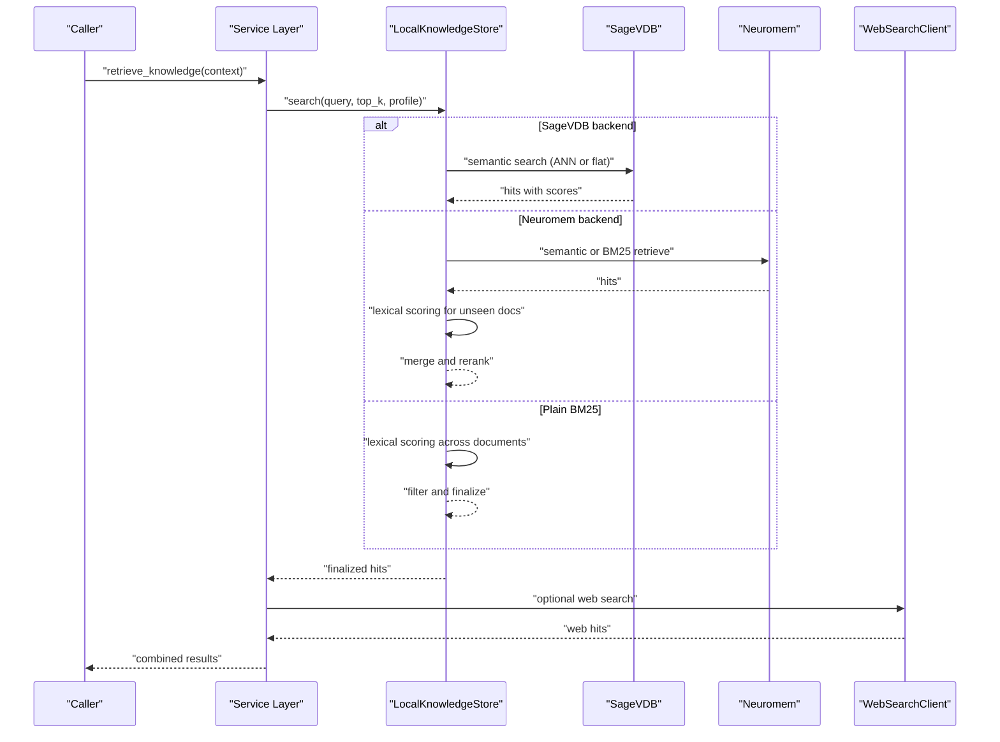
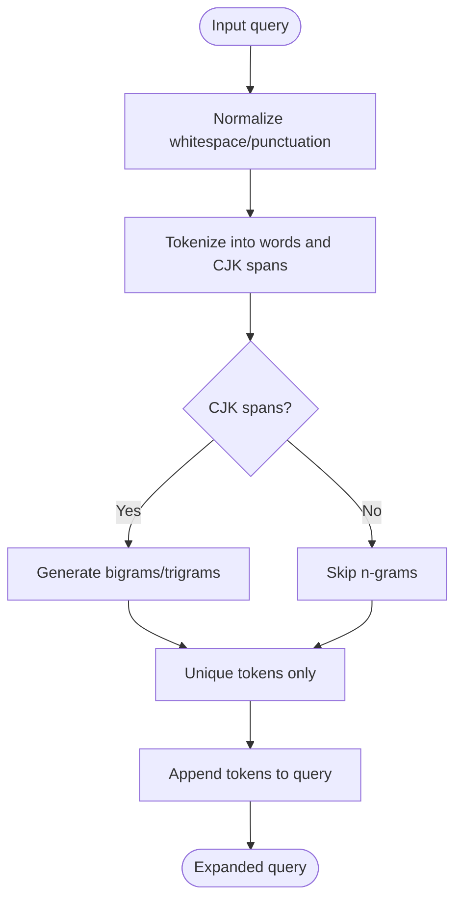
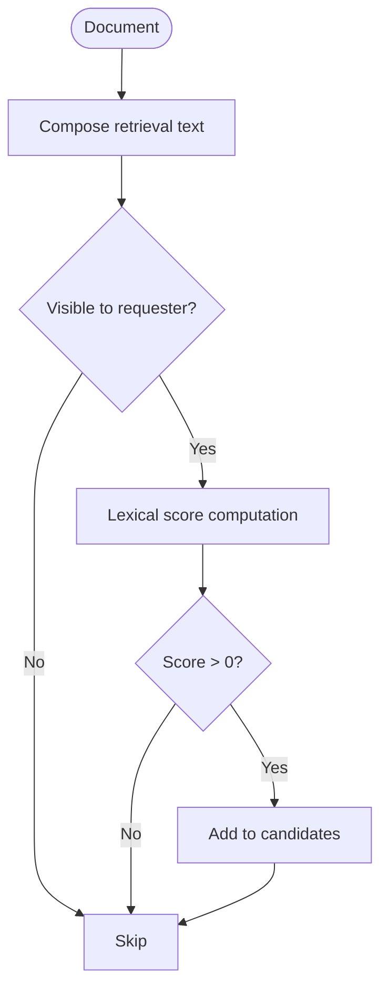
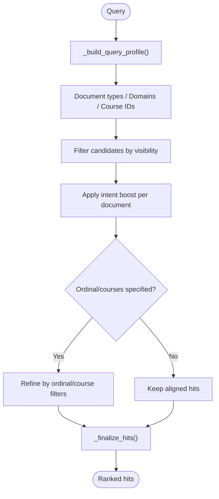
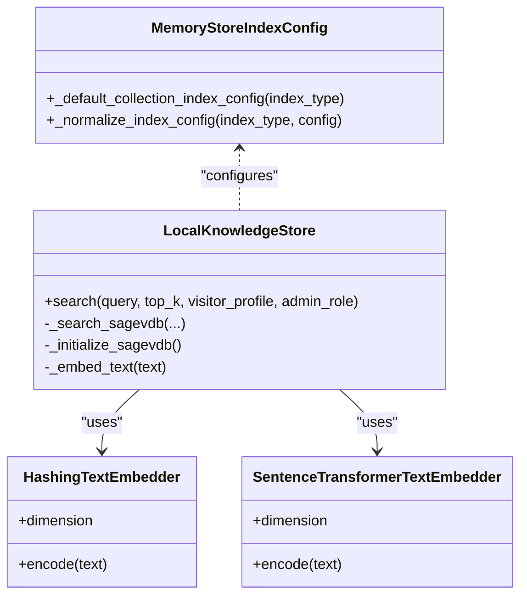
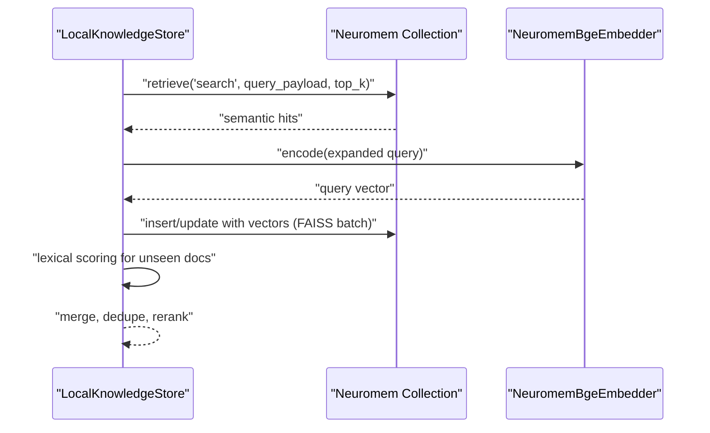
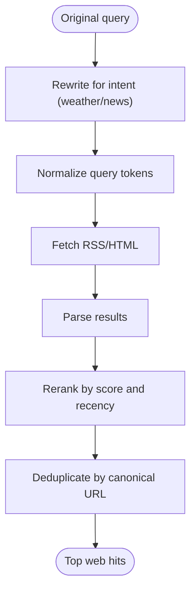
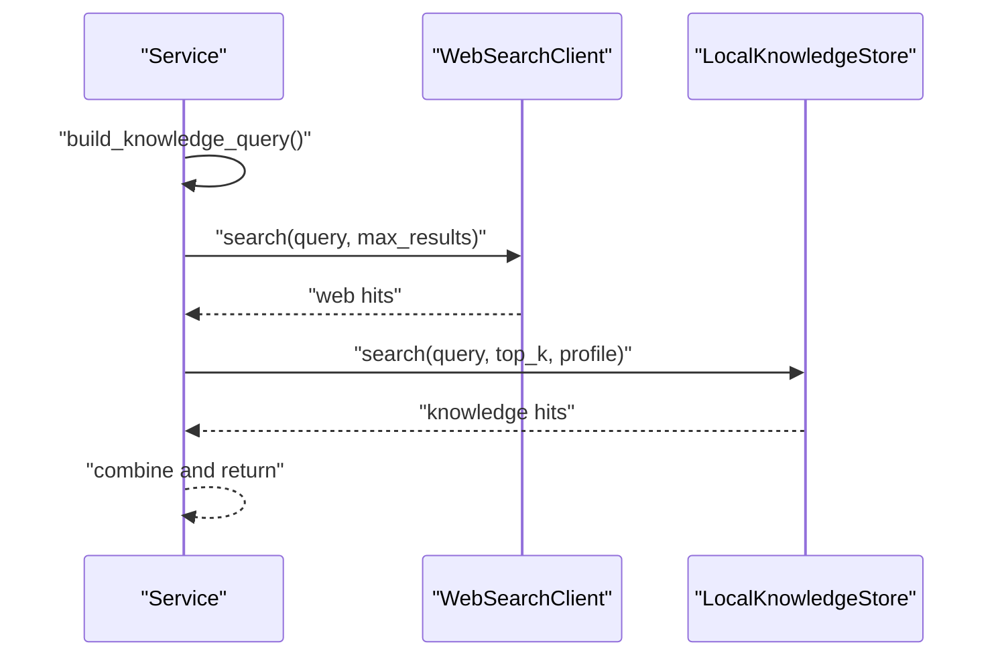
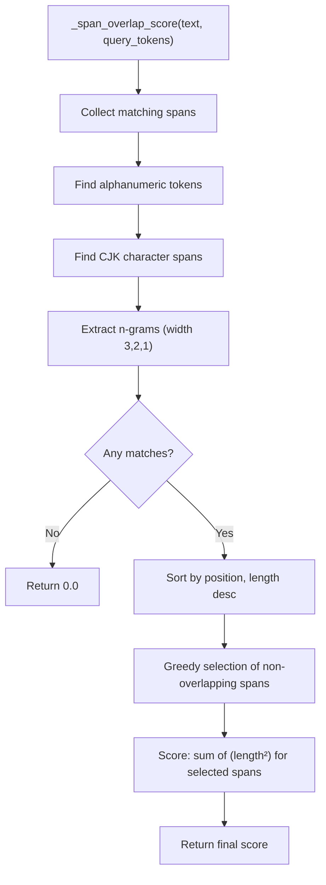
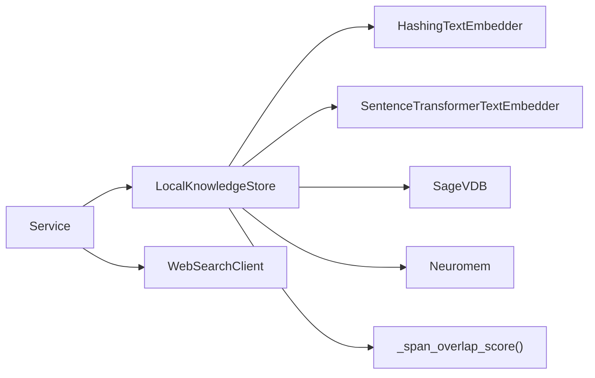

# Search Algorithms and Retrieval

<cite>
**Referenced Files in This Document**
- [knowledge_base.py](file://src/sage_faculty_twin/knowledge_base.py)
- [web_search.py](file://src/sage_faculty_twin/web_search.py)
- [service.py](file://src/sage_faculty_twin/service.py)
- [memory_store.py](file://src/sage_faculty_twin/memory_store.py)
</cite>

## Update Summary
**Changes Made**
- Enhanced Chinese text processing with new `_span_overlap_score` function implementing maximal span deduplication
- Updated scoring algorithm to address token counting inflation issues in Chinese text
- Added sophisticated span overlap detection and length-squared scoring mechanism
- Improved lexical scoring with deduplicated matching spans for better relevance calculation

## Table of Contents
1. [Introduction](#introduction)
2. [Project Structure](#project-structure)
3. [Core Components](#core-components)
4. [Architecture Overview](#architecture-overview)
5. [Detailed Component Analysis](#detailed-component-analysis)
6. [Enhanced Scoring Algorithm](#enhanced-scoring-algorithm)
7. [Dependency Analysis](#dependency-analysis)
8. [Performance Considerations](#performance-considerations)
9. [Troubleshooting Guide](#troubleshooting-guide)
10. [Conclusion](#conclusion)

## Introduction
This document explains the search algorithms and retrieval mechanisms implemented in the repository. It covers:
- Hybrid search combining BM25 lexical scoring with semantic embeddings
- Advanced scoring algorithms with maximal span deduplication for Chinese text processing
- Ranking algorithms, relevance scoring functions, and result filtering criteria
- Tokenization, query expansion, and document composition
- Backend-specific implementations for SageVDB and Neuromem, including ANN search strategies and index optimization
- Performance tuning, latency optimization, and scalability considerations for large knowledge bases

## Project Structure
The search functionality spans several modules:
- Knowledge base search engine with multiple backends (BM25, FAISS-based semantic, and ANN-enabled SageVDB)
- Web search client for external results
- Service orchestration integrating web search and knowledge base retrieval

```mermaid
graph TB
subgraph "Search Engine"
KB["LocalKnowledgeStore<br/>Hybrid Search"]
SAGE["SageVDB Backend<br/>ANN/BM25"]
NEURO["Neuromem Backend<br/>BM25/FAISS"]
END
subgraph "External"
WEB["WebSearchClient<br/>Bing RSS/HTML"]
END
subgraph "Orchestration"
SVC["Service Layer<br/>retrieve_knowledge()"]
END
SVC --> KB
KB --> SAGE
KB --> NEURO
SVC --> WEB
```

**Diagram sources**
- [knowledge_base.py](file://src/sage_faculty_twin/knowledge_base.py)
- [web_search.py](file://src/sage_faculty_twin/web_search.py)
- [service.py](file://src/sage_faculty_twin/service.py)

**Section sources**
- [knowledge_base.py](file://src/sage_faculty_twin/knowledge_base.py)
- [web_search.py](file://src/sage_faculty_twin/web_search.py)
- [service.py](file://src/sage_faculty_twin/service.py)

## Core Components
- LocalKnowledgeStore: Implements hybrid retrieval across backends, tokenization, query expansion, intent-aware scoring, and post-processing filters.
- SageVDB backend: Supports flat index and ANN backends with configurable distance metrics and algorithms.
- Neuromem backend: Supports BM25 and FAISS indices with batched embedding indexing for performance.
- WebSearchClient: Provides external web search with query rewriting, normalization, and reranking heuristics.

Key capabilities:
- Tokenization and n-gram extraction for Chinese text with maximal span deduplication
- Query expansion by appending tokenized terms
- Intent-aware boosting and filtering (document types, domains, courses, named entities)
- Deduplication by source group and visibility checks
- Semantic search via FAISS and BM25 lexical matching

**Section sources**
- [knowledge_base.py](file://src/sage_faculty_twin/knowledge_base.py)
- [memory_store.py](file://src/sage_faculty_twin/memory_store.py)
- [web_search.py](file://src/sage_faculty_twin/web_search.py)

## Architecture Overview
The system supports two primary retrieval modes:
- Internal knowledge base retrieval via SageVDB or Neuromem
- External web search via WebSearchClient



**Diagram sources**
- [service.py](file://src/sage_faculty_twin/service.py)
- [knowledge_base.py](file://src/sage_faculty_twin/knowledge_base.py)
- [web_search.py](file://src/sage_faculty_twin/web_search.py)

## Detailed Component Analysis

### Tokenization and Query Expansion
- Tokenization extracts alphanumeric and CJK tokens, lowercases, and builds character-level n-grams for Chinese spans.
- Query expansion appends sorted unique tokens from the query to improve lexical recall.



**Diagram sources**
- [knowledge_base.py](file://src/sage_faculty_twin/knowledge_base.py)

**Section sources**
- [knowledge_base.py](file://src/sage_faculty_twin/knowledge_base.py)

### Document Composition and Lexical Scoring
- Retrieval text is composed from title, tags, aliases, metadata, source name, and content.
- Lexical scoring filters documents by visibility and computes a positive score; only positive-scoring documents are considered.



**Diagram sources**
- [knowledge_base.py](file://src/sage_faculty_twin/knowledge_base.py)

**Section sources**
- [knowledge_base.py](file://src/sage_faculty_twin/knowledge_base.py)

### Intent-Aware Filtering and Boosting
- QueryProfile infers document types, topic domains, course IDs, named entities, and preferences.
- Document intent boost applies domain-specific and material-type boosts; optional ordinal-number and course filters refine results.



**Diagram sources**
- [knowledge_base.py](file://src/sage_faculty_twin/knowledge_base.py)

**Section sources**
- [knowledge_base.py](file://src/sage_faculty_twin/knowledge_base.py)

### SageVDB Backend Implementation
- Embedding backends supported: HashingTextEmbedder and SentenceTransformer-based embedder.
- ANN vs flat mode: ANN uses inner product metric; flat uses cosine metric via NumPy search.
- Index building and rebuilding handled per backend selection.



**Diagram sources**
- [knowledge_base.py](file://src/sage_faculty_twin/knowledge_base.py)
- [memory_store.py](file://src/sage_faculty_twin/memory_store.py)

**Section sources**
- [knowledge_base.py](file://src/sage_faculty_twin/knowledge_base.py)
- [memory_store.py](file://src/sage_faculty_twin/memory_store.py)

### Neuromem Backend Implementation
- Supports BM25 and FAISS indices.
- FAISS branch uses a dedicated embedder and batch encodes all documents for speed.
- Retrieve-first strategy merges BM25 lexical candidates with FAISS semantic results.



**Diagram sources**
- [knowledge_base.py](file://src/sage_faculty_twin/knowledge_base.py)

**Section sources**
- [knowledge_base.py](file://src/sage_faculty_twin/knowledge_base.py)

### Web Search Client
- Rewrites queries for weather/news intents and normalizes punctuation.
- Scores results by host weights, recency, and content markers; deduplicates by canonical URL.



**Diagram sources**
- [web_search.py](file://src/sage_faculty_twin/web_search.py)

**Section sources**
- [web_search.py](file://src/sage_faculty_twin/web_search.py)

### Orchestration and Integration
- Service layer builds a knowledge query, performs web search, and integrates results.



**Diagram sources**
- [service.py](file://src/sage_faculty_twin/service.py)
- [web_search.py](file://src/sage_faculty_twin/web_search.py)
- [knowledge_base.py](file://src/sage_faculty_twin/knowledge_base.py)

**Section sources**
- [service.py](file://src/sage_faculty_twin/service.py)
- [web_search.py](file://src/sage_faculty_twin/web_search.py)
- [knowledge_base.py](file://src/sage_faculty_twin/knowledge_base.py)

## Enhanced Scoring Algorithm

### Maximal Span Deduplication for Chinese Text Processing

**Updated** Enhanced the knowledge base scoring algorithm with sophisticated Chinese text processing capabilities to address token counting inflation issues.

The new `_span_overlap_score` function implements a maximal span deduplication algorithm that identifies overlapping character spans and rewards longer, more specific matches over shorter, generic ones.

#### Algorithm Overview



**Diagram sources**
- [knowledge_base.py:1163-1205](file://src/sage_faculty_twin/knowledge_base.py#L1163-L1205)

#### Key Features

1. **Dual Token Recognition**: Identifies both English alphanumeric tokens and Chinese character spans
2. **Multi-width N-gram Extraction**: Extracts 3-character, 2-character, and 1-character spans from Chinese text
3. **Maximal Span Selection**: Uses greedy algorithm to select non-overlapping spans with longest length first
4. **Length-Squared Scoring**: Rewards longer spans exponentially (length²) for better specificity

#### Implementation Details

The scoring function processes text in two stages:
- **Stage 1**: Extracts all matching alphanumeric tokens from English text
- **Stage 2**: Extracts Chinese character spans and generates n-grams of varying widths
- **Stage 3**: Applies maximal span selection to eliminate duplicates
- **Stage 4**: Computes final score using length-squared weighting

**Section sources**
- [knowledge_base.py:1163-1205](file://src/sage_faculty_twin/knowledge_base.py#L1163-L1205)
- [knowledge_base.py:844-845](file://src/sage_faculty_twin/knowledge_base.py#L844-L845)

## Dependency Analysis
- LocalKnowledgeStore depends on:
  - Embedding providers (HashingTextEmbedder, SentenceTransformerTextEmbedder)
  - SageVDB backend (flat or ANN)
  - Neuromem backend (BM25 or FAISS)
  - Query profiling and filtering utilities
  - Enhanced scoring functions with maximal span deduplication
- WebSearchClient is independent and integrated at the service level.



**Diagram sources**
- [knowledge_base.py](file://src/sage_faculty_twin/knowledge_base.py)
- [service.py](file://src/sage_faculty_twin/service.py)
- [web_search.py](file://src/sage_faculty_twin/web_search.py)

**Section sources**
- [knowledge_base.py](file://src/sage_faculty_twin/knowledge_base.py)
- [service.py](file://src/sage_faculty_twin/service.py)
- [web_search.py](file://src/sage_faculty_twin/web_search.py)

## Performance Considerations
- Batched embeddings for FAISS indexing:
  - Precomputes vectors for all documents and inserts them in bulk to avoid repeated per-document encoding overhead.
- ANN search:
  - Uses inner product metric for ANN backends; tune algorithm and backend name via settings.
- Index configuration:
  - BM25 uses NumPy backends; FAISS uses cosine metric with configured dimension.
- Query expansion and lexical fallback:
  - Expands query with tokens and falls back to lexical scoring for unseen documents in hybrid retrieval.
- Web search limits:
  - Caps max results and uses fast RSS/HTML fetch with minimal parsing.
- Enhanced scoring algorithm:
  - Maximal span deduplication adds computational overhead but significantly improves Chinese text relevance
  - Optimized greedy selection algorithm minimizes performance impact

Recommendations:
- Prefer FAISS batch indexing for large corpora to reduce latency.
- Tune retrieval_top_k and hybrid merge limits to balance precision and recall.
- Monitor embedding dimension consistency and metric alignment.
- Consider performance trade-offs when enabling Chinese text processing features.

**Section sources**
- [knowledge_base.py](file://src/sage_faculty_twin/knowledge_base.py)
- [memory_store.py](file://src/sage_faculty_twin/memory_store.py)

## Troubleshooting Guide
Common issues and resolutions:
- Missing external packages:
  - SageVDB or ANN backends require installation; errors indicate missing dependencies.
  - Neuromem FAISS requires sentence-transformers and numpy.
- Dimension mismatches:
  - Embedding model must report a valid dimension; otherwise initialization fails.
- Empty or invalid results:
  - Verify query normalization and tokenization; ensure documents are indexed and visible to the requester profile.
- Web search failures:
  - Network timeouts or Bing API changes can cause empty results; the client logs warnings and continues.
- Chinese text processing issues:
  - Ensure proper Unicode handling for CJK characters
  - Verify regex patterns for Chinese character detection
  - Check n-gram extraction logic for optimal performance

Actions:
- Rebuild indexes after changing backend or embedding model.
- Validate embedding dimension and backend configuration.
- Confirm visibility rules align with intended audience profiles.
- Test Chinese text processing with representative datasets.

**Section sources**
- [knowledge_base.py](file://src/sage_faculty_twin/knowledge_base.py)
- [service.py](file://src/sage_faculty_twin/service.py)

## Conclusion
The system implements a robust hybrid retrieval pipeline with enhanced Chinese text processing capabilities:
- Lexical BM25 scoring with intent-aware boosting and filtering
- Advanced maximal span deduplication for Chinese text to prevent token counting inflation
- Semantic search via FAISS with batched indexing for performance
- ANN-enabled SageVDB for scalable vector search
- Optional external web search with intent-aware reranking

The new `_span_overlap_score` function addresses critical issues in Chinese text processing by implementing sophisticated span overlap detection and length-squared scoring, significantly improving relevance for multilingual knowledge bases. By tuning tokenization, query expansion, and backend configurations, the system scales to large knowledge bases while maintaining low-latency responses and high relevance for diverse query intents across different languages.