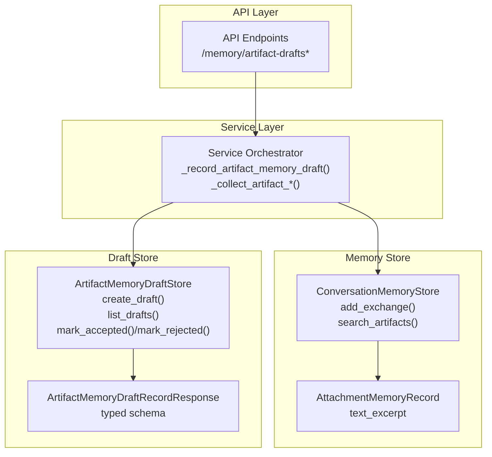
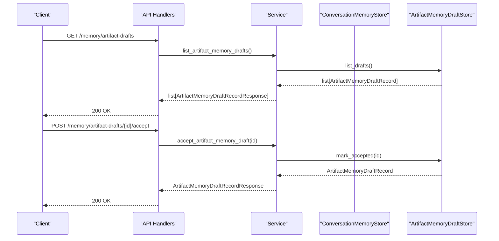
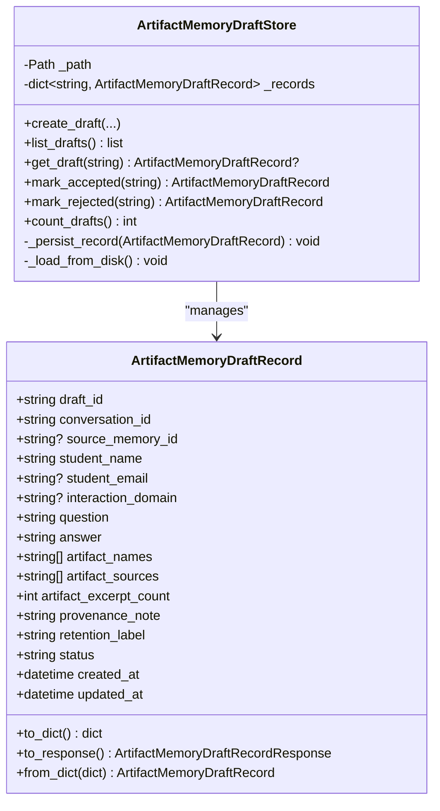
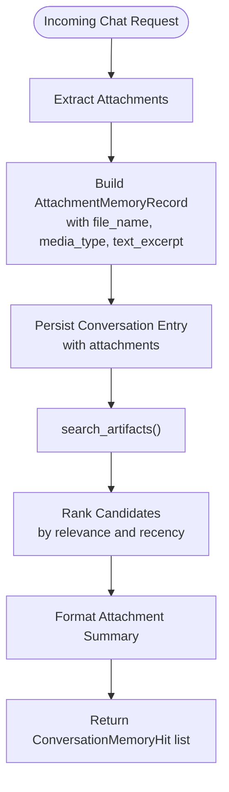
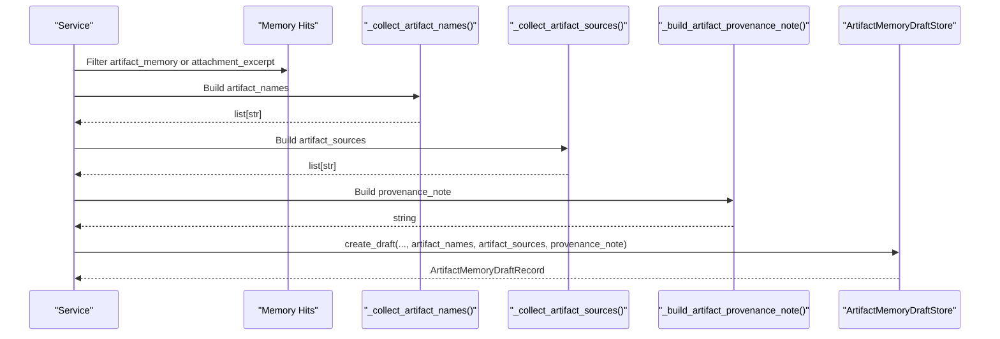
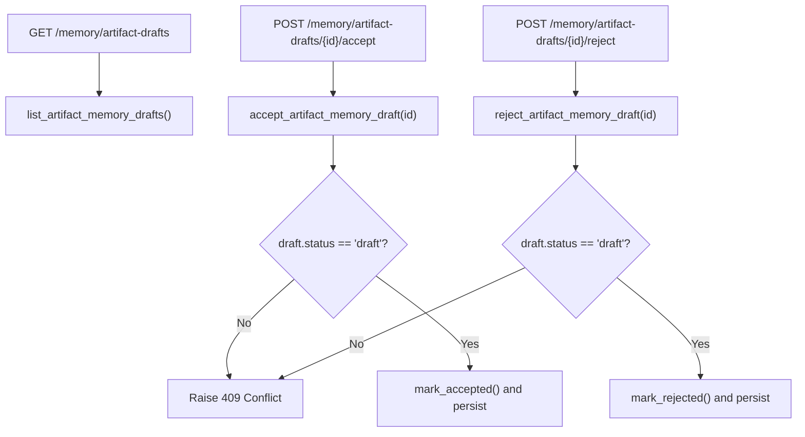
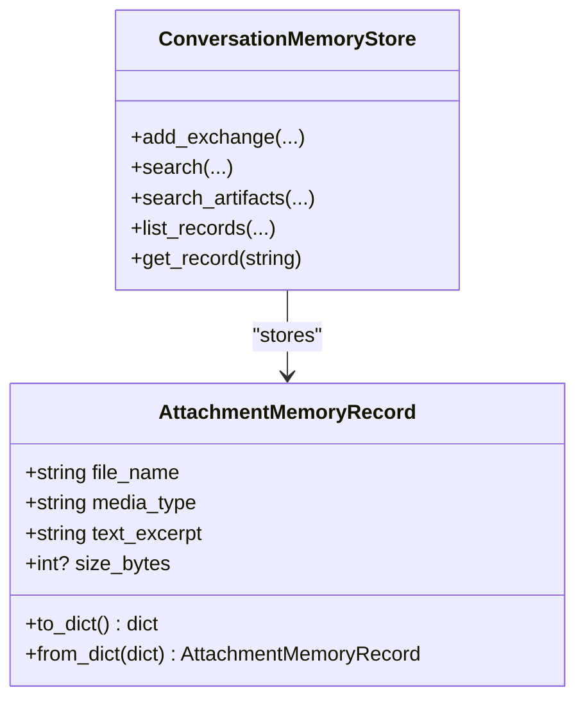
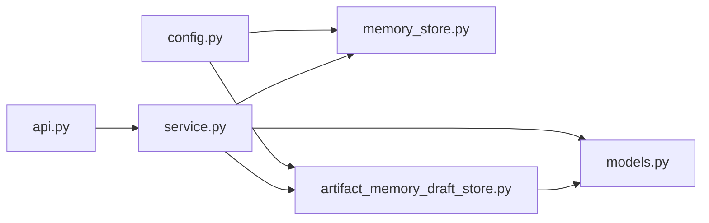

# Artifact Memory

<cite>
**Referenced Files in This Document**
- [artifact_memory_draft_store.py](file://src/sage_faculty_twin/artifact_memory_draft_store.py)
- [models.py](file://src/sage_faculty_twin/models.py)
- [service.py](file://src/sage_faculty_twin/service.py)
- [api.py](file://src/sage_faculty_twin/api.py)
- [memory_store.py](file://src/sage_faculty_twin/memory_store.py)
- [config.py](file://src/sage_faculty_twin/config.py)
</cite>

## Table of Contents
1. [Introduction](#introduction)
2. [Project Structure](#project-structure)
3. [Core Components](#core-components)
4. [Architecture Overview](#architecture-overview)
5. [Detailed Component Analysis](#detailed-component-analysis)
6. [Dependency Analysis](#dependency-analysis)
7. [Performance Considerations](#performance-considerations)
8. [Troubleshooting Guide](#troubleshooting-guide)
9. [Conclusion](#conclusion)
10. [Appendices](#appendices)

## Introduction
This document describes the artifact memory system, focusing on the artifact memory draft store, attachment memory records, and the end-to-end pipeline that extracts artifacts from documents and attachments, generates provenance notes, and persists typed draft records. It also covers integration with conversation memory, indexing/search capabilities, and administrative controls for artifact memory drafts.

## Project Structure
The artifact memory system spans several modules:
- Artifact memory draft store: a local JSON-backed store for draft records
- Conversation memory store: a layered memory backend that indexes and retrieves conversation entries and supports artifact-specific retrieval
- Service layer: orchestrates artifact extraction, provenance note generation, and draft creation
- API layer: exposes administrative endpoints to list, accept, and reject artifact memory drafts
- Models: defines the typed draft record schema and related structures

**Diagram sources**
- [api.py:880-907](file://src/sage_faculty_twin/api.py#L880-L907)
- [service.py:1544-1603](file://src/sage_faculty_twin/service.py#L1544-L1603)
- [memory_store.py:380-582](file://src/sage_faculty_twin/memory_store.py#L380-L582)
- [artifact_memory_draft_store.py:97-183](file://src/sage_faculty_twin/artifact_memory_draft_store.py#L97-L183)
- [models.py:29-53](file://src/sage_faculty_twin/models.py#L29-L53)
- [models.py:709-726](file://src/sage_faculty_twin/models.py#L709-L726)

**Section sources**
- [artifact_memory_draft_store.py:1-184](file://src/sage_faculty_twin/artifact_memory_draft_store.py#L1-L184)
- [models.py:29-53](file://src/sage_faculty_twin/models.py#L29-L53)
- [models.py:709-726](file://src/sage_faculty_twin/models.py#L709-L726)
- [service.py:1544-1603](file://src/sage_faculty_twin/service.py#L1544-L1603)
- [memory_store.py:380-582](file://src/sage_faculty_twin/memory_store.py#L380-L582)
- [api.py:880-907](file://src/sage_faculty_twin/api.py#L880-L907)
- [config.py:79-79](file://src/sage_faculty_twin/config.py#L79-L79)

## Core Components
- ArtifactMemoryDraftRecord: in-memory representation of a draft artifact memory record with fields for conversation linkage, student identity, question/answer, artifact metadata, provenance note, retention label, status, and timestamps.
- ArtifactMemoryDraftStore: manages draft lifecycle on disk, persisting each draft as a JSON file under a configurable directory.
- AttachmentMemoryRecord: captures per-attachment metadata including file name, media type, and a text excerpt extracted from the attachment.
- ConversationMemoryStore: writes conversation entries with attachments and supports artifact-focused retrieval via a dedicated method.
- Service orchestration: builds artifact names and sources, generates provenance notes, and creates drafts when artifact-related memory hits are detected.
- API endpoints: expose administrative actions to list, accept, and reject drafts.

**Section sources**
- [artifact_memory_draft_store.py:12-94](file://src/sage_faculty_twin/artifact_memory_draft_store.py#L12-L94)
- [artifact_memory_draft_store.py:97-183](file://src/sage_faculty_twin/artifact_memory_draft_store.py#L97-L183)
- [memory_store.py:29-53](file://src/sage_faculty_twin/memory_store.py#L29-L53)
- [memory_store.py:380-582](file://src/sage_faculty_twin/memory_store.py#L380-L582)
- [service.py:1297-1338](file://src/sage_faculty_twin/service.py#L1297-L1338)
- [service.py:1544-1603](file://src/sage_faculty_twin/service.py#L1544-L1603)
- [api.py:880-907](file://src/sage_faculty_twin/api.py#L880-L907)
- [models.py:709-726](file://src/sage_faculty_twin/models.py#L709-L726)

## Architecture Overview
The artifact memory pipeline integrates with the conversation memory system. After generating an answer, the service detects artifact-related memory hits and constructs a draft record. The draft is persisted locally and can later be reviewed and accepted/rejected by administrators.

**Diagram sources**
- [api.py:880-907](file://src/sage_faculty_twin/api.py#L880-L907)
- [service.py:2514-2545](file://src/sage_faculty_twin/service.py#L2514-L2545)
- [artifact_memory_draft_store.py:143-169](file://src/sage_faculty_twin/artifact_memory_draft_store.py#L143-L169)

## Detailed Component Analysis

### Artifact Memory Draft Store
- Purpose: Persist and manage artifact memory drafts as JSON files under a configurable directory.
- Key operations:
  - Create a new draft with computed identifiers and metadata
  - List drafts ordered by update time
  - Retrieve a specific draft
  - Transition draft status to accepted or rejected
  - Count drafts
- Persistence: Each draft is written as a JSON file named by its draft_id; the directory is ensured to exist on initialization and during persistence.

**Diagram sources**
- [artifact_memory_draft_store.py:12-94](file://src/sage_faculty_twin/artifact_memory_draft_store.py#L12-L94)
- [artifact_memory_draft_store.py:97-183](file://src/sage_faculty_twin/artifact_memory_draft_store.py#L97-L183)

**Section sources**
- [artifact_memory_draft_store.py:97-183](file://src/sage_faculty_twin/artifact_memory_draft_store.py#L97-L183)
- [config.py:79-79](file://src/sage_faculty_twin/config.py#L79-L79)

### Attachment Memory Record and Text Excerpt Generation
- AttachmentMemoryRecord encapsulates per-attachment metadata and a text excerpt derived from the attachment content.
- The conversation memory store extracts attachment records from incoming chat requests and stores them with each conversation entry.
- During artifact retrieval, the system ranks candidates and formats summaries that include the attachment excerpt.

**Diagram sources**
- [memory_store.py:380-424](file://src/sage_faculty_twin/memory_store.py#L380-L424)
- [memory_store.py:491-582](file://src/sage_faculty_twin/memory_store.py#L491-L582)
- [memory_store.py:29-53](file://src/sage_faculty_twin/memory_store.py#L29-L53)

**Section sources**
- [memory_store.py:29-53](file://src/sage_faculty_twin/memory_store.py#L29-L53)
- [memory_store.py:380-424](file://src/sage_faculty_twin/memory_store.py#L380-L424)
- [memory_store.py:491-582](file://src/sage_faculty_twin/memory_store.py#L491-L582)

### Artifact Extraction and Provenance Note Construction
- The service identifies artifact-related memory hits (either tagged with a specific topic or originating from attachment excerpts).
- It collects artifact names and sources from the current request and the identified hits.
- A provenance note is constructed summarizing the context and sources of the artifacts.
- A draft is created with the collected information and persisted.

**Diagram sources**
- [service.py:1544-1603](file://src/sage_faculty_twin/service.py#L1544-L1603)
- [service.py:1297-1338](file://src/sage_faculty_twin/service.py#L1297-L1338)

**Section sources**
- [service.py:1297-1338](file://src/sage_faculty_twin/service.py#L1297-L1338)
- [service.py:1544-1603](file://src/sage_faculty_twin/service.py#L1544-L1603)

### Administrative Draft Management
- Listing drafts: returns all drafts ordered by update time.
- Accepting a draft: transitions the draft to accepted and persists the change.
- Rejecting a draft: transitions the draft to rejected and persists the change.
- Validation: raises conflicts if the draft is not in draft status or does not exist.

**Diagram sources**
- [api.py:880-907](file://src/sage_faculty_twin/api.py#L880-L907)
- [service.py:2514-2545](file://src/sage_faculty_twin/service.py#L2514-L2545)
- [artifact_memory_draft_store.py:149-169](file://src/sage_faculty_twin/artifact_memory_draft_store.py#L149-L169)

**Section sources**
- [api.py:880-907](file://src/sage_faculty_twin/api.py#L880-L907)
- [service.py:2514-2545](file://src/sage_faculty_twin/service.py#L2514-L2545)
- [artifact_memory_draft_store.py:149-169](file://src/sage_faculty_twin/artifact_memory_draft_store.py#L149-L169)

### Integration with Conversation Memory
- Artifacts are indexed as part of conversation memory entries and retrievable via a specialized artifact search method.
- The conversation store’s retrieval logic distinguishes artifact hits by topic and source, formats summaries, and deduplicates results.

**Diagram sources**
- [memory_store.py:380-582](file://src/sage_faculty_twin/memory_store.py#L380-L582)
- [memory_store.py:29-53](file://src/sage_faculty_twin/memory_store.py#L29-L53)

**Section sources**
- [memory_store.py:380-582](file://src/sage_faculty_twin/memory_store.py#L380-L582)
- [memory_store.py:29-53](file://src/sage_faculty_twin/memory_store.py#L29-L53)

## Dependency Analysis
- The service depends on:
  - ConversationMemoryStore for retrieving artifact-related memory hits and building search queries
  - ArtifactMemoryDraftStore for creating and managing draft records
  - Models for typed schemas and conversion helpers
- The API layer depends on the service for administrative operations on drafts
- Configuration provides the draft storage directory

**Diagram sources**
- [api.py:880-907](file://src/sage_faculty_twin/api.py#L880-L907)
- [service.py:1544-1603](file://src/sage_faculty_twin/service.py#L1544-L1603)
- [memory_store.py:380-582](file://src/sage_faculty_twin/memory_store.py#L380-L582)
- [artifact_memory_draft_store.py:97-183](file://src/sage_faculty_twin/artifact_memory_draft_store.py#L97-L183)
- [models.py:709-726](file://src/sage_faculty_twin/models.py#L709-L726)
- [config.py:79-79](file://src/sage_faculty_twin/config.py#L79-L79)

**Section sources**
- [api.py:880-907](file://src/sage_faculty_twin/api.py#L880-L907)
- [service.py:1544-1603](file://src/sage_faculty_twin/service.py#L1544-L1603)
- [memory_store.py:380-582](file://src/sage_faculty_twin/memory_store.py#L380-L582)
- [artifact_memory_draft_store.py:97-183](file://src/sage_faculty_twin/artifact_memory_draft_store.py#L97-L183)
- [models.py:709-726](file://src/sage_faculty_twin/models.py#L709-L726)
- [config.py:79-79](file://src/sage_faculty_twin/config.py#L79-L79)

## Performance Considerations
- Draft persistence is file-based; each create/update writes a small JSON file. For high throughput, consider batching or asynchronous writes if needed.
- Artifact retrieval relies on conversation memory indexing; ensure appropriate index selection and dimensionality for retrieval latency and accuracy.
- Deduplication in artifact search prevents redundant hits and improves result quality.

[No sources needed since this section provides general guidance]

## Troubleshooting Guide
- Draft not found: API handlers raise 404 when attempting to accept/reject a non-existent draft.
- Status conflict: Attempting to accept/reject a non-draft record raises 409 with the current status.
- No artifact names: If no artifact names are collected, the draft creation is skipped with a trace noting the reason.
- Directory issues: The draft store ensures the directory exists; if permissions are insufficient, persistence will fail.

**Section sources**
- [service.py:2517-2545](file://src/sage_faculty_twin/service.py#L2517-L2545)
- [artifact_memory_draft_store.py:158-169](file://src/sage_faculty_twin/artifact_memory_draft_store.py#L158-L169)
- [service.py:1558-1569](file://src/sage_faculty_twin/service.py#L1558-L1569)

## Conclusion
The artifact memory system provides a robust mechanism to capture, index, and manage artifacts associated with conversations. By extracting artifact names and sources, generating provenance notes, and persisting typed drafts, it enables administrators to review and approve artifact memory entries. Integration with conversation memory ensures that artifacts are discoverable and retrievable alongside other memory signals.

[No sources needed since this section summarizes without analyzing specific files]

## Appendices

### Example Usage Patterns
- Creating an artifact memory draft after a conversation exchange:
  - The service detects artifact-related memory hits
  - Collects artifact names and sources
  - Builds a provenance note
  - Persists a draft via the draft store
- Administrative review:
  - List drafts, then accept or reject specific drafts
  - On acceptance, the draft can be further processed into permanent memory or knowledge

**Section sources**
- [service.py:1544-1603](file://src/sage_faculty_twin/service.py#L1544-L1603)
- [api.py:880-907](file://src/sage_faculty_twin/api.py#L880-L907)
- [artifact_memory_draft_store.py:143-169](file://src/sage_faculty_twin/artifact_memory_draft_store.py#L143-L169)