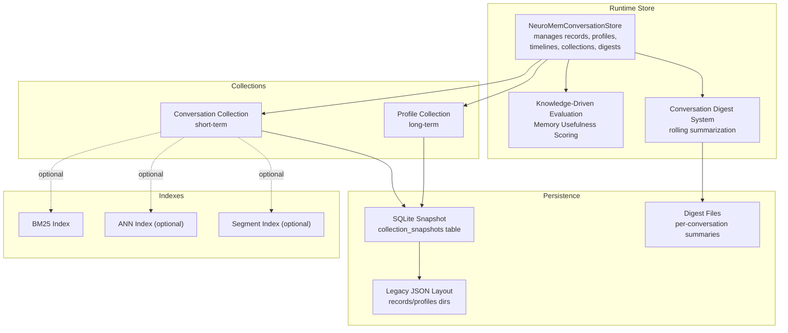
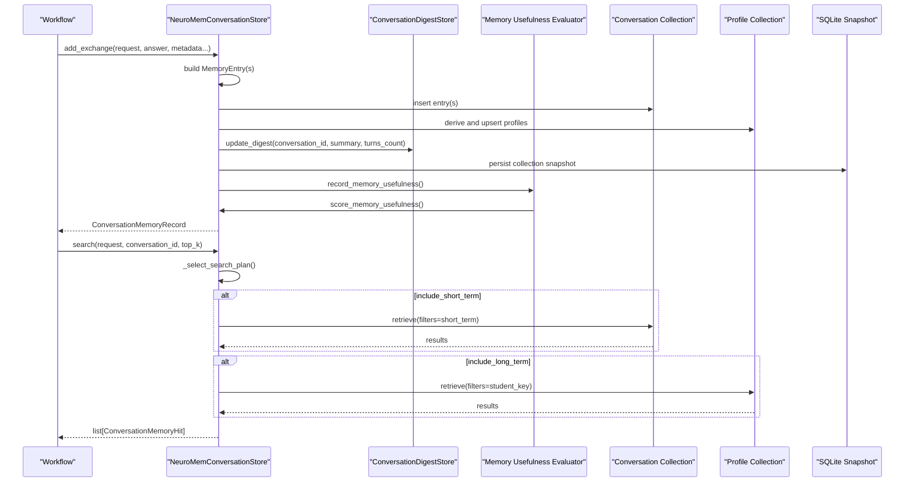
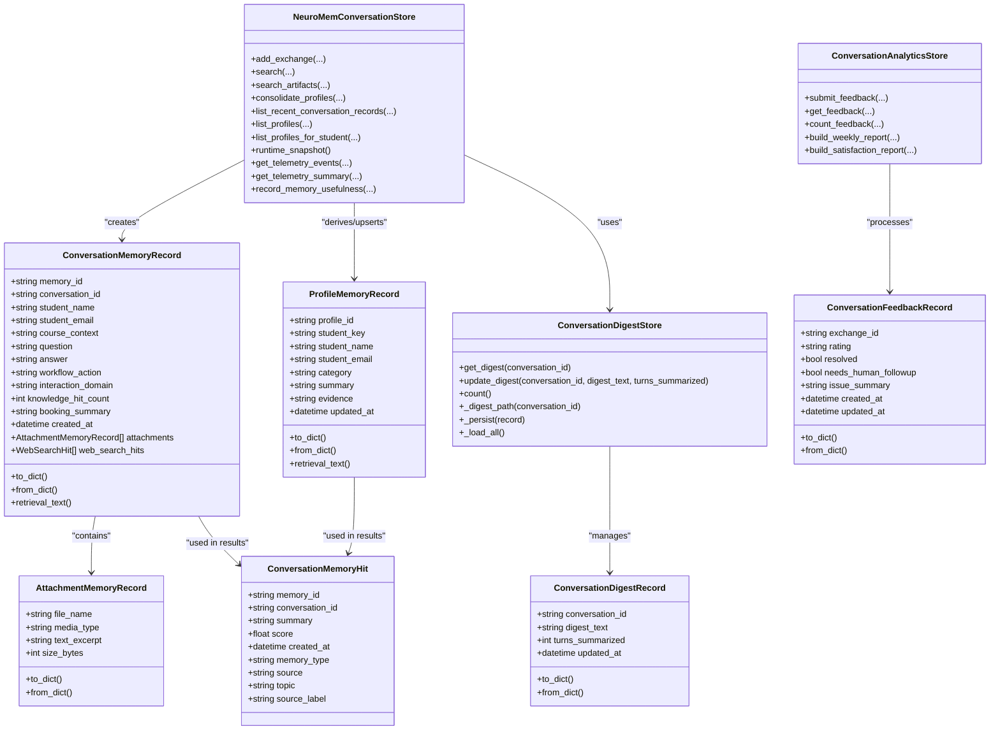

# Conversation Memory

<cite>
**Referenced Files in This Document**
- [memory_store.py](file://src/sage_faculty_twin/memory_store.py)
- [analytics_store.py](file://src/sage_faculty_twin/analytics_store.py)
- [service.py](file://src/sage_faculty_twin/service.py)
- [test_conversation_digest.py](file://tests/test_conversation_digest.py)
- [index_metadata.json](file://data/conversation_memory/collections/conversation-memory/index_metadata.json)
- [index_metadata.json](file://data/conversation_memory/collections/conversation-profile-memory/index_metadata.json)
- [raw_data.json](file://data/conversation_memory/collections/conversation-profile-memory/raw_data.json)
- [conv-complete.json](file://data/conversation_memory/digests/conv-complete.json)
- [conv-booking.json](file://data/conversation_memory/digests/conv-booking.json)
- [artifact_memory_draft_store.py](file://src/sage_faculty_twin/artifact_memory_draft_store.py)
- [test_memory_store.py](file://tests/test_memory_store.py)
- [test_store_resilience.py](file://tests/test_store_resilience.py)
</cite>

## Update Summary
**Changes Made**
- Added comprehensive documentation for the new conversation digest system with rolling summarization
- Enhanced memory management capabilities section with improved digest file handling
- Updated conversation summarization documentation with new digest store functionality
- Added detailed coverage of memory persistence improvements with digest file management
- Expanded troubleshooting section to include digest-related issues

## Table of Contents
1. [Introduction](#introduction)
2. [Project Structure](#project-structure)
3. [Core Components](#core-components)
4. [Architecture Overview](#architecture-overview)
5. [Detailed Component Analysis](#detailed-component-analysis)
6. [Dependency Analysis](#dependency-analysis)
7. [Performance Considerations](#performance-considerations)
8. [Troubleshooting Guide](#troubleshooting-guide)
9. [Conclusion](#conclusion)
10. [Appendices](#appendices)

## Introduction
This document explains the conversation memory system that powers contextual recall for chat workflows. The system has evolved to a knowledge-driven architecture that emphasizes automated memory evaluation and continuous improvement. It covers the ConversationMemoryRecord data structure, persistence and indexing mechanisms, retrieval algorithms, short-term versus long-term memory distinction, neural continual memory integration, attachment handling, conversation digest system, and telemetry for performance monitoring. The system now focuses on memory usefulness scoring and automated quality assessment rather than manual feedback collection, with enhanced digest file management for improved memory compression and retrieval.

## Project Structure
The conversation memory system is implemented in a dedicated store class backed by a layered memory collection abstraction. Data is persisted to SQLite snapshots and indexed via configurable backends. Profiles are derived from conversation exchanges and stored separately for long-term recall. The system now emphasizes knowledge-driven evaluation through memory usefulness scoring and includes a sophisticated digest system for conversation summarization and memory compression.

**Diagram sources**
- [memory_store.py:223-257](file://src/sage_faculty_twin/memory_store.py#L223-L257)
- [memory_store.py:996-1087](file://src/sage_faculty_twin/memory_store.py#L996-L1087)
- [memory_store.py:1146-1179](file://src/sage_faculty_twin/memory_store.py#L1146-L1179)
- [memory_store.py:1320-1353](file://src/sage_faculty_twin/memory_store.py#L1320-L1353)
- [memory_store.py:255-317](file://src/sage_faculty_twin/memory_store.py#L255-L317)
- [index_metadata.json:1-7](file://data/conversation_memory/collections/conversation-memory/index_metadata.json#L1-L7)

**Section sources**
- [memory_store.py:223-257](file://src/sage_faculty_twin/memory_store.py#L223-L257)
- [memory_store.py:996-1087](file://src/sage_faculty_twin/memory_store.py#L996-L1087)
- [memory_store.py:1146-1179](file://src/sage_faculty_twin/memory_store.py#L1146-L1179)
- [memory_store.py:1320-1353](file://src/sage_faculty_twin/memory_store.py#L1320-L1353)
- [memory_store.py:255-317](file://src/sage_faculty_twin/memory_store.py#L255-L317)
- [index_metadata.json:1-7](file://data/conversation_memory/collections/conversation-memory/index_metadata.json#L1-L7)
- [index_metadata.json:1-7](file://data/conversation_memory/collections/conversation-profile-memory/index_metadata.json#L1-L7)

## Core Components
- ConversationMemoryRecord: The primary data structure representing a single exchange with attachments and web search hits.
- ProfileMemoryRecord: Long-term user profile entries derived from conversations.
- ConversationMemoryHit: Lightweight retrieval result for UI presentation.
- AttachmentMemoryRecord: Minimal record for extracted attachment excerpts.
- ConversationDigestRecord: Per-conversation rolling digest containing summarized context.
- ConversationDigestStore: Persistent store for managing conversation digests with threshold-based triggering.
- NeuroMemConversationStore: Central orchestrator for adding, persisting, and retrieving memories; managing timelines, profiles, and digests; emitting telemetry; and evaluating memory usefulness.
- ConversationAnalyticsStore: Analytics engine for processing conversation data and generating insights.

Key responsibilities:
- Build MemoryEntry payloads for conversation and profile collections.
- Maintain per-conversation timelines for recent-exchange recall.
- Derive and upsert profile summaries.
- Manage conversation digests with rolling summarization and threshold-based updates.
- Persist collections to SQLite snapshots.
- Select and configure indexes (BM25, FAISS, Sage VDB ANN, Segment).
- Integrate with neural continual memory collection type.
- Evaluate memory usefulness through automated scoring.
- Generate knowledge gap recommendations based on conversation patterns.

**Section sources**
- [memory_store.py:55-121](file://src/sage_faculty_twin/memory_store.py#L55-L121)
- [memory_store.py:160-194](file://src/sage_faculty_twin/memory_store.py#L160-L194)
- [memory_store.py:223-257](file://src/sage_faculty_twin/memory_store.py#L223-L257)
- [memory_store.py:223-252](file://src/sage_faculty_twin/memory_store.py#L223-L252)
- [memory_store.py:255-317](file://src/sage_faculty_twin/memory_store.py#L255-L317)
- [analytics_store.py:14-49](file://src/sage_faculty_twin/analytics_store.py#L14-L49)

## Architecture Overview
The system separates short-term (conversation) and long-term (profile) memory into distinct collections, with an integrated digest system for conversation summarization. Short-term memory is optimized for recency and conversation context; long-term memory captures stable user characteristics. The digest system provides rolling summarization to compress conversation history and reduce token usage. Retrieval combines both scopes according to a dynamic search plan. The system now emphasizes knowledge-driven evaluation through memory usefulness scoring.

**Diagram sources**
- [memory_store.py:380-424](file://src/sage_faculty_twin/memory_store.py#L380-L424)
- [memory_store.py:446-489](file://src/sage_faculty_twin/memory_store.py#L446-L489)
- [memory_store.py:757-776](file://src/sage_faculty_twin/memory_store.py#L757-L776)
- [memory_store.py:1320-1353](file://src/sage_faculty_twin/memory_store.py#L1320-L1353)
- [memory_store.py:1146-1179](file://src/sage_faculty_twin/memory_store.py#L1146-L1179)
- [memory_store.py:255-317](file://src/sage_faculty_twin/memory_store.py#L255-L317)

## Detailed Component Analysis

### ConversationMemoryRecord
Represents a single Q&A exchange plus metadata and artifacts. Provides:
- Structured fields for student identity, course context, workflow action, domain, knowledge hit count, and booking summary.
- Attachments and web search hits.
- A retrieval-friendly text builder that aggregates fields for indexing.

Important behaviors:
- to/from_dict for serialization.
- retrieval_text builds a compact string for vector/bm25 indexing.
- created_at timestamps enable ordering and recency weighting.

Usage pattern:
- Constructed during workflow completion and inserted into the conversation collection.

**Section sources**
- [memory_store.py:55-121](file://src/sage_faculty_twin/memory_store.py#L55-L121)
- [memory_store.py:123-144](file://src/sage_faculty_twin/memory_store.py#L123-L144)

### Timeline Management
Per-conversation timelines are maintained as ordered lists of memory IDs, enabling:
- Efficient recent-exchange retrieval for the same conversation.
- Deduplication and ordering by creation time.

Operations:
- Append/prepend to timeline on new exchange.
- List recent records excluding the current question.

**Section sources**
- [memory_store.py:1447-1456](file://src/sage_faculty_twin/memory_store.py#L1447-L1456)
- [memory_store.py:596-622](file://src/sage_faculty_twin/memory_store.py#L596-L622)

### Conversation Digest System
**Updated** The conversation digest system provides rolling summarization for conversation history compression. Each conversation maintains a digest file containing summarized context of earlier turns, reducing token usage in prompts while preserving important information.

Key components:
- ConversationDigestRecord: Represents a single digest with conversation_id, digest_text, turns_summarized, and updated_at fields.
- ConversationDigestStore: Manages persistent storage of digests with threshold-based triggering and sanitization.

Digest management features:
- Threshold-based triggering: Summarization occurs when new turns exceed configured thresholds.
- Rolling updates: Each update merges new turns into existing digest text.
- Sanitized file naming: Conversation IDs are sanitized to prevent filesystem conflicts.
- Persistence: Digests are stored as individual JSON files in the digests directory.
- Load-all functionality: Automatically loads existing digests on initialization.

**Section sources**
- [memory_store.py:223-252](file://src/sage_faculty_twin/memory_store.py#L223-L252)
- [memory_store.py:255-317](file://src/sage_faculty_twin/memory_store.py#L255-L317)
- [conv-complete.json:1-6](file://data/conversation_memory/digests/conv-complete.json#L1-L6)
- [conv-booking.json:1-6](file://data/conversation_memory/digests/conv-booking.json#L1-L6)

### Persistence and Indexing
Two collection types are supported:
- Unified: Uses a classic index (BM25, FAISS, or Segment) with explicit index metadata.
- Neural Continual: Integrates a trainable continual memory collection with configurable hyperparameters.

Persistence:
- Collections are snapshotted into SQLite to avoid reliance on external filesystem layouts.
- Legacy JSON directories are migrated once and removed.
- Digest files are managed separately in the digests directory with individual JSON files per conversation.

Index selection:
- Auto-selection prefers available backends; Sage VDB ANN requires an optional dependency.
- Index metadata is normalized and persisted alongside collection config.

**Section sources**
- [memory_store.py:258-322](file://src/sage_faculty_twin/memory_store.py#L258-L322)
- [memory_store.py:337-348](file://src/sage_faculty_twin/memory_store.py#L337-L348)
- [memory_store.py:979-994](file://src/sage_faculty_twin/memory_store.py#L979-L994)
- [memory_store.py:1019-1087](file://src/sage_faculty_twin/memory_store.py#L1019-L1087)
- [memory_store.py:1146-1179](file://src/sage_faculty_twin/memory_store.py#L1146-L1179)
- [index_metadata.json:1-7](file://data/conversation_memory/collections/conversation-memory/index_metadata.json#L1-L7)

### Search Plan and Retrieval
The store selects a hybrid retrieval plan based on keywords in the query:
- booking-first: Emphasizes recent short-term and minimal long-term.
- profile-aware: Balances recent and long-term based on detected intent.
- balanced: Standard split favoring recent context.

Short-term retrieval:
- Builds a QueryRequest scoped to the current conversation and student identity.
- Retrieves from the conversation collection and augments with recent same-conversation items.

Long-term retrieval:
- Builds a QueryRequest scoped to the student key.
- Prioritizes preferred categories inferred from the query (e.g., booking_preference, collaboration_preference).

Artifacts:
- Dedicated retrieval pipeline for uploaded attachment excerpts.
- Token overlap scoring ranks candidates before collection-backed results.

**Section sources**
- [memory_store.py:757-776](file://src/sage_faculty_twin/memory_store.py#L757-L776)
- [memory_store.py:778-841](file://src/sage_faculty_twin/memory_store.py#L778-L841)
- [memory_store.py:843-917](file://src/sage_faculty_twin/memory_store.py#L843-L917)
- [memory_store.py:491-582](file://src/sage_faculty_twin/memory_store.py#L491-L582)
- [memory_store.py:1770-1791](file://src/sage_faculty_twin/memory_store.py#L1770-L1791)
- [memory_store.py:1820-1827](file://src/sage_faculty_twin/memory_store.py#L1820-L1827)

### Neural Continual Memory Integration
Neural continual memory collection type enables:
- Configurable feature dimensionality and learning parameters.
- Online continual learning with replay buffers and blending scores.
- Runtime detection of service type for statistics reporting.

Behavior:
- On unified collections, service type becomes "online_continual_memory" when collection type is neural_continual.
- Persistence preserves collection type across restarts.

**Section sources**
- [memory_store.py:337-348](file://src/sage_faculty_twin/memory_store.py#L337-L348)
- [memory_store.py:1356-1383](file://src/sage_faculty_twin/memory_store.py#L1356-L1383)
- [test_memory_store.py:255-289](file://tests/test_memory_store.py#L255-L289)
- [test_memory_store.py:291-322](file://tests/test_memory_store.py#L291-L322)

### Attachment Handling
Attachments are extracted from incoming requests and transformed into:
- AttachmentMemoryRecord entries with clipped text excerpts.
- Dedicated MemoryEntry payloads tagged as artifact_memory for specialized retrieval.

Scoring:
- Overlap between query tokens and attachment metadata/text determines ranking before collection results.

**Section sources**
- [memory_store.py:1724-1740](file://src/sage_faculty_twin/memory_store.py#L1724-L1740)
- [memory_store.py:1485-1515](file://src/sage_faculty_twin/memory_store.py#L1485-L1515)
- [memory_store.py:1770-1791](file://src/sage_faculty_twin/memory_store.py#L1770-L1791)
- [memory_store.py:1820-1827](file://src/sage_faculty_twin/memory_store.py#L1820-L1827)

### Profile Memory and Consolidation
Profiles summarize stable user characteristics:
- Derived categories include identity, course_context, recent_topic, booking_preference, collaboration_preference.
- Upsert logic replaces older entries for the same profile_id while preserving the latest.

Storage:
- Profile entries are stored in the profile collection and canonicalized to keep only the newest per profile_id.

**Section sources**
- [memory_store.py:1422-1440](file://src/sage_faculty_twin/memory_store.py#L1422-L1440)
- [memory_store.py:1442-1445](file://src/sage_faculty_twin/memory_store.py#L1442-L1445)
- [memory_store.py:1517-1539](file://src/sage_faculty_twin/memory_store.py#L1517-L1539)
- [memory_store.py:1566-1596](file://src/sage_faculty_twin/memory_store.py#L1566-L1596)
- [raw_data.json:1-200](file://data/conversation_memory/collections/conversation-profile-memory/raw_data.json#L1-L200)

### Knowledge-Driven Architecture and Memory Usefulness Scoring
**Updated** The system now emphasizes knowledge-driven evaluation through automated memory usefulness scoring instead of manual feedback collection.

The memory usefulness evaluation system assesses:
- Whether memory and knowledge materials helped answer the question effectively.
- The quality and relevance of retrieved context.
- The freshness and recency of memory usage.
- The balance between short-term and long-term memory utilization.

Scoring criteria:
- Helpful: Memory significantly contributed to answer quality and context continuity.
- Stale: Memory is outdated and lacks supporting knowledge materials.
- Low confidence: No retrievable evidence found to support the answer.
- Review worthy: Memory used but lacks sufficient knowledge material support.

Integration:
- Automatically triggered after answer generation in workflow execution.
- Records detailed telemetry with signal, reason, and usage metrics.
- Generates knowledge gap recommendations based on patterns.

**Section sources**
- [memory_store.py:1320-1353](file://src/sage_faculty_twin/memory_store.py#L1320-L1353)
- [service.py:1812-1876](file://src/sage_faculty_twin/service.py#L1812-L1876)
- [service.py:1936-1999](file://src/sage_faculty_twin/service.py#L1936-L1999)

### Analytics and Knowledge Gap Recommendations
**Updated** The analytics system now focuses on knowledge-driven insights rather than feedback-based metrics.

Capabilities:
- Cluster similar conversation exchanges based on question patterns and domains.
- Identify knowledge gaps and generate actionable recommendations.
- Track satisfaction trends and resolution rates.
- Provide weekly reports on memory effectiveness and knowledge coverage.

Knowledge gap detection:
- Analyzes unresolved questions and common themes.
- Suggests FAQ content and knowledge base improvements.
- Generates draft content for knowledge base enhancement.

**Section sources**
- [analytics_store.py:99-141](file://src/sage_faculty_twin/analytics_store.py#L99-L141)
- [analytics_store.py:149-192](file://src/sage_faculty_twin/analytics_store.py#L149-L192)
- [analytics_store.py:559-591](file://src/sage_faculty_twin/analytics_store.py#L559-L591)

### Telemetry and Performance Monitoring
**Updated** Telemetry now focuses on memory usefulness scoring and knowledge-driven metrics.

Tracking includes:
- Write events for conversation and profile writes.
- Retrieve events for general retrieval, artifact retrieval, and search plans.
- Memory usefulness signals with counts, reasons, and quality assessments.
- Event counters by type and recent event summaries.
- Knowledge gap detection and recommendation generation.

Statistics:
- Service stats include storage stats, index counts, and telemetry summaries.
- Runtime snapshot exposes conversation and profile stats along with recent events.
- Memory usefulness telemetry provides insights into retrieval quality and effectiveness.

**Section sources**
- [memory_store.py:413-423](file://src/sage_faculty_twin/memory_store.py#L413-L423)
- [memory_store.py:433-443](file://src/sage_faculty_twin/memory_store.py#L433-L443)
- [memory_store.py:473-488](file://src/sage_faculty_twin/memory_store.py#L473-L488)
- [memory_store.py:572-581](file://src/sage_faculty_twin/memory_store.py#L572-L581)
- [memory_store.py:1286-1319](file://src/sage_faculty_twin/memory_store.py#L1286-L1319)
- [memory_store.py:1321-1354](file://src/sage_faculty_twin/memory_store.py#L1321-L1354)
- [memory_store.py:1356-1383](file://src/sage_faculty_twin/memory_store.py#L1356-L1383)
- [memory_store.py:743-755](file://src/sage_faculty_twin/memory_store.py#L743-L755)

### Integration with Workflow Execution
**Updated** The workflow integrates memory persistence, retrieval, knowledge-driven evaluation, and digest management.

Enhanced integration includes:
- Automatic memory usefulness scoring after answer generation.
- Knowledge gap detection and recommendation generation.
- Automated quality assessment of memory usage.
- Digest management with threshold-based summarization.
- Integration with analytics for continuous improvement.

**Section sources**
- [service.py:1519-1532](file://src/sage_faculty_twin/service.py#L1519-L1532)
- [service.py:3958-3984](file://src/sage_faculty_twin/service.py#L3958-L3984)
- [service.py:1812-1876](file://src/sage_faculty_twin/service.py#L1812-L1876)

## Dependency Analysis

**Diagram sources**
- [memory_store.py:55-121](file://src/sage_faculty_twin/memory_store.py#L55-L121)
- [memory_store.py:160-194](file://src/sage_faculty_twin/memory_store.py#L160-L194)
- [memory_store.py:223-252](file://src/sage_faculty_twin/memory_store.py#L223-L252)
- [memory_store.py:255-317](file://src/sage_faculty_twin/memory_store.py#L255-L317)
- [memory_store.py:223-257](file://src/sage_faculty_twin/memory_store.py#L223-L257)
- [analytics_store.py:14-49](file://src/sage_faculty_twin/analytics_store.py#L14-L49)

**Section sources**
- [memory_store.py:55-121](file://src/sage_faculty_twin/memory_store.py#L55-L121)
- [memory_store.py:160-194](file://src/sage_faculty_twin/memory_store.py#L160-L194)
- [memory_store.py:223-252](file://src/sage_faculty_twin/memory_store.py#L223-L252)
- [memory_store.py:255-317](file://src/sage_faculty_twin/memory_store.py#L255-L317)
- [memory_store.py:223-257](file://src/sage_faculty_twin/memory_store.py#L223-L257)
- [analytics_store.py:14-49](file://src/sage_faculty_twin/analytics_store.py#L14-L49)

## Performance Considerations
- Index selection: BM25 is default for unified collections; FAISS/Sage VDB ANN require optional dependencies and enable vector-based retrieval when configured.
- Top-K expansion: Queries expand top_k to improve recall before final filtering.
- Recency bias: Recent same-conversation items are prioritized for short-term retrieval.
- Deduplication: Results are de-duplicated by memory_id or attachment index to avoid redundant context.
- Telemetry sampling: Recent telemetry events are capped to control overhead.
- Memory usefulness scoring: Automated evaluation reduces manual overhead while improving quality assessment.
- Digest compression: Conversation digests reduce token usage by summarizing older turns.
- Threshold-based summarization: Prevents excessive summarization frequency while maintaining context compression.

## Troubleshooting Guide
**Updated** Common issues and resolutions for the knowledge-driven architecture with enhanced digest system:

- Missing optional dependency for Sage VDB ANN index: The store raises a runtime error when the required package is absent; switch index type or install the dependency.
- Legacy disk layout migration: Old JSON directories are migrated once; ensure cleanup completes and verify SQLite snapshot exists.
- Duplicate profile entries: Canonicalization removes older duplicates; verify the latest profile is retained after reload.
- Neural continual collection type persistence: After setting the collection type, confirm it persists across restarts.
- Memory usefulness scoring failures: Check workflow configuration for memory usefulness evaluation steps.
- Knowledge gap detection issues: Verify analytics store initialization and feedback data availability.
- Digest file corruption: The digest store skips corrupt JSON files and continues operation; check digest directory permissions.
- Digest threshold misconfiguration: Verify context_digest_turn_threshold setting matches expected summarization frequency.
- Digest file naming conflicts: Conversation IDs are automatically sanitized; check for filesystem permission issues.
- Digest persistence failures: Ensure digest directory is writable and has sufficient space for JSON files.

**Section sources**
- [memory_store.py:324-322](file://src/sage_faculty_twin/memory_store.py#L324-L322)
- [memory_store.py:1217-1256](file://src/sage_faculty_twin/memory_store.py#L1217-L1256)
- [memory_store.py:1566-1596](file://src/sage_faculty_twin/memory_store.py#L1566-L1596)
- [test_memory_store.py:324-344](file://tests/test_memory_store.py#L324-L344)
- [test_memory_store.py:255-289](file://tests/test_memory_store.py#L255-L289)
- [test_memory_store.py:291-322](file://tests/test_memory_store.py#L291-L322)
- [test_store_resilience.py:173-190](file://tests/test_store_resilience.py#L173-L190)
- [test_conversation_digest.py:103-122](file://tests/test_conversation_digest.py#L103-L122)
- [test_conversation_digest.py:189-204](file://tests/test_conversation_digest.py#L189-L204)

## Conclusion
The conversation memory system provides robust, layered recall across short-term and long-term contexts, with flexible indexing and neural continual memory integration. The system has evolved to a knowledge-driven architecture that emphasizes automated memory evaluation and continuous improvement through memory usefulness scoring. It preserves context across conversations, handles attachments, generates knowledge gap recommendations, and offers comprehensive telemetry for performance monitoring. The enhanced digest system provides efficient conversation summarization and memory compression, while the improved memory management capabilities ensure reliable persistence and retrieval. The design supports both unified and neural continual collection types, with automatic persistence and migration for reliability.

## Appendices

### Example Usage Patterns
**Updated** Enhanced usage patterns for the knowledge-driven architecture with digest system:

- Writing a conversation exchange with automatic memory usefulness evaluation and digest management:
  - Add exchange via the store's add_exchange method.
  - Memory usefulness scoring automatically triggered in workflow.
  - Digest system manages rolling summarization based on turn thresholds.
  - Consolidate profiles to persist long-term characteristics.
- Retrieving context-aware results with knowledge gap insights and digest integration:
  - Call search with top_k and include flags for short-term/long-term.
  - Use search_artifacts for attachment excerpts.
  - Access knowledge gap recommendations from analytics store.
  - Digest files provide compressed context for long-range conversation understanding.
- Inspecting runtime health and memory effectiveness with digest monitoring:
  - Use runtime_snapshot and telemetry APIs to review stats and recent events.
  - Monitor memory usefulness signals and quality metrics.
  - Review knowledge gap reports and recommendations.
  - Check digest store status and threshold configurations.
  - Monitor digest file count and storage usage.

**Section sources**
- [service.py:1519-1532](file://src/sage_faculty_twin/service.py#L1519-L1532)
- [memory_store.py:446-489](file://src/sage_faculty_twin/memory_store.py#L446-L489)
- [memory_store.py:491-582](file://src/sage_faculty_twin/memory_store.py#L491-L582)
- [memory_store.py:743-755](file://src/sage_faculty_twin/memory_store.py#L743-L755)
- [memory_store.py:675-741](file://src/sage_faculty_twin/memory_store.py#L675-L741)
- [memory_store.py:255-317](file://src/sage_faculty_twin/memory_store.py#L255-L317)
- [analytics_store.py:149-192](file://src/sage_faculty_twin/analytics_store.py#L149-L192)