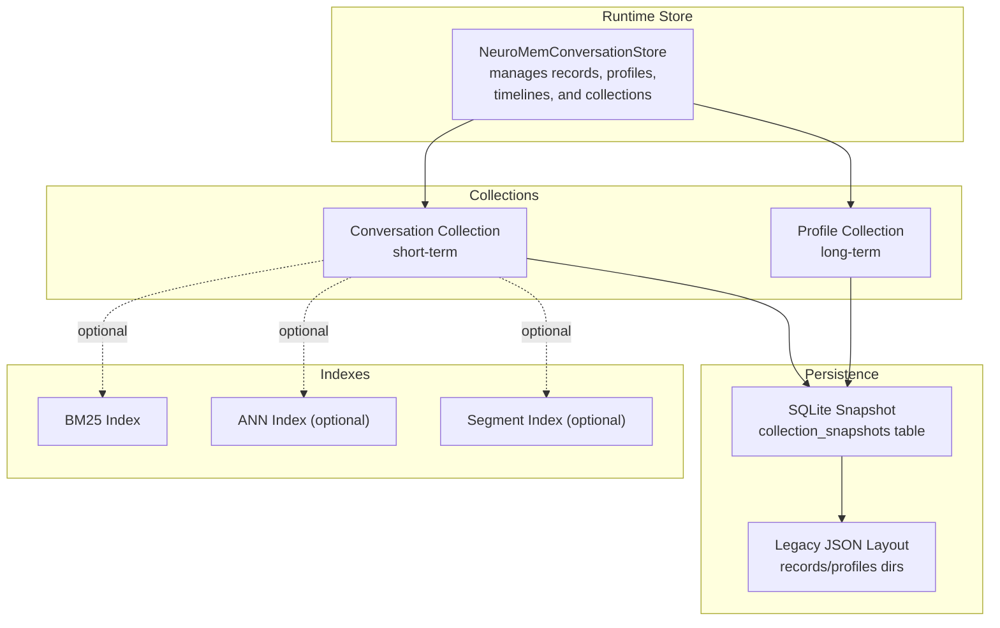
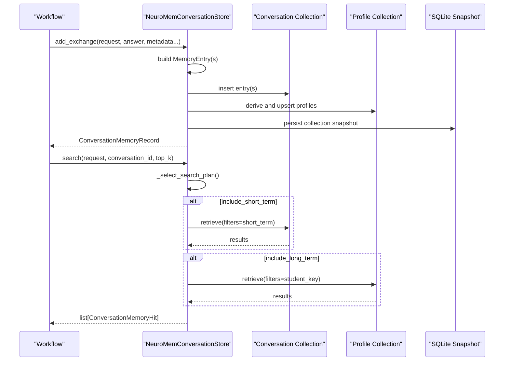
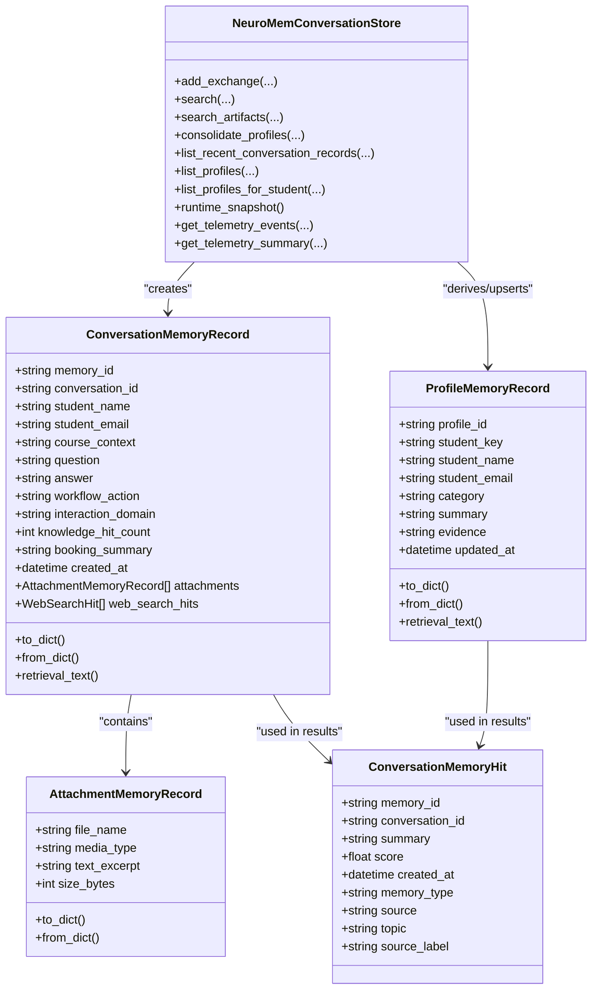

# Conversation Memory

<cite>
**Referenced Files in This Document**
- [memory_store.py](file://src/sage_faculty_twin/memory_store.py)
- [index_metadata.json](file://data/conversation_memory/collections/conversation-memory/index_metadata.json)
- [index_metadata.json](file://data/conversation_memory/collections/conversation-profile-memory/index_metadata.json)
- [raw_data.json](file://data/conversation_memory/collections/conversation-profile-memory/raw_data.json)
- [test_memory_store.py](file://tests/test_memory_store.py)
- [service.py](file://src/sage_faculty_twin/service.py)
</cite>

## Table of Contents
1. [Introduction](#introduction)
2. [Project Structure](#project-structure)
3. [Core Components](#core-components)
4. [Architecture Overview](#architecture-overview)
5. [Detailed Component Analysis](#detailed-component-analysis)
6. [Dependency Analysis](#dependency-analysis)
7. [Performance Considerations](#performance-considerations)
8. [Troubleshooting Guide](#troubleshooting-guide)
9. [Conclusion](#conclusion)
10. [Appendices](#appendices)

## Introduction
This document explains the conversation memory system that powers contextual recall for chat workflows. It covers the ConversationMemoryRecord data structure, persistence and indexing mechanisms, retrieval algorithms, short-term versus long-term memory distinction, neural continual memory integration, attachment handling, and telemetry for performance monitoring. It also documents usage patterns, context preservation across conversations, and integration with workflow execution.

## Project Structure
The conversation memory system is implemented in a dedicated store class backed by a layered memory collection abstraction. Data is persisted to SQLite snapshots and indexed via configurable backends. Profiles are derived from conversation exchanges and stored separately for long-term recall.

**Diagram sources**
- [memory_store.py:223-257](file://src/sage_faculty_twin/memory_store.py#L223-L257)
- [memory_store.py:996-1087](file://src/sage_faculty_twin/memory_store.py#L996-L1087)
- [memory_store.py:1146-1179](file://src/sage_faculty_twin/memory_store.py#L1146-L1179)
- [index_metadata.json:1-7](file://data/conversation_memory/collections/conversation-memory/index_metadata.json#L1-L7)

**Section sources**
- [memory_store.py:223-257](file://src/sage_faculty_twin/memory_store.py#L223-L257)
- [memory_store.py:996-1087](file://src/sage_faculty_twin/memory_store.py#L996-L1087)
- [memory_store.py:1146-1179](file://src/sage_faculty_twin/memory_store.py#L1146-L1179)
- [index_metadata.json:1-7](file://data/conversation_memory/collections/conversation-memory/index_metadata.json#L1-L7)
- [index_metadata.json:1-7](file://data/conversation_memory/collections/conversation-profile-memory/index_metadata.json#L1-L7)

## Core Components
- ConversationMemoryRecord: The primary data structure representing a single exchange with attachments and web search hits.
- ProfileMemoryRecord: Long-term user profile entries derived from conversations.
- ConversationMemoryHit: Lightweight retrieval result for UI presentation.
- AttachmentMemoryRecord: Minimal record for extracted attachment excerpts.
- NeuroMemConversationStore: Central orchestrator for adding, persisting, and retrieving memories; managing timelines and profiles; and emitting telemetry.

Key responsibilities:
- Build MemoryEntry payloads for conversation and profile collections.
- Maintain per-conversation timelines for recent-exchange recall.
- Derive and upsert profile summaries.
- Persist collections to SQLite snapshots.
- Select and configure indexes (BM25, FAISS, Sage VDB ANN, Segment).
- Integrate with neural continual memory collection type.

**Section sources**
- [memory_store.py:55-121](file://src/sage_faculty_twin/memory_store.py#L55-L121)
- [memory_store.py:160-194](file://src/sage_faculty_twin/memory_store.py#L160-L194)
- [memory_store.py:147-158](file://src/sage_faculty_twin/memory_store.py#L147-L158)
- [memory_store.py:223-257](file://src/sage_faculty_twin/memory_store.py#L223-L257)

## Architecture Overview
The system separates short-term (conversation) and long-term (profile) memory into distinct collections. Short-term memory is optimized for recency and conversation context; long-term memory captures stable user characteristics. Retrieval combines both scopes according to a dynamic search plan.

**Diagram sources**
- [memory_store.py:380-424](file://src/sage_faculty_twin/memory_store.py#L380-L424)
- [memory_store.py:446-489](file://src/sage_faculty_twin/memory_store.py#L446-L489)
- [memory_store.py:757-776](file://src/sage_faculty_twin/memory_store.py#L757-L776)
- [memory_store.py:1391-1406](file://src/sage_faculty_twin/memory_store.py#L1391-L1406)
- [memory_store.py:1146-1179](file://src/sage_faculty_twin/memory_store.py#L1146-L1179)

## Detailed Component Analysis

### ConversationMemoryRecord
Represents a single Q&A exchange plus metadata and artifacts. Provides:
- Structured fields for student identity, course context, workflow action, domain, knowledge hit count, and booking summary.
- Attachments and web search hits.
- A retrieval-friendly text builder that aggregates fields for indexing.

Important behaviors:
- to/from_dict for serialization.
- retrieval_text builds a compact string for vector/bm25 indexing.
- created_at timestamps enable ordering and recency weighting.

Usage pattern:
- Constructed during workflow completion and inserted into the conversation collection.

**Section sources**
- [memory_store.py:55-121](file://src/sage_faculty_twin/memory_store.py#L55-L121)
- [memory_store.py:123-144](file://src/sage_faculty_twin/memory_store.py#L123-L144)

### Timeline Management
Per-conversation timelines are maintained as ordered lists of memory IDs, enabling:
- Efficient recent-exchange retrieval for the same conversation.
- Deduplication and ordering by creation time.

Operations:
- Append/prepend to timeline on new exchange.
- List recent records excluding the current question.

**Section sources**
- [memory_store.py:1447-1456](file://src/sage_faculty_twin/memory_store.py#L1447-L1456)
- [memory_store.py:596-622](file://src/sage_faculty_twin/memory_store.py#L596-L622)

### Persistence and Indexing
Two collection types are supported:
- Unified: Uses a classic index (BM25, FAISS, or Segment) with explicit index metadata.
- Neural Continual: Integrates a trainable continual memory collection with configurable hyperparameters.

Persistence:
- Collections are snapshotted into SQLite to avoid reliance on external filesystem layouts.
- Legacy JSON directories are migrated once and removed.

Index selection:
- Auto-selection prefers available backends; Sage VDB ANN requires an optional dependency.
- Index metadata is normalized and persisted alongside collection config.

**Section sources**
- [memory_store.py:258-322](file://src/sage_faculty_twin/memory_store.py#L258-L322)
- [memory_store.py:337-348](file://src/sage_faculty_twin/memory_store.py#L337-L348)
- [memory_store.py:979-994](file://src/sage_faculty_twin/memory_store.py#L979-L994)
- [memory_store.py:1019-1087](file://src/sage_faculty_twin/memory_store.py#L1019-L1087)
- [memory_store.py:1146-1179](file://src/sage_faculty_twin/memory_store.py#L1146-L1179)
- [index_metadata.json:1-7](file://data/conversation_memory/collections/conversation-memory/index_metadata.json#L1-L7)

### Search Plan and Retrieval
The store selects a hybrid retrieval plan based on keywords in the query:
- booking-first: Emphasizes recent short-term and minimal long-term.
- profile-aware: Balances recent and long-term based on detected intent.
- balanced: Standard split favoring recent context.

Short-term retrieval:
- Builds a QueryRequest scoped to the current conversation and student identity.
- Retrieves from the conversation collection and augments with recent same-conversation items.

Long-term retrieval:
- Builds a QueryRequest scoped to the student key.
- Prioritizes preferred categories inferred from the query (e.g., booking_preference, collaboration_preference).

Artifacts:
- Dedicated retrieval pipeline for uploaded attachment excerpts.
- Token overlap scoring ranks candidates before collection-backed results.

**Section sources**
- [memory_store.py:757-776](file://src/sage_faculty_twin/memory_store.py#L757-L776)
- [memory_store.py:778-841](file://src/sage_faculty_twin/memory_store.py#L778-L841)
- [memory_store.py:843-917](file://src/sage_faculty_twin/memory_store.py#L843-L917)
- [memory_store.py:491-582](file://src/sage_faculty_twin/memory_store.py#L491-L582)
- [memory_store.py:1770-1791](file://src/sage_faculty_twin/memory_store.py#L1770-L1791)
- [memory_store.py:1820-1827](file://src/sage_faculty_twin/memory_store.py#L1820-L1827)

### Neural Continual Memory Integration
Neural continual memory collection type enables:
- Configurable feature dimensionality and learning parameters.
- Online continual learning with replay buffers and blending scores.
- Runtime detection of service type for statistics reporting.

Behavior:
- On unified collections, service type becomes “online_continual_memory” when collection type is neural_continual.
- Persistence preserves collection type across restarts.

**Section sources**
- [memory_store.py:337-348](file://src/sage_faculty_twin/memory_store.py#L337-L348)
- [memory_store.py:1356-1383](file://src/sage_faculty_twin/memory_store.py#L1356-L1383)
- [test_memory_store.py:255-289](file://tests/test_memory_store.py#L255-L289)
- [test_memory_store.py:291-322](file://tests/test_memory_store.py#L291-L322)

### Attachment Handling
Attachments are extracted from incoming requests and transformed into:
- AttachmentMemoryRecord entries with clipped text excerpts.
- Dedicated MemoryEntry payloads tagged as artifact_memory for specialized retrieval.

Scoring:
- Overlap between query tokens and attachment metadata/text determines ranking before collection results.

**Section sources**
- [memory_store.py:1724-1740](file://src/sage_faculty_twin/memory_store.py#L1724-L1740)
- [memory_store.py:1485-1515](file://src/sage_faculty_twin/memory_store.py#L1485-L1515)
- [memory_store.py:1770-1791](file://src/sage_faculty_twin/memory_store.py#L1770-L1791)
- [memory_store.py:1820-1827](file://src/sage_faculty_twin/memory_store.py#L1820-L1827)

### Profile Memory and Consolidation
Profiles summarize stable user characteristics:
- Derived categories include identity, course_context, recent_topic, booking_preference, collaboration_preference.
- Upsert logic replaces older entries for the same profile_id while preserving the latest.

Storage:
- Profile entries are stored in the profile collection and canonicalized to keep only the newest per profile_id.

**Section sources**
- [memory_store.py:1422-1440](file://src/sage_faculty_twin/memory_store.py#L1422-L1440)
- [memory_store.py:1442-1445](file://src/sage_faculty_twin/memory_store.py#L1442-L1445)
- [memory_store.py:1517-1539](file://src/sage_faculty_twin/memory_store.py#L1517-L1539)
- [memory_store.py:1566-1596](file://src/sage_faculty_twin/memory_store.py#L1566-L1596)
- [raw_data.json:1-200](file://data/conversation_memory/collections/conversation-profile-memory/raw_data.json#L1-L200)

### Telemetry and Performance Monitoring
Telemetry tracks:
- Write events for conversation and profile writes.
- Retrieve events for general retrieval, artifact retrieval, and search plans.
- Memory usefulness signals with counts and reasons.
- Event counters by type and recent event summaries.

Statistics:
- Service stats include storage stats, index counts, and telemetry summaries.
- Runtime snapshot exposes conversation and profile stats along with recent events.

**Section sources**
- [memory_store.py:413-423](file://src/sage_faculty_twin/memory_store.py#L413-L423)
- [memory_store.py:433-443](file://src/sage_faculty_twin/memory_store.py#L433-L443)
- [memory_store.py:473-488](file://src/sage_faculty_twin/memory_store.py#L473-L488)
- [memory_store.py:572-581](file://src/sage_faculty_twin/memory_store.py#L572-L581)
- [memory_store.py:1286-1319](file://src/sage_faculty_twin/memory_store.py#L1286-L1319)
- [memory_store.py:1321-1354](file://src/sage_faculty_twin/memory_store.py#L1321-L1354)
- [memory_store.py:1356-1383](file://src/sage_faculty_twin/memory_store.py#L1356-L1383)
- [memory_store.py:743-755](file://src/sage_faculty_twin/memory_store.py#L743-L755)

### Integration with Workflow Execution
The workflow integrates memory persistence and retrieval:
- After generating an answer, the workflow persists the exchange to memory store.
- Attachment artifacts are recorded as part of the memory draft.
- Retrieval is invoked prior to response generation to enrich context.

**Section sources**
- [service.py:1519-1532](file://src/sage_faculty_twin/service.py#L1519-L1532)
- [service.py:3958-3984](file://src/sage_faculty_twin/service.py#L3958-L3984)

## Dependency Analysis

**Diagram sources**
- [memory_store.py:55-121](file://src/sage_faculty_twin/memory_store.py#L55-L121)
- [memory_store.py:160-194](file://src/sage_faculty_twin/memory_store.py#L160-L194)
- [memory_store.py:223-257](file://src/sage_faculty_twin/memory_store.py#L223-L257)

**Section sources**
- [memory_store.py:55-121](file://src/sage_faculty_twin/memory_store.py#L55-L121)
- [memory_store.py:160-194](file://src/sage_faculty_twin/memory_store.py#L160-L194)
- [memory_store.py:223-257](file://src/sage_faculty_twin/memory_store.py#L223-L257)

## Performance Considerations
- Index selection: BM25 is default for unified collections; FAISS/Sage VDB ANN require optional dependencies and enable vector-based retrieval when configured.
- Top-K expansion: Queries expand top_k to improve recall before final filtering.
- Recency bias: Recent same-conversation items are prioritized for short-term retrieval.
- Deduplication: Results are de-duplicated by memory_id or attachment index to avoid redundant context.
- Telemetry sampling: Recent telemetry events are capped to control overhead.

[No sources needed since this section provides general guidance]

## Troubleshooting Guide
Common issues and resolutions:
- Missing optional dependency for Sage VDB ANN index: The store raises a runtime error when the required package is absent; switch index type or install the dependency.
- Legacy disk layout migration: Old JSON directories are migrated once; ensure cleanup completes and verify SQLite snapshot exists.
- Duplicate profile entries: Canonicalization removes older duplicates; verify the latest profile is retained after reload.
- Neural continual collection type persistence: After setting the collection type, confirm it persists across restarts.

**Section sources**
- [memory_store.py:324-322](file://src/sage_faculty_twin/memory_store.py#L324-L322)
- [memory_store.py:1217-1256](file://src/sage_faculty_twin/memory_store.py#L1217-L1256)
- [memory_store.py:1566-1596](file://src/sage_faculty_twin/memory_store.py#L1566-L1596)
- [test_memory_store.py:324-344](file://tests/test_memory_store.py#L324-L344)
- [test_memory_store.py:255-289](file://tests/test_memory_store.py#L255-L289)
- [test_memory_store.py:291-322](file://tests/test_memory_store.py#L291-L322)

## Conclusion
The conversation memory system provides robust, layered recall across short-term and long-term contexts, with flexible indexing and neural continual memory integration. It preserves context across conversations, handles attachments, and offers comprehensive telemetry for performance monitoring. The design supports both unified and neural continual collection types, with automatic persistence and migration for reliability.

## Appendices

### Example Usage Patterns
- Writing a conversation exchange and deriving profiles:
  - Add exchange via the store’s add_exchange method.
  - Consolidate profiles to persist long-term characteristics.
- Retrieving context-aware results:
  - Call search with top_k and include flags for short-term/long-term.
  - Use search_artifacts for attachment excerpts.
- Inspecting runtime health:
  - Use runtime_snapshot and telemetry APIs to review stats and recent events.

**Section sources**
- [service.py:1519-1532](file://src/sage_faculty_twin/service.py#L1519-L1532)
- [memory_store.py:446-489](file://src/sage_faculty_twin/memory_store.py#L446-L489)
- [memory_store.py:491-582](file://src/sage_faculty_twin/memory_store.py#L491-L582)
- [memory_store.py:743-755](file://src/sage_faculty_twin/memory_store.py#L743-L755)
- [memory_store.py:675-741](file://src/sage_faculty_twin/memory_store.py#L675-L741)