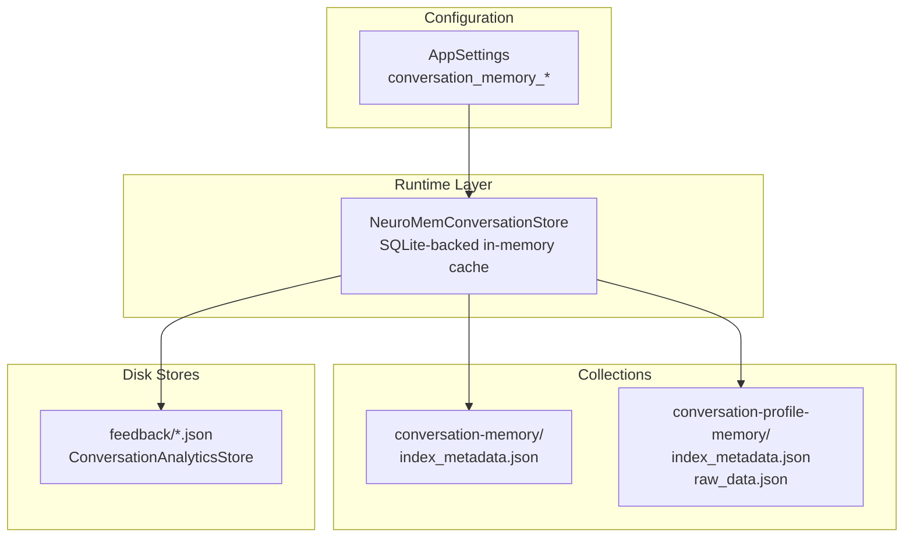
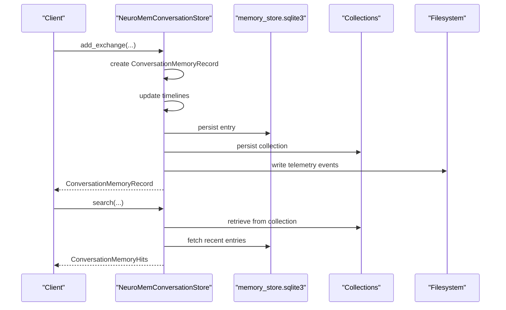
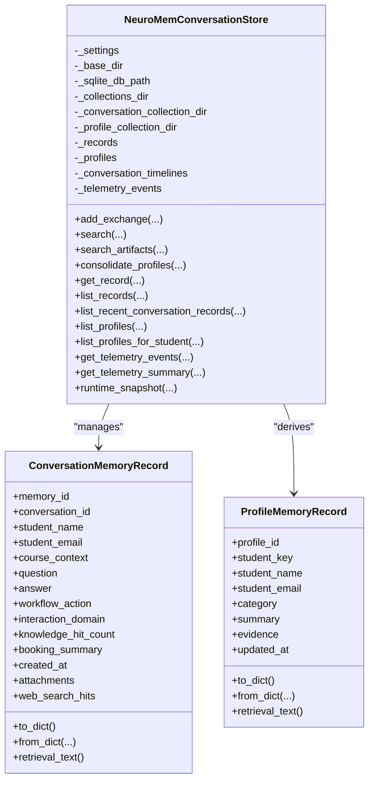
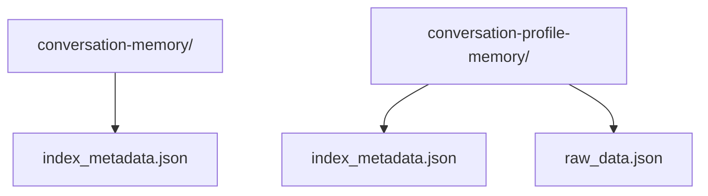
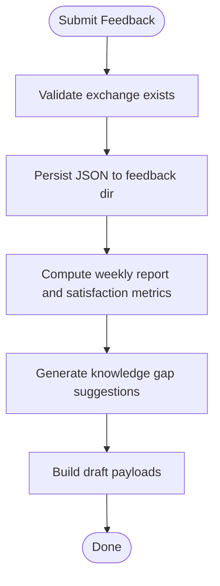
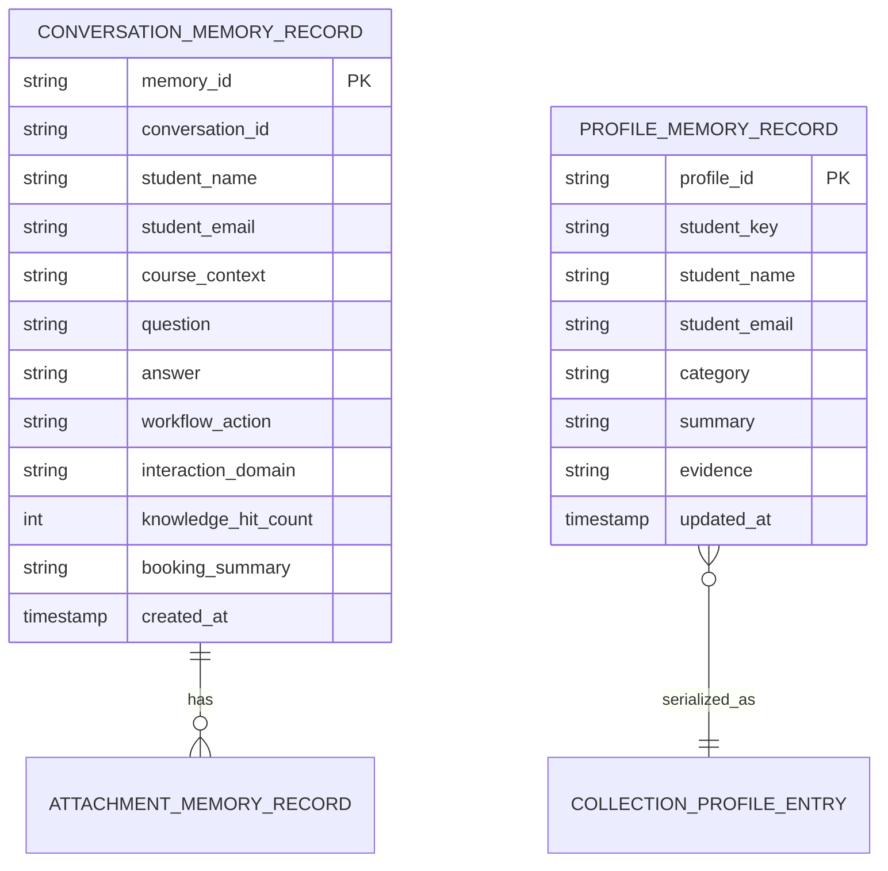
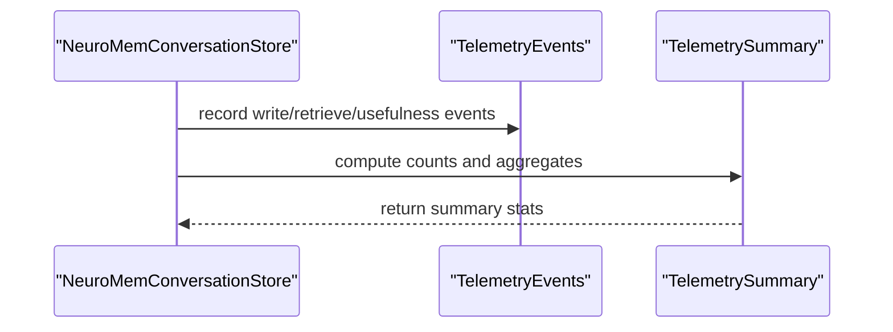
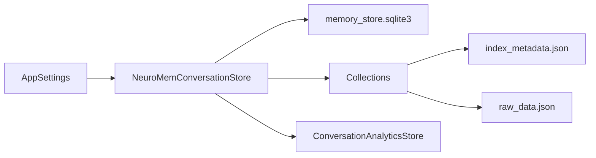

# Memory Persistence and Storage

<cite>
**Referenced Files in This Document**
- [memory_store.py](file://src/sage_faculty_twin/memory_store.py)
- [config.py](file://src/sage_faculty_twin/config.py)
- [analytics_store.py](file://src/sage_faculty_twin/analytics_store.py)
- [models.py](file://src/sage_faculty_twin/models.py)
- [index_metadata.json](file://data/conversation_memory/collections/conversation-memory/index_metadata.json)
- [index_metadata.json](file://data/conversation_memory/collections/conversation-profile-memory/index_metadata.json)
- [raw_data.json](file://data/conversation_memory/collections/conversation-profile-memory/raw_data.json)
</cite>

## Table of Contents
1. [Introduction](#introduction)
2. [Project Structure](#project-structure)
3. [Core Components](#core-components)
4. [Architecture Overview](#architecture-overview)
5. [Detailed Component Analysis](#detailed-component-analysis)
6. [Dependency Analysis](#dependency-analysis)
7. [Performance Considerations](#performance-considerations)
8. [Troubleshooting Guide](#troubleshooting-guide)
9. [Conclusion](#conclusion)

## Introduction
This document explains the memory persistence and storage mechanisms used by the system. It covers the SQLite-based conversation memory store, the collection-based storage architecture, and the file system organization. It also documents memory collection types (conversation-memory and conversation-profile-memory), index configuration options, serialization strategies, backup and migration procedures, telemetry for monitoring memory operations, and practical guidance for configuration, performance tuning, and troubleshooting.

## Project Structure
The memory subsystem centers around a layered storage approach:
- Runtime memory store backed by a SQLite database for fast short-term retrieval
- Persistent collections organized under a dedicated directory tree
- Separate disk-backed stores for analytics feedback
- Configuration-driven index selection and neural memory parameters

**Diagram sources**
- [memory_store.py:223-257](file://src/sage_faculty_twin/memory_store.py#L223-L257)
- [index_metadata.json:1-7](file://data/conversation_memory/collections/conversation-memory/index_metadata.json#L1-L7)
- [index_metadata.json:1-7](file://data/conversation_memory/collections/conversation-profile-memory/index_metadata.json#L1-L7)
- [raw_data.json:1-20](file://data/conversation_memory/collections/conversation-profile-memory/raw_data.json#L1-L20)
- [config.py:75-119](file://src/sage_faculty_twin/config.py#L75-L119)

**Section sources**
- [memory_store.py:223-257](file://src/sage_faculty_twin/memory_store.py#L223-L257)
- [config.py:75-119](file://src/sage_faculty_twin/config.py#L75-L119)

## Core Components
- Conversation memory store: manages short-term conversation entries, maintains timelines, and persists to collections
- Profile memory store: maintains long-term student profiles derived from conversations
- Analytics feedback store: persists user feedback for weekly reports and satisfaction metrics
- Configuration: controls storage locations, index types, and neural memory parameters

Key responsibilities:
- Serialization: JSON-based persistence for feedback and profile raw data
- Indexing: configurable search index types per collection
- Telemetry: event logging for write/read operations and usefulness scoring
- Migration: automatic migration of legacy disk layouts and canonicalization of profile collections

**Section sources**
- [memory_store.py:223-257](file://src/sage_faculty_twin/memory_store.py#L223-L257)
- [memory_store.py:380-444](file://src/sage_faculty_twin/memory_store.py#L380-L444)
- [memory_store.py:446-582](file://src/sage_faculty_twin/memory_store.py#L446-L582)
- [memory_store.py:675-741](file://src/sage_faculty_twin/memory_store.py#L675-L741)
- [analytics_store.py:99-141](file://src/sage_faculty_twin/analytics_store.py#L99-L141)
- [config.py:75-119](file://src/sage_faculty_twin/config.py#L75-L119)

## Architecture Overview
The system uses a layered architecture:
- Runtime layer: in-memory dictionaries and timelines for fast access
- Persistence layer: SQLite database for short-term entries and collections for long-term structures
- Disk layer: JSON files for feedback and profile raw data
- Configuration layer: environment-driven settings for storage paths and index choices

**Diagram sources**
- [memory_store.py:380-424](file://src/sage_faculty_twin/memory_store.py#L380-L424)
- [memory_store.py:446-489](file://src/sage_faculty_twin/memory_store.py#L446-L489)
- [memory_store.py:223-257](file://src/sage_faculty_twin/memory_store.py#L223-L257)

## Detailed Component Analysis

### Conversation Memory Store
The conversation memory store encapsulates:
- Runtime state: in-memory records, timelines, and profiles
- Persistence: SQLite database and collection-based storage
- Index configuration: auto-selection of index types with readiness checks
- Telemetry: event logging for write/retrieve operations and usefulness scoring

**Diagram sources**
- [memory_store.py:223-257](file://src/sage_faculty_twin/memory_store.py#L223-L257)
- [memory_store.py:56-121](file://src/sage_faculty_twin/memory_store.py#L56-L121)
- [memory_store.py:161-194](file://src/sage_faculty_twin/memory_store.py#L161-L194)

Implementation highlights:
- Auto-index selection prefers vector-capable indexes (sage_vdb_ann/sagedb_ann/faiss) and falls back to segment/fifo when unavailable
- Neural collection configuration supports feature dimension, learning rate, weight decay, replay buffer sizing, and score blending
- Search policies balance short-term and long-term retrieval based on query semantics

**Section sources**
- [memory_store.py:258-322](file://src/sage_faculty_twin/memory_store.py#L258-L322)
- [memory_store.py:337-348](file://src/sage_faculty_twin/memory_store.py#L337-L348)
- [memory_store.py:757-776](file://src/sage_faculty_twin/memory_store.py#L757-L776)

### Collection-Based Storage Architecture
Collections organize persistent memory:
- conversation-memory: short-term conversation entries with BM25 index metadata
- conversation-profile-memory: long-term student profiles with raw data and index metadata

**Diagram sources**
- [index_metadata.json:1-7](file://data/conversation_memory/collections/conversation-memory/index_metadata.json#L1-L7)
- [index_metadata.json:1-7](file://data/conversation_memory/collections/conversation-profile-memory/index_metadata.json#L1-L7)
- [raw_data.json:1-20](file://data/conversation_memory/collections/conversation-profile-memory/raw_data.json#L1-L20)

Storage characteristics:
- Index metadata defines search type and configuration per collection
- Raw data contains serialized profile records with metadata and timestamps
- Collections support both BM25 and vector-capable indexes depending on configuration

**Section sources**
- [index_metadata.json:1-7](file://data/conversation_memory/collections/conversation-memory/index_metadata.json#L1-L7)
- [index_metadata.json:1-7](file://data/conversation_memory/collections/conversation-profile-memory/index_metadata.json#L1-L7)
- [raw_data.json:1-20](file://data/conversation_memory/collections/conversation-profile-memory/raw_data.json#L1-L20)

### Analytics Feedback Store
The analytics feedback store persists user feedback for reporting and satisfaction metrics:
- Feedback stored as JSON files named by exchange ID
- Weekly reports and satisfaction metrics computed from stored feedback and conversation records
- Gap suggestions and draft generation based on clustering and similarity analysis

**Diagram sources**
- [analytics_store.py:111-141](file://src/sage_faculty_twin/analytics_store.py#L111-L141)
- [analytics_store.py:149-222](file://src/sage_faculty_twin/analytics_store.py#L149-L222)
- [analytics_store.py:224-260](file://src/sage_faculty_twin/analytics_store.py#L224-L260)

**Section sources**
- [analytics_store.py:99-141](file://src/sage_faculty_twin/analytics_store.py#L99-L141)
- [analytics_store.py:149-222](file://src/sage_faculty_twin/analytics_store.py#L149-L222)
- [analytics_store.py:224-260](file://src/sage_faculty_twin/analytics_store.py#L224-L260)

### Serialization and Data Model
Serialization patterns:
- ConversationMemoryRecord and ProfileMemoryRecord use to_dict/from_dict for JSON persistence
- Analytics feedback stored as JSON with ISO-formatted timestamps
- Profile raw data includes metadata, timestamps, and embedded profile payloads

**Diagram sources**
- [memory_store.py:56-121](file://src/sage_faculty_twin/memory_store.py#L56-L121)
- [memory_store.py:161-194](file://src/sage_faculty_twin/memory_store.py#L161-L194)
- [models.py:9-13](file://src/sage_faculty_twin/models.py#L9-L13)
- [models.py:185-189](file://src/sage_faculty_twin/models.py#L185-L189)

**Section sources**
- [memory_store.py:56-121](file://src/sage_faculty_twin/memory_store.py#L56-L121)
- [memory_store.py:161-194](file://src/sage_faculty_twin/memory_store.py#L161-L194)
- [models.py:9-13](file://src/sage_faculty_twin/models.py#L9-L13)
- [models.py:185-189](file://src/sage_faculty_twin/models.py#L185-L189)

### Backup Procedures
Backup strategies:
- Feedback backups: JSON files stored per exchange ID under the feedback directory
- Profile backups: raw_data.json containing serialized profile records with metadata
- Collection backups: index metadata and raw data preserved in collection directories

Operational guidance:
- Regularly archive the conversation_memory directory
- Monitor feedback and raw_data files for integrity
- Validate index metadata consistency during restore

**Section sources**
- [analytics_store.py:111-141](file://src/sage_faculty_twin/analytics_store.py#L111-L141)
- [raw_data.json:1-20](file://data/conversation_memory/collections/conversation-profile-memory/raw_data.json#L1-L20)
- [index_metadata.json:1-7](file://data/conversation_memory/collections/conversation-memory/index_metadata.json#L1-L7)

### Data Migration Processes
Migration behaviors:
- Legacy disk layout migration: automatic detection and migration during initialization
- Canonicalization of profile collection: ensures consistent profile record structure and metadata

Operational guidance:
- Run initialization after applying configuration changes
- Monitor telemetry for migration-related events
- Validate profile counts before and after migration

**Section sources**
- [memory_store.py:253-256](file://src/sage_faculty_twin/memory_store.py#L253-L256)

### Telemetry System
Telemetry tracks:
- Write operations: conversation writes and profile consolidations
- Retrieve operations: short-term, long-term, and artifact retrievals
- Usefulness scoring: signals indicating memory usefulness for feedback
- Event aggregation: counts by type, recent events, and summary statistics

**Diagram sources**
- [memory_store.py:413-423](file://src/sage_faculty_twin/memory_store.py#L413-L423)
- [memory_store.py:473-488](file://src/sage_faculty_twin/memory_store.py#L473-L488)
- [memory_store.py:572-581](file://src/sage_faculty_twin/memory_store.py#L572-L581)
- [memory_store.py:675-741](file://src/sage_faculty_twin/memory_store.py#L675-L741)

**Section sources**
- [memory_store.py:675-741](file://src/sage_faculty_twin/memory_store.py#L675-L741)

## Dependency Analysis
Key dependencies and relationships:
- Configuration drives storage paths and index selection
- Memory store depends on configuration for paths and neural parameters
- Analytics store depends on memory store for feedback linkage and sampling
- Collections depend on index metadata for search configuration

**Diagram sources**
- [config.py:75-119](file://src/sage_faculty_twin/config.py#L75-L119)
- [memory_store.py:223-257](file://src/sage_faculty_twin/memory_store.py#L223-L257)
- [analytics_store.py:99-110](file://src/sage_faculty_twin/analytics_store.py#L99-L110)
- [index_metadata.json:1-7](file://data/conversation_memory/collections/conversation-memory/index_metadata.json#L1-L7)
- [raw_data.json:1-20](file://data/conversation_memory/collections/conversation-profile-memory/raw_data.json#L1-L20)

**Section sources**
- [config.py:75-119](file://src/sage_faculty_twin/config.py#L75-L119)
- [memory_store.py:223-257](file://src/sage_faculty_twin/memory_store.py#L223-L257)
- [analytics_store.py:99-110](file://src/sage_faculty_twin/analytics_store.py#L99-L110)

## Performance Considerations
- Index selection: prefer vector-capable indexes (sage_vdb_ann/sagedb_ann/faiss) for improved retrieval performance; fallback to BM25/segment/fifo when unavailable
- Neural memory tuning: adjust feature dimension, learning rate, weight decay, replay buffer size, and score blending for optimal recall and latency
- Top-K balancing: tune conversation_memory_top_k and search policies for balanced short-term and long-term retrieval
- Telemetry-driven optimization: monitor write/read durations and result counts to identify bottlenecks

[No sources needed since this section provides general guidance]

## Troubleshooting Guide
Common issues and resolutions:
- Missing optional dependencies for vector indexes: ensure required packages are installed or configure index type accordingly
- Index type mismatch: verify DIGITAL_TWIN_CONVERSATION_MEMORY_INDEX_TYPE aligns with declared indexes and environment readiness
- Storage path misconfiguration: confirm conversation_memory_dir and related directories exist and are writable
- Telemetry anomalies: check recent telemetry events and summary for excessive write failures or missing usefulness signals
- Migration errors: rerun initialization to trigger migration and canonicalization; validate profile counts afterward

**Section sources**
- [memory_store.py:270-322](file://src/sage_faculty_twin/memory_store.py#L270-L322)
- [memory_store.py:253-256](file://src/sage_faculty_twin/memory_store.py#L253-L256)
- [memory_store.py:675-741](file://src/sage_faculty_twin/memory_store.py#L675-L741)

## Conclusion
The memory persistence and storage system combines a SQLite-backed runtime store with collection-based persistence and JSON-backed analytics. Configuration-driven index selection and neural memory parameters enable flexible and scalable retrieval. Robust telemetry and migration procedures support reliable operation, while clear separation of concerns across components simplifies maintenance and troubleshooting.