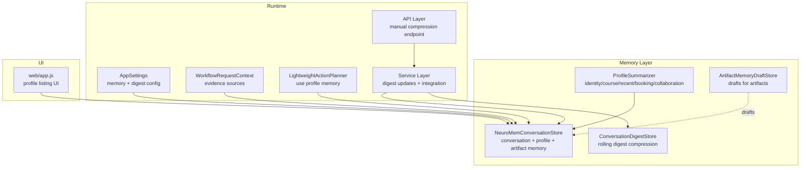
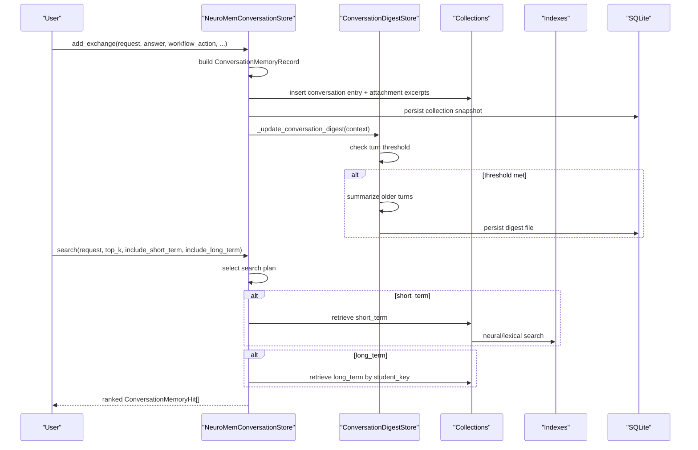
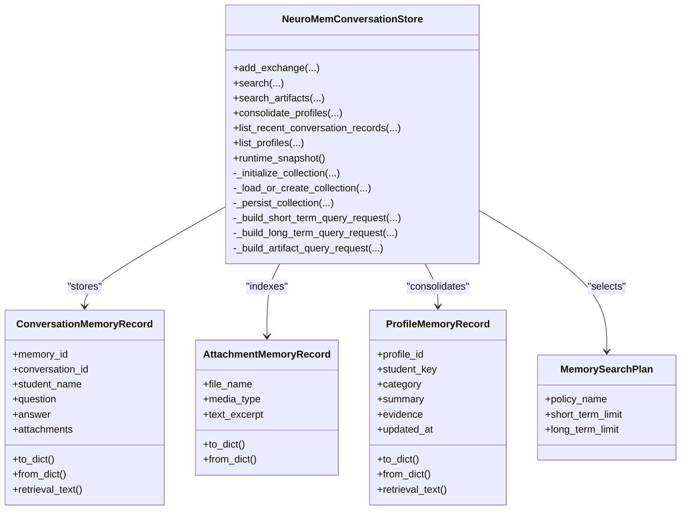
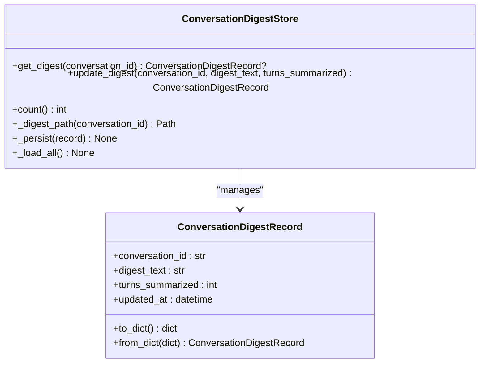
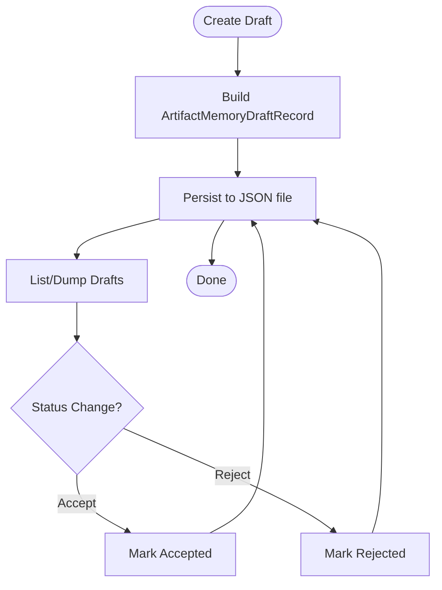
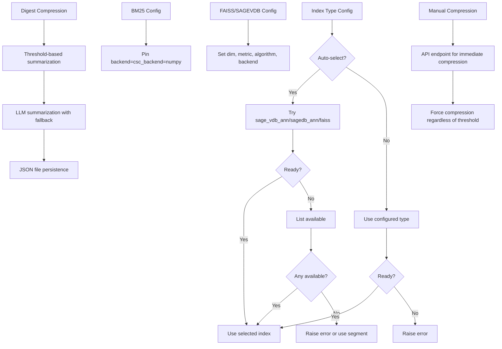
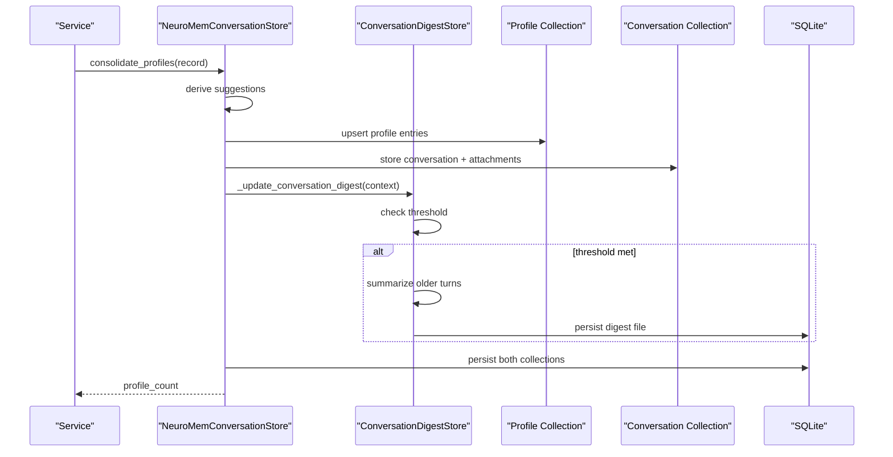
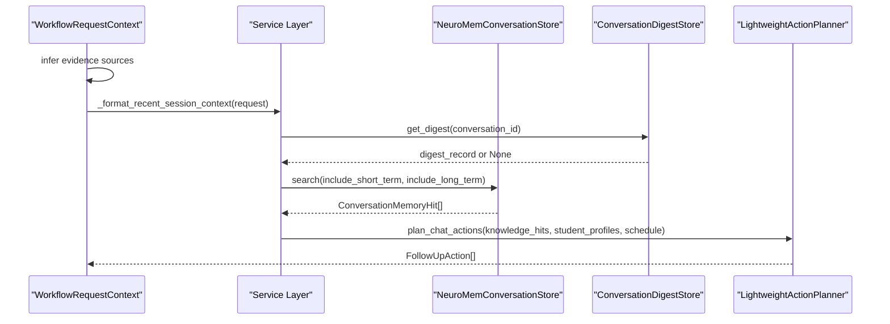
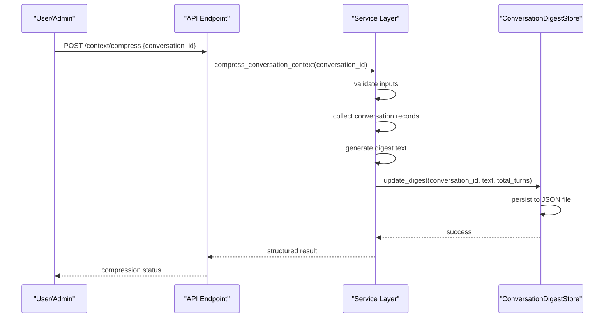
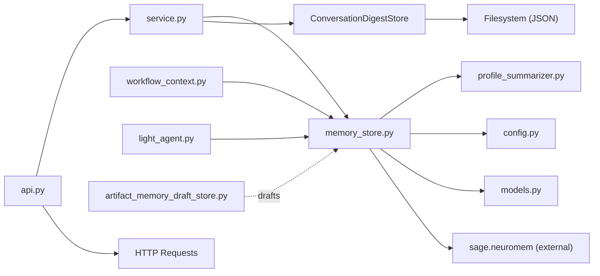

# Memory Systems

<cite>
**Referenced Files in This Document**
- [memory_store.py](file://src/sage_faculty_twin/memory_store.py)
- [profile_summarizer.py](file://src/sage_faculty_twin/profile_summarizer.py)
- [artifact_memory_draft_store.py](file://src/sage_faculty_twin/artifact_memory_draft_store.py)
- [config.py](file://src/sage_faculty_twin/config.py)
- [models.py](file://src/sage_faculty_twin/models.py)
- [workflow_context.py](file://src/sage_faculty_twin/workflow_context.py)
- [light_agent.py](file://src/sage_faculty_twin/light_agent.py)
- [service.py](file://src/sage_faculty_twin/service.py)
- [api.py](file://src/sage_faculty_twin/api.py)
- [test_conversation_digest.py](file://tests/test_conversation_digest.py)
- [app.js](file://src/sage_faculty_twin/web/app.js)
</cite>

## Update Summary
**Changes Made**
- Added comprehensive documentation for the new ConversationDigestStore system with rolling conversation digests
- Documented intelligent compression of older conversation turns with configurable thresholds and maximum character limits
- Added manual compression button functionality and automatic compression triggers
- Integrated digest system into memory architecture overview and persistence strategies
- Updated configuration and integration points with workflow execution

## Table of Contents
1. [Introduction](#introduction)
2. [Project Structure](#project-structure)
3. [Core Components](#core-components)
4. [Architecture Overview](#architecture-overview)
5. [Detailed Component Analysis](#detailed-component-analysis)
6. [Dependency Analysis](#dependency-analysis)
7. [Performance Considerations](#performance-considerations)
8. [Troubleshooting Guide](#troubleshooting-guide)
9. [Conclusion](#conclusion)

## Introduction
This document explains the memory management architecture that powers conversational recall, long-term student profiling, artifact memory, neural continual memory, and the new rolling conversation digest system. It covers persistence strategies, retrieval mechanisms, cross-session context preservation, indexing and compression choices, and privacy-aware operations. The digest system intelligently compresses older conversation turns to reduce prompt size while preserving important context, featuring configurable thresholds and character limits for optimal performance. The system now includes both automatic compression triggers and manual compression buttons for enhanced user control.

## Project Structure
The memory system spans several modules:
- Memory store: conversation memory, profile memory, artifact indexing, and persistence
- Profile summarizer: transforms conversations into long-term student profiles
- Artifact memory draft store: manages drafts for material-based memory
- Conversation digest store: maintains compressed summaries of older conversation turns with intelligent trigger-based summarization
- Configuration: memory-related settings including digest system configuration
- Models: shared data structures used across memory and workflows
- Workflow context: orchestrates memory usage in workflows
- Light agent: consumes profile memory to generate follow-up actions
- Service layer: coordinates digest updates and integrates with workflow execution
- API endpoints: provide manual compression functionality
- Tests and frontend: validate digest functionality and expose profile listings

**Diagram sources**
- [memory_store.py:320-354](file://src/sage_faculty_twin/memory_store.py#L320-L354)
- [profile_summarizer.py:202-213](file://src/sage_faculty_twin/profile_summarizer.py#L202-L213)
- [artifact_memory_draft_store.py:97-103](file://src/sage_faculty_twin/artifact_memory_draft_store.py#L97-L103)
- [config.py:125-131](file://src/sage_faculty_twin/config.py#L125-L131)
- [workflow_context.py:210-239](file://src/sage_faculty_twin/workflow_context.py#L210-L239)
- [light_agent.py:21-31](file://src/sage_faculty_twin/light_agent.py#L21-L31)
- [service.py:5546](file://src/sage_faculty_twin/service.py#L5546)
- [api.py:727-740](file://src/sage_faculty_twin/api.py#L727-L740)
- [app.js:2627-2656](file://src/sage_faculty_twin/web/app.js#L2627-L2656)

**Section sources**
- [memory_store.py:320-354](file://src/sage_faculty_twin/memory_store.py#L320-L354)
- [config.py:125-131](file://src/sage_faculty_twin/config.py#L125-L131)

## Core Components
- Conversation memory store: captures exchanges, builds short-term memory, and persists via SQLite snapshots
- Profile memory store: consolidates stable student characteristics from conversations
- Artifact memory: extracts and indexes excerpts from uploaded attachments
- Neural continual memory: trainable, online continual memory for short-term recall
- **Conversation digest store**: maintains rolling compressed summaries of older conversation turns with intelligent trigger-based updates and manual compression capabilities
- Index selection and configuration: automatic selection of bm25/faiss/sage_vdb_ann with fallbacks
- Persistence: SQLite-backed snapshots for collections; JSON drafts for artifacts and digest files
- Privacy-aware filtering: guest handling and per-student scoping

**Section sources**
- [memory_store.py:380-424](file://src/sage_faculty_twin/memory_store.py#L380-L424)
- [memory_store.py:426-444](file://src/sage_faculty_twin/memory_store.py#L426-L444)
- [memory_store.py:491-582](file://src/sage_faculty_twin/memory_store.py#L491-L582)
- [memory_store.py:947-994](file://src/sage_faculty_twin/memory_store.py#L947-L994)
- [memory_store.py:1146-1179](file://src/sage_faculty_twin/memory_store.py#L1146-L1179)
- [artifact_memory_draft_store.py:97-103](file://src/sage_faculty_twin/artifact_memory_draft_store.py#L97-L103)
- [memory_store.py:255-318](file://src/sage_faculty_twin/memory_store.py#L255-L318)

## Architecture Overview
The memory system is layered with the new digest system integrated:
- Short-term conversation memory: dense neural continual memory with configurable index
- Long-term profile memory: unified collection with stable summaries
- Artifact memory: attachment excerpts indexed alongside conversations
- **Conversation digest memory**: rolling compressed summaries of older turns with intelligent trigger-based updates and manual compression capabilities
- Persistence: SQLite snapshots for collections; JSON drafts for artifacts and digest files
- Retrieval: hybrid policy selecting short-term, long-term, and artifact candidates with digest-aware context formatting

**Diagram sources**
- [memory_store.py:380-424](file://src/sage_faculty_twin/memory_store.py#L380-L424)
- [memory_store.py:446-489](file://src/sage_faculty_twin/memory_store.py#L446-L489)
- [memory_store.py:757-776](file://src/sage_faculty_twin/memory_store.py#L757-L776)
- [memory_store.py:778-841](file://src/sage_faculty_twin/memory_store.py#L778-L841)
- [memory_store.py:843-917](file://src/sage_faculty_twin/memory_store.py#L843-L917)
- [memory_store.py:1146-1179](file://src/sage_faculty_twin/memory_store.py#L1146-L1179)
- [service.py:1623-1672](file://src/sage_faculty_twin/service.py#L1623-L1672)
- [memory_store.py:255-318](file://src/sage_faculty_twin/memory_store.py#L255-L318)

## Detailed Component Analysis

### Conversation Memory Store
Responsibilities:
- Add conversation exchanges and attachments
- Build and persist memory entries
- Search short-term, long-term, and artifact memories
- Consolidate profiles into long-term memory
- Manage collection lifecycle and persistence

Key behaviors:
- Automatic index selection with fallbacks and environment checks
- Neural continual memory configuration and runtime stats
- Guest filtering and per-conversation timelines
- Canonicalization and migration of legacy layouts

**Diagram sources**
- [memory_store.py:320-354](file://src/sage_faculty_twin/memory_store.py#L320-L354)
- [memory_store.py:55-121](file://src/sage_faculty_twin/memory_store.py#L55-L121)
- [memory_store.py:160-194](file://src/sage_faculty_twin/memory_store.py#L160-L194)
- [memory_store.py:217-221](file://src/sage_faculty_twin/memory_store.py#L217-L221)

**Section sources**
- [memory_store.py:380-424](file://src/sage_faculty_twin/memory_store.py#L380-L424)
- [memory_store.py:446-489](file://src/sage_faculty_twin/memory_store.py#L446-L489)
- [memory_store.py:491-582](file://src/sage_faculty_twin/memory_store.py#L491-L582)
- [memory_store.py:757-776](file://src/sage_faculty_twin/memory_store.py#L757-L776)
- [memory_store.py:947-994](file://src/sage_faculty_twin/memory_store.py#L947-L994)
- [memory_store.py:1146-1179](file://src/sage_faculty_twin/memory_store.py#L1146-L1179)
- [memory_store.py:1458-1549](file://src/sage_faculty_twin/memory_store.py#L1458-L1549)

### Conversation Digest Store
**New Component** - Maintains rolling compressed summaries of older conversation turns to reduce prompt size while preserving important context.

Responsibilities:
- Store and retrieve compressed summaries of conversation history
- Maintain per-conversation digest records with metadata
- Provide persistent storage for digest files
- Support intelligent trigger-based summarization updates
- Enable manual compression via API endpoint

Key behaviors:
- Automatic sanitization of conversation IDs for filesystem safety
- Threshold-based trigger logic that determines when to summarize
- Configurable character limits for digest text length
- Graceful fallback when LLM summarization fails
- Persistent JSON file storage with corruption tolerance
- Manual compression button functionality for immediate compression

**Diagram sources**
- [memory_store.py:223-253](file://src/sage_faculty_twin/memory_store.py#L223-L253)
- [memory_store.py:255-318](file://src/sage_faculty_twin/memory_store.py#L255-L318)

**Section sources**
- [memory_store.py:223-253](file://src/sage_faculty_twin/memory_store.py#L223-L253)
- [memory_store.py:255-318](file://src/sage_faculty_twin/memory_store.py#L255-L318)
- [test_conversation_digest.py:30-53](file://tests/test_conversation_digest.py#L30-L53)
- [test_conversation_digest.py:60-98](file://tests/test_conversation_digest.py#L60-L98)
- [test_conversation_digest.py:106-136](file://tests/test_conversation_digest.py#L106-L136)

### Profile Summarization System
Responsibilities:
- Derive stable student profiles from conversation records
- Support multiple categories: identity, course context, recent topic, booking preference, collaboration preference
- Provide category registry and available categories

Implementation highlights:
- Category-specific summarizers registered under a registry
- Topic extraction and preference inference from questions/answers
- Evidence construction for traceability

**Diagram sources**
- [profile_summarizer.py:202-213](file://src/sage_faculty_twin/profile_summarizer.py#L202-L213)
- [profile_summarizer.py:53-62](file://src/sage_faculty_twin/profile_summarizer.py#L53-L62)
- [profile_summarizer.py:72-83](file://src/sage_faculty_twin/profile_summarizer.py#L72-L83)
- [profile_summarizer.py:87-114](file://src/sage_faculty_twin/profile_summarizer.py#L87-L114)
- [profile_summarizer.py:117-162](file://src/sage_faculty_twin/profile_summarizer.py#L117-L162)
- [profile_summarizer.py:165-200](file://src/sage_faculty_twin/profile_summarizer.py#L165-L200)

**Section sources**
- [profile_summarizer.py:202-213](file://src/sage_faculty_twin/profile_summarizer.py#L202-L213)
- [profile_summarizer.py:53-62](file://src/sage_faculty_twin/profile_summarizer.py#L53-L62)
- [profile_summarizer.py:87-114](file://src/sage_faculty_twin/profile_summarizer.py#L87-L114)
- [profile_summarizer.py:117-162](file://src/sage_faculty_twin/profile_summarizer.py#L117-L162)
- [profile_summarizer.py:165-200](file://src/sage_faculty_twin/profile_summarizer.py#L165-L200)

### Artifact Memory Draft Store
Responsibilities:
- Create, list, and manage drafts for artifact-based memory
- Persist drafts as JSON files under a dedicated directory
- Track status transitions (draft → accepted/rejected)

**Diagram sources**
- [artifact_memory_draft_store.py:104-141](file://src/sage_faculty_twin/artifact_memory_draft_store.py#L104-L141)
- [artifact_memory_draft_store.py:149-169](file://src/sage_faculty_twin/artifact_memory_draft_store.py#L149-L169)
- [artifact_memory_draft_store.py:171-183](file://src/sage_faculty_twin/artifact_memory_draft_store.py#L171-L183)

**Section sources**
- [artifact_memory_draft_store.py:97-103](file://src/sage_faculty_twin/artifact_memory_draft_store.py#L97-L103)
- [artifact_memory_draft_store.py:104-141](file://src/sage_faculty_twin/artifact_memory_draft_store.py#L104-L141)
- [artifact_memory_draft_store.py:149-169](file://src/sage_faculty_twin/artifact_memory_draft_store.py#L149-L169)
- [artifact_memory_draft_store.py:171-183](file://src/sage_faculty_twin/artifact_memory_draft_store.py#L171-L183)

### Memory Indexing and Compression
Index selection:
- Auto-select index type preferring vector-capable indexes (sage_vdb_ann/sagedb_ann/faiss); falls back to segment/fifo if unavailable
- bm25 pinned to numpy backend by default
- faiss and sage_vdb_ann configured with dimension and metric
- Environment-dependent readiness checks for optional dependencies

Compression and storage:
- Neural continual memory: trainable online memory with replay buffer and blending scores
- **Conversation digest compression**: rolling summaries that replace older turns with compressed context, supporting both automatic and manual compression
- Unified collection: lexical bm25 with normalized backend settings
- SQLite snapshots: raw collection data, config, and index metadata persisted atomically
- **Digest files**: individual JSON files per conversation with sanitized filenames

**Diagram sources**
- [memory_store.py:258-322](file://src/sage_faculty_twin/memory_store.py#L258-L322)
- [memory_store.py:350-369](file://src/sage_faculty_twin/memory_store.py#L350-L369)
- [memory_store.py:1011-1087](file://src/sage_faculty_twin/memory_store.py#L1011-L1087)
- [memory_store.py:1146-1179](file://src/sage_faculty_twin/memory_store.py#L1146-L1179)
- [memory_store.py:255-318](file://src/sage_faculty_twin/memory_store.py#L255-L318)
- [test_bm25_backend_config.py:7-14](file://tests/test_bm25_backend_config.py#L7-L14)

**Section sources**
- [memory_store.py:258-322](file://src/sage_faculty_twin/memory_store.py#L258-L322)
- [memory_store.py:350-369](file://src/sage_faculty_twin/memory_store.py#L350-L369)
- [memory_store.py:1011-1087](file://src/sage_faculty_twin/memory_store.py#L1011-L1087)
- [memory_store.py:1146-1179](file://src/sage_faculty_twin/memory_store.py#L1146-L1179)
- [memory_store.py:255-318](file://src/sage_faculty_twin/memory_store.py#L255-L318)
- [test_bm25_backend_config.py:7-14](file://tests/test_bm25_backend_config.py#L7-L14)

### Memory Consolidation and Persistence
Consolidation process:
- After each conversation exchange, derive profile suggestions and upsert into long-term memory
- **Update conversation digest when threshold is met: summarize older turns and persist compressed summary**
- Canonicalize profile entries by category and timestamp
- Persist collections to SQLite snapshots and digest files

Persistence:
- Conversation and profile collections are stored in separate directories
- **Digest files are stored as individual JSON files under the digest directory**
- Legacy JSON snapshots are migrated into SQLite-backed persistence
- Artifact drafts are stored as JSON files under a dedicated directory

**Diagram sources**
- [memory_store.py:426-444](file://src/sage_faculty_twin/memory_store.py#L426-L444)
- [memory_store.py:1422-1440](file://src/sage_faculty_twin/memory_store.py#L1422-L1440)
- [memory_store.py:1442-1449](file://src/sage_faculty_twin/memory_store.py#L1442-L1449)
- [memory_store.py:1566-1596](file://src/sage_faculty_twin/memory_store.py#L1566-L1596)
- [memory_store.py:1146-1179](file://src/sage_faculty_twin/memory_store.py#L1146-L1179)
- [service.py:1623-1672](file://src/sage_faculty_twin/service.py#L1623-L1672)
- [memory_store.py:255-318](file://src/sage_faculty_twin/memory_store.py#L255-L318)

**Section sources**
- [memory_store.py:426-444](file://src/sage_faculty_twin/memory_store.py#L426-L444)
- [memory_store.py:1422-1440](file://src/sage_faculty_twin/memory_store.py#L1422-L1440)
- [memory_store.py:1566-1596](file://src/sage_faculty_twin/memory_store.py#L1566-L1596)
- [memory_store.py:1146-1179](file://src/sage_faculty_twin/memory_store.py#L1146-L1179)
- [service.py:1623-1672](file://src/sage_faculty_twin/service.py#L1623-L1672)
- [memory_store.py:255-318](file://src/sage_faculty_twin/memory_store.py#L255-L318)

### Privacy and Cross-Session Context Preservation
Privacy controls:
- Guest filtering: excludes records where student name is "guest"
- Per-student scoping: long-term queries filter by student_key derived from email or name
- Timeline scoping: recent conversation records filtered by conversation_id

Cross-session context:
- Timelines maintain ordering of conversation exchanges per conversation_id
- Recent memory retrieval augments results with recent same-conversation records
- **Digest system preserves compressed context across sessions while reducing token usage**
- Long-term memory preserves stable summaries across sessions

**Section sources**
- [memory_store.py:1408-1421](file://src/sage_faculty_twin/memory_store.py#L1408-L1421)
- [memory_store.py:596-622](file://src/sage_faculty_twin/memory_store.py#L596-L622)
- [memory_store.py:843-917](file://src/sage_faculty_twin/memory_store.py#L843-L917)
- [memory_store.py:1712-1718](file://src/sage_faculty_twin/memory_store.py#L1712-L1718)

### Integration with Workflow Execution
Integration points:
- WorkflowRequestContext infers evidence sources including recent memory, profile memory, and artifact memory
- **Service layer coordinates digest updates during conversation processing**
- **Digest-aware context formatting in `_format_recent_session_context`**
- LightweightActionPlanner consumes profile memory to suggest follow-ups and availability slots
- Service consolidates profile memory after conversation completion
- **API layer provides manual compression endpoint for immediate digest generation**

**Diagram sources**
- [workflow_context.py:210-239](file://src/sage_faculty_twin/workflow_context.py#L210-L239)
- [memory_store.py:446-489](file://src/sage_faculty_twin/memory_store.py#L446-L489)
- [light_agent.py:21-31](file://src/sage_faculty_twin/light_agent.py#L21-L31)
- [light_agent.py:109-118](file://src/sage_faculty_twin/light_agent.py#L109-L118)
- [service.py:2954-2981](file://src/sage_faculty_twin/service.py#L2954-L2981)
- [service.py:1623-1672](file://src/sage_faculty_twin/service.py#L1623-L1672)

**Section sources**
- [workflow_context.py:210-239](file://src/sage_faculty_twin/workflow_context.py#L210-L239)
- [light_agent.py:21-31](file://src/sage_faculty_twin/light_agent.py#L21-L31)
- [light_agent.py:109-118](file://src/sage_faculty_twin/light_agent.py#L109-L118)
- [service.py:2954-2981](file://src/sage_faculty_twin/service.py#L2954-L2981)
- [service.py:1623-1672](file://src/sage_faculty_twin/service.py#L1623-L1672)

### Manual Compression Button and API Integration
**New Feature** - Provides users with manual control over conversation compression through a dedicated API endpoint.

Responsibilities:
- Handle manual compression requests via POST /context/compress endpoint
- Execute immediate compression regardless of turn threshold
- Return structured results with compression statistics
- Integrate with existing digest store infrastructure

Key behaviors:
- Validates conversation_id parameter from request payload
- Executes compression immediately without waiting for threshold
- Returns success/failure status with compression metrics
- Supports emergency compression when automatic triggers fail

**Diagram sources**
- [api.py:727-740](file://src/sage_faculty_twin/api.py#L727-L740)
- [service.py:1732-1785](file://src/sage_faculty_twin/service.py#L1732-L1785)
- [memory_store.py:277-291](file://src/sage_faculty_twin/memory_store.py#L277-L291)

**Section sources**
- [api.py:727-740](file://src/sage_faculty_twin/api.py#L727-L740)
- [service.py:1732-1785](file://src/sage_faculty_twin/service.py#L1732-L1785)
- [memory_store.py:277-291](file://src/sage_faculty_twin/memory_store.py#L277-L291)

## Dependency Analysis
- External dependencies:
  - sage.neuromem: MemoryEntry, QueryRequest, RetrievalResult, ServiceStats, TelemetryEvent
  - Optional vector backends: sage_vdb_anns, faiss
- Internal dependencies:
  - memory_store depends on profile_summarizer for consolidation
  - **service layer coordinates digest updates and integrates with memory store**
  - workflow_context influences memory search scope
  - light_agent consumes profile memory for planning
  - artifact_memory_draft_store complements conversation memory with drafts
  - **conversation_digest_store provides persistent storage for compressed context**
  - **api layer exposes manual compression endpoint for user control**

**Diagram sources**
- [memory_store.py:15-25](file://src/sage_faculty_twin/memory_store.py#L15-L25)
- [profile_summarizer.py:1-10](file://src/sage_faculty_twin/profile_summarizer.py#L1-L10)
- [config.py:1-15](file://src/sage_faculty_twin/config.py#L1-L15)
- [models.py:1-10](file://src/sage_faculty_twin/models.py#L1-L10)
- [workflow_context.py:1-10](file://src/sage_faculty_twin/workflow_context.py#L1-L10)
- [light_agent.py:1-10](file://src/sage_faculty_twin/light_agent.py#L1-L10)
- [artifact_memory_draft_store.py:1-10](file://src/sage_faculty_twin/artifact_memory_draft_store.py#L1-L10)
- [service.py:5546](file://src/sage_faculty_twin/service.py#L5546)
- [memory_store.py:255-318](file://src/sage_faculty_twin/memory_store.py#L255-L318)
- [api.py:727-740](file://src/sage_faculty_twin/api.py#L727-L740)

**Section sources**
- [memory_store.py:15-25](file://src/sage_faculty_twin/memory_store.py#L15-L25)
- [profile_summarizer.py:1-10](file://src/sage_faculty_twin/profile_summarizer.py#L1-L10)
- [config.py:1-15](file://src/sage_faculty_twin/config.py#L1-L15)
- [models.py:1-10](file://src/sage_faculty_twin/models.py#L1-L10)
- [workflow_context.py:1-10](file://src/sage_faculty_twin/workflow_context.py#L1-L10)
- [light_agent.py:1-10](file://src/sage_faculty_twin/light_agent.py#L1-L10)
- [artifact_memory_draft_store.py:1-10](file://src/sage_faculty_twin/artifact_memory_draft_store.py#L1-L10)
- [service.py:5546](file://src/sage_faculty_twin/service.py#L5546)
- [memory_store.py:255-318](file://src/sage_faculty_twin/memory_store.py#L255-L318)
- [api.py:727-740](file://src/sage_faculty_twin/api.py#L727-L740)

## Performance Considerations
- Index selection: prefer vector-capable indexes for recall quality; fallback gracefully
- Replay buffer and learning rate tuning for neural continual memory
- Top-k scaling: short-term queries scale with conversation context; long-term prioritizes categories
- Guest filtering reduces irrelevant retrieval noise
- Canonicalization prevents redundant profile entries and optimizes storage
- **Digest threshold configuration: tune context_digest_turn_threshold to balance summarization frequency and context retention**
- **Character limits: configure context_digest_max_chars to control memory footprint and LLM input size**
- **Fallback mechanism: digest updates never block chat workflow due to LLM summarization failures**
- **Manual compression: immediate compression bypasses threshold checks for urgent scenarios**
- **Storage efficiency: JSON files provide atomic persistence with corruption tolerance**

## Troubleshooting Guide
Common issues and resolutions:
- Index not ready: ensure required optional dependencies are installed or configure index type explicitly
- No results returned: verify guest filtering and per-student scoping; confirm conversation_id and student_key alignment
- Migration errors: legacy directories must be empty after migration; check SQLite snapshot integrity
- Draft status errors: status transitions require draft→accepted/rejected; invalid states raise errors
- **Digest file corruption: digest store automatically skips invalid JSON files during load-all operations**
- **Digest threshold issues: verify context_digest_turn_threshold configuration and conversation record counts**
- **Digest storage problems: ensure context_digest_dir is writable and has sufficient space for JSON files**
- **Manual compression failures: verify conversation_id parameter and check LLM availability for summarization**
- **API endpoint errors: ensure proper JSON payload format and valid conversation_id values**

**Section sources**
- [memory_store.py:270-322](file://src/sage_faculty_twin/memory_store.py#L270-L322)
- [memory_store.py:1217-1256](file://src/sage_faculty_twin/memory_store.py#L1217-L1256)
- [memory_store.py:1286-1319](file://src/sage_faculty_twin/memory_store.py#L1286-L1319)
- [artifact_memory_draft_store.py:158-169](file://src/sage_faculty_twin/artifact_memory_draft_store.py#L158-L169)
- [test_conversation_digest.py:106-136](file://tests/test_conversation_digest.py#L106-L136)
- [config.py:125-131](file://src/sage_faculty_twin/config.py#L125-L131)
- [api.py:727-740](file://src/sage_faculty_twin/api.py#L727-L740)

## Conclusion
The memory system combines neural continual memory for short-term recall, unified profile memory for long-term stability, artifact indexing for contextual material, and the new rolling conversation digest system for efficient long-range context preservation. The digest system intelligently compresses older conversation turns based on configurable thresholds, reducing prompt size while maintaining important context. It persists efficiently via SQLite snapshots and JSON files, supports robust index selection with fallbacks, and integrates tightly with workflows to preserve context across sessions while respecting privacy constraints. The addition of manual compression buttons and API endpoints provides users with enhanced control over conversation compression, ensuring optimal performance and user experience.