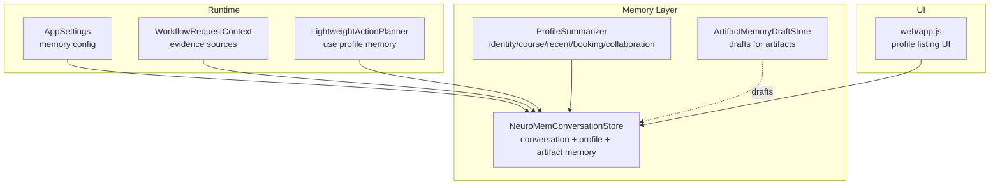
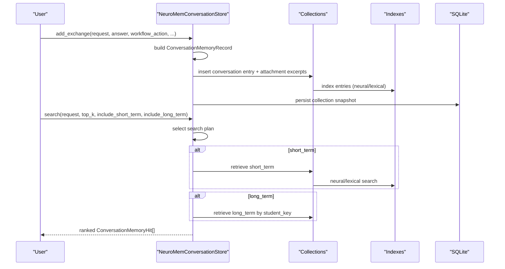
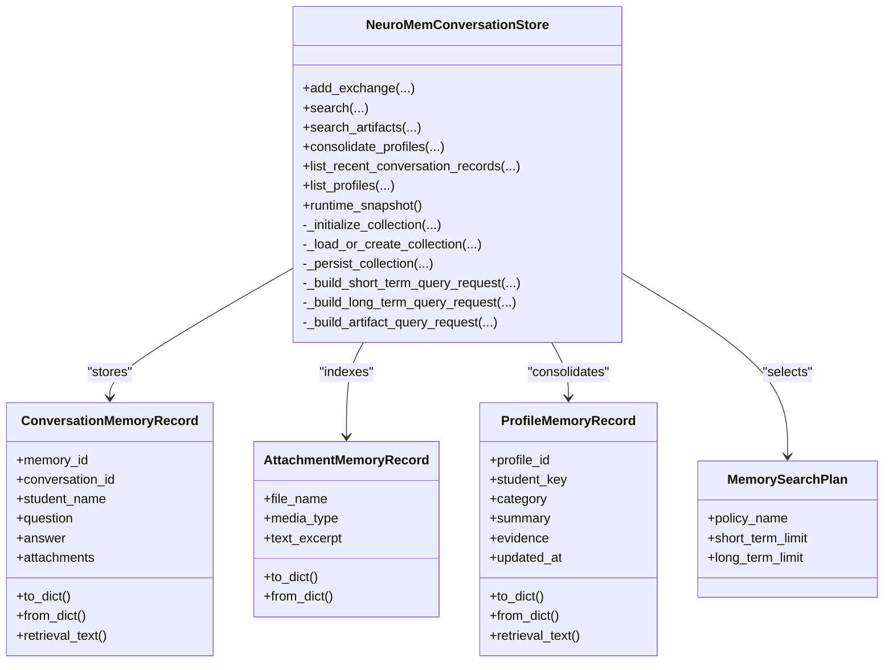
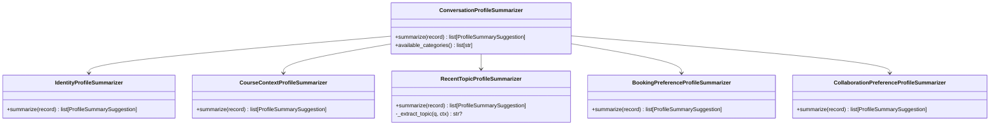
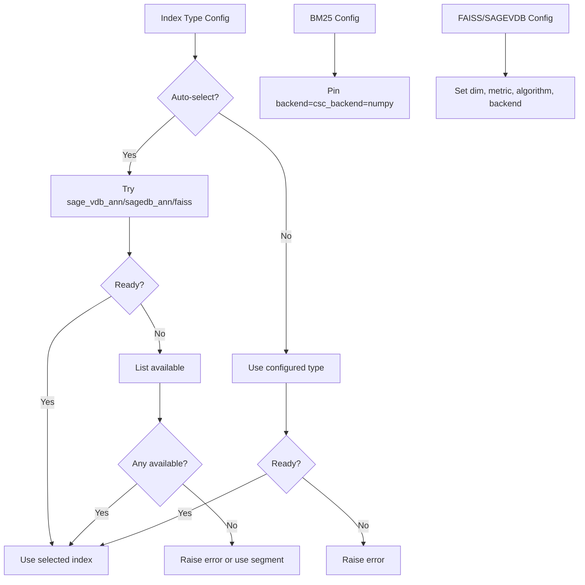
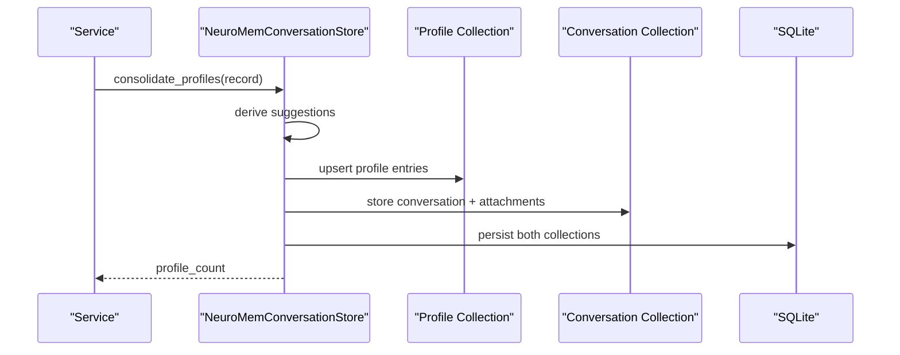
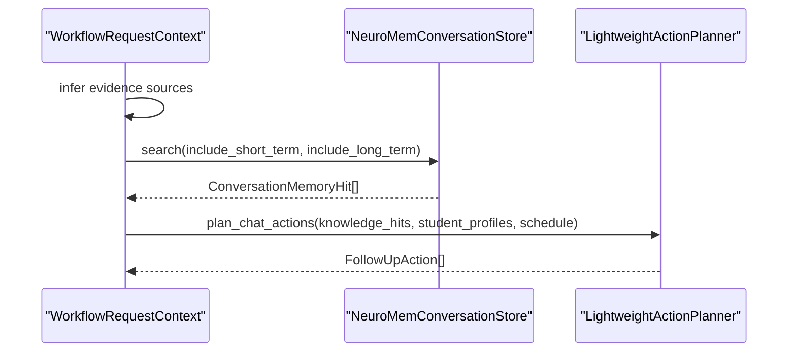
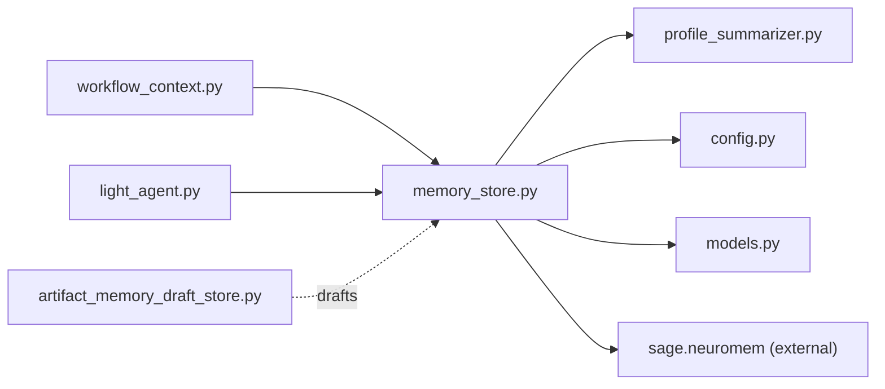

# Memory Systems

<cite>
**Referenced Files in This Document**
- [memory_store.py](file://src/sage_faculty_twin/memory_store.py)
- [profile_summarizer.py](file://src/sage_faculty_twin/profile_summarizer.py)
- [artifact_memory_draft_store.py](file://src/sage_faculty_twin/artifact_memory_draft_store.py)
- [config.py](file://src/sage_faculty_twin/config.py)
- [models.py](file://src/sage_faculty_twin/models.py)
- [workflow_context.py](file://src/sage_faculty_twin/workflow_context.py)
- [light_agent.py](file://src/sage_faculty_twin/light_agent.py)
- [test_bm25_backend_config.py](file://tests/test_bm25_backend_config.py)
- [app.js](file://src/sage_faculty_twin/web/app.js)
</cite>

## Table of Contents
1. [Introduction](#introduction)
2. [Project Structure](#project-structure)
3. [Core Components](#core-components)
4. [Architecture Overview](#architecture-overview)
5. [Detailed Component Analysis](#detailed-component-analysis)
6. [Dependency Analysis](#dependency-analysis)
7. [Performance Considerations](#performance-considerations)
8. [Troubleshooting Guide](#troubleshooting-guide)
9. [Conclusion](#conclusion)

## Introduction
This document explains the memory management architecture that powers conversational recall, long-term student profiling, artifact memory, and neural continual memory. It covers persistence strategies, retrieval mechanisms, cross-session context preservation, indexing and compression choices, and privacy-aware operations. It also demonstrates how memory integrates with workflow execution and provides practical usage patterns.

## Project Structure
The memory system spans several modules:
- Memory store: conversation memory, profile memory, artifact indexing, and persistence
- Profile summarizer: transforms conversations into long-term student profiles
- Artifact memory draft store: manages drafts for material-based memory
- Configuration: memory-related settings and defaults
- Models: shared data structures used across memory and workflows
- Workflow context: orchestrates memory usage in workflows
- Light agent: consumes profile memory to generate follow-up actions
- Tests and frontend: validate index configuration and expose profile listings

**Diagram sources**
- [memory_store.py:223-257](file://src/sage_faculty_twin/memory_store.py#L223-L257)
- [profile_summarizer.py:202-213](file://src/sage_faculty_twin/profile_summarizer.py#L202-L213)
- [artifact_memory_draft_store.py:97-103](file://src/sage_faculty_twin/artifact_memory_draft_store.py#L97-L103)
- [config.py:75-120](file://src/sage_faculty_twin/config.py#L75-L120)
- [workflow_context.py:12-37](file://src/sage_faculty_twin/workflow_context.py#L12-L37)
- [light_agent.py:21-31](file://src/sage_faculty_twin/light_agent.py#L21-L31)
- [app.js:2627-2656](file://src/sage_faculty_twin/web/app.js#L2627-L2656)

**Section sources**
- [memory_store.py:223-257](file://src/sage_faculty_twin/memory_store.py#L223-L257)
- [config.py:75-120](file://src/sage_faculty_twin/config.py#L75-L120)

## Core Components
- Conversation memory store: captures exchanges, builds short-term memory, and persists via SQLite snapshots
- Profile memory store: consolidates stable student characteristics from conversations
- Artifact memory: extracts and indexes excerpts from uploaded attachments
- Neural continual memory: trainable, online continual memory for short-term recall
- Index selection and configuration: automatic selection of bm25/faiss/sage_vdb_ann with fallbacks
- Persistence: SQLite-backed snapshots for collections and disk-based drafts
- Privacy-aware filtering: guest handling and per-student scoping

**Section sources**
- [memory_store.py:380-424](file://src/sage_faculty_twin/memory_store.py#L380-L424)
- [memory_store.py:426-444](file://src/sage_faculty_twin/memory_store.py#L426-L444)
- [memory_store.py:491-582](file://src/sage_faculty_twin/memory_store.py#L491-L582)
- [memory_store.py:947-994](file://src/sage_faculty_twin/memory_store.py#L947-L994)
- [memory_store.py:1146-1179](file://src/sage_faculty_twin/memory_store.py#L1146-L1179)
- [artifact_memory_draft_store.py:97-103](file://src/sage_faculty_twin/artifact_memory_draft_store.py#L97-L103)

## Architecture Overview
The memory system is layered:
- Short-term conversation memory: dense neural continual memory with configurable index
- Long-term profile memory: unified collection with stable summaries
- Artifact memory: attachment excerpts indexed alongside conversations
- Persistence: SQLite snapshots for collections; JSON drafts for artifacts
- Retrieval: hybrid policy selecting short-term, long-term, and artifact candidates

**Diagram sources**
- [memory_store.py:380-424](file://src/sage_faculty_twin/memory_store.py#L380-L424)
- [memory_store.py:446-489](file://src/sage_faculty_twin/memory_store.py#L446-L489)
- [memory_store.py:757-776](file://src/sage_faculty_twin/memory_store.py#L757-L776)
- [memory_store.py:778-841](file://src/sage_faculty_twin/memory_store.py#L778-L841)
- [memory_store.py:843-917](file://src/sage_faculty_twin/memory_store.py#L843-L917)
- [memory_store.py:1146-1179](file://src/sage_faculty_twin/memory_store.py#L1146-L1179)

## Detailed Component Analysis

### Conversation Memory Store
Responsibilities:
- Add conversation exchanges and attachments
- Build and persist memory entries
- Search short-term, long-term, and artifact memories
- Consolidate profiles into long-term memory
- Manage collection lifecycle and persistence

Key behaviors:
- Automatic index selection with fallbacks and environment checks
- Neural continual memory configuration and runtime stats
- Guest filtering and per-conversation timelines
- Canonicalization and migration of legacy layouts

**Diagram sources**
- [memory_store.py:223-257](file://src/sage_faculty_twin/memory_store.py#L223-L257)
- [memory_store.py:55-121](file://src/sage_faculty_twin/memory_store.py#L55-L121)
- [memory_store.py:160-194](file://src/sage_faculty_twin/memory_store.py#L160-L194)
- [memory_store.py:217-221](file://src/sage_faculty_twin/memory_store.py#L217-L221)

**Section sources**
- [memory_store.py:380-424](file://src/sage_faculty_twin/memory_store.py#L380-L424)
- [memory_store.py:446-489](file://src/sage_faculty_twin/memory_store.py#L446-L489)
- [memory_store.py:491-582](file://src/sage_faculty_twin/memory_store.py#L491-L582)
- [memory_store.py:757-776](file://src/sage_faculty_twin/memory_store.py#L757-L776)
- [memory_store.py:947-994](file://src/sage_faculty_twin/memory_store.py#L947-L994)
- [memory_store.py:1146-1179](file://src/sage_faculty_twin/memory_store.py#L1146-L1179)
- [memory_store.py:1458-1549](file://src/sage_faculty_twin/memory_store.py#L1458-L1549)

### Profile Summarization System
Responsibilities:
- Derive stable student profiles from conversation records
- Support multiple categories: identity, course context, recent topic, booking preference, collaboration preference
- Provide category registry and available categories

Implementation highlights:
- Category-specific summarizers registered under a registry
- Topic extraction and preference inference from questions/answers
- Evidence construction for traceability

**Diagram sources**
- [profile_summarizer.py:202-213](file://src/sage_faculty_twin/profile_summarizer.py#L202-L213)
- [profile_summarizer.py:53-62](file://src/sage_faculty_twin/profile_summarizer.py#L53-L62)
- [profile_summarizer.py:72-83](file://src/sage_faculty_twin/profile_summarizer.py#L72-L83)
- [profile_summarizer.py:87-114](file://src/sage_faculty_twin/profile_summarizer.py#L87-L114)
- [profile_summarizer.py:117-162](file://src/sage_faculty_twin/profile_summarizer.py#L117-L162)
- [profile_summarizer.py:165-200](file://src/sage_faculty_twin/profile_summarizer.py#L165-L200)

**Section sources**
- [profile_summarizer.py:202-213](file://src/sage_faculty_twin/profile_summarizer.py#L202-L213)
- [profile_summarizer.py:53-62](file://src/sage_faculty_twin/profile_summarizer.py#L53-L62)
- [profile_summarizer.py:87-114](file://src/sage_faculty_twin/profile_summarizer.py#L87-L114)
- [profile_summarizer.py:117-162](file://src/sage_faculty_twin/profile_summarizer.py#L117-L162)
- [profile_summarizer.py:165-200](file://src/sage_faculty_twin/profile_summarizer.py#L165-L200)

### Artifact Memory Draft Store
Responsibilities:
- Create, list, and manage drafts for artifact-based memory
- Persist drafts as JSON files under a dedicated directory
- Track status transitions (draft → accepted/rejected)

**Diagram sources**
- [artifact_memory_draft_store.py:104-141](file://src/sage_faculty_twin/artifact_memory_draft_store.py#L104-L141)
- [artifact_memory_draft_store.py:149-169](file://src/sage_faculty_twin/artifact_memory_draft_store.py#L149-L169)
- [artifact_memory_draft_store.py:171-183](file://src/sage_faculty_twin/artifact_memory_draft_store.py#L171-L183)

**Section sources**
- [artifact_memory_draft_store.py:97-103](file://src/sage_faculty_twin/artifact_memory_draft_store.py#L97-L103)
- [artifact_memory_draft_store.py:104-141](file://src/sage_faculty_twin/artifact_memory_draft_store.py#L104-L141)
- [artifact_memory_draft_store.py:149-169](file://src/sage_faculty_twin/artifact_memory_draft_store.py#L149-L169)
- [artifact_memory_draft_store.py:171-183](file://src/sage_faculty_twin/artifact_memory_draft_store.py#L171-L183)

### Memory Indexing and Compression
Index selection:
- Auto-select index type preferring vector-capable indexes (sage_vdb_ann/sagedb_ann/faiss); falls back to segment/fifo if unavailable
- bm25 pinned to numpy backend by default
- faiss and sage_vdb_ann configured with dimension and metric
- Environment-dependent readiness checks for optional dependencies

Compression and storage:
- Neural continual memory: trainable online memory with replay buffer and blending scores
- Unified collection: lexical bm25 with normalized backend settings
- SQLite snapshots: raw collection data, config, and index metadata persisted atomically

**Diagram sources**
- [memory_store.py:258-322](file://src/sage_faculty_twin/memory_store.py#L258-L322)
- [memory_store.py:350-369](file://src/sage_faculty_twin/memory_store.py#L350-L369)
- [memory_store.py:1011-1087](file://src/sage_faculty_twin/memory_store.py#L1011-L1087)
- [memory_store.py:1146-1179](file://src/sage_faculty_twin/memory_store.py#L1146-L1179)
- [test_bm25_backend_config.py:7-14](file://tests/test_bm25_backend_config.py#L7-L14)

**Section sources**
- [memory_store.py:258-322](file://src/sage_faculty_twin/memory_store.py#L258-L322)
- [memory_store.py:350-369](file://src/sage_faculty_twin/memory_store.py#L350-L369)
- [memory_store.py:1011-1087](file://src/sage_faculty_twin/memory_store.py#L1011-L1087)
- [memory_store.py:1146-1179](file://src/sage_faculty_twin/memory_store.py#L1146-L1179)
- [test_bm25_backend_config.py:7-14](file://tests/test_bm25_backend_config.py#L7-L14)

### Memory Consolidation and Persistence
Consolidation process:
- After each conversation exchange, derive profile suggestions and upsert into long-term memory
- Canonicalize profile entries by category and timestamp
- Persist collections to SQLite snapshots

Persistence:
- Conversation and profile collections are stored in separate directories
- Legacy JSON snapshots are migrated into SQLite-backed persistence
- Artifact drafts are stored as JSON files under a dedicated directory

**Diagram sources**
- [memory_store.py:426-444](file://src/sage_faculty_twin/memory_store.py#L426-L444)
- [memory_store.py:1422-1440](file://src/sage_faculty_twin/memory_store.py#L1422-L1440)
- [memory_store.py:1442-1449](file://src/sage_faculty_twin/memory_store.py#L1442-L1449)
- [memory_store.py:1566-1596](file://src/sage_faculty_twin/memory_store.py#L1566-L1596)
- [memory_store.py:1146-1179](file://src/sage_faculty_twin/memory_store.py#L1146-L1179)

**Section sources**
- [memory_store.py:426-444](file://src/sage_faculty_twin/memory_store.py#L426-L444)
- [memory_store.py:1422-1440](file://src/sage_faculty_twin/memory_store.py#L1422-L1440)
- [memory_store.py:1566-1596](file://src/sage_faculty_twin/memory_store.py#L1566-L1596)
- [memory_store.py:1146-1179](file://src/sage_faculty_twin/memory_store.py#L1146-L1179)

### Privacy and Cross-Session Context Preservation
Privacy controls:
- Guest filtering: excludes records where student name is "guest"
- Per-student scoping: long-term queries filter by student_key derived from email or name
- Timeline scoping: recent conversation records filtered by conversation_id

Cross-session context:
- Timelines maintain ordering of conversation exchanges per conversation_id
- Recent memory retrieval augments results with recent same-conversation records
- Long-term memory preserves stable summaries across sessions

**Section sources**
- [memory_store.py:1408-1421](file://src/sage_faculty_twin/memory_store.py#L1408-L1421)
- [memory_store.py:596-622](file://src/sage_faculty_twin/memory_store.py#L596-L622)
- [memory_store.py:843-917](file://src/sage_faculty_twin/memory_store.py#L843-L917)
- [memory_store.py:1712-1718](file://src/sage_faculty_twin/memory_store.py#L1712-L1718)

### Integration with Workflow Execution
Integration points:
- WorkflowRequestContext infers evidence sources including recent memory, profile memory, and artifact memory
- LightweightActionPlanner consumes profile memory to suggest follow-ups and availability slots
- Service consolidates profile memory after conversation completion

**Diagram sources**
- [workflow_context.py:210-239](file://src/sage_faculty_twin/workflow_context.py#L210-L239)
- [memory_store.py:446-489](file://src/sage_faculty_twin/memory_store.py#L446-L489)
- [light_agent.py:21-31](file://src/sage_faculty_twin/light_agent.py#L21-L31)
- [light_agent.py:109-118](file://src/sage_faculty_twin/light_agent.py#L109-L118)

**Section sources**
- [workflow_context.py:210-239](file://src/sage_faculty_twin/workflow_context.py#L210-L239)
- [light_agent.py:21-31](file://src/sage_faculty_twin/light_agent.py#L21-L31)
- [light_agent.py:109-118](file://src/sage_faculty_twin/light_agent.py#L109-L118)

## Dependency Analysis
- External dependencies:
  - sage.neuromem: MemoryEntry, QueryRequest, RetrievalResult, ServiceStats, TelemetryEvent
  - Optional vector backends: sage_vdb_anns, faiss
- Internal dependencies:
  - memory_store depends on profile_summarizer for consolidation
  - workflow_context influences memory search scope
  - light_agent consumes profile memory for planning
  - artifact_memory_draft_store complements conversation memory with drafts

**Diagram sources**
- [memory_store.py:15-25](file://src/sage_faculty_twin/memory_store.py#L15-L25)
- [profile_summarizer.py:1-10](file://src/sage_faculty_twin/profile_summarizer.py#L1-L10)
- [config.py:1-15](file://src/sage_faculty_twin/config.py#L1-L15)
- [models.py:1-10](file://src/sage_faculty_twin/models.py#L1-L10)
- [workflow_context.py:1-10](file://src/sage_faculty_twin/workflow_context.py#L1-L10)
- [light_agent.py:1-10](file://src/sage_faculty_twin/light_agent.py#L1-L10)
- [artifact_memory_draft_store.py:1-10](file://src/sage_faculty_twin/artifact_memory_draft_store.py#L1-L10)

**Section sources**
- [memory_store.py:15-25](file://src/sage_faculty_twin/memory_store.py#L15-L25)
- [profile_summarizer.py:1-10](file://src/sage_faculty_twin/profile_summarizer.py#L1-L10)
- [config.py:1-15](file://src/sage_faculty_twin/config.py#L1-L15)
- [models.py:1-10](file://src/sage_faculty_twin/models.py#L1-L10)
- [workflow_context.py:1-10](file://src/sage_faculty_twin/workflow_context.py#L1-L10)
- [light_agent.py:1-10](file://src/sage_faculty_twin/light_agent.py#L1-L10)
- [artifact_memory_draft_store.py:1-10](file://src/sage_faculty_twin/artifact_memory_draft_store.py#L1-L10)

## Performance Considerations
- Index selection: prefer vector-capable indexes for recall quality; fallback gracefully
- Replay buffer and learning rate tuning for neural continual memory
- Top-k scaling: short-term queries scale with conversation context; long-term prioritizes categories
- Guest filtering reduces irrelevant retrieval noise
- Canonicalization prevents redundant profile entries and optimizes storage

[No sources needed since this section provides general guidance]

## Troubleshooting Guide
Common issues and resolutions:
- Index not ready: ensure required optional dependencies are installed or configure index type explicitly
- No results returned: verify guest filtering and per-student scoping; confirm conversation_id and student_key alignment
- Migration errors: legacy directories must be empty after migration; check SQLite snapshot integrity
- Draft status errors: status transitions require draft→accepted/rejected; invalid states raise errors

**Section sources**
- [memory_store.py:270-322](file://src/sage_faculty_twin/memory_store.py#L270-L322)
- [memory_store.py:1217-1256](file://src/sage_faculty_twin/memory_store.py#L1217-L1256)
- [memory_store.py:1286-1319](file://src/sage_faculty_twin/memory_store.py#L1286-L1319)
- [artifact_memory_draft_store.py:158-169](file://src/sage_faculty_twin/artifact_memory_draft_store.py#L158-L169)

## Conclusion
The memory system combines neural continual memory for short-term recall, unified profile memory for long-term stability, and artifact indexing for contextual material. It persists efficiently via SQLite snapshots and JSON drafts, supports robust index selection with fallbacks, and integrates tightly with workflows to preserve context across sessions while respecting privacy constraints.