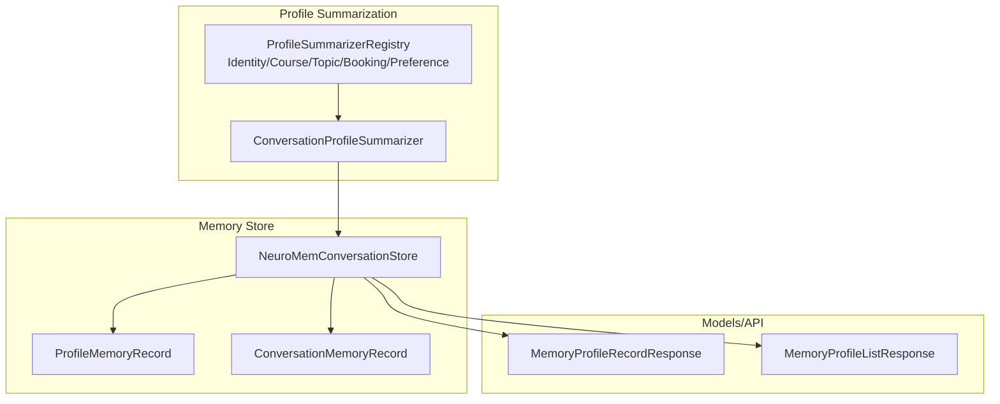
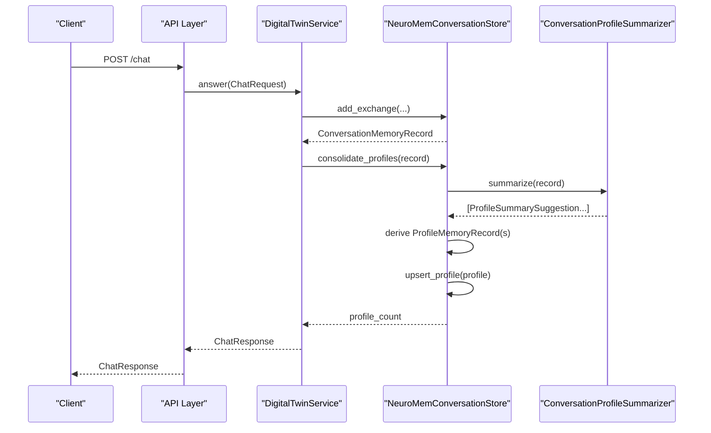
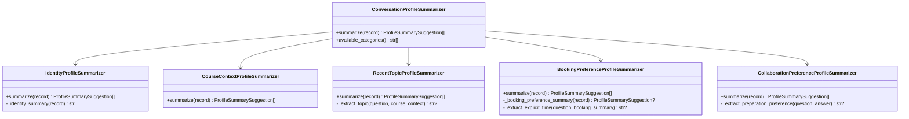
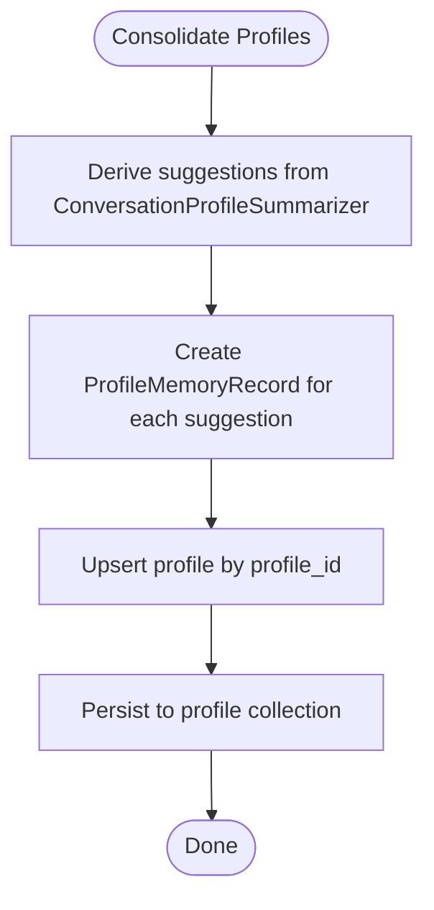
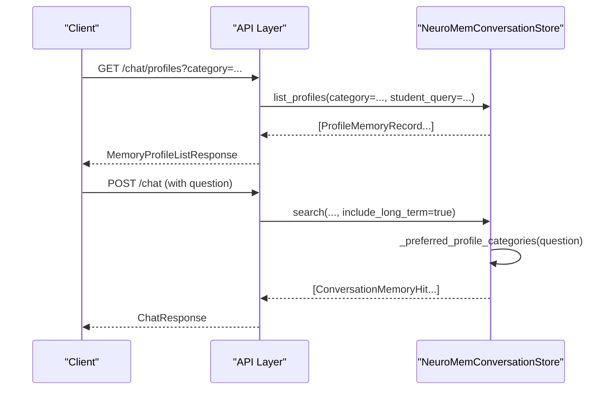
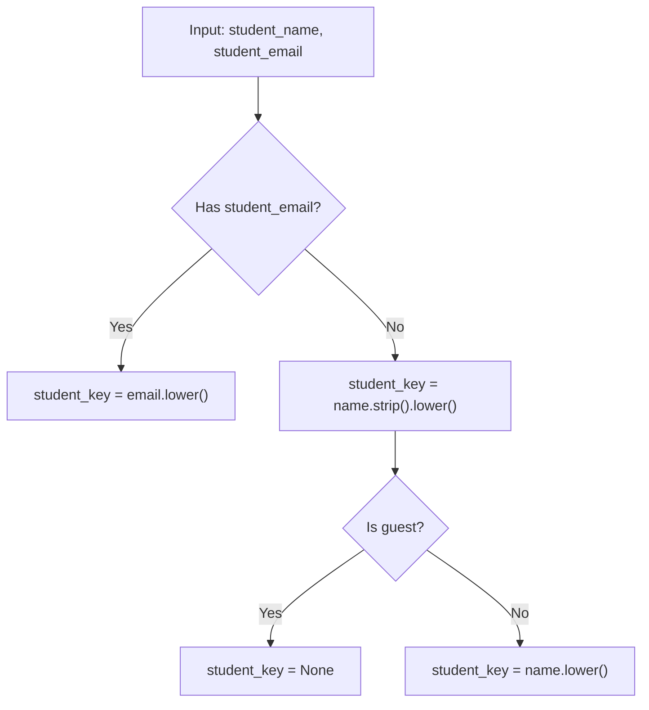
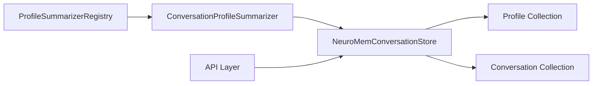

# Profile Memory

<cite>
**Referenced Files in This Document**
- [profile_summarizer.py](file://src/sage_faculty_twin/profile_summarizer.py)
- [memory_store.py](file://src/sage_faculty_twin/memory_store.py)
- [models.py](file://src/sage_faculty_twin/models.py)
- [test_memory_store.py](file://tests/test_memory_store.py)
- [api.py](file://src/sage_faculty_twin/api.py)
</cite>

## Table of Contents
1. [Introduction](#introduction)
2. [Project Structure](#project-structure)
3. [Core Components](#core-components)
4. [Architecture Overview](#architecture-overview)
5. [Detailed Component Analysis](#detailed-component-analysis)
6. [Dependency Analysis](#dependency-analysis)
7. [Performance Considerations](#performance-considerations)
8. [Troubleshooting Guide](#troubleshooting-guide)
9. [Conclusion](#conclusion)
10. [Appendices](#appendices)

## Introduction
This document explains the profile memory system that automatically derives long-term student profiles from conversational interactions. It covers the ProfileMemoryRecord structure, the profile categorization taxonomy, automatic profile derivation, consolidation, storage, retrieval, and integration with personalized responses. Privacy considerations and usage patterns are also documented.

## Project Structure
The profile memory system spans three primary modules:
- Profile summarization engine: defines categories and extraction logic
- Memory store: persists and retrieves conversation and profile memories
- Data models: define the canonical record shapes and API responses

**Diagram sources**
- [profile_summarizer.py:29-213](file://src/sage_faculty_twin/profile_summarizer.py#L29-L213)
- [memory_store.py:161-1854](file://src/sage_faculty_twin/memory_store.py#L161-L1854)
- [models.py:414-429](file://src/sage_faculty_twin/models.py#L414-L429)

**Section sources**
- [profile_summarizer.py:1-213](file://src/sage_faculty_twin/profile_summarizer.py#L1-L213)
- [memory_store.py:161-1854](file://src/sage_faculty_twin/memory_store.py#L161-L1854)
- [models.py:414-429](file://src/sage_faculty_twin/models.py#L414-L429)

## Core Components
- ProfileMemoryRecord: the canonical long-term profile entity with category, summary, and evidence.
- ConversationProfileSummarizer: orchestrates category-specific summarizers and produces suggestions.
- Category summarizers: identity, course_context, recent_topic, booking_preference, collaboration_preference.
- Memory store integration: derives, upserts, and retrieves profiles; supports category filtering and student-scoped queries.

Key implementation references:
- ProfileMemoryRecord definition and retrieval text: [memory_store.py:161-214](file://src/sage_faculty_twin/memory_store.py#L161-L214)
- ConversationProfileSummarizer and registry: [profile_summarizer.py:29-213](file://src/sage_faculty_twin/profile_summarizer.py#L29-L213)
- Derivation and upsert pipeline: [memory_store.py:1422-1446](file://src/sage_faculty_twin/memory_store.py#L1422-L1446)
- Long-term retrieval with category preferences: [memory_store.py:843-917](file://src/sage_faculty_twin/memory_store.py#L843-L917)

**Section sources**
- [memory_store.py:161-214](file://src/sage_faculty_twin/memory_store.py#L161-L214)
- [profile_summarizer.py:29-213](file://src/sage_faculty_twin/profile_summarizer.py#L29-L213)
- [memory_store.py:1422-1446](file://src/sage_faculty_twin/memory_store.py#L1422-L1446)
- [memory_store.py:843-917](file://src/sage_faculty_twin/memory_store.py#L843-L917)

## Architecture Overview
The profile memory system integrates with the conversation memory pipeline. After each exchange, the system:
1. Builds a ConversationMemoryRecord
2. Derives profile suggestions via ConversationProfileSummarizer
3. Upserts ProfileMemoryRecord(s) into the profile collection
4. Persists to disk and indexes for later retrieval

**Diagram sources**
- [memory_store.py:380-444](file://src/sage_faculty_twin/memory_store.py#L380-L444)
- [profile_summarizer.py:202-213](file://src/sage_faculty_twin/profile_summarizer.py#L202-L213)
- [memory_store.py:1422-1446](file://src/sage_faculty_twin/memory_store.py#L1422-L1446)

## Detailed Component Analysis

### ProfileMemoryRecord
- Purpose: Encapsulates a long-term profile for a student-key (email or normalized name).
- Fields: profile_id, student_key, student_name, student_email, category, summary, evidence, updated_at.
- Retrieval text: Augments category aliases and personal identifiers to improve recall.
- Persistence: Stored as “profile_record” entries in the profile collection with metadata.

Implementation highlights:
- Record creation and serialization: [memory_store.py:161-194](file://src/sage_faculty_twin/memory_store.py#L161-L194)
- Retrieval text composition: [memory_store.py:196-213](file://src/sage_faculty_twin/memory_store.py#L196-L213)

**Section sources**
- [memory_store.py:161-214](file://src/sage_faculty_twin/memory_store.py#L161-L214)

### ConversationProfileSummarizer and Categories
- Orchestrator: Iterates registered summarizers and aggregates suggestions.
- Categories:
  - identity: identity summary from student_name and student_email
  - course_context: derived from course_context when present
  - recent_topic: extracted from question/course_context
  - booking_preference: detects booking-related intent and preferences
  - collaboration_preference: detects preparation-related intent

**Diagram sources**
- [profile_summarizer.py:29-213](file://src/sage_faculty_twin/profile_summarizer.py#L29-L213)

**Section sources**
- [profile_summarizer.py:29-213](file://src/sage_faculty_twin/profile_summarizer.py#L29-L213)

### Automatic Profile Derivation and Consolidation
- Derivation: Converts a ConversationMemoryRecord into one or more ProfileMemoryRecord instances using registered summarizers.
- Upsert: Replaces prior entries for the same profile_id to keep the latest update.
- Canonicalization: On load, removes duplicates and keeps the most recent entry per profile_id.

**Diagram sources**
- [memory_store.py:1422-1446](file://src/sage_faculty_twin/memory_store.py#L1422-L1446)

**Section sources**
- [memory_store.py:1422-1446](file://src/sage_faculty_twin/memory_store.py#L1422-L1446)

### Storage and Retrieval
- Storage: Profiles are persisted as “profile_record” entries with metadata and indexed for retrieval.
- Retrieval:
  - List by category and student query
  - Long-term retrieval prioritizes categories inferred from the query
  - Preferred categories are detected heuristically from keywords

**Diagram sources**
- [memory_store.py:630-670](file://src/sage_faculty_twin/memory_store.py#L630-L670)
- [memory_store.py:843-917](file://src/sage_faculty_twin/memory_store.py#L843-L917)
- [models.py:425-429](file://src/sage_faculty_twin/models.py#L425-L429)

**Section sources**
- [memory_store.py:630-670](file://src/sage_faculty_twin/memory_store.py#L630-L670)
- [memory_store.py:843-917](file://src/sage_faculty_twin/memory_store.py#L843-L917)
- [models.py:425-429](file://src/sage_faculty_twin/models.py#L425-L429)

### Student Identity Management
- Identity key: student_key is email (if present) else normalized student_name (rejects “guest”).
- Profile grouping: profiles are grouped by student_key; long-term retrieval filters by student_key.
- Evidence preservation: summaries include evidence pointers to original conversation context.

**Diagram sources**
- [memory_store.py:1712-1718](file://src/sage_faculty_twin/memory_store.py#L1712-L1718)

**Section sources**
- [memory_store.py:1712-1718](file://src/sage_faculty_twin/memory_store.py#L1712-L1718)

### Profile Summarization Pipeline and Evidence-Based Updates
- Evidence: Each suggestion carries evidence describing the triggering context (e.g., conversation id, question, booking summary).
- Update semantics: Upsert replaces older entries; canonicalization ensures a single latest entry per profile_id.
- Category importance: Used to weight retrieval and influence long-term recall.

References:
- Evidence-based suggestion: [profile_summarizer.py:23-27](file://src/sage_faculty_twin/profile_summarizer.py#L23-L27)
- Upsert and deletion of duplicates: [memory_store.py:1442-1564](file://src/sage_faculty_twin/memory_store.py#L1442-L1564)
- Canonicalization on startup: [memory_store.py:1566-1596](file://src/sage_faculty_twin/memory_store.py#L1566-L1596)

**Section sources**
- [profile_summarizer.py:23-27](file://src/sage_faculty_twin/profile_summarizer.py#L23-L27)
- [memory_store.py:1442-1564](file://src/sage_faculty_twin/memory_store.py#L1442-L1564)
- [memory_store.py:1566-1596](file://src/sage_faculty_twin/memory_store.py#L1566-L1596)

### Category-Specific Queries and Personalized Responses
- Category filtering: list_profiles supports category and student query filters.
- Personalization: Long-term retrieval prioritizes categories inferred from the incoming question (e.g., booking, collaboration, identity, course context).
- Integration: The chat pipeline calls search with include_long_term enabled, allowing stable profile recall.

References:
- Filtering and sorting: [memory_store.py:630-670](file://src/sage_faculty_twin/memory_store.py#L630-L670)
- Preferred categories detection: [memory_store.py:919-937](file://src/sage_faculty_twin/memory_store.py#L919-L937)
- Search integration: [memory_store.py:446-489](file://src/sage_faculty_twin/memory_store.py#L446-L489)

**Section sources**
- [memory_store.py:630-670](file://src/sage_faculty_twin/memory_store.py#L630-L670)
- [memory_store.py:919-937](file://src/sage_faculty_twin/memory_store.py#L919-L937)
- [memory_store.py:446-489](file://src/sage_faculty_twin/memory_store.py#L446-L489)

## Dependency Analysis
- ProfileSummarizerRegistry registers category-specific summarizers and exposes available categories.
- ConversationProfileSummarizer depends on the registry to enumerate and invoke summarizers.
- Memory store depends on ConversationProfileSummarizer to derive profiles and on the profile collection for persistence and retrieval.
- API layer invokes memory store during chat and profile listing.

**Diagram sources**
- [profile_summarizer.py:33-51](file://src/sage_faculty_twin/profile_summarizer.py#L33-L51)
- [profile_summarizer.py:202-213](file://src/sage_faculty_twin/profile_summarizer.py#L202-L213)
- [memory_store.py:241](file://src/sage_faculty_twin/memory_store.py#L241)

**Section sources**
- [profile_summarizer.py:33-51](file://src/sage_faculty_twin/profile_summarizer.py#L33-L51)
- [profile_summarizer.py:202-213](file://src/sage_faculty_twin/profile_summarizer.py#L202-L213)
- [memory_store.py:241](file://src/sage_faculty_twin/memory_store.py#L241)

## Performance Considerations
- Index selection: The memory store selects an appropriate index type and collection type, with neural continual memory supported for conversation memory.
- Retrieval limits: Short-term and long-term retrieval limits are tuned per policy to balance latency and relevance.
- Deduplication and canonicalization: Ensures efficient storage and avoids redundant retrieval of stale entries.
- Telemetry: Tracks write/read counts and usefulness signals to inform tuning.

[No sources needed since this section provides general guidance]

## Troubleshooting Guide
Common issues and resolutions:
- Missing optional dependency for specific index types: The system raises a runtime error if an index type requires an optional package that is not installed.
- Legacy layout migration: The store migrates legacy JSON files into the new SQLite-backed persistence and cleans up legacy directories.
- Duplicate profile entries: On startup, the store canonicalizes the profile collection to keep the latest entry per profile_id.

References:
- Index readiness checks: [memory_store.py:270-322](file://src/sage_faculty_twin/memory_store.py#L270-L322)
- Migration and cleanup: [memory_store.py:1217-1284](file://src/sage_faculty_twin/memory_store.py#L1217-L1284)
- Canonicalization: [memory_store.py:1566-1596](file://src/sage_faculty_twin/memory_store.py#L1566-L1596)

**Section sources**
- [memory_store.py:270-322](file://src/sage_faculty_twin/memory_store.py#L270-L322)
- [memory_store.py:1217-1284](file://src/sage_faculty_twin/memory_store.py#L1217-L1284)
- [memory_store.py:1566-1596](file://src/sage_faculty_twin/memory_store.py#L1566-L1596)

## Conclusion
The profile memory system provides a robust, evidence-backed mechanism to derive and maintain long-term student profiles from conversations. It supports multiple categories, preserves privacy via identity keys, and integrates seamlessly with the chat pipeline to enable personalized responses. The design emphasizes reliability through canonicalization, migration, and telemetry.

## Appendices

### Example Usage Patterns
- Automatic derivation: After each chat exchange, consolidate_profiles is called to derive and persist profiles.
- Category-specific listing: Use list_profiles with category and student query filters to inspect or audit profiles.
- Integration with chat: Long-term retrieval is enabled by default during search, allowing stable profile recall.

References:
- Consolidation invocation: [memory_store.py:426-444](file://src/sage_faculty_twin/memory_store.py#L426-L444)
- Listing profiles: [memory_store.py:630-670](file://src/sage_faculty_twin/memory_store.py#L630-L670)
- Chat search with long-term: [memory_store.py:446-489](file://src/sage_faculty_twin/memory_store.py#L446-L489)

**Section sources**
- [memory_store.py:426-444](file://src/sage_faculty_twin/memory_store.py#L426-L444)
- [memory_store.py:630-670](file://src/sage_faculty_twin/memory_store.py#L630-L670)
- [memory_store.py:446-489](file://src/sage_faculty_twin/memory_store.py#L446-L489)

### Privacy Considerations
- Identity key: Uses email when available; otherwise normalized name. Rejects “guest” to avoid storing ephemeral identities.
- Evidence minimization: Profiles include evidence pointers (e.g., conversation id, question excerpts) rather than full transcripts.
- Access control: API endpoints enforce session cookies for administrative and user actions.

References:
- Identity key logic: [memory_store.py:1712-1718](file://src/sage_faculty_twin/memory_store.py#L1712-L1718)
- Evidence fields: [profile_summarizer.py:23-27](file://src/sage_faculty_twin/profile_summarizer.py#L23-L27)
- Session enforcement: [api.py:456-509](file://src/sage_faculty_twin/api.py#L456-L509)

**Section sources**
- [memory_store.py:1712-1718](file://src/sage_faculty_twin/memory_store.py#L1712-L1718)
- [profile_summarizer.py:23-27](file://src/sage_faculty_twin/profile_summarizer.py#L23-L27)
- [api.py:456-509](file://src/sage_faculty_twin/api.py#L456-L509)