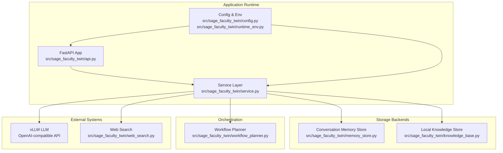
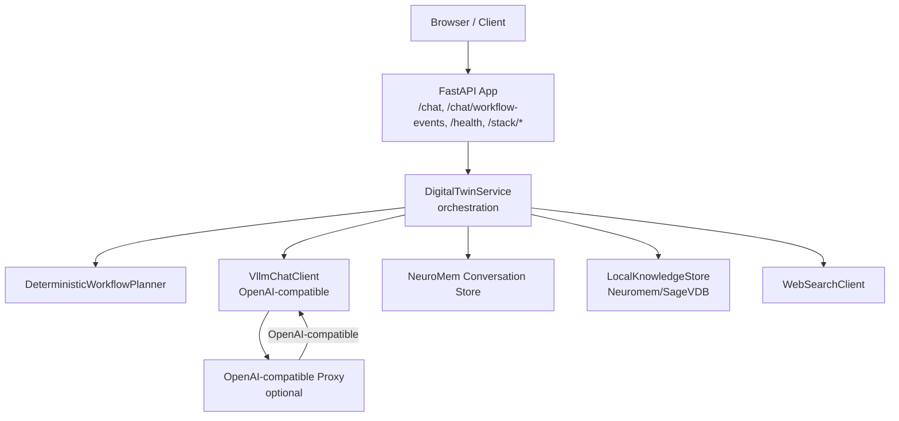
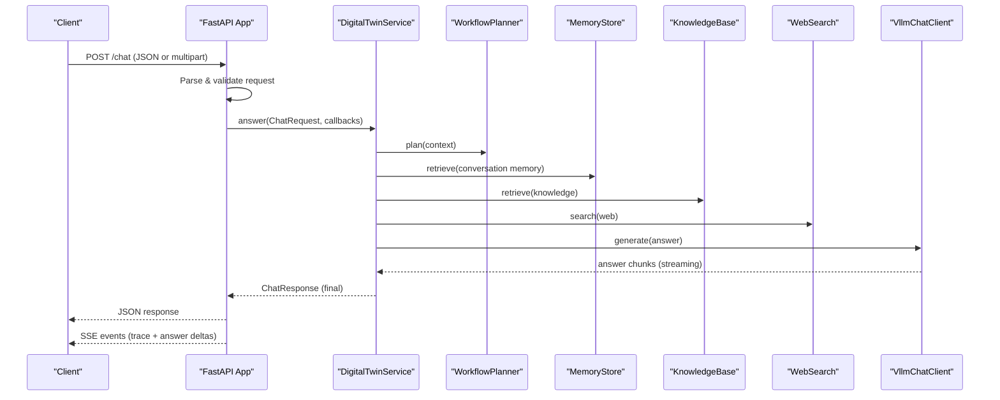
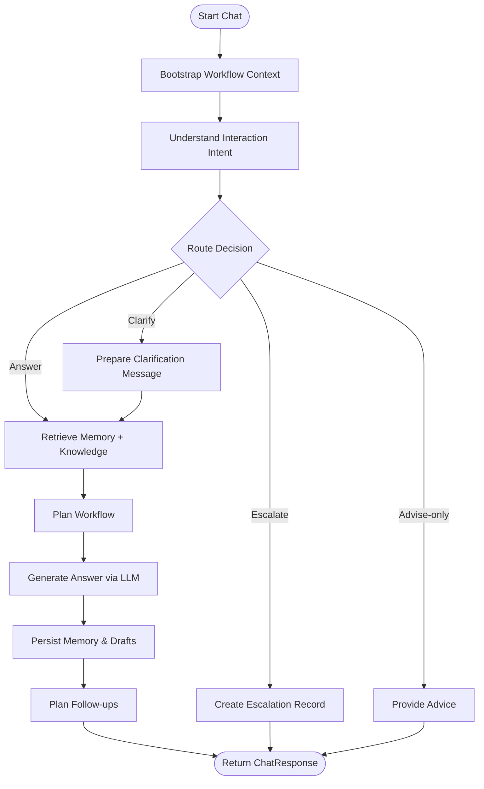
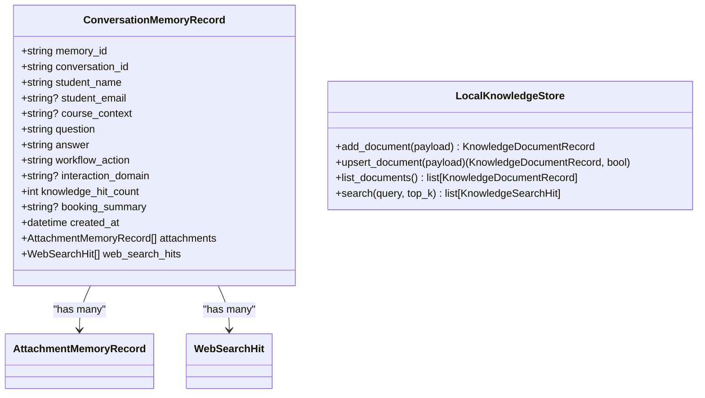
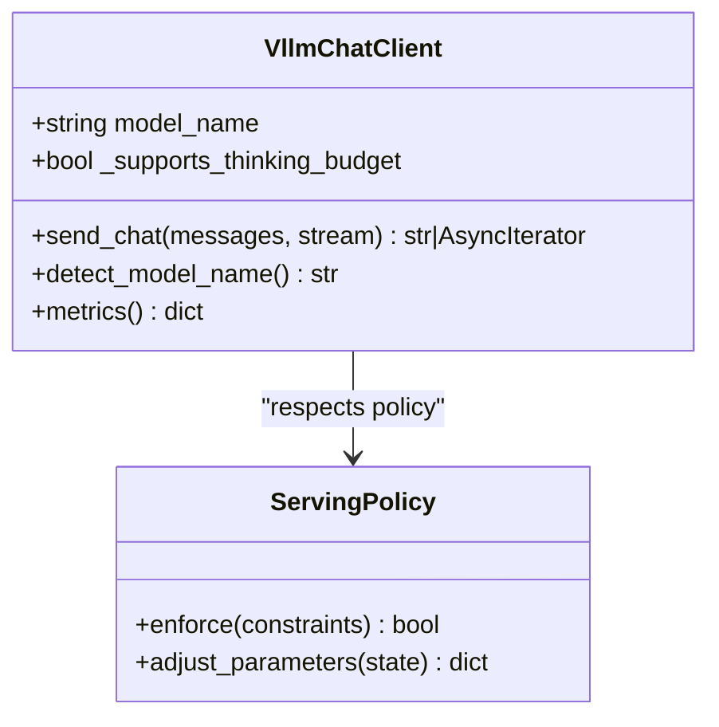
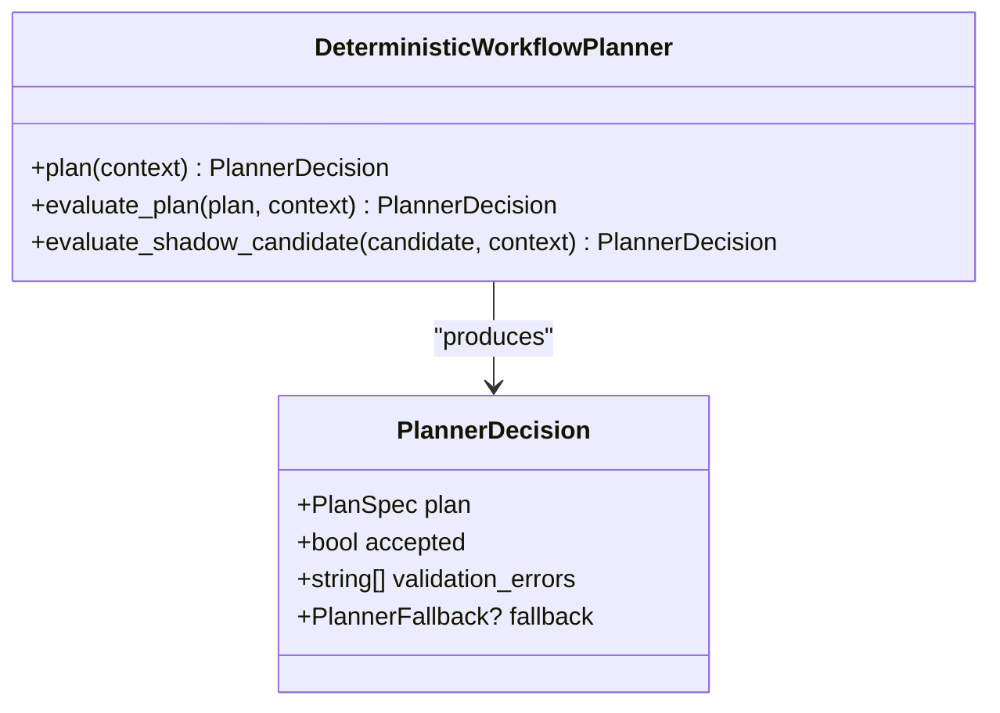
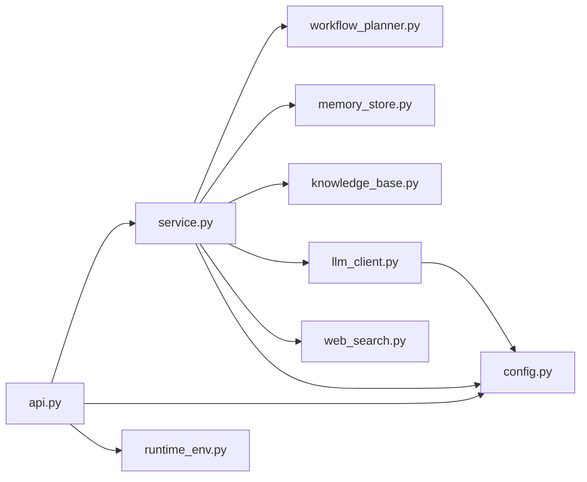

# Architecture Overview

<cite>
**Referenced Files in This Document**
- [README.md](file://README.md)
- [api.py](file://src/sage_faculty_twin/api.py)
- [service.py](file://src/sage_faculty_twin/service.py)
- [config.py](file://src/sage_faculty_twin/config.py)
- [workflow_planner.py](file://src/sage_faculty_twin/workflow_planner.py)
- [memory_store.py](file://src/sage_faculty_twin/memory_store.py)
- [knowledge_base.py](file://src/sage_faculty_twin/knowledge_base.py)
- [llm_client.py](file://src/sage_faculty_twin/llm_client.py)
- [web_search.py](file://src/sage_faculty_twin/web_search.py)
- [runtime_env.py](file://src/sage_faculty_twin/runtime_env.py)
- [sage-faculty-twin-app.service](file://deploy/systemd/user/sage-faculty-twin-app.service)
- [sage-faculty-twin-vllm-openai-proxy.service](file://deploy/systemd/user/sage-faculty-twin-vllm-openai-proxy.service)
- [start_all_services.sh](file://tools/start_all_services.sh)
- [run_app_server.sh](file://tools/run_app_server.sh)
</cite>

## Table of Contents
1. [Introduction](#introduction)
2. [Project Structure](#project-structure)
3. [Core Components](#core-components)
4. [Architecture Overview](#architecture-overview)
5. [Detailed Component Analysis](#detailed-component-analysis)
6. [Dependency Analysis](#dependency-analysis)
7. [Performance Considerations](#performance-considerations)
8. [Troubleshooting Guide](#troubleshooting-guide)
9. [Conclusion](#conclusion)

## Introduction
This document describes the Sage Faculty Twin system architecture, focusing on the integration of FastAPI web framework, SAGE workflow orchestration, and vLLM LLM infrastructure. It explains the layered architecture from API endpoints through the service layer to storage systems, and documents component interactions, data flows, and integration patterns among the chat interface, workflow engine, knowledge base, and memory systems. It also covers system boundaries, scalability considerations, and deployment topology.

## Project Structure
The repository is organized around a Python package implementing the faculty digital twin, with supporting scripts and systemd units for deployment and runtime management.

- Application entrypoint and API layer: src/sage_faculty_twin/api.py
- Service orchestration and workflow engine: src/sage_faculty_twin/service.py
- Configuration and environment: src/sage_faculty_twin/config.py, src/sage_faculty_twin/runtime_env.py
- Storage backends: src/sage_faculty_twin/memory_store.py, src/sage_faculty_twin/knowledge_base.py
- LLM integration: src/sage_faculty_twin/llm_client.py
- Web search: src/sage_faculty_twin/web_search.py
- Workflow planning: src/sage_faculty_twin/workflow_planner.py
- Deployment and runtime: deploy/systemd/user/*.service, tools/start_all_services.sh, tools/run_app_server.sh

**Diagram sources**
- [api.py:90-120](file://src/sage_faculty_twin/api.py#L90-L120)
- [service.py:581-634](file://src/sage_faculty_twin/service.py#L581-L634)
- [config.py:9-132](file://src/sage_faculty_twin/config.py#L9-L132)
- [runtime_env.py:102-131](file://src/sage_faculty_twin/runtime_env.py#L102-L131)
- [memory_store.py:121-200](file://src/sage_faculty_twin/memory_store.py#L121-L200)
- [knowledge_base.py:121-200](file://src/sage_faculty_twin/knowledge_base.py#L121-L200)
- [workflow_planner.py:90-134](file://src/sage_faculty_twin/workflow_planner.py#L90-L134)
- [web_search.py:93-136](file://src/sage_faculty_twin/web_search.py#L93-L136)

**Section sources**
- [README.md:118-126](file://README.md#L118-L126)
- [api.py:90-120](file://src/sage_faculty_twin/api.py#L90-L120)
- [service.py:581-634](file://src/sage_faculty_twin/service.py#L581-L634)
- [config.py:9-132](file://src/sage_faculty_twin/config.py#L9-L132)
- [runtime_env.py:102-131](file://src/sage_faculty_twin/runtime_env.py#L102-L131)
- [memory_store.py:121-200](file://src/sage_faculty_twin/memory_store.py#L121-L200)
- [knowledge_base.py:121-200](file://src/sage_faculty_twin/knowledge_base.py#L121-L200)
- [workflow_planner.py:90-134](file://src/sage_faculty_twin/workflow_planner.py#L90-L134)
- [web_search.py:93-136](file://src/sage_faculty_twin/web_search.py#L93-L136)

## Core Components
- FastAPI application: Defines REST endpoints, middleware, CORS, SSE event streaming, and request parsing/validation for chat and administrative operations.
- Service layer: Implements the core workflow orchestration, including intent understanding, retrieval, planning, LLM invocation, memory persistence, and follow-up actions.
- Configuration and runtime: Centralized settings via Pydantic settings with environment variable prefix, and runtime environment bootstrapping to ensure correct library resolution and policy loading.
- Storage backends: Conversation memory store backed by Sage NeuroMem and local filesystem; local knowledge base with pluggable backends (Neuromem BM25/FAISS or SageVDB).
- LLM client: OpenAI-compatible HTTP client with caching, metrics, and streaming support; integrates with SAGE serving policy.
- Web search: Optional external search integration with query rewriting and result reranking.
- Workflow planner: Deterministic planner that builds plans from policy and step registry, evaluates against policy constraints, and supports shadow/Live modes.

**Section sources**
- [api.py:90-120](file://src/sage_faculty_twin/api.py#L90-L120)
- [service.py:581-634](file://src/sage_faculty_twin/service.py#L581-L634)
- [config.py:9-132](file://src/sage_faculty_twin/config.py#L9-L132)
- [runtime_env.py:102-131](file://src/sage_faculty_twin/runtime_env.py#L102-L131)
- [memory_store.py:121-200](file://src/sage_faculty_twin/memory_store.py#L121-L200)
- [knowledge_base.py:121-200](file://src/sage_faculty_twin/knowledge_base.py#L121-L200)
- [llm_client.py:68-139](file://src/sage_faculty_twin/llm_client.py#L68-L139)
- [web_search.py:93-136](file://src/sage_faculty_twin/web_search.py#L93-L136)
- [workflow_planner.py:90-134](file://src/sage_faculty_twin/workflow_planner.py#L90-L134)

## Architecture Overview
The system follows a layered architecture:
- Presentation layer: FastAPI routes handle HTTP requests, validate payloads, and stream workflow events via Server-Sent Events (SSE).
- Service layer: Orchestrates the end-to-end chat workflow, including intent detection, retrieval from memory and knowledge base, optional web search, planning, LLM generation, and post-answer side effects.
- Storage layer: Conversation memory and knowledge base provide persistent and searchable artifacts.
- Infrastructure layer: vLLM provides the LLM inference backend with OpenAI-compatible API; optional OpenAI-compatible proxy can enforce auth and routing.

**Diagram sources**
- [api.py:597-700](file://src/sage_faculty_twin/api.py#L597-L700)
- [service.py:581-634](file://src/sage_faculty_twin/service.py#L581-L634)
- [workflow_planner.py:90-134](file://src/sage_faculty_twin/workflow_planner.py#L90-L134)
- [llm_client.py:68-139](file://src/sage_faculty_twin/llm_client.py#L68-L139)
- [memory_store.py:121-200](file://src/sage_faculty_twin/memory_store.py#L121-L200)
- [knowledge_base.py:121-200](file://src/sage_faculty_twin/knowledge_base.py#L121-L200)
- [web_search.py:93-136](file://src/sage_faculty_twin/web_search.py#L93-L136)
- [sage-faculty-twin-vllm-openai-proxy.service:1-20](file://deploy/systemd/user/sage-faculty-twin-vllm-openai-proxy.service#L1-L20)

## Detailed Component Analysis

### API Layer
The API layer defines:
- Health and diagnostics endpoints
- Authentication endpoints for admin and user sessions
- Chat endpoints supporting both JSON and multipart/form-data, with streaming SSE for workflow events
- Knowledge base administration endpoints
- Presence and suggestion endpoints
- Static asset serving for the frontend

Key behaviors:
- Lazy initialization of the service to defer expensive setup until first request.
- SSE event broker for streaming workflow trace steps and answer deltas.
- Request parsing with strict validation for attachments and chat payloads.
- CORS configuration for local development.

**Diagram sources**
- [api.py:618-700](file://src/sage_faculty_twin/api.py#L618-L700)
- [service.py:581-634](file://src/sage_faculty_twin/service.py#L581-L634)
- [workflow_planner.py:110-134](file://src/sage_faculty_twin/workflow_planner.py#L110-L134)
- [memory_store.py:121-200](file://src/sage_faculty_twin/memory_store.py#L121-L200)
- [knowledge_base.py:121-200](file://src/sage_faculty_twin/knowledge_base.py#L121-L200)
- [web_search.py:93-136](file://src/sage_faculty_twin/web_search.py#L93-L136)
- [llm_client.py:68-139](file://src/sage_faculty_twin/llm_client.py#L68-L139)

**Section sources**
- [api.py:90-120](file://src/sage_faculty_twin/api.py#L90-L120)
- [api.py:597-700](file://src/sage_faculty_twin/api.py#L597-L700)
- [api.py:170-256](file://src/sage_faculty_twin/api.py#L170-L256)

### Service Orchestration
The service orchestrates the chat workflow:
- Bootstraps context, resolves admin session, and prepares the workflow context.
- Understands interaction intent and decides route (answer, clarify, escalate, advise-only).
- Executes retrieval from conversation memory and knowledge base, optionally web search.
- Builds prompts with soft caps and streaming LLM generation.
- Persists memory, consolidates profiles, plans follow-ups, and computes usefulness signals.
- Emits structured trace steps and publishes SSE events.

**Diagram sources**
- [service.py:635-775](file://src/sage_faculty_twin/service.py#L635-L775)
- [service.py:777-860](file://src/sage_faculty_twin/service.py#L777-L860)
- [service.py:861-950](file://src/sage_faculty_twin/service.py#L861-L950)

**Section sources**
- [service.py:581-634](file://src/sage_faculty_twin/service.py#L581-L634)
- [service.py:635-775](file://src/sage_faculty_twin/service.py#L635-L775)
- [service.py:777-860](file://src/sage_faculty_twin/service.py#L777-L860)
- [service.py:861-950](file://src/sage_faculty_twin/service.py#L861-L950)

### Storage Systems
- Conversation memory store: Manages conversation records, attachment excerpts, web search hits, and retrieval text for vectorization and search.
- Local knowledge base: Provides CRUD operations for knowledge documents, with pluggable backends (Neuromem BM25/FAISS or SageVDB), and embedders for dense retrieval.

**Diagram sources**
- [memory_store.py:56-121](file://src/sage_faculty_twin/memory_store.py#L56-L121)
- [knowledge_base.py:141-200](file://src/sage_faculty_twin/knowledge_base.py#L141-L200)

**Section sources**
- [memory_store.py:56-121](file://src/sage_faculty_twin/memory_store.py#L56-L121)
- [knowledge_base.py:141-200](file://src/sage_faculty_twin/knowledge_base.py#L141-L200)

### LLM Integration and Policy
- VllmChatClient encapsulates OpenAI-compatible API calls, with intent classification client, semantic caching, throughput metrics, and auto-detection of model capabilities.
- Integrates with SAGE serving policy for congestion control and policy-driven behavior.

**Diagram sources**
- [llm_client.py:68-139](file://src/sage_faculty_twin/llm_client.py#L68-L139)
- [llm_client.py:140-200](file://src/sage_faculty_twin/llm_client.py#L140-L200)

**Section sources**
- [llm_client.py:68-139](file://src/sage_faculty_twin/llm_client.py#L68-L139)
- [llm_client.py:140-200](file://src/sage_faculty_twin/llm_client.py#L140-L200)

### Workflow Planning
- DeterministicWorkflowPlanner constructs plans from a policy and step registry, evaluates feasibility, and supports shadow/Live modes for plan validation and fallback templates.

**Diagram sources**
- [workflow_planner.py:90-134](file://src/sage_faculty_twin/workflow_planner.py#L90-L134)
- [workflow_planner.py:81-88](file://src/sage_faculty_twin/workflow_planner.py#L81-L88)

**Section sources**
- [workflow_planner.py:90-134](file://src/sage_faculty_twin/workflow_planner.py#L90-L134)
- [workflow_planner.py:81-88](file://src/sage_faculty_twin/workflow_planner.py#L81-L88)

## Dependency Analysis
The system exhibits clear layering and low coupling:
- API depends on Service for orchestration and on SSE broker for streaming.
- Service depends on Planner, Memory Store, Knowledge Base, Web Search, and LLM client.
- Configuration and runtime environment bootstrap ensure correct imports and policy enforcement.
- Deployment scripts and systemd units manage lifecycle and expose endpoints.

**Diagram sources**
- [api.py:90-120](file://src/sage_faculty_twin/api.py#L90-L120)
- [service.py:581-634](file://src/sage_faculty_twin/service.py#L581-L634)
- [workflow_planner.py:90-134](file://src/sage_faculty_twin/workflow_planner.py#L90-L134)
- [memory_store.py:121-200](file://src/sage_faculty_twin/memory_store.py#L121-L200)
- [knowledge_base.py:121-200](file://src/sage_faculty_twin/knowledge_base.py#L121-L200)
- [llm_client.py:68-139](file://src/sage_faculty_twin/llm_client.py#L68-L139)
- [web_search.py:93-136](file://src/sage_faculty_twin/web_search.py#L93-L136)
- [config.py:9-132](file://src/sage_faculty_twin/config.py#L9-L132)
- [runtime_env.py:102-131](file://src/sage_faculty_twin/runtime_env.py#L102-L131)

**Section sources**
- [api.py:90-120](file://src/sage_faculty_twin/api.py#L90-L120)
- [service.py:581-634](file://src/sage_faculty_twin/service.py#L581-L634)
- [config.py:9-132](file://src/sage_faculty_twin/config.py#L9-L132)
- [runtime_env.py:102-131](file://src/sage_faculty_twin/runtime_env.py#L102-L131)

## Performance Considerations
- Streaming: SSE keepalive and answer chunk streaming reduce perceived latency and prevent proxy timeouts.
- Prompt soft cap: Truncation policies for memory hits, knowledge excerpts, and attachments bound prompt size and decode latency.
- Caching: Semantic and exact response caching reduces repeated LLM calls.
- Metrics: Throughput, latency, and KV-cache usage are tracked to inform scaling and policy adjustments.
- Background post-answer tasks: Optional deferred execution of memory persist, profile consolidation, and follow-up planning to minimize critical path latency.

[No sources needed since this section provides general guidance]

## Troubleshooting Guide
Common operational issues and remedies:
- Module import errors related to SAGE policy or local packages: ensure correct PYTHONPATH and local policy checkout.
- Missing sageVDB compiled extensions: link shared libraries as indicated by validation checks.
- No module named sage_faculty_twin: run via provided scripts to avoid PYTHONPATH conflicts.
- CORS and local development: local CORS is configured for localhost/127.0.0.1 origins.
- Health and readiness: use /health and /stack/versions endpoints to verify runtime state and component versions.

**Section sources**
- [runtime_env.py:34-57](file://src/sage_faculty_twin/runtime_env.py#L34-L57)
- [runtime_env.py:59-91](file://src/sage_faculty_twin/runtime_env.py#L59-L91)
- [README.md:111-117](file://README.md#L111-L117)
- [api.py:512-539](file://src/sage_faculty_twin/api.py#L512-L539)

## Conclusion
The Sage Faculty Twin system integrates FastAPI, SAGE workflow orchestration, and vLLM to deliver a responsive, policy-aware chat experience. The layered architecture cleanly separates concerns, enabling modular enhancements to retrieval, planning, and storage. The deployment topology supports local development and production exposure via systemd-managed services and optional Cloudflare tunneling, while performance optimizations and observability facilitate scalable operations.