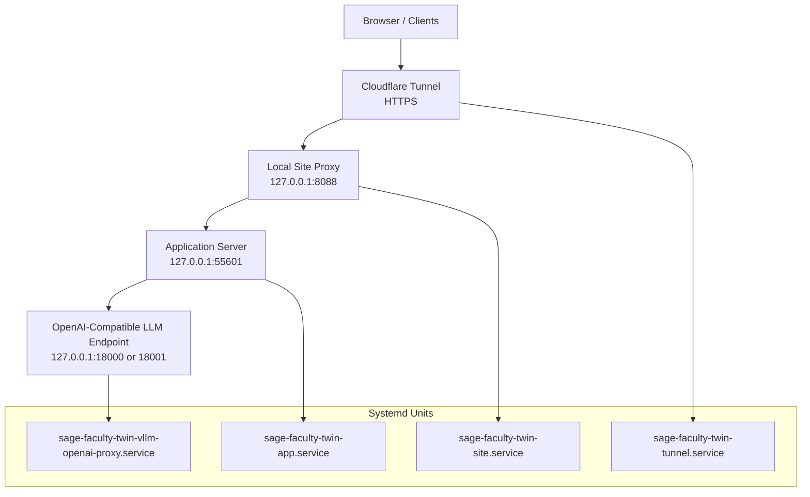
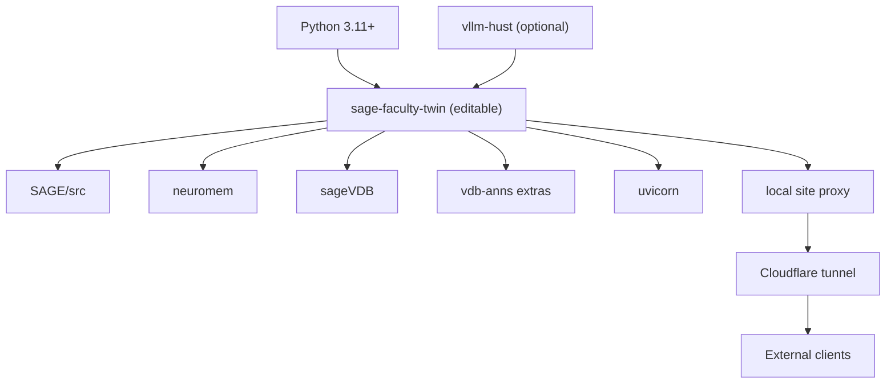

# Deployment Scenarios

<cite>
**Referenced Files in This Document**
- [README.md](file://README.md)
- [deployment.md](file://docs/deployment.md)
- [systemd-runtime-notes.md](file://docs/systemd-runtime-notes.md)
- [quickstart.sh](file://quickstart.sh)
- [manage.sh](file://manage.sh)
- [install_user_services.sh](file://tools/install_user_services.sh)
- [start_all_services.sh](file://tools/start_all_services.sh)
- [run_app_server.sh](file://tools/run_app_server.sh)
- [run_local_proxy.sh](file://tools/run_local_proxy.sh)
- [reload_local_proxy.sh](file://tools/reload_local_proxy.sh)
- [run_named_tunnel.sh](file://tools/run_named_tunnel.sh)
- [cloudflared-config.example.yml](file://tools/cloudflared-config.example.yml)
- [.env.example](file://.env.example)
- [sage-faculty-twin-app.service](file://deploy/systemd/user/sage-faculty-twin-app.service)
- [sage-faculty-twin-site.service](file://deploy/systemd/user/sage-faculty-twin-site.service)
- [sage-faculty-twin-tunnel.service](file://deploy/systemd/user/sage-faculty-twin-tunnel.service)
- [sage-faculty-twin-vllm-openai-proxy.service](file://deploy/systemd/user/sage-faculty-twin-vllm-openai-proxy.service)
- [pyproject.toml](file://pyproject.toml)
</cite>

## Table of Contents
1. [Introduction](#introduction)
2. [Project Structure](#project-structure)
3. [Core Components](#core-components)
4. [Architecture Overview](#architecture-overview)
5. [Detailed Component Analysis](#detailed-component-analysis)
6. [Dependency Analysis](#dependency-analysis)
7. [Performance Considerations](#performance-considerations)
8. [Troubleshooting Guide](#troubleshooting-guide)
9. [Conclusion](#conclusion)
10. [Appendices](#appendices)

## Introduction
This document explains deployment scenarios for Sage Faculty Twin across local development, production with systemd user services, cloud exposure via Cloudflare tunnels, and hybrid setups. It covers the quickstart process, service management via manage.sh, and integration with Cloudflare tunnels. It also outlines hardware requirements, network considerations, and scaling strategies tailored to institutional needs.

## Project Structure
The repository organizes deployment assets around:
- Application server and orchestration in src/sage_faculty_twin
- Systemd user service units under deploy/systemd/user
- Tooling for service management, local proxy, tunneling, and full-stack startup under tools/
- Documentation for deployment and runtime notes under docs/
- Configuration templates and environment under .env.example

```mermaid
graph TB
subgraph "Application"
API["FastAPI app<br/>src/sage_faculty_twin/api.py"]
SVC["Service orchestrator<br/>src/sage_faculty_twin/service.py"]
end
subgraph "Systemd User Services"
APP_SVC["sage-faculty-twin-app.service"]
SITE_SVC["sage-faculty-twin-site.service"]
TUN_SVC["sage-faculty-twin-tunnel.service"]
PROXY_SVC["sage-faculty-twin-vllm-openai-proxy.service"]
end
subgraph "Tooling"
RUN_APP["tools/run_app_server.sh"]
RUN_LOCAL["tools/run_local_proxy.sh"]
RELOAD_LOCAL["tools/reload_local_proxy.sh"]
RUN_TUN["tools/run_named_tunnel.sh"]
START_ALL["tools/start_all_services.sh"]
INSTALL_USER["tools/install_user_services.sh"]
MANAGE["manage.sh"]
QUICKSTART["quickstart.sh"]
end
subgraph "Docs & Config"
DEPLOY_DOC["docs/deployment.md"]
SYSNOTE_DOC["docs/systemd-runtime-notes.md"]
ENV_EXAMPLE[".env.example"]
CF_EXAMPLE["tools/cloudflared-config.example.yml"]
end
API --> RUN_APP
SVC --> RUN_APP
RUN_APP --> APP_SVC
RUN_LOCAL --> SITE_SVC
RUN_TUN --> TUN_SVC
INSTALL_USER --> APP_SVC
INSTALL_USER --> SITE_SVC
INSTALL_USER --> TUN_SVC
INSTALL_USER --> PROXY_SVC
MANAGE --> APP_SVC
MANAGE --> SITE_SVC
MANAGE --> TUN_SVC
MANAGE --> PROXY_SVC
START_ALL --> INSTALL_USER
START_ALL --> RUN_LOCAL
START_ALL --> RUN_TUN
QUICKSTART --> INSTALL_USER
QUICKSTART --> ENV_EXAMPLE
DEPLOY_DOC -. references .-> APP_SVC
DEPLOY_DOC -. references .-> SITE_SVC
DEPLOY_DOC -. references .-> TUN_SVC
SYSNOTE_DOC -. runtime notes .-> APP_SVC
SYSNOTE_DOC -. runtime notes .-> SITE_SVC
SYSNOTE_DOC -. runtime notes .-> TUN_SVC
CF_EXAMPLE -. config .-> RUN_TUN
```

**Diagram sources**
- [sage-faculty-twin-app.service](file://deploy/systemd/user/sage-faculty-twin-app.service)
- [sage-faculty-twin-site.service](file://deploy/systemd/user/sage-faculty-twin-site.service)
- [sage-faculty-twin-tunnel.service](file://deploy/systemd/user/sage-faculty-twin-tunnel.service)
- [sage-faculty-twin-vllm-openai-proxy.service](file://deploy/systemd/user/sage-faculty-twin-vllm-openai-proxy.service)
- [run_app_server.sh](file://tools/run_app_server.sh)
- [run_local_proxy.sh](file://tools/run_local_proxy.sh)
- [reload_local_proxy.sh](file://tools/reload_local_proxy.sh)
- [run_named_tunnel.sh](file://tools/run_named_tunnel.sh)
- [install_user_services.sh](file://tools/install_user_services.sh)
- [manage.sh](file://manage.sh)
- [quickstart.sh](file://quickstart.sh)
- [deployment.md](file://docs/deployment.md)
- [systemd-runtime-notes.md](file://docs/systemd-runtime-notes.md)
- [cloudflared-config.example.yml](file://tools/cloudflared-config.example.yml)
- [.env.example](file://.env.example)

**Section sources**
- [README.md](file://README.md)
- [deployment.md](file://docs/deployment.md)
- [systemd-runtime-notes.md](file://docs/systemd-runtime-notes.md)

## Core Components
- Application server: FastAPI app with streaming chat and SSE support, configured via .env and launched by tools/run_app_server.sh.
- Local reverse proxy: Nginx-style local site proxy for homepage compatibility and local access.
- Cloudflare tunnel: Named tunnel integration to expose the local site securely to the internet.
- Systemd user services: Persistent, auto-starting units for app, site proxy, tunnel, and optional OpenAI-compatible vLLM proxy.
- Full-stack startup: tools/start_all_services.sh orchestrates model service, app/site proxy, and tunnel.
- Quickstart: automated provisioning of environment, dependencies, .env, and systemd units.

Key ports and roles:
- Application: 127.0.0.1:55601
- Site proxy: 127.0.0.1:8088
- Cloudflare tunnel: routes to site proxy
- Optional OpenAI-compatible proxy: 127.0.0.1:18001 (upstream to vLLM)

**Section sources**
- [README.md](file://README.md)
- [deployment.md](file://docs/deployment.md)
- [sage-faculty-twin-app.service](file://deploy/systemd/user/sage-faculty-twin-app.service)
- [sage-faculty-twin-site.service](file://deploy/systemd/user/sage-faculty-twin-site.service)
- [sage-faculty-twin-tunnel.service](file://deploy/systemd/user/sage-faculty-twin-tunnel.service)
- [sage-faculty-twin-vllm-openai-proxy.service](file://deploy/systemd/user/sage-faculty-twin-vllm-openai-proxy.service)
- [run_app_server.sh](file://tools/run_app_server.sh)
- [run_local_proxy.sh](file://tools/run_local_proxy.sh)
- [run_named_tunnel.sh](file://tools/run_named_tunnel.sh)
- [start_all_services.sh](file://tools/start_all_services.sh)
- [quickstart.sh](file://quickstart.sh)

## Architecture Overview
The deployment architecture supports layered exposure and optional components:
- Local development: app runs on 127.0.0.1:55601; optional local site proxy on 8088.
- Production with systemd: user services manage app and site proxy; optional tunnel and proxy.
- Cloud exposure: Cloudflare tunnel forwards to the local site proxy.
- Hybrid: combine local services with external model endpoints or separate tunnel management.

**Diagram sources**
- [deployment.md](file://docs/deployment.md)
- [sage-faculty-twin-app.service](file://deploy/systemd/user/sage-faculty-twin-app.service)
- [sage-faculty-twin-site.service](file://deploy/systemd/user/sage-faculty-twin-site.service)
- [sage-faculty-twin-tunnel.service](file://deploy/systemd/user/sage-faculty-twin-tunnel.service)
- [sage-faculty-twin-vllm-openai-proxy.service](file://deploy/systemd/user/sage-faculty-twin-vllm-openai-proxy.service)
- [run_named_tunnel.sh](file://tools/run_named_tunnel.sh)

## Detailed Component Analysis

### Local Development Setup
- Run the app directly with tools/run_app_server.sh, which sets PYTHONPATH, ensures knowledge backend packages, and loads .env into the process environment before launching uvicorn.
- Access the app on 127.0.0.1:55601; homepage compatibility routes are served by the local site proxy on 8088.
- For quick verification, use curl endpoints documented in README.md.

Operational notes:
- Streaming requires Transfer-Encoding: chunked from the upstream LLM endpoint; verify with the curl recipe in docs/deployment.md.
- Timeout budgets are configurable via environment variables; adjust DIGITAL_TWIN_CHAT_REQUEST_TIMEOUT_SECONDS and DIGITAL_TWIN_LLM_TIMEOUT_SECONDS as needed.

**Section sources**
- [deployment.md](file://docs/deployment.md)
- [README.md](file://README.md)
- [run_app_server.sh](file://tools/run_app_server.sh)
- [run_local_proxy.sh](file://tools/run_local_proxy.sh)

### Production with Systemd User Services
- Install and start user services with manage.sh install --start or quickstart.sh --start.
- The installer resolves a suitable Python interpreter, persists it, and renders service units with environment variables for ports and branding.
- Optional components:
  - --with-tunnel to include the tunnel service
  - --with-vllm-proxy to include the OpenAI-compatible proxy
  - --with-site-proxy to include the local site proxy

Service responsibilities:
- Application service: runs tools/run_app_server.sh and restarts on failure.
- Site proxy service: runs tools/run_local_proxy.sh and reloads via tools/reload_local_proxy.sh.
- Tunnel service: runs tools/run_named_tunnel.sh with a Cloudflare tunnel config.
- OpenAI proxy service: runs tools/run_vllm_openai_proxy.sh and forwards to the vLLM endpoint.

Runtime considerations:
- systemd user services require XDG_RUNTIME_DIR and session bus address; see systemd-runtime-notes.md for host overrides if needed.

**Section sources**
- [manage.sh](file://manage.sh)
- [install_user_services.sh](file://tools/install_user_services.sh)
- [quickstart.sh](file://quickstart.sh)
- [systemd-runtime-notes.md](file://docs/systemd-runtime-notes.md)
- [sage-faculty-twin-app.service](file://deploy/systemd/user/sage-faculty-twin-app.service)
- [sage-faculty-twin-site.service](file://deploy/systemd/user/sage-faculty-twin-site.service)
- [sage-faculty-twin-tunnel.service](file://deploy/systemd/user/sage-faculty-twin-tunnel.service)
- [sage-faculty-twin-vllm-openai-proxy.service](file://deploy/systemd/user/sage-faculty-twin-vllm-openai-proxy.service)

### Cloudflare Tunnel Integration
- Prepare a Cloudflare tunnel config by copying tools/cloudflared-config.example.yml to .runtime/cloudflared/config.yml and filling in the tunnel id and hostname.
- Start the tunnel with tools/run_named_tunnel.sh; it waits for the local site proxy to be reachable before launching cloudflared.
- The tunnel forwards HTTPS traffic to the local site proxy on 127.0.0.1:8088.

Security and routing:
- Keep DIGITAL_TWIN_HOMEPAGE_PUBLIC_URL aligned with the configured hostname for proper branding in the UI.
- Ensure DNS and SSL termination are handled by Cloudflare; the local tunnel service only manages the local forwarding.

**Section sources**
- [run_named_tunnel.sh](file://tools/run_named_tunnel.sh)
- [cloudflared-config.example.yml](file://tools/cloudflared-config.example.yml)
- [sage-faculty-twin-tunnel.service](file://deploy/systemd/user/sage-faculty-twin-tunnel.service)
- [deployment.md](file://docs/deployment.md)

### Full-Stack Startup (Including Model Service)
- tools/start_all_services.sh orchestrates:
  - Launching a model service (e.g., Ascend-based vLLM) via a dev hub script
  - Installing and starting the app and site proxy via tools/install_user_services.sh
  - Starting the tunnel service
- Options include presets, Docker container selection, skipping components, and health-check timeouts.

Operational guidance:
- Verify model service health on 127.0.0.1:8000 before proceeding.
- Use --skip-model to reuse an already-running model service.
- Use --skip-tunnel to avoid starting the tunnel if it is managed elsewhere.

**Section sources**
- [start_all_services.sh](file://tools/start_all_services.sh)
- [install_user_services.sh](file://tools/install_user_services.sh)
- [deployment.md](file://docs/deployment.md)

### Service Management Through manage.sh
- Supported actions: status, start, stop, restart
- Flags:
  - --with-tunnel: include the tunnel service
  - --with-site-proxy: include the site proxy service
  - --with-vllm-proxy: include the OpenAI-compatible proxy service
  - --start: start services after install
  - --json: output structured JSON for status
- manage.sh composes the target units and delegates to systemctl --user.

Verification:
- Use manage.sh status to inspect active states and sub-states of each unit.
- Use journalctl --user -u <unit> -f for logs during troubleshooting.

**Section sources**
- [manage.sh](file://manage.sh)
- [systemd-runtime-notes.md](file://docs/systemd-runtime-notes.md)

### Quickstart Process
- quickstart.sh performs:
  - Preflight checks for git, Python, and GPUs
  - Cloning sibling repos (SAGE, neuromem, sageVDB; optionally vllm-hust)
  - Installing the app in editable mode and optional vllm-hust
  - Bootstrapping .env with latency and streaming flags
  - Installing systemd user units (optionally starting them)
  - Optional smoke test against 127.0.0.1:55601
- It emphasizes that .env must be exported into the process environment before launching uvicorn to ensure streaming and latency flags take effect.

**Section sources**
- [quickstart.sh](file://quickstart.sh)
- [deployment.md](file://docs/deployment.md)
- [.env.example](file://.env.example)

## Dependency Analysis
The deployment stack depends on:
- Python 3.11+ and editable installation of the app with optional extras for vector databases and ANN search
- Sibling repositories: SAGE, neuromem, sageVDB
- Optional: vllm-hust for model serving
- Systemd user services for persistence and auto-start
- Cloudflare tunnel credentials and configuration

**Diagram sources**
- [pyproject.toml](file://pyproject.toml)
- [quickstart.sh](file://quickstart.sh)
- [deployment.md](file://docs/deployment.md)

**Section sources**
- [pyproject.toml](file://pyproject.toml)
- [quickstart.sh](file://quickstart.sh)
- [deployment.md](file://docs/deployment.md)

## Performance Considerations
- Streaming and latency:
  - Enable DIGITAL_TWIN_STREAM_CHAT_ANSWER and ensure the upstream LLM emits Transfer-Encoding: chunked.
  - Tune DIGITAL_TWIN_CHAT_REQUEST_TIMEOUT_SECONDS and DIGITAL_TWIN_LLM_TIMEOUT_SECONDS to stay under Cloudflare’s edge timeout.
- Proxy tuning:
  - Increase client_max_body_size and timeouts in nginx to accommodate large PDF uploads and long LLM responses.
- Knowledge backend:
  - Use sagevdb with SageANNS for ANN retrieval; ensure isage-vdb and isage-anns are available or auto-installed at startup.
- Scaling:
  - Horizontal scaling: run multiple instances behind a reverse proxy and coordinate shared knowledge backends.
  - Vertical scaling: increase tensor-parallel size and GPU memory utilization for vLLM where feasible.

[No sources needed since this section provides general guidance]

## Troubleshooting Guide
Common issues and remedies:
- Module import errors related to SAGE or vLLM integrations:
  - Ensure PYTHONPATH includes ../SAGE/src and that the correct Python interpreter is selected by the installer.
- Streaming not working:
  - Verify upstream LLM endpoint emits Transfer-Encoding: chunked; use the curl verification recipe in docs/deployment.md.
- 422 on /chat:
  - Ensure the request body includes required fields (e.g., student_name and question).
- Cloudflare timeouts:
  - Reduce request budgets or move long-running endpoints behind SSE/WebSocket; review nginx proxy timeouts.
- systemd user services:
  - Set XDG_RUNTIME_DIR and DBUS_SESSION_BUS_ADDRESS if missing; see systemd-runtime-notes.md for host-level overrides.

**Section sources**
- [deployment.md](file://docs/deployment.md)
- [systemd-runtime-notes.md](file://docs/systemd-runtime-notes.md)
- [README.md](file://README.md)

## Conclusion
Sage Faculty Twin supports flexible deployment scenarios from local development to production with systemd user services and secure cloud exposure via Cloudflare tunnels. The provided scripts and documentation streamline provisioning, service management, and integration with optional components like the OpenAI-compatible proxy and named tunnels. Adjust environment variables, proxy settings, and model service configuration to meet institutional capacity and compliance needs.

[No sources needed since this section summarizes without analyzing specific files]

## Appendices

### Hardware Requirements
- Linux host with Python 3.11+
- Optional: NVIDIA GPU for vLLM model service; Ascend/NPU supported via dev hub scripts
- Disk space sufficient for model artifacts and vector database indices
- Network connectivity for Cloudflare tunnel and optional web search providers

**Section sources**
- [quickstart.sh](file://quickstart.sh)
- [start_all_services.sh](file://tools/start_all_services.sh)

### Network Considerations
- Internal ports:
  - Application: 127.0.0.1:55601
  - Site proxy: 127.0.0.1:8088
  - Optional proxy: 127.0.0.1:18001 (upstream to vLLM)
- External exposure:
  - Cloudflare tunnel forwards HTTPS to the local site proxy
- Proxy tuning:
  - Increase client_max_body_size and proxy timeouts to handle large uploads and long responses

**Section sources**
- [deployment.md](file://docs/deployment.md)
- [sage-faculty-twin-tunnel.service](file://deploy/systemd/user/sage-faculty-twin-tunnel.service)
- [run_named_tunnel.sh](file://tools/run_named_tunnel.sh)

### Scaling Strategies
- Small institutions:
  - Single-node deployment with systemd user services and a local model service
- Medium institutions:
  - Add a reverse proxy with tuned timeouts and consider multiple app replicas behind a load balancer
- Large institutions:
  - Use distributed vector database backends, horizontal scaling of the app, and centralized tunnel management

**Section sources**
- [deployment.md](file://docs/deployment.md)
- [start_all_services.sh](file://tools/start_all_services.sh)