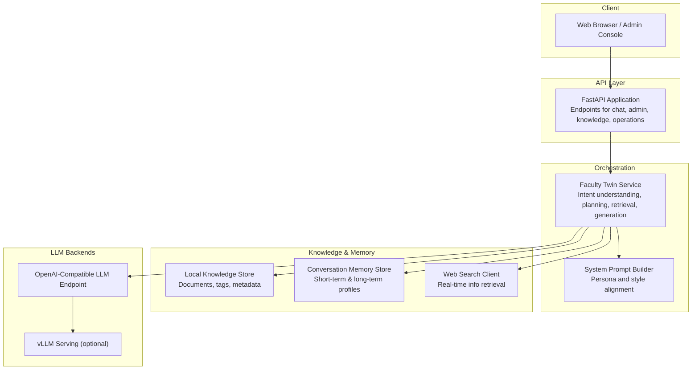
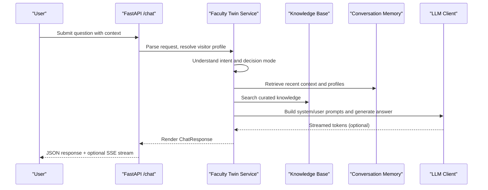
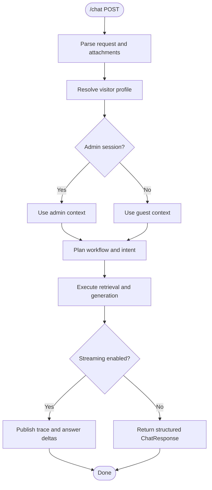
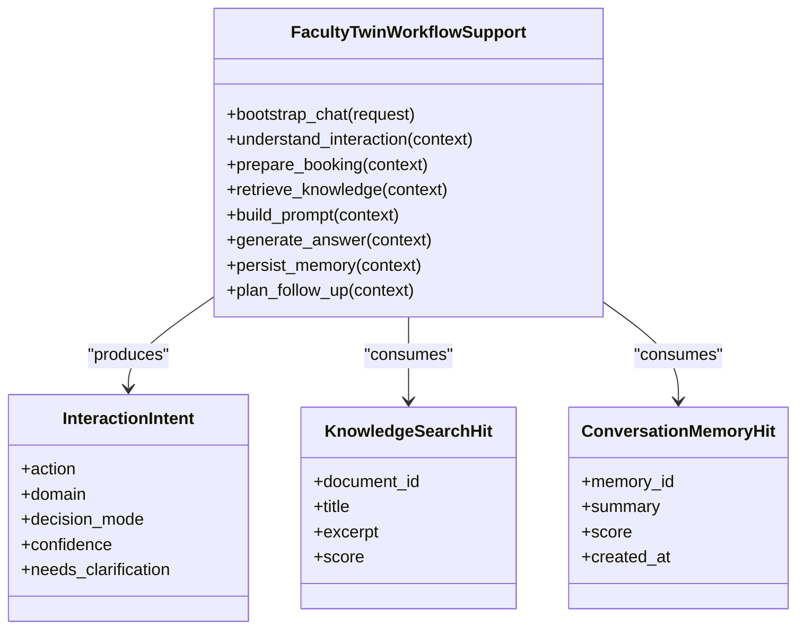
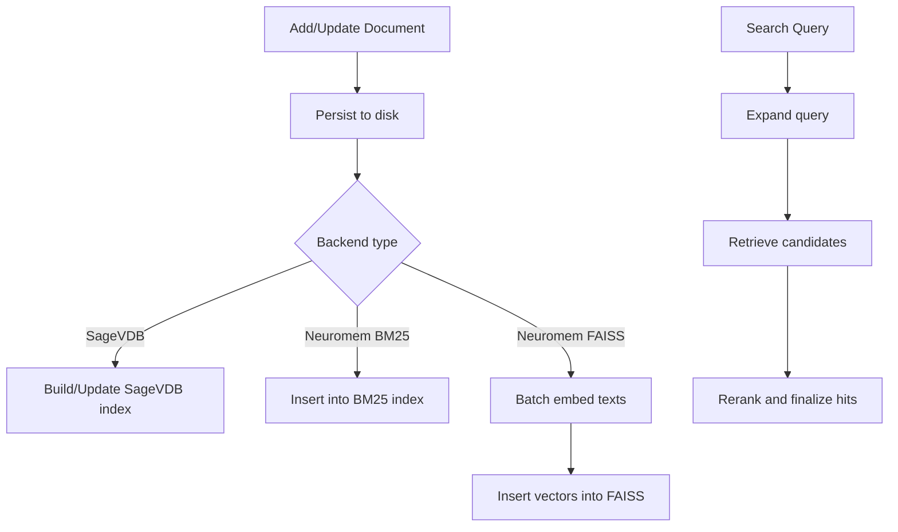
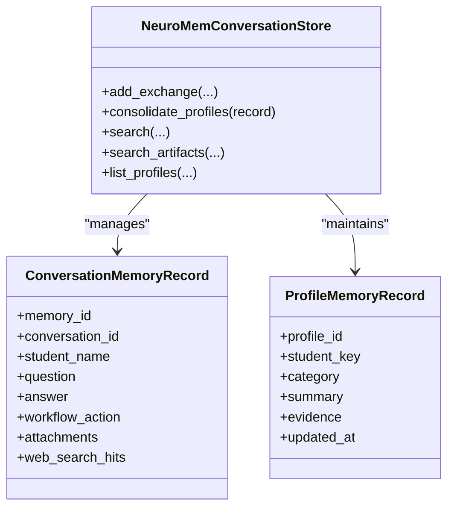
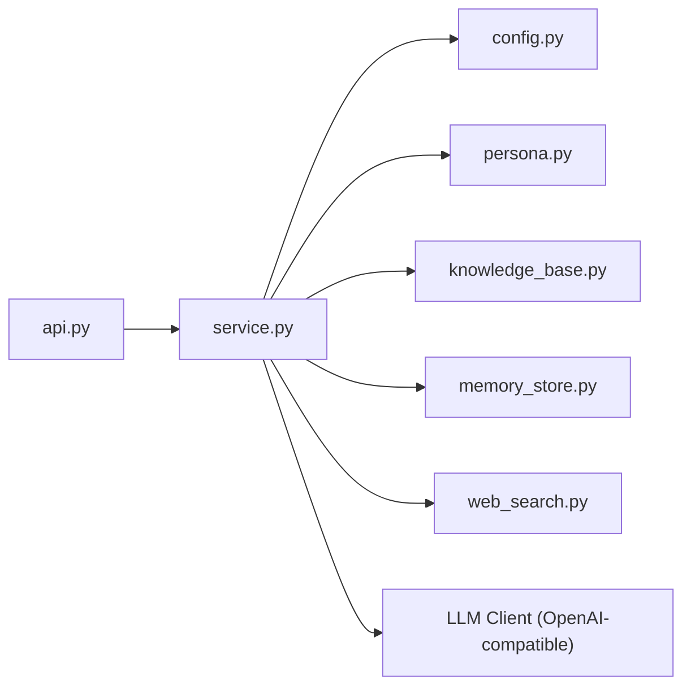

# Introduction and Purpose

<cite>
**Referenced Files in This Document**
- [README.md](file://README.md)
- [api.py](file://src/sage_faculty_twin/api.py)
- [service.py](file://src/sage_faculty_twin/service.py)
- [models.py](file://src/sage_faculty_twin/models.py)
- [config.py](file://src/sage_faculty_twin/config.py)
- [persona.py](file://src/sage_faculty_twin/persona.py)
- [web_search.py](file://src/sage_faculty_twin/web_search.py)
- [knowledge_base.py](file://src/sage_faculty_twin/knowledge_base.py)
- [memory_store.py](file://src/sage_faculty_twin/memory_store.py)
</cite>

## Table of Contents
1. [Introduction](#introduction)
2. [Project Structure](#project-structure)
3. [Core Components](#core-components)
4. [Architecture Overview](#architecture-overview)
5. [Detailed Component Analysis](#detailed-component-analysis)
6. [Dependency Analysis](#dependency-analysis)
7. [Performance Considerations](#performance-considerations)
8. [Troubleshooting Guide](#troubleshooting-guide)
9. [Conclusion](#conclusion)

## Introduction
Sage Faculty Twin is an academic digital assistant platform designed to transform traditional faculty-student academic support through AI-powered chat, 24/7 availability, and personalized guidance. It serves as a “digital twin” of a faculty member, enabling intelligent automation of routine academic interactions, proactive student support, and scalable engagement across diverse contexts such as advising, teaching assistance, research collaboration, and administrative coordination.

Key goals:
- Enhance teaching effectiveness by automating repetitive queries and providing instant, consistent answers.
- Improve student engagement by offering timely, personalized guidance and follow-up actions.
- Reduce workload on faculty by intelligently routing complex or sensitive issues to human oversight while handling straightforward tasks automatically.
- Deliver a seamless, secure, and privacy-conscious experience for both faculty and students.

Target audience:
- Faculty members who want to scale their academic support without sacrificing quality or personalization.
- Academic institutions seeking to modernize student services, improve response times, and maintain institutional knowledge.

Problem it solves:
- Conventional academic support often suffers from limited availability, inconsistent responses, and high administrative overhead. Sage Faculty Twin addresses these challenges by providing an always-available, intelligent assistant that understands context, retrieves relevant knowledge, and offers actionable next steps.

Mission:
- To empower faculty with intelligent automation that enhances both teaching effectiveness and student engagement, while preserving human judgment for nuanced decisions.

## Project Structure
The platform is implemented as a FastAPI application integrated with AI/ML backends and specialized academic workflows. It includes:
- API layer for chat, admin controls, knowledge management, and operations dashboards.
- Workflow orchestration that interprets user intent, retrieves knowledge and memory, generates answers, and schedules follow-ups.
- Knowledge base and conversation memory stores backed by configurable retrieval engines.
- Optional web search integration for real-time information.
- Configuration-driven persona and policy enforcement to align responses with institutional identity and guidelines.

**Diagram sources**
- [api.py:90-116](file://src/sage_faculty_twin/api.py#L90-L116)
- [service.py:581-634](file://src/sage_faculty_twin/service.py#L581-L634)
- [persona.py:22-39](file://src/sage_faculty_twin/persona.py#L22-L39)
- [knowledge_base.py:121-140](file://src/sage_faculty_twin/knowledge_base.py#L121-L140)
- [memory_store.py:223-257](file://src/sage_faculty_twin/memory_store.py#L223-L257)
- [web_search.py:93-108](file://src/sage_faculty_twin/web_search.py#L93-L108)

**Section sources**
- [README.md:1-126](file://README.md#L1-L126)
- [api.py:90-116](file://src/sage_faculty_twin/api.py#L90-L116)

## Core Components
- API and Routing: Exposes endpoints for chat, admin controls, knowledge management, presence tracking, and analytics. Supports streaming workflow events and structured responses.
- Workflow Engine: Interprets user intent, decides on action modes (direct answer, advise-only, human handoff), orchestrates retrieval from knowledge and memory, and executes follow-up actions.
- Knowledge Base: Manages curated academic materials with flexible backends (local JSON, SageVDB, or Neuromem), supports tagging, metadata, and visibility controls.
- Conversation Memory: Maintains short-term conversational context and long-term student profiles, enabling personalized and context-aware responses.
- Web Search: Optional integration to fetch real-time information for queries flagged as needing current data.
- Configuration and Persona: Centralized settings define system prompts, retrieval policies, availability, and stylistic guidance aligned with the faculty’s identity.

**Section sources**
- [api.py:597-700](file://src/sage_faculty_twin/api.py#L597-L700)
- [service.py:581-634](file://src/sage_faculty_twin/service.py#L581-L634)
- [knowledge_base.py:121-140](file://src/sage_faculty_twin/knowledge_base.py#L121-L140)
- [memory_store.py:223-257](file://src/sage_faculty_twin/memory_store.py#L223-L257)
- [web_search.py:93-108](file://src/sage_faculty_twin/web_search.py#L93-L108)
- [config.py:9-132](file://src/sage_faculty_twin/config.py#L9-L132)
- [persona.py:22-39](file://src/sage_faculty_twin/persona.py#L22-L39)

## Architecture Overview
The system follows a modular, layered architecture:
- Presentation and API: FastAPI routes requests, validates payloads, and streams workflow events.
- Orchestration: Intent classification, retrieval planning, LLM prompting, and post-answer actions.
- Data Stores: Knowledge base and conversation memory with pluggable backends.
- LLM Integration: OpenAI-compatible endpoint with optional vLLM proxy for performance.

**Diagram sources**
- [api.py:618-700](file://src/sage_faculty_twin/api.py#L618-L700)
- [service.py:635-775](file://src/sage_faculty_twin/service.py#L635-L775)
- [knowledge_base.py:273-295](file://src/sage_faculty_twin/knowledge_base.py#L273-L295)
- [memory_store.py:446-489](file://src/sage_faculty_twin/memory_store.py#L446-L489)

## Detailed Component Analysis

### API Layer and Chat Flow
- Streaming and SSE: The API supports streaming LLM tokens and workflow events over SSE to power progressive UI rendering.
- Request parsing: Validates multipart/form-data and JSON payloads, extracts attachments, normalizes query text, and enriches visitor profile.
- Health and diagnostics: Provides health checks, stack version reporting, and hardware telemetry.

**Diagram sources**
- [api.py:618-700](file://src/sage_faculty_twin/api.py#L618-L700)
- [api.py:170-256](file://src/sage_faculty_twin/api.py#L170-L256)

**Section sources**
- [api.py:597-700](file://src/sage_faculty_twin/api.py#L597-L700)
- [api.py:170-256](file://src/sage_faculty_twin/api.py#L170-L256)

### Workflow Engine and Intent Understanding
- Intent classification: Determines action (answer, book meeting, ask follow-up, human handoff, admin add knowledge), domain (general, research, teaching, advising, booking), decision mode (direct answer, advise-only, review queue, human handoff), and confidence.
- Planning and routing: Uses planner decisions and shadow planner comparisons to select optimal execution paths, with post-answer background tasks for persistence and follow-ups.
- Retrieval fusion: Combines conversation memory, knowledge base, and optional web search results to build a comprehensive prompt.

**Diagram sources**
- [service.py:581-634](file://src/sage_faculty_twin/service.py#L581-L634)
- [service.py:696-775](file://src/sage_faculty_twin/service.py#L696-L775)
- [models.py:47-63](file://src/sage_faculty_twin/models.py#L47-L63)
- [models.py:400-412](file://src/sage_faculty_twin/models.py#L400-L412)
- [models.py:147-183](file://src/sage_faculty_twin/models.py#L147-L183)

**Section sources**
- [service.py:581-634](file://src/sage_faculty_twin/service.py#L581-L634)
- [service.py:696-775](file://src/sage_faculty_twin/service.py#L696-L775)
- [models.py:47-63](file://src/sage_faculty_twin/models.py#L47-L63)

### Knowledge Base Management
- Storage: Documents stored as JSON with metadata, tags, and source names; supports deduplication by source name.
- Backends: Local JSON, SageVDB (flat or ANN), or Neuromem (BM25 or FAISS).
- Search: Tokenization, query expansion, and scoring; optional visibility filtering by visitor profile and admin role.

**Diagram sources**
- [knowledge_base.py:141-166](file://src/sage_faculty_twin/knowledge_base.py#L141-L166)
- [knowledge_base.py:273-295](file://src/sage_faculty_twin/knowledge_base.py#L273-L295)
- [knowledge_base.py:422-473](file://src/sage_faculty_twin/knowledge_base.py#L422-L473)
- [knowledge_base.py:483-521](file://src/sage_faculty_twin/knowledge_base.py#L483-L521)

**Section sources**
- [knowledge_base.py:121-140](file://src/sage_faculty_twin/knowledge_base.py#L121-L140)
- [knowledge_base.py:273-295](file://src/sage_faculty_twin/knowledge_base.py#L273-L295)

### Conversation Memory and Personalization
- Short-term memory: Captures recent exchanges with attachments and web search hits; enables contextual recall.
- Long-term profiles: Summarizes student identities, course contexts, preferences, and recurring topics to personalize future interactions.
- Indexing and retrieval: Configurable collection types and index backends (BM25, FAISS, ANN) with telemetry and performance metrics.

**Diagram sources**
- [memory_store.py:56-122](file://src/sage_faculty_twin/memory_store.py#L56-L122)
- [memory_store.py:161-194](file://src/sage_faculty_twin/memory_store.py#L161-L194)
- [memory_store.py:223-257](file://src/sage_faculty_twin/memory_store.py#L223-L257)

**Section sources**
- [memory_store.py:223-257](file://src/sage_faculty_twin/memory_store.py#L223-L257)
- [memory_store.py:446-489](file://src/sage_faculty_twin/memory_store.py#L446-L489)

### Web Search Integration
- Optional real-time retrieval: Detects news/weather intents, normalizes queries, and ranks results by relevance and recency.
- Controlled by configuration: Enables/disables and sets timeouts and result caps.

**Section sources**
- [web_search.py:93-108](file://src/sage_faculty_twin/web_search.py#L93-L108)
- [web_search.py:221-251](file://src/sage_faculty_twin/web_search.py#L221-L251)

### Configuration and Persona
- Centralized settings: Define system prompts, LLM endpoints, retrieval policies, availability, and session secrets.
- Persona builder: Composes system prompts with owner identity, role, and customizable style profile.

**Section sources**
- [config.py:9-132](file://src/sage_faculty_twin/config.py#L9-L132)
- [persona.py:22-39](file://src/sage_faculty_twin/persona.py#L22-L39)

## Dependency Analysis
High-level dependencies:
- FastAPI application depends on the Faculty Twin Service for orchestration.
- Service depends on Knowledge Base, Conversation Memory, Web Search, and LLM clients.
- Configuration and persona influence system behavior and prompt construction.
- Deployment scripts and systemd services manage startup and runtime.

**Diagram sources**
- [api.py:90-116](file://src/sage_faculty_twin/api.py#L90-L116)
- [service.py:581-634](file://src/sage_faculty_twin/service.py#L581-L634)
- [config.py:9-132](file://src/sage_faculty_twin/config.py#L9-L132)
- [persona.py:22-39](file://src/sage_faculty_twin/persona.py#L22-L39)
- [knowledge_base.py:121-140](file://src/sage_faculty_twin/knowledge_base.py#L121-L140)
- [memory_store.py:223-257](file://src/sage_faculty_twin/memory_store.py#L223-L257)
- [web_search.py:93-108](file://src/sage_faculty_twin/web_search.py#L93-L108)

**Section sources**
- [README.md:118-126](file://README.md#L118-L126)

## Performance Considerations
- Streaming and background tasks: Enable low-latency responses by returning ChatResponse promptly and deferring post-answer persistence and planning.
- Prompt soft cap and truncation: Limits prompt size to balance quality and latency, with safeguards to preserve key context.
- Retrieval backends: Choose appropriate index types (BM25 vs FAISS) and embedding models to optimize recall and speed.
- Caching and retries: Configure LLM cache TTL and retry parameters to stabilize throughput under variable latency.

[No sources needed since this section provides general guidance]

## Troubleshooting Guide
Common issues and resolutions:
- Module import errors: Ensure proper PYTHONPATH and environment setup via provided scripts.
- Validation errors: Verify request payloads conform to model schemas (e.g., required fields for chat).
- Streaming issues: Confirm environment flags for streaming and upstream LLM support.
- Service readiness: Use health endpoints to confirm initialization and stack versions.

**Section sources**
- [README.md:111-117](file://README.md#L111-L117)
- [api.py:618-700](file://src/sage_faculty_twin/api.py#L618-L700)

## Conclusion
Sage Faculty Twin reimagines academic support by combining AI-driven intent understanding, scalable knowledge and memory systems, and configurable workflows. By automating routine interactions and providing personalized guidance, it empowers faculty to focus on higher-value activities while ensuring students receive timely, consistent, and engaging support around the clock.