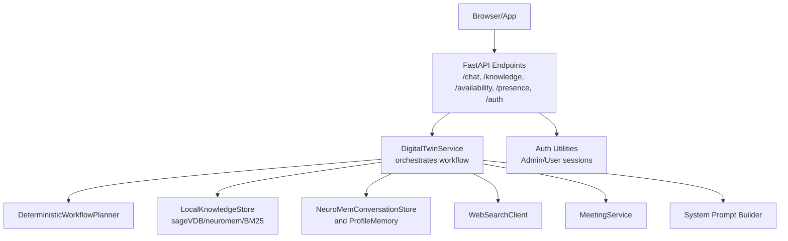
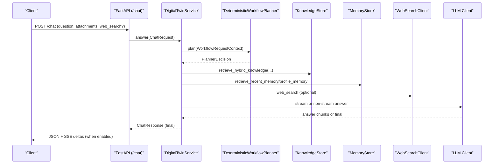
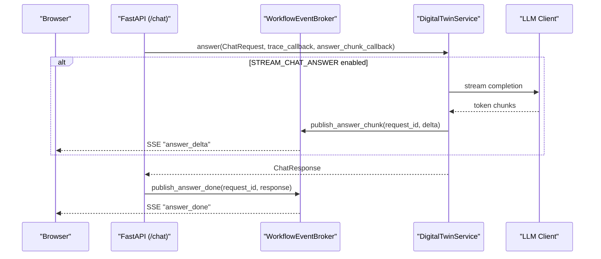
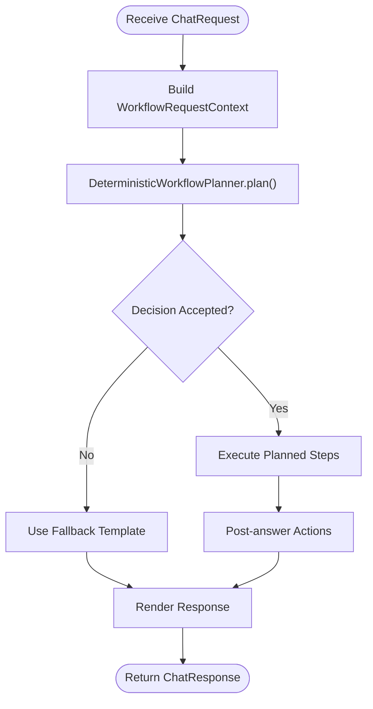
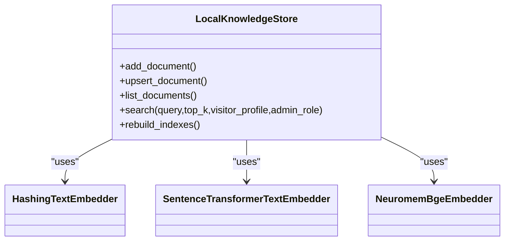
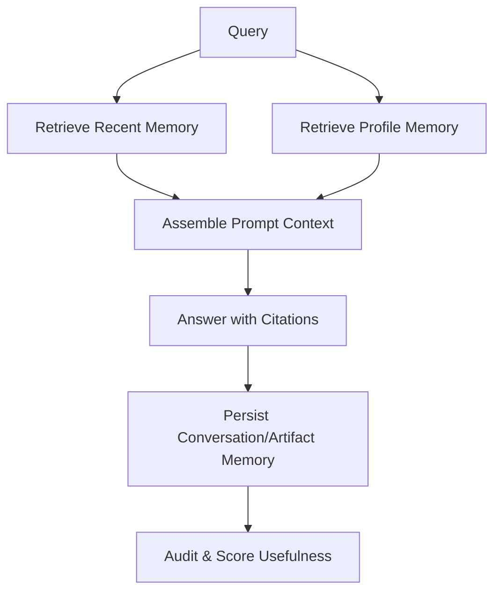
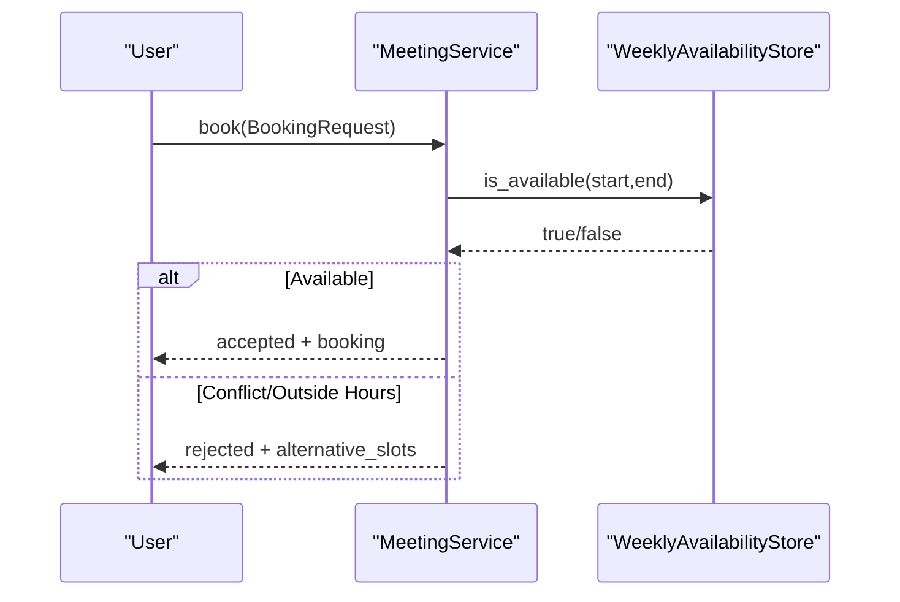
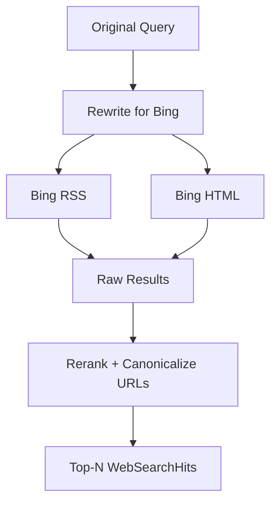
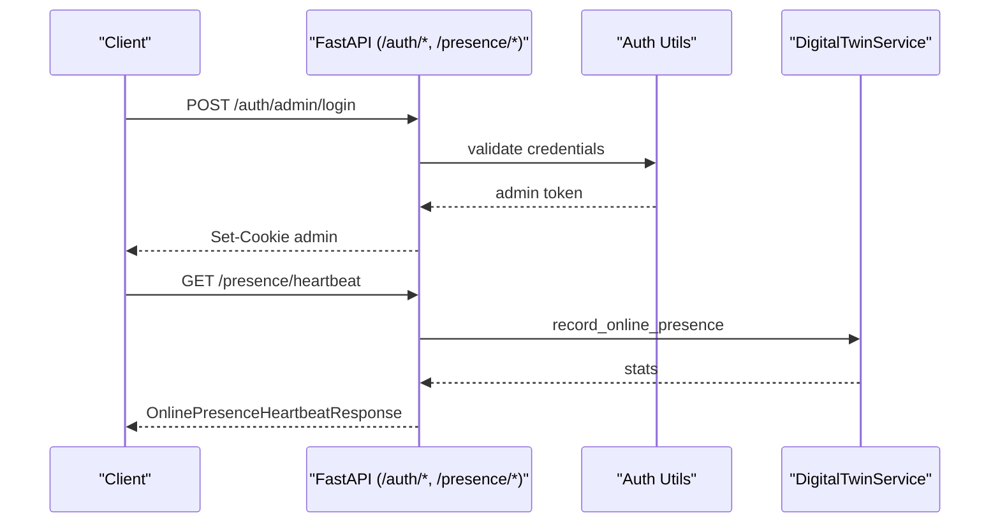
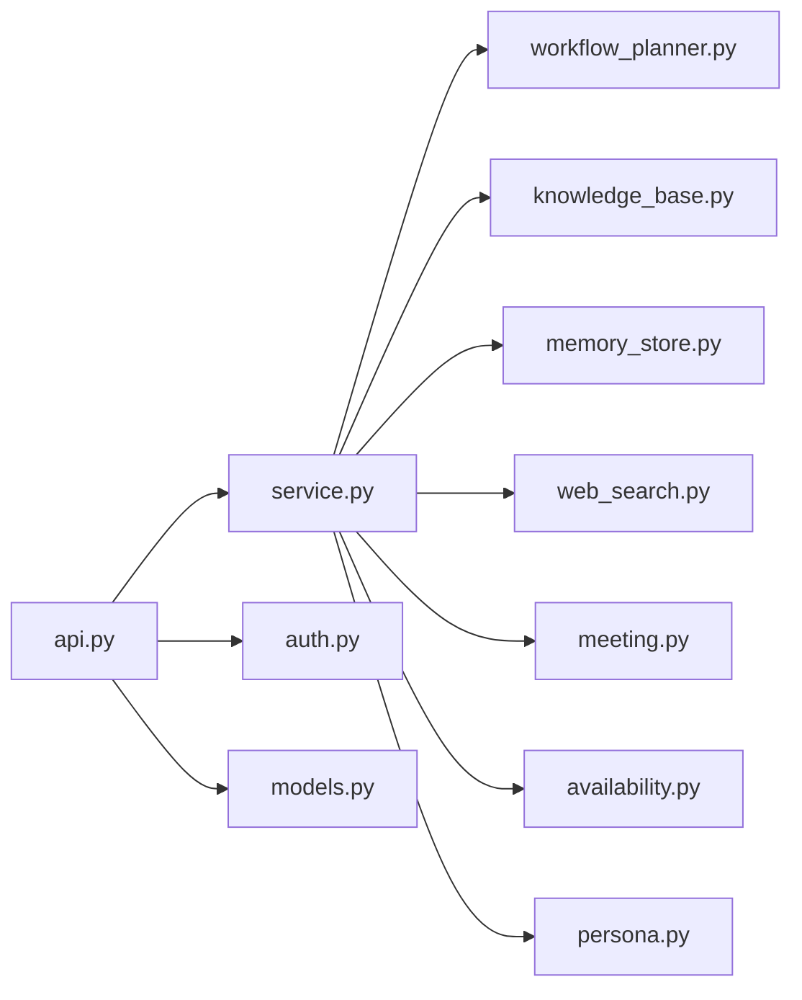

# Key Features

<cite>
**Referenced Files in This Document**
- [README.md](file://README.md)
- [api.py](file://src/sage_faculty_twin/api.py)
- [service.py](file://src/sage_faculty_twin/service.py)
- [workflow_planner.py](file://src/sage_faculty_twin/workflow_planner.py)
- [knowledge_base.py](file://src/sage_faculty_twin/knowledge_base.py)
- [web_search.py](file://src/sage_faculty_twin/web_search.py)
- [meeting.py](file://src/sage_faculty_twin/meeting.py)
- [availability.py](file://src/sage_faculty_twin/availability.py)
- [persona.py](file://src/sage_faculty_twin/persona.py)
- [auth.py](file://src/sage_faculty_twin/auth.py)
- [models.py](file://src/sage_faculty_twin/models.py)
- [test_chat_streaming.py](file://tests/test_chat_streaming.py)
</cite>

## Table of Contents
1. [Introduction](#introduction)
2. [Project Structure](#project-structure)
3. [Core Components](#core-components)
4. [Architecture Overview](#architecture-overview)
5. [Detailed Component Analysis](#detailed-component-analysis)
6. [Dependency Analysis](#dependency-analysis)
7. [Performance Considerations](#performance-considerations)
8. [Troubleshooting Guide](#troubleshooting-guide)
9. [Conclusion](#conclusion)

## Introduction
This document explains the key features of Sage Faculty Twin and how they collectively deliver an academic support ecosystem centered on intelligent assistance for a single faculty member. It covers:
- Intelligent chat with streaming answers and multi-modal attachments
- Advanced workflow planning and execution
- Multi-backend knowledge management with hybrid retrieval
- Personalized memory systems for conversations and profiles
- Appointment scheduling and booking
- Web search integration
- Administrative controls and user/session management

Each feature is described with its purpose, implementation highlights, and how it contributes to a responsive, policy-aware, and scalable academic assistant.

## Project Structure
At a high level, the system is a FastAPI application that orchestrates a Sage-powered digital twin. The API layer exposes endpoints for chat, knowledge, scheduling, presence, and administration. The service layer implements the workflow engine, planner, memory stores, and integrations with LLMs and external knowledge/backends. Supporting modules handle persona, availability, web search, authentication, and models.

**Diagram sources**
- [api.py:90-120](file://src/sage_faculty_twin/api.py#L90-L120)
- [service.py:581-634](file://src/sage_faculty_twin/service.py#L581-L634)
- [workflow_planner.py:90-134](file://src/sage_faculty_twin/workflow_planner.py#L90-L134)
- [knowledge_base.py:121-140](file://src/sage_faculty_twin/knowledge_base.py#L121-L140)
- [web_search.py:93-107](file://src/sage_faculty_twin/web_search.py#L93-L107)
- [meeting.py:11-16](file://src/sage_faculty_twin/meeting.py#L11-L16)
- [persona.py:22-39](file://src/sage_faculty_twin/persona.py#L22-L39)
- [auth.py:16-17](file://src/sage_faculty_twin/auth.py#L16-L17)

**Section sources**
- [README.md:1-126](file://README.md#L1-L126)
- [api.py:90-120](file://src/sage_faculty_twin/api.py#L90-L120)

## Core Components
- Intelligent chat with streaming and multi-modal attachments: Implements request parsing, streaming SSE, and optional LLM token streaming.
- Advanced workflow planning and execution: Deterministic planner selects safe, auditable steps guided by policy and context.
- Multi-backend knowledge management: Supports BM25, FAISS/SentenceTransformers, and hashing embeddings with flexible backends.
- Personalized memory systems: Long-term and short-term memory retrieval and consolidation with privacy-aware consent.
- Appointment scheduling and booking: Availability management with conflict detection and slot suggestions.
- Web search integration: Bing-based search with query rewriting and result reranking.
- Administrative features: Session-based admin/user controls, presence tracking, and operational visibility.

**Section sources**
- [api.py:170-256](file://src/sage_faculty_twin/api.py#L170-L256)
- [service.py:581-634](file://src/sage_faculty_twin/service.py#L581-L634)
- [workflow_planner.py:90-134](file://src/sage_faculty_twin/workflow_planner.py#L90-L134)
- [knowledge_base.py:121-140](file://src/sage_faculty_twin/knowledge_base.py#L121-L140)
- [web_search.py:93-107](file://src/sage_faculty_twin/web_search.py#L93-L107)
- [meeting.py:11-16](file://src/sage_faculty_twin/meeting.py#L11-L16)
- [availability.py:11-26](file://src/sage_faculty_twin/availability.py#L11-L26)
- [auth.py:16-17](file://src/sage_faculty_twin/auth.py#L16-L17)

## Architecture Overview
The runtime architecture couples FastAPI endpoints with a Sage-based workflow engine. The workflow planner evaluates intent and selects a deterministic plan, which the service executes through retrieval, prompting, LLM inference, and post-answer actions. Knowledge and memory backends are abstracted behind unified interfaces. Optional web search augments grounding. Administrative controls and user sessions protect sensitive operations.

**Diagram sources**
- [api.py:618-700](file://src/sage_faculty_twin/api.py#L618-L700)
- [service.py:581-634](file://src/sage_faculty_twin/service.py#L581-L634)
- [workflow_planner.py:110-134](file://src/sage_faculty_twin/workflow_planner.py#L110-L134)
- [knowledge_base.py:273-295](file://src/sage_faculty_twin/knowledge_base.py#L273-L295)
- [web_search.py:109-127](file://src/sage_faculty_twin/web_search.py#L109-L127)

## Detailed Component Analysis

### Intelligent Chat Interface with Streaming Responses and Multi-modal Attachments
- Streaming responses: When enabled, the server streams token deltas via Server-Sent Events and concludes with the final structured response. This improves perceived latency and UX during long answers.
- Multi-modal attachments: Accepts PDF/TXT/MD/CSV/JSON/PY/YAML/LOG with size and character limits, extracting text safely and truncating long content.
- Request parsing: Validates multipart/form-data and JSON payloads, normalizes optional fields, and enforces limits.
- SSE broker: Manages per-request event queues, heartbeats, and graceful closure.

**Diagram sources**
- [api.py:597-700](file://src/sage_faculty_twin/api.py#L597-L700)
- [api.py:170-256](file://src/sage_faculty_twin/api.py#L170-L256)
- [service.py:581-634](file://src/sage_faculty_twin/service.py#L581-L634)

**Section sources**
- [api.py:145-168](file://src/sage_faculty_twin/api.py#L145-L168)
- [api.py:328-368](file://src/sage_faculty_twin/api.py#L328-L368)
- [api.py:597-700](file://src/sage_faculty_twin/api.py#L597-L700)
- [test_chat_streaming.py:92-123](file://tests/test_chat_streaming.py#L92-L123)

### Advanced Workflow Planning and Execution System
- Deterministic planner: Builds plans from intent classification and context, selecting steps with conservative side effects and auditable fallback templates.
- Policy-driven decisions: Evaluates risk levels and side effects against a policy, enabling shadow/Live modes and fallback reasoning.
- Execution orchestration: The service coordinates retrieval, prompting, LLM answer generation, and post-answer actions (memory persistence, profile consolidation, follow-ups, usefulness scoring).

**Diagram sources**
- [service.py:581-634](file://src/sage_faculty_twin/service.py#L581-L634)
- [workflow_planner.py:110-134](file://src/sage_faculty_twin/workflow_planner.py#L110-L134)
- [workflow_planner.py:180-426](file://src/sage_faculty_twin/workflow_planner.py#L180-L426)

**Section sources**
- [workflow_planner.py:90-134](file://src/sage_faculty_twin/workflow_planner.py#L90-L134)
- [service.py:581-634](file://src/sage_faculty_twin/service.py#L581-L634)

### Multi-backend Knowledge Management with Hybrid Retrieval
- Backends: sageVDB (flat/ANNs), neuromem (BM25/FAISS), and pure lexical BM25.
- Embeddings: Hashing or SentenceTransformers; FAISS path supports batched encoding for performance.
- Hybrid retrieval: Combines knowledge store results with optional web search and recent memory.
- Visibility and deduplication: Documents are deduplicated by source_name and filtered by requester visibility.

**Diagram sources**
- [knowledge_base.py:121-140](file://src/sage_faculty_twin/knowledge_base.py#L121-L140)
- [knowledge_base.py:18-81](file://src/sage_faculty_twin/knowledge_base.py#L18-L81)
- [knowledge_base.py:42-76](file://src/sage_faculty_twin/knowledge_base.py#L42-L76)
- [knowledge_base.py:78-119](file://src/sage_faculty_twin/knowledge_base.py#L78-L119)

**Section sources**
- [knowledge_base.py:273-331](file://src/sage_faculty_twin/knowledge_base.py#L273-L331)
- [knowledge_base.py:422-521](file://src/sage_faculty_twin/knowledge_base.py#L422-L521)
- [knowledge_base.py:561-710](file://src/sage_faculty_twin/knowledge_base.py#L561-L710)

### Personalized Memory Systems for Conversation and Profile Management
- Conversation memory: Retrieves recent exchanges and timelines, with filtering and limits.
- Profile memory: Consolidates long-term student profiles by category and recency, respecting consent.
- Audit and summarization: Provides memory audit items and profile categorization for downstream use.

**Diagram sources**
- [service.py:581-634](file://src/sage_faculty_twin/service.py#L581-L634)
- [memory_store.py:862-891](file://src/sage_faculty_twin/memory_store.py#L862-L891)

**Section sources**
- [service.py:581-634](file://src/sage_faculty_twin/service.py#L581-L634)
- [memory_store.py:862-891](file://src/sage_faculty_twin/memory_store.py#L862-L891)

### Appointment Scheduling and Booking Capabilities
- Availability management: Loads/stores weekly schedules, suggests slots, and detects conflicts.
- Booking lifecycle: Validates duration and hours, checks availability, prevents conflicts, and supports confirmation/rejection.
- Alternative slots: Recommends nearby alternatives when conflicts occur.

**Diagram sources**
- [meeting.py:17-68](file://src/sage_faculty_twin/meeting.py#L17-L68)
- [availability.py:71-114](file://src/sage_faculty_twin/availability.py#L71-L114)

**Section sources**
- [meeting.py:11-180](file://src/sage_faculty_twin/meeting.py#L11-L180)
- [availability.py:11-165](file://src/sage_faculty_twin/availability.py#L11-L165)

### Web Search Integration
- Query rewriting: Detects weather/news intents and normalizes queries.
- Dual-source search: Tries RSS then HTML scraping from Bing, with result reranking.
- Scoring: Host weights, recency bonuses, and keyword matching improve relevance.

**Diagram sources**
- [web_search.py:109-127](file://src/sage_faculty_twin/web_search.py#L109-L127)
- [web_search.py:222-252](file://src/sage_faculty_twin/web_search.py#L222-L252)

**Section sources**
- [web_search.py:93-107](file://src/sage_faculty_twin/web_search.py#L93-L107)
- [web_search.py:169-220](file://src/sage_faculty_twin/web_search.py#L169-L220)
- [web_search.py:222-326](file://src/sage_faculty_twin/web_search.py#L222-L326)

### Administrative Features and User Sessions
- Admin/user sessions: Signed cookies with HMAC, expirable payloads, and role normalization.
- Admin controls: Login/logout, session inspection, and service control endpoints.
- Presence tracking: Heartbeat requests to monitor online visitors and active conversations.

**Diagram sources**
- [auth.py:119-143](file://src/sage_faculty_twin/auth.py#L119-L143)
- [api.py:542-547](file://src/sage_faculty_twin/api.py#L542-L547)
- [service.py:581-634](file://src/sage_faculty_twin/service.py#L581-L634)

**Section sources**
- [auth.py:16-17](file://src/sage_faculty_twin/auth.py#L16-L17)
- [auth.py:119-179](file://src/sage_faculty_twin/auth.py#L119-L179)
- [api.py:451-510](file://src/sage_faculty_twin/api.py#L451-L510)
- [api.py:542-547](file://src/sage_faculty_twin/api.py#L542-L547)

## Dependency Analysis
The system exhibits layered dependencies:
- API depends on Service for orchestration and on Auth for session enforcement.
- Service depends on Planner, KnowledgeStore, MemoryStore, WebSearchClient, MeetingService, and LLM client.
- KnowledgeStore abstracts multiple backends; MemoryStore encapsulates conversation and profile memory.
- WebSearchClient is optional and gated by configuration.
- Persona builds system prompts from owner settings and style profiles.

**Diagram sources**
- [api.py:90-120](file://src/sage_faculty_twin/api.py#L90-L120)
- [service.py:581-634](file://src/sage_faculty_twin/service.py#L581-L634)
- [workflow_planner.py:90-134](file://src/sage_faculty_twin/workflow_planner.py#L90-L134)
- [knowledge_base.py:121-140](file://src/sage_faculty_twin/knowledge_base.py#L121-L140)
- [web_search.py:93-107](file://src/sage_faculty_twin/web_search.py#L93-L107)
- [meeting.py:11-16](file://src/sage_faculty_twin/meeting.py#L11-L16)
- [availability.py:11-26](file://src/sage_faculty_twin/availability.py#L11-L26)
- [persona.py:22-39](file://src/sage_faculty_twin/persona.py#L22-L39)
- [auth.py:16-17](file://src/sage_faculty_twin/auth.py#L16-L17)
- [models.py:16-31](file://src/sage_faculty_twin/models.py#L16-L31)

**Section sources**
- [service.py:581-634](file://src/sage_faculty_twin/service.py#L581-L634)
- [api.py:90-120](file://src/sage_faculty_twin/api.py#L90-L120)

## Performance Considerations
- Streaming and SSE: Keep-alive events prevent proxy timeouts; enable DIGITAL_TWIN_STREAM_CHAT_ANSWER for progressive UI updates.
- Prompt soft cap: Truncation of memory hits, knowledge excerpts, and attachments bounds decode latency.
- Backend selection: FAISS batching and ANN backends can accelerate retrieval; BM25 remains lightweight.
- Concurrency: The planner’s DAG groups post-answer stages to minimize tail latency while preserving determinism.

[No sources needed since this section provides general guidance]

## Troubleshooting Guide
- Streaming not observed: Verify DIGITAL_TWIN_STREAM_CHAT_ANSWER is enabled and upstream LLM supports chunked streaming.
- Chat 504 timeout: The system enforces a configurable request timeout; adjust DIGITAL_TWIN_CHAT_REQUEST_TIMEOUT_SECONDS if upstream latency is high.
- Attachment errors: Ensure supported MIME/type and size limits; UTF-8 decoding failures will raise validation errors.
- Admin session issues: Confirm cookie signing secret and expiration; use admin login endpoints and inspect session via /auth/session.

**Section sources**
- [README.md:111-117](file://README.md#L111-L117)
- [api.py:127-129](file://src/sage_faculty_twin/api.py#L127-L129)
- [api.py:328-368](file://src/sage_faculty_twin/api.py#L328-L368)
- [auth.py:119-179](file://src/sage_faculty_twin/auth.py#L119-L179)

## Conclusion
Sage Faculty Twin integrates an intelligent chat interface, robust workflow planning, multi-backend knowledge management, personalized memory systems, scheduling, and web search into a cohesive academic support platform. Administrative controls and session management ensure safe, auditable operations. Together, these features enable a responsive, policy-aligned, and scalable assistant tailored to a faculty member’s needs.