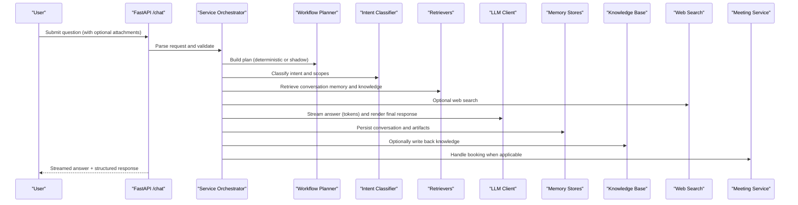
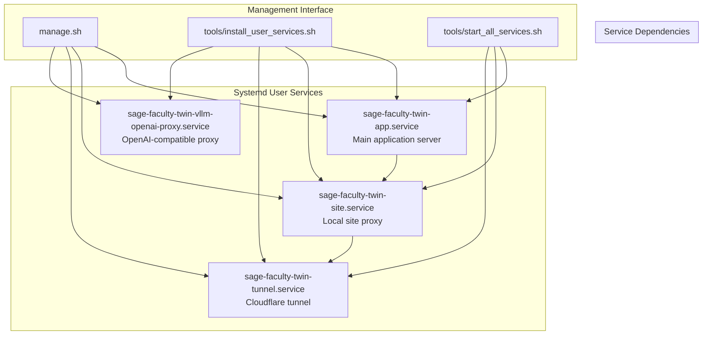
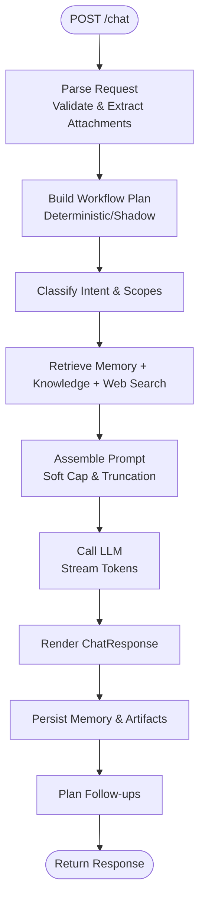
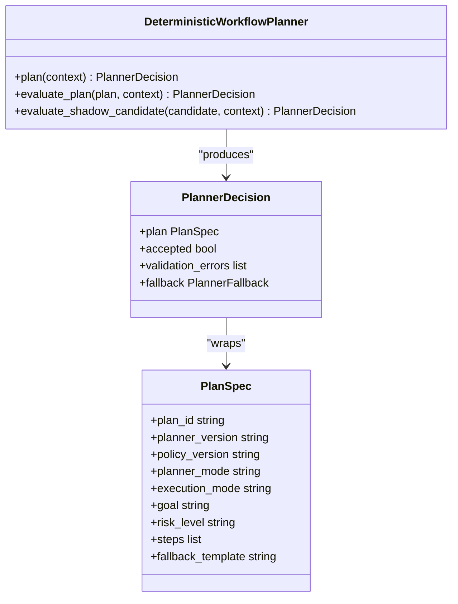
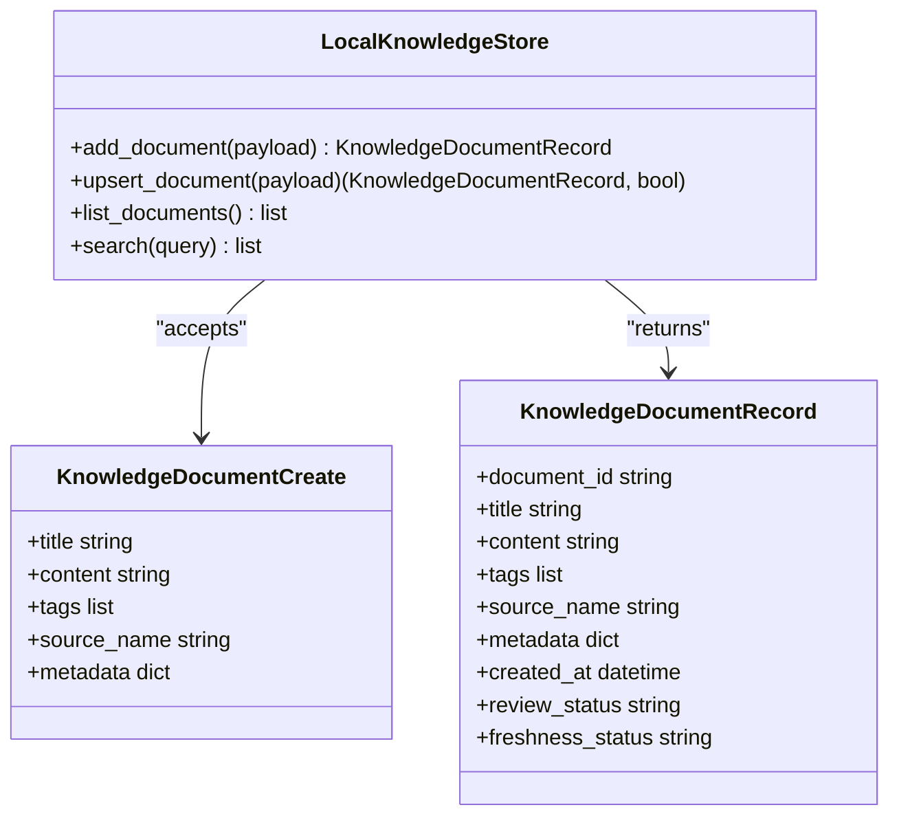
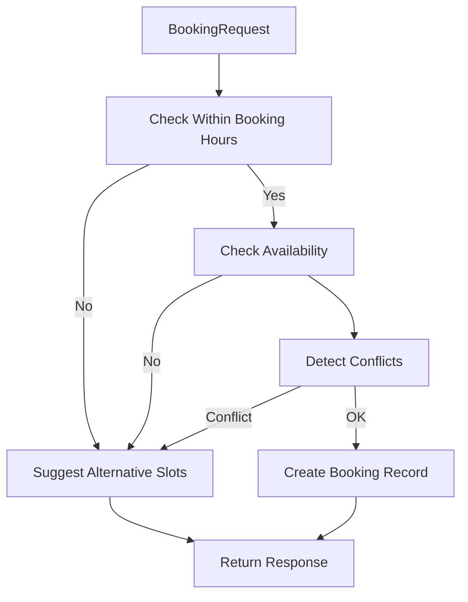
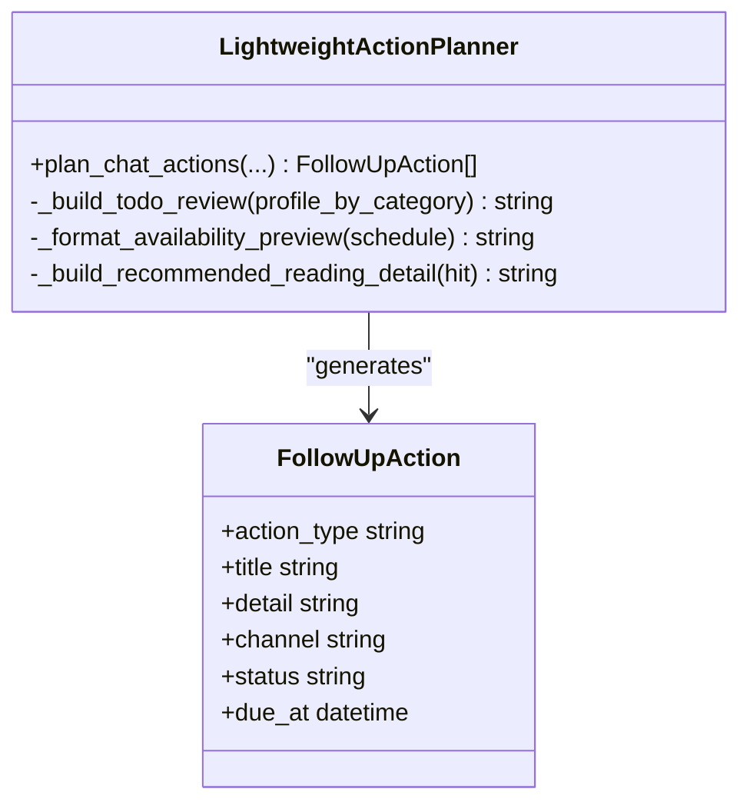
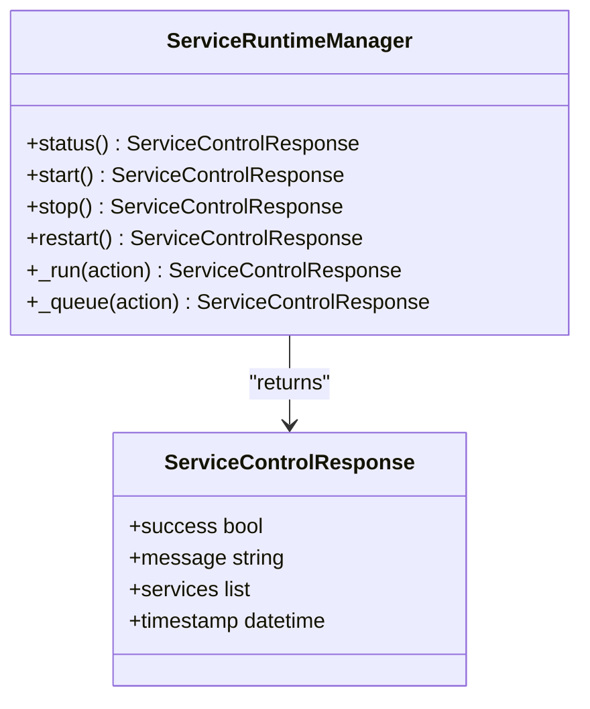
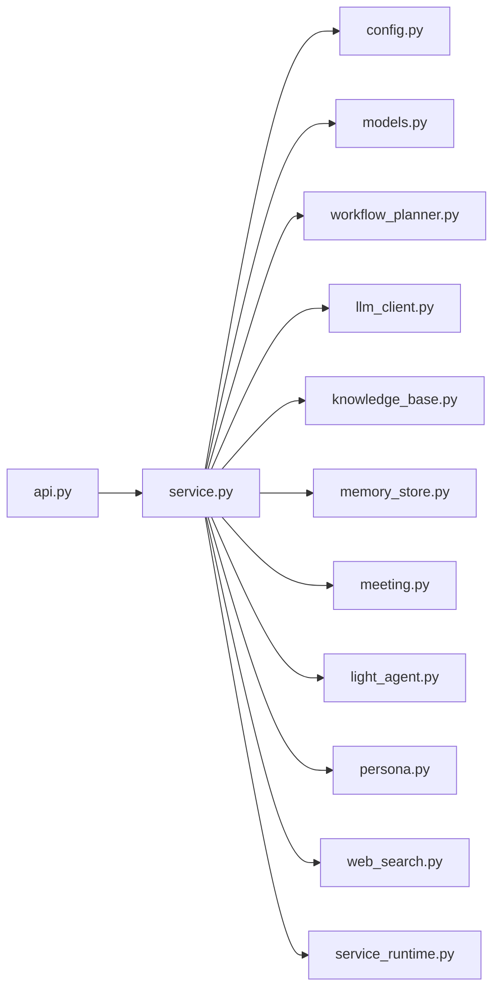

# Project Overview

<cite>
**Referenced Files in This Document**
- [README.md](file://README.md)
- [pyproject.toml](file://pyproject.toml)
- [src/sage_faculty_twin/__init__.py](file://src/sage_faculty_twin/__init__.py)
- [src/sage_faculty_twin/api.py](file://src/sage_faculty_twin/api.py)
- [src/sage_faculty_twin/service.py](file://src/sage_faculty_twin/service.py)
- [src/sage_faculty_twin/config.py](file://src/sage_faculty_twin/config.py)
- [src/sage_faculty_twin/models.py](file://src/sage_faculty_twin/models.py)
- [src/sage_faculty_twin/workflow_planner.py](file://src/sage_faculty_twin/workflow_planner.py)
- [src/sage_faculty_twin/knowledge_base.py](file://src/sage_faculty_twin/knowledge_base.py)
- [src/sage_faculty_twin/meeting.py](file://src/sage_faculty_twin/meeting.py)
- [src/sage_faculty_twin/light_agent.py](file://src/sage_faculty_twin/light_agent.py)
- [src/sage_faculty_twin/llm_client.py](file://src/sage_faculty_twin/llm_client.py)
- [src/sage_faculty_twin/web_search.py](file://src/sage_faculty_twin/web_search.py)
- [src/sage_faculty_twin/persona.py](file://src/sage_faculty_twin/persona.py)
- [src/sage_faculty_twin/memory_store.py](file://src/sage_faculty_twin/memory_store.py)
- [src/sage_faculty_twin/service_runtime.py](file://src/sage_faculty_twin/service_runtime.py)
- [manage.sh](file://manage.sh)
- [tools/install_user_services.sh](file://tools/install_user_services.sh)
- [tools/start_all_services.sh](file://tools/start_all_services.sh)
- [deploy/systemd/user/sage-faculty-twin-app.service](file://deploy/systemd/user/sage-faculty-twin-app.service)
- [deploy/systemd/user/sage-faculty-twin-site.service](file://deploy/systemd/user/sage-faculty-twin-site.service)
- [deploy/systemd/user/sage-faculty-twin-tunnel.service](file://deploy/systemd/user/sage-faculty-twin-tunnel.service)
- [deploy/systemd/user/sage-faculty-twin-vllm-openai-proxy.service](file://deploy/systemd/user/sage-faculty-twin-vllm-openai-proxy.service)
</cite>

## Update Summary
**Changes Made**
- Updated deployment section to reflect consolidated service management approach using unified `manage.sh` commands
- Streamlined command examples in deployment instructions for improved clarity
- Enhanced service management documentation with unified systemd service handling
- Added comprehensive coverage of the consolidated service architecture

## Table of Contents
1. [Introduction](#introduction)
2. [Project Structure](#project-structure)
3. [Core Components](#core-components)
4. [Architecture Overview](#architecture-overview)
5. [Deployment and Service Management](#deployment-and-service-management)
6. [Detailed Component Analysis](#detailed-component-analysis)
7. [Dependency Analysis](#dependency-analysis)
8. [Performance Considerations](#performance-considerations)
9. [Troubleshooting Guide](#troubleshooting-guide)
10. [Conclusion](#conclusion)

## Introduction
Sage Faculty Twin is an academic digital assistant platform designed for individual faculty members. It leverages FastAPI, the SAGE framework, and vLLM-compatible inference to deliver an AI-powered chat experience, integrated workflow orchestration, and knowledge management. The system supports 24/7 availability, intelligent scheduling, and personalized student guidance, enabling faculty to maintain consistent support without manual intervention.

Key characteristics:
- Academic-first design: tailored for faculty-student interactions in higher education contexts.
- AI-driven orchestration: intent classification, retrieval-augmented generation, and guided workflows.
- Knowledge-centric: curated knowledge base with optional web search augmentation.
- Operational visibility: live workflow tracing, metrics, and administrative controls.
- Unified service management: consolidated deployment and management through systemd user services.

## Project Structure
The repository is organized around a FastAPI application that exposes REST endpoints and an embedded static frontend. Supporting modules encapsulate configuration, workflow planning, LLM integration, knowledge stores, meeting scheduling, and memory persistence. The system now features a consolidated service management approach using systemd user services.

```mermaid
graph TB
subgraph "Application Layer"
API["FastAPI App<br/>src/sage_faculty_twin/api.py"]
Service["Service Orchestrator<br/>src/sage_faculty_twin/service.py"]
end
subgraph "Core Modules"
Config["Settings & Environment<br/>src/sage_faculty_twin/config.py"]
Models["Pydantic Models<br/>src/sage_faculty_twin/models.py"]
Planner["Workflow Planner<br/>src/sage_faculty_twin/workflow_planner.py"]
Persona["System Prompt Builder<br/>src/sage_faculty_twin/persona.py"]
Runtime["Service Runtime Manager<br/>src/sage_faculty_twin/service_runtime.py"]
end
subgraph "AI & Retrieval"
LLM["LLM Client<br/>src/sage_faculty_twin/llm_client.py"]
KB["Knowledge Store<br/>src/sage_faculty_twin/knowledge_base.py"]
Web["Web Search<br/>src/sage_faculty_twin/web_search.py"]
Memory["Conversation & Profile Memory<br/>src/sage_faculty_twin/memory_store.py"]
end
subgraph "Operations"
Meeting["Meeting Service<br/>src/sage_faculty_twin/meeting.py"]
Agent["Lightweight Action Planner<br/>src/sage_faculty_twin/light_agent.py"]
end
subgraph "Service Management"
Systemd["Systemd User Services<br/>deploy/systemd/user/*.service"]
Manager["Service Manager<br/>manage.sh"]
Installer["Service Installer<br/>tools/install_user_services.sh"]
Starter["All-in-One Starter<br/>tools/start_all_services.sh"]
end
API --> Service
Service --> Planner
Service --> LLM
Service --> KB
Service --> Web
Service --> Memory
Service --> Meeting
Service --> Agent
Service --> Persona
Service --> Models
Service --> Config
Service --> Runtime
Systemd --> Manager
Installer --> Systemd
Starter --> Systemd
```



**Diagram sources**
- [src/sage_faculty_twin/api.py](file://src/sage_faculty_twin/api.py)
- [src/sage_faculty_twin/service.py](file://src/sage_faculty_twin/service.py)
- [src/sage_faculty_twin/config.py](file://src/sage_faculty_twin/config.py)
- [src/sage_faculty_twin/models.py](file://src/sage_faculty_twin/models.py)
- [src/sage_faculty_twin/workflow_planner.py](file://src/sage_faculty_twin/workflow_planner.py)
- [src/sage_faculty_twin/persona.py](file://src/sage_faculty_twin/persona.py)
- [src/sage_faculty_twin/llm_client.py](file://src/sage_faculty_twin/llm_client.py)
- [src/sage_faculty_twin/knowledge_base.py](file://src/sage_faculty_twin/knowledge_base.py)
- [src/sage_faculty_twin/web_search.py](file://src/sage_faculty_twin/web_search.py)
- [src/sage_faculty_twin/memory_store.py](file://src/sage_faculty_twin/memory_store.py)
- [src/sage_faculty_twin/meeting.py](file://src/sage_faculty_twin/meeting.py)
- [src/sage_faculty_twin/light_agent.py](file://src/sage_faculty_twin/light_agent.py)
- [src/sage_faculty_twin/service_runtime.py](file://src/sage_faculty_twin/service_runtime.py)
- [manage.sh](file://manage.sh)
- [tools/install_user_services.sh](file://tools/install_user_services.sh)
- [tools/start_all_services.sh](file://tools/start_all_services.sh)
- [deploy/systemd/user/sage-faculty-twin-app.service](file://deploy/systemd/user/sage-faculty-twin-app.service)
- [deploy/systemd/user/sage-faculty-twin-site.service](file://deploy/systemd/user/sage-faculty-twin-site.service)
- [deploy/systemd/user/sage-faculty-twin-tunnel.service](file://deploy/systemd/user/sage-faculty-twin-tunnel.service)
- [deploy/systemd/user/sage-faculty-twin-vllm-openai-proxy.service](file://deploy/systemd/user/sage-faculty-twin-vllm-openai-proxy.service)

**Section sources**
- [README.md](file://README.md)
- [pyproject.toml](file://pyproject.toml)
- [manage.sh](file://manage.sh)
- [tools/install_user_services.sh](file://tools/install_user_services.sh)
- [tools/start_all_services.sh](file://tools/start_all_services.sh)

## Core Components
- FastAPI Application: Exposes endpoints for chat, availability, knowledge management, user/admin sessions, and operational dashboards. It also serves a static frontend and manages streaming workflow events.
- Service Orchestrator: Implements the end-to-end chat workflow, integrating intent understanding, retrieval, LLM answering, memory persistence, follow-up planning, and scheduling.
- Configuration: Centralized settings for LLM endpoints, retrieval backends, web search, availability, and operational policies.
- Workflow Planner: Builds deterministic plans from intent and policy, with optional shadow planning and fallback templates.
- Knowledge Base: Local JSON documents with pluggable backends (Neuromem, sageVDB) and optional embedding-based retrieval.
- LLM Client: Manages OpenAI-compatible API calls, caching, metrics, and streaming token callbacks.
- Meeting Service: Handles booking requests, conflict detection, and availability checks against weekly schedules.
- Lightweight Action Planner: Generates actionable follow-ups (reading lists, todo reviews, office hour recommendations).
- Memory Stores: Persists conversation exchanges, attachments, web search hits, and student profiles for recall and personalization.
- Persona: Constructs system prompts aligned with faculty identity and communication style.
- Service Runtime Manager: Provides unified service control and monitoring capabilities for the entire system.

**Section sources**
- [src/sage_faculty_twin/api.py](file://src/sage_faculty_twin/api.py)
- [src/sage_faculty_twin/service.py](file://src/sage_faculty_twin/service.py)
- [src/sage_faculty_twin/config.py](file://src/sage_faculty_twin/config.py)
- [src/sage_faculty_twin/workflow_planner.py](file://src/sage_faculty_twin/workflow_planner.py)
- [src/sage_faculty_twin/knowledge_base.py](file://src/sage_faculty_twin/knowledge_base.py)
- [src/sage_faculty_twin/llm_client.py](file://src/sage_faculty_twin/llm_client.py)
- [src/sage_faculty_twin/meeting.py](file://src/sage_faculty_twin/meeting.py)
- [src/sage_faculty_twin/light_agent.py](file://src/sage_faculty_twin/light_agent.py)
- [src/sage_faculty_twin/memory_store.py](file://src/sage_faculty_twin/memory_store.py)
- [src/sage_faculty_twin/persona.py](file://src/sage_faculty_twin/persona.py)
- [src/sage_faculty_twin/service_runtime.py](file://src/sage_faculty_twin/service_runtime.py)

## Architecture Overview
The system integrates AI, retrieval, and operational workflows behind a FastAPI interface. The service orchestrator coordinates:
- Intent classification and domain routing
- Retrieval from conversation memory, knowledge base, and optionally web search
- LLM answer generation with streaming support
- Post-answer actions: memory persistence, profile consolidation, follow-up planning, and usefulness scoring
- Administrative controls and operational dashboards



**Diagram sources**
- [src/sage_faculty_twin/api.py](file://src/sage_faculty_twin/api.py)
- [src/sage_faculty_twin/service.py](file://src/sage_faculty_twin/service.py)
- [src/sage_faculty_twin/workflow_planner.py](file://src/sage_faculty_twin/workflow_planner.py)
- [src/sage_faculty_twin/llm_client.py](file://src/sage_faculty_twin/llm_client.py)
- [src/sage_faculty_twin/knowledge_base.py](file://src/sage_faculty_twin/knowledge_base.py)
- [src/sage_faculty_twin/web_search.py](file://src/sage_faculty_twin/web_search.py)
- [src/sage_faculty_twin/memory_store.py](file://src/sage_faculty_twin/memory_store.py)
- [src/sage_faculty_twin/meeting.py](file://src/sage_faculty_twin/meeting.py)

## Deployment and Service Management

### Consolidated Service Management Approach
The Sage Faculty Twin system now features a unified service management approach that consolidates all deployment and operational activities through a single interface. This approach simplifies complex multi-service deployments and provides consistent management across different environments.

#### Unified Service Commands
The system provides a unified `manage.sh` interface for all service operations:

```bash
# Check service status
./manage.sh status

# Start/stop/restart services
./manage.sh start
./manage.sh stop  
./manage.sh restart

# Advanced operations with optional components
./manage.sh restart --with-vllm-proxy
./manage.sh restart --with-tunnel
./manage.sh install --start
```

#### Systemd User Services Architecture
The system uses four coordinated systemd user services that work together to provide a complete deployment:



**Diagram sources**
- [manage.sh](file://manage.sh)
- [tools/install_user_services.sh](file://tools/install_user_services.sh)
- [tools/start_all_services.sh](file://tools/start_all_services.sh)
- [deploy/systemd/user/sage-faculty-twin-app.service](file://deploy/systemd/user/sage-faculty-twin-app.service)
- [deploy/systemd/user/sage-faculty-twin-site.service](file://deploy/systemd/user/sage-faculty-twin-site.service)
- [deploy/systemd/user/sage-faculty-twin-tunnel.service](file://deploy/systemd/user/sage-faculty-twin-tunnel.service)
- [deploy/systemd/user/sage-faculty-twin-vllm-openai-proxy.service](file://deploy/systemd/user/sage-faculty-twin-vllm-openai-proxy.service)

#### Streamlined Deployment Process
The deployment process has been streamlined to provide a single-command experience:

**First-time Setup:**
```bash
# Basic setup with environment, dependencies, and systemd services
./quickstart.sh

# With vLLM installation
./quickstart.sh --with-vllm

# Install and start services
./quickstart.sh --start
```

**Full-stack Deployment:**
```bash
# One-command deployment with model service
bash tools/start_all_services.sh

# With custom presets
bash tools/start_all_services.sh --preset w8a8
bash tools/start_all_services.sh --skip-model
```

#### Service Installation and Management
The `tools/install_user_services.sh` script handles the installation of all systemd user services with flexible options:

```bash
# Install basic services
./tools/install_user_services.sh

# Install with optional components
./tools/install_user_services.sh --with-tunnel
./tools/install_user_services.sh --with-vllm-proxy
./tools/install_user_services.sh --with-site-proxy

# Install and start services
./tools/install_user_services.sh --start
```

**Section sources**
- [README.md](file://README.md)
- [manage.sh](file://manage.sh)
- [tools/install_user_services.sh](file://tools/install_user_services.sh)
- [tools/start_all_services.sh](file://tools/start_all_services.sh)
- [deploy/systemd/user/sage-faculty-twin-app.service](file://deploy/systemd/user/sage-faculty-twin-app.service)
- [deploy/systemd/user/sage-faculty-twin-site.service](file://deploy/systemd/user/sage-faculty-twin-site.service)
- [deploy/systemd/user/sage-faculty-twin-tunnel.service](file://deploy/systemd/user/sage-faculty-twin-tunnel.service)
- [deploy/systemd/user/sage-faculty-twin-vllm-openai-proxy.service](file://deploy/systemd/user/sage-faculty-twin-vllm-openai-proxy.service)

## Detailed Component Analysis

### AI-Powered Chat Pipeline
The chat pipeline transforms raw queries into structured answers with traceability and streaming:
- Request parsing supports both JSON and multipart forms, with attachment extraction and validation.
- Streaming is controlled by environment flags and SSE keepalive to mitigate proxy timeouts.
- The orchestrator builds a canonical workflow trace, emitting typed events for UI rendering and diagnostics.



**Diagram sources**
- [src/sage_faculty_twin/api.py](file://src/sage_faculty_twin/api.py)
- [src/sage_faculty_twin/service.py](file://src/sage_faculty_twin/service.py)
- [src/sage_faculty_twin/llm_client.py](file://src/sage_faculty_twin/llm_client.py)
- [src/sage_faculty_twin/light_agent.py](file://src/sage_faculty_twin/light_agent.py)
- [src/sage_faculty_twin/memory_store.py](file://src/sage_faculty_twin/memory_store.py)

**Section sources**
- [src/sage_faculty_twin/api.py](file://src/sage_faculty_twin/api.py)
- [src/sage_faculty_twin/service.py](file://src/sage_faculty_twin/service.py)

### Workflow Orchestration and Planning
The planner evaluates intent-driven plans against policy constraints, generating accepted or fallback templates. It supports shadow planning for safety and deterministic execution for latency-sensitive paths.



**Diagram sources**
- [src/sage_faculty_twin/workflow_planner.py](file://src/sage_faculty_twin/workflow_planner.py)

**Section sources**
- [src/sage_faculty_twin/workflow_planner.py](file://src/sage_faculty_twin/workflow_planner.py)

### Knowledge Management
The knowledge base supports ingestion, upsert, and retrieval across backends. It normalizes metadata and maintains document records with review status and freshness indicators.



**Diagram sources**
- [src/sage_faculty_twin/knowledge_base.py](file://src/sage_faculty_twin/knowledge_base.py)
- [src/sage_faculty_twin/models.py](file://src/sage_faculty_twin/models.py)

**Section sources**
- [src/sage_faculty_twin/knowledge_base.py](file://src/sage_faculty_twin/knowledge_base.py)
- [src/sage_faculty_twin/models.py](file://src/sage_faculty_twin/models.py)

### Intelligent Scheduling
The meeting service enforces booking hours, detects conflicts, and suggests alternative slots. It integrates with weekly availability schedules and supports admin decisions.



**Diagram sources**
- [src/sage_faculty_twin/meeting.py](file://src/sage_faculty_twin/meeting.py)

**Section sources**
- [src/sage_faculty_twin/meeting.py](file://src/sage_faculty_twin/meeting.py)

### Personalized Guidance and Follow-ups
The lightweight action planner recommends reading materials, todo reviews, and office hour slots based on knowledge hits, student profiles, and availability.



**Diagram sources**
- [src/sage_faculty_twin/light_agent.py](file://src/sage_faculty_twin/light_agent.py)
- [src/sage_faculty_twin/models.py](file://src/sage_faculty_twin/models.py)

**Section sources**
- [src/sage_faculty_twin/light_agent.py](file://src/sage_faculty_twin/light_agent.py)
- [src/sage_faculty_twin/models.py](file://src/sage_faculty_twin/models.py)

### Service Runtime Management
The Service Runtime Manager provides unified control over all system services, enabling consistent management across different deployment scenarios.



**Diagram sources**
- [src/sage_faculty_twin/service_runtime.py](file://src/sage_faculty_twin/service_runtime.py)

**Section sources**
- [src/sage_faculty_twin/service_runtime.py](file://src/sage_faculty_twin/service_runtime.py)

### Technology Stack Overview
- Backend: FastAPI, Pydantic, Pydantic Settings
- AI/LLM: OpenAI-compatible API via vLLM (via vllm-hust), with optional intent model
- Retrieval: Local knowledge base with Neuromem or sageVDB backends; optional web search
- Storage: SQLite-backed conversation memory; JSON-based knowledge and artifacts
- Frontend: Static SPA served by FastAPI
- DevOps: Unified systemd units managed through `manage.sh`, tunneling, and startup scripts

**Section sources**
- [pyproject.toml](file://pyproject.toml)
- [README.md](file://README.md)

## Dependency Analysis
Internal dependencies emphasize separation of concerns:
- API depends on Service, which composes Planner, LLM Client, Knowledge Base, Memory Stores, Meeting Service, and Lightweight Action Planner.
- Configuration drives all components via strongly typed settings.
- Models define contracts across modules.
- Service Runtime Manager provides unified control over all system services.



**Diagram sources**
- [src/sage_faculty_twin/api.py](file://src/sage_faculty_twin/api.py)
- [src/sage_faculty_twin/service.py](file://src/sage_faculty_twin/service.py)
- [src/sage_faculty_twin/config.py](file://src/sage_faculty_twin/config.py)
- [src/sage_faculty_twin/models.py](file://src/sage_faculty_twin/models.py)
- [src/sage_faculty_twin/workflow_planner.py](file://src/sage_faculty_twin/workflow_planner.py)
- [src/sage_faculty_twin/llm_client.py](file://src/sage_faculty_twin/llm_client.py)
- [src/sage_faculty_twin/knowledge_base.py](file://src/sage_faculty_twin/knowledge_base.py)
- [src/sage_faculty_twin/memory_store.py](file://src/sage_faculty_twin/memory_store.py)
- [src/sage_faculty_twin/meeting.py](file://src/sage_faculty_twin/meeting.py)
- [src/sage_faculty_twin/light_agent.py](file://src/sage_faculty_twin/light_agent.py)
- [src/sage_faculty_twin/persona.py](file://src/sage_faculty_twin/persona.py)
- [src/sage_faculty_twin/web_search.py](file://src/sage_faculty_twin/web_search.py)
- [src/sage_faculty_twin/service_runtime.py](file://src/sage_faculty_twin/service_runtime.py)

**Section sources**
- [src/sage_faculty_twin/service.py](file://src/sage_faculty_twin/service.py)

## Performance Considerations
- Streaming and Keepalive: SSE keepalive mitigates proxy timeouts during long LLM decodes; streaming tokens improve perceived latency.
- Prompt Soft Cap: Automatic truncation of memory hits, knowledge excerpts, and attachments prevents excessive prompt sizes.
- Caching: Semantic and exact response caching reduces repeated LLM calls.
- Backpressure and Metrics: Built-in throughput and latency metrics enable tuning of concurrency and timeouts.
- Retrieval Efficiency: Top-K selection and backend-specific embeddings optimize retrieval quality and speed.
- Unified Service Management: Consolidated service control reduces operational overhead and improves reliability.

## Troubleshooting Guide
Common issues and resolutions:
- Module import errors: Ensure PYTHONPATH includes ../SAGE/src when using the Sage stack.
- CORS and local development: Configure local CORS for localhost/127.0.0.1 origins.
- Chat endpoint validation: Requests must include required fields; multipart uploads must respect size and type constraints.
- Streaming behavior: Enable DIGITAL_TWIN_STREAM_CHAT_ANSWER and verify upstream LLM supports chunked streaming.
- Health and versions: Use /health, /stack/versions, and /stack/hardware endpoints for diagnostics.
- Service management: Use `./manage.sh status` to check all services and `./manage.sh restart` to restart services.
- Systemd user services: Ensure `systemctl --user` is available and properly configured for service management.

**Section sources**
- [README.md](file://README.md)
- [src/sage_faculty_twin/api.py](file://src/sage_faculty_twin/api.py)
- [manage.sh](file://manage.sh)

## Conclusion
Sage Faculty Twin delivers a robust, extensible academic digital assistant that blends AI, retrieval, and operational workflows. Its modular architecture, strong typing, and streaming-first design enable 24/7 support, intelligent scheduling, and personalized guidance—transforming how faculty engage with students while maintaining control and transparency.

The unified service management approach represented by the consolidated `manage.sh` interface and systemd user services provides a streamlined deployment experience that reduces complexity while maintaining flexibility. This approach ensures consistent service operation across different environments and simplifies maintenance and troubleshooting.

The system's comprehensive feature set, including AI-powered chat, workflow orchestration, knowledge management, intelligent scheduling, and personalized guidance, positions it as a transformative solution for modern academic institutions seeking to enhance student support and engagement.