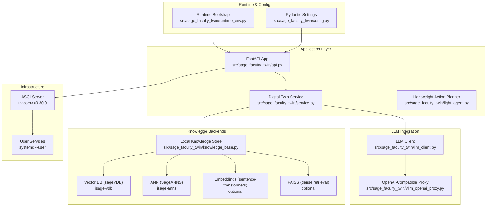
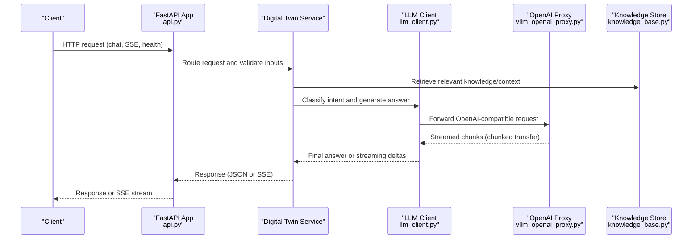
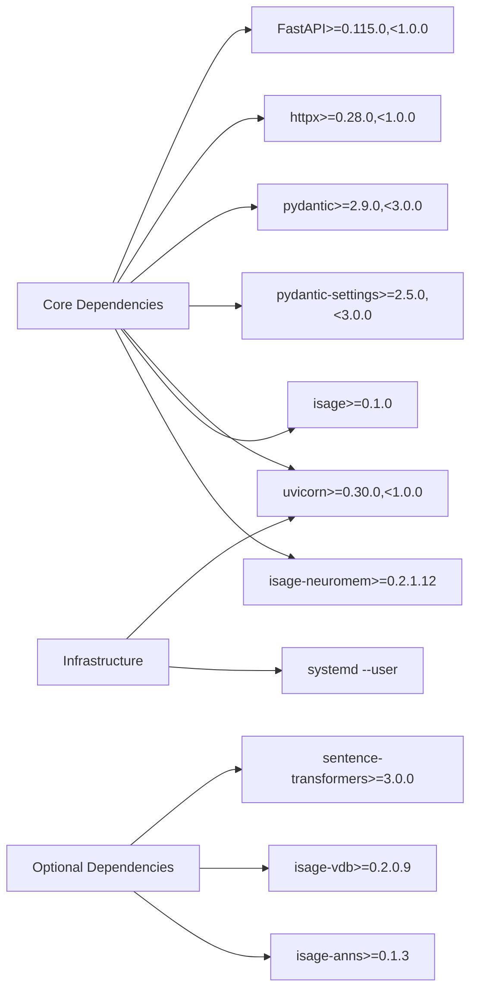

# Technology Stack

<cite>
**Referenced Files in This Document**
- [pyproject.toml](file://pyproject.toml)
- [README.md](file://README.md)
- [docs/deployment.md](file://docs/deployment.md)
- [docs/systemd-runtime-notes.md](file://docs/systemd-runtime-notes.md)
- [src/sage_faculty_twin/__init__.py](file://src/sage_faculty_twin/__init__.py)
- [src/sage_faculty_twin/config.py](file://src/sage_faculty_twin/config.py)
- [src/sage_faculty_twin/runtime_env.py](file://src/sage_faculty_twin/runtime_env.py)
- [src/sage_faculty_twin/api.py](file://src/sage_faculty_twin/api.py)
- [src/sage_faculty_twin/llm_client.py](file://src/sage_faculty_twin/llm_client.py)
- [src/sage_faculty_twin/vllm_openai_proxy.py](file://src/sage_faculty_twin/vllm_openai_proxy.py)
- [src/sage_faculty_twin/knowledge_base.py](file://src/sage_faculty_twin/knowledge_base.py)
- [src/sage_faculty_twin/light_agent.py](file://src/sage_faculty_twin/light_agent.py)
- [deploy/systemd/user/sage-faculty-twin-app.service](file://deploy/systemd/user/sage-faculty-twin-app.service)
</cite>

## Table of Contents
1. [Introduction](#introduction)
2. [Project Structure](#project-structure)
3. [Core Technologies](#core-technologies)
4. [Architecture Overview](#architecture-overview)
5. [Detailed Component Analysis](#detailed-component-analysis)
6. [Dependency Analysis](#dependency-analysis)
7. [Performance Considerations](#performance-considerations)
8. [Troubleshooting Guide](#troubleshooting-guide)
9. [Conclusion](#conclusion)

## Introduction
This document provides a comprehensive technology stack overview for Sage Faculty Twin. It covers the core technologies (FastAPI, SAGE framework, vLLM, Pydantic), optional dependencies (sentence-transformers, FAISS, sageVDB, isage-neuromem), infrastructure dependencies (uvicorn, systemd), and explains the rationale behind version requirements and compatibility matrices. The focus is on practical deployment and runtime behavior, with emphasis on production-grade configurations and operational reliability.

## Project Structure
The repository follows a modular Python package layout with a FastAPI application at the center, integrating with the SAGE framework, vLLM-compatible LLM backends, and optional vector databases and retrieval systems. Key areas:
- Application entrypoints and API routes
- Runtime environment bootstrapping and dependency validation
- LLM client and OpenAI-compatible proxy
- Knowledge base and retrieval backends
- Deployment and systemd service management

**Diagram sources**
- [src/sage_faculty_twin/api.py:1-200](file://src/sage_faculty_twin/api.py#L1-L200)
- [src/sage_faculty_twin/runtime_env.py:102-131](file://src/sage_faculty_twin/runtime_env.py#L102-L131)
- [src/sage_faculty_twin/config.py:9-132](file://src/sage_faculty_twin/config.py#L9-L132)
- [src/sage_faculty_twin/llm_client.py:68-139](file://src/sage_faculty_twin/llm_client.py#L68-L139)
- [src/sage_faculty_twin/vllm_openai_proxy.py:123-257](file://src/sage_faculty_twin/vllm_openai_proxy.py#L123-L257)
- [src/sage_faculty_twin/knowledge_base.py:121-200](file://src/sage_faculty_twin/knowledge_base.py#L121-L200)
- [pyproject.toml:24-34](file://pyproject.toml#L24-L34)
- [docs/deployment.md:20-42](file://docs/deployment.md#L20-L42)
- [deploy/systemd/user/sage-faculty-twin-app.service:6-14](file://deploy/systemd/user/sage-faculty-twin-app.service#L6-L14)

**Section sources**
- [pyproject.toml:5-34](file://pyproject.toml#L5-L34)
- [README.md:12-18](file://README.md#L12-L18)
- [docs/deployment.md:20-42](file://docs/deployment.md#L20-L42)

## Core Technologies
This section documents the core technologies and their version requirements, along with rationale and compatibility considerations.

- FastAPI 0.115.0+
  - Purpose: Web framework powering the API endpoints, routing, dependency injection, and ASGI server integration.
  - Rationale: Enables modern async-first APIs, automatic OpenAPI/Swagger generation, robust request validation, and seamless integration with uvicorn.
  - Compatibility: Requires Python 3.11+ as per project metadata; aligns with uvicorn 0.30.0+ for production deployments.
  - Evidence: Dependencies and project classifiers indicate FastAPI usage and Python 3.11 support.

- vLLM 0.3.0+ (OpenAI-compatible)
  - Purpose: High-throughput LLM inference backend accessed via OpenAI-compatible endpoints.
  - Rationale: Provides efficient token streaming, chunked transfer encoding, and low-latency responses essential for interactive chat experiences.
  - Compatibility: The application expects an OpenAI-compatible interface; streaming and chunked responses are validated during deployment.
  - Evidence: LLM client integrates with OpenAI-compatible endpoints; deployment guide emphasizes streaming and chunked transfer requirements.

- SAGE Framework
  - Purpose: Core orchestration and serving policies for the digital twin, including policy enforcement and runtime integration.
  - Rationale: Ensures consistent behavior across deployments, policy-driven request handling, and integration with upstream LLMs.
  - Compatibility: Requires local source checkout under a sibling directory; runtime validation ensures local policy precedence.
  - Evidence: Runtime bootstrap enforces local policy module presence and validates source availability.

- Pydantic 2.9.0+
  - Purpose: Data validation, serialization, and configuration management using Pydantic models and settings.
  - Rationale: Strong typing, automatic validation, and environment-based configuration loading simplify application setup and reduce errors.
  - Evidence: Settings are defined via Pydantic models with environment prefixes and file-based loading.

**Section sources**
- [pyproject.toml:24-34](file://pyproject.toml#L24-L34)
- [src/sage_faculty_twin/config.py:9-132](file://src/sage_faculty_twin/config.py#L9-L132)
- [src/sage_faculty_twin/runtime_env.py:102-131](file://src/sage_faculty_twin/runtime_env.py#L102-L131)
- [docs/deployment.md:220-264](file://docs/deployment.md#L220-L264)

## Architecture Overview
The system architecture centers around a FastAPI application that orchestrates:
- LLM interactions via an OpenAI-compatible client
- Knowledge retrieval using local storage and optional vector databases
- Lightweight action planning and follow-up suggestions
- Secure and scalable deployment using uvicorn and systemd

**Diagram sources**
- [src/sage_faculty_twin/api.py:90-120](file://src/sage_faculty_twin/api.py#L90-L120)
- [src/sage_faculty_twin/llm_client.py:68-139](file://src/sage_faculty_twin/llm_client.py#L68-L139)
- [src/sage_faculty_twin/vllm_openai_proxy.py:170-257](file://src/sage_faculty_twin/vllm_openai_proxy.py#L170-L257)
- [src/sage_faculty_twin/knowledge_base.py:121-200](file://src/sage_faculty_twin/knowledge_base.py#L121-L200)

## Detailed Component Analysis

### FastAPI Application
- Role: Central API gateway exposing endpoints for chat, SSE streaming, health checks, and static assets.
- Features:
  - CORS configuration for local development
  - Streaming responses for per-token updates
  - Lazy initialization of the digital twin service to defer expensive setup
  - Environment-driven configuration for timeouts, streaming, and attachment limits
- Production considerations:
  - Streaming requires chunked transfer encoding from upstream; otherwise SSE will fail.
  - Timeout budgets must be tuned to account for Cloudflare’s edge timeout constraints.

**Section sources**
- [src/sage_faculty_twin/api.py:79-120](file://src/sage_faculty_twin/api.py#L79-L120)
- [src/sage_faculty_twin/api.py:170-200](file://src/sage_faculty_twin/api.py#L170-L200)
- [docs/deployment.md:159-185](file://docs/deployment.md#L159-L185)

### LLM Client and Policy Integration
- Role: Encapsulates LLM interactions, intent classification, caching, and metrics.
- Key capabilities:
  - OpenAI-compatible chat completions with streaming support
  - Intent classification using a dedicated smaller model
  - Semantic caching and prefix cache metrics integration
  - Serving policy application for request prioritization and deadlines
- Compatibility:
  - Validates upstream model support for reasoning token budgets
  - Supports fallbacks when upstream features are unavailable

**Section sources**
- [src/sage_faculty_twin/llm_client.py:68-139](file://src/sage_faculty_twin/llm_client.py#L68-L139)
- [src/sage_faculty_twin/llm_client.py:345-415](file://src/sage_faculty_twin/llm_client.py#L345-L415)
- [src/sage_faculty_twin/llm_client.py:599-758](file://src/sage_faculty_twin/llm_client.py#L599-L758)

### OpenAI-Compatible Proxy
- Role: Adds authentication and optional upstream API key forwarding to a vLLM-compatible endpoint.
- Features:
  - Path prefix mapping and header normalization
  - Streaming passthrough for SSE compatibility
  - Health endpoint and runtime settings validation
- Production considerations:
  - Requires a real API key; otherwise startup validation fails.
  - Validates upstream base URL and path prefix correctness.

**Section sources**
- [src/sage_faculty_twin/vllm_openai_proxy.py:36-66](file://src/sage_faculty_twin/vllm_openai_proxy.py#L36-L66)
- [src/sage_faculty_twin/vllm_openai_proxy.py:170-257](file://src/sage_faculty_twin/vllm_openai_proxy.py#L170-L257)

### Knowledge Base and Retrieval Backends
- Role: Manages local knowledge documents and integrates with vector databases and embeddings.
- Options:
  - sageVDB: Vector database with optional ANN backends (FAISS/HNSW)
  - sentence-transformers: Dense embeddings for FAISS-based retrieval
  - Neuromem: Lexical BM25 or FAISS-based dense retrieval
- Embedding backends:
  - HashingTextEmbedder: Deterministic hashing-based embeddings
  - SentenceTransformerTextEmbedder: Model-based embeddings
  - NeuromemBgeEmbedder: BAAI BGE embeddings for FAISS

**Section sources**
- [src/sage_faculty_twin/knowledge_base.py:18-119](file://src/sage_faculty_twin/knowledge_base.py#L18-L119)
- [src/sage_faculty_twin/knowledge_base.py:121-200](file://src/sage_faculty_twin/knowledge_base.py#L121-L200)
- [pyproject.toml:36-52](file://pyproject.toml#L36-L52)

### Lightweight Action Planner
- Role: Generates follow-up actions based on intent, knowledge hits, and availability schedules.
- Behavior:
  - Recommends reading materials, todo reviews, and office hour slots
  - Deduplicates and truncates outputs for concise UI presentation

**Section sources**
- [src/sage_faculty_twin/light_agent.py:21-107](file://src/sage_faculty_twin/light_agent.py#L21-L107)

### Runtime Environment and Bootstrapping
- Role: Prepares the Python path, validates optional dependencies, and ensures local policy precedence.
- Checks:
  - Prepend sibling directories to PYTHONPATH for SAGE, neuromem, and sageVDB
  - Validate sageVDB source availability and compiled extension presence
  - Ensure local policy module is loaded from the expected source

**Section sources**
- [src/sage_faculty_twin/runtime_env.py:13-31](file://src/sage_faculty_twin/runtime_env.py#L13-L31)
- [src/sage_faculty_twin/runtime_env.py:59-91](file://src/sage_faculty_twin/runtime_env.py#L59-L91)
- [src/sage_faculty_twin/runtime_env.py:102-131](file://src/sage_faculty_twin/runtime_env.py#L102-L131)

## Dependency Analysis
This section outlines core and optional dependencies, their roles, and compatibility constraints.

- Core Dependencies
  - FastAPI 0.115.0+: Web framework and ASGI server integration
  - httpx 0.28.0+: HTTP client for LLM and proxy integrations
  - Pydantic 2.9.0+: Data validation and configuration models
  - Pydantic Settings 2.5.0+: Environment-based settings loading
  - pypdf 5.5.0+: PDF parsing for chat attachments
  - uvicorn 0.30.0+: ASGI server for production deployments
  - isage 0.1.0+: SAGE framework integration
  - isage-neuromem 0.2.1.12+: Neuromem integration

- Optional Dependencies
  - sentence-transformers 3.0.0+: Dense embeddings for FAISS retrieval
  - FAISS (via isage-vdb): Approximate nearest neighbor search backend
  - isage-vdb 0.2.0.9: Vector database library
  - isage-anns 0.1.3: Pure-Python ANN utilities

- Infrastructure Dependencies
  - uvicorn 0.30.0+: ASGI server for FastAPI
  - systemd --user: Persistent user services for app, site proxy, and optional tunnel/proxy

**Diagram sources**
- [pyproject.toml:24-52](file://pyproject.toml#L24-L52)
- [docs/deployment.md:62-88](file://docs/deployment.md#L62-L88)

**Section sources**
- [pyproject.toml:24-52](file://pyproject.toml#L24-L52)
- [docs/deployment.md:62-88](file://docs/deployment.md#L62-L88)

## Performance Considerations
- Streaming and Chunked Transfer
  - Streaming requires upstream OpenAI-compatible endpoints to emit chunked transfer encoding. The deployment guide provides verification steps and remediation for non-chunked responses.
- Timeout Budgets
  - Application-level timeouts are configurable and must remain below Cloudflare’s edge timeout limits. Tuning upstream LLM timeouts before request-level timeouts is recommended.
- Caching and Metrics
  - The LLM client maintains response caches and vLLM metrics to optimize throughput and latency. Prefix cache hit rates and token throughput are exposed for observability.
- Vector Database Backends
  - Dense retrieval with sentence-transformers and FAISS can improve recall but adds computational overhead. Dimensionality and algorithm selection impact performance and memory usage.

[No sources needed since this section provides general guidance]

## Troubleshooting Guide
- Module Import Issues
  - Ensure the repository root and sibling directories (SAGE, neuromem, sageVDB) are on PYTHONPATH. The runtime bootstrap script prepends these paths automatically.
- Missing Compiled Extensions
  - If sageVDB is sourced locally, compiled shared libraries must be linked; otherwise, the module may expose an empty API surface. Use the provided script to link shared libraries.
- Local Policy Precedence
  - The runtime validates that the policy module is loaded from the local SAGE checkout to avoid accidental overrides by system-installed packages.
- Streaming Not Working
  - Verify upstream LLM responds with chunked transfer encoding and HTTP/1.1. Adjust proxy protocol settings if necessary.
- systemd Service Management
  - Use the provided management scripts to install and start user services. Optional services (tunnel, proxy) can be included via flags.

**Section sources**
- [src/sage_faculty_twin/runtime_env.py:13-31](file://src/sage_faculty_twin/runtime_env.py#L13-L31)
- [src/sage_faculty_twin/runtime_env.py:59-91](file://src/sage_faculty_twin/runtime_env.py#L59-L91)
- [docs/deployment.md:220-264](file://docs/deployment.md#L220-L264)
- [docs/systemd-runtime-notes.md:6-26](file://docs/systemd-runtime-notes.md#L6-L26)

## Conclusion
Sage Faculty Twin combines FastAPI, the SAGE framework, and vLLM-compatible LLMs to deliver a responsive, policy-aware digital twin. Core dependencies enforce strong typing and environment-driven configuration, while optional components like sentence-transformers, FAISS, and sageVDB enable scalable retrieval. Production readiness is ensured through uvicorn-based deployments, systemd user services, and rigorous runtime validation. Adhering to streaming and timeout guidelines, and maintaining local policy and dependency precedence, guarantees reliable operation in diverse environments.