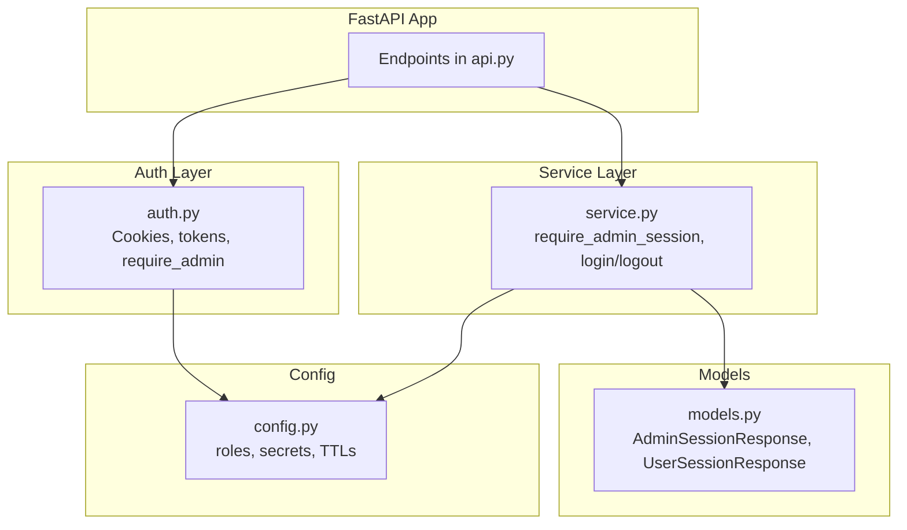
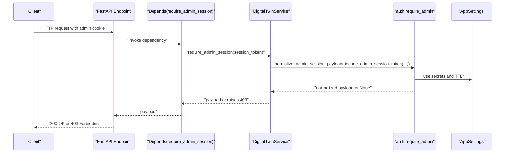
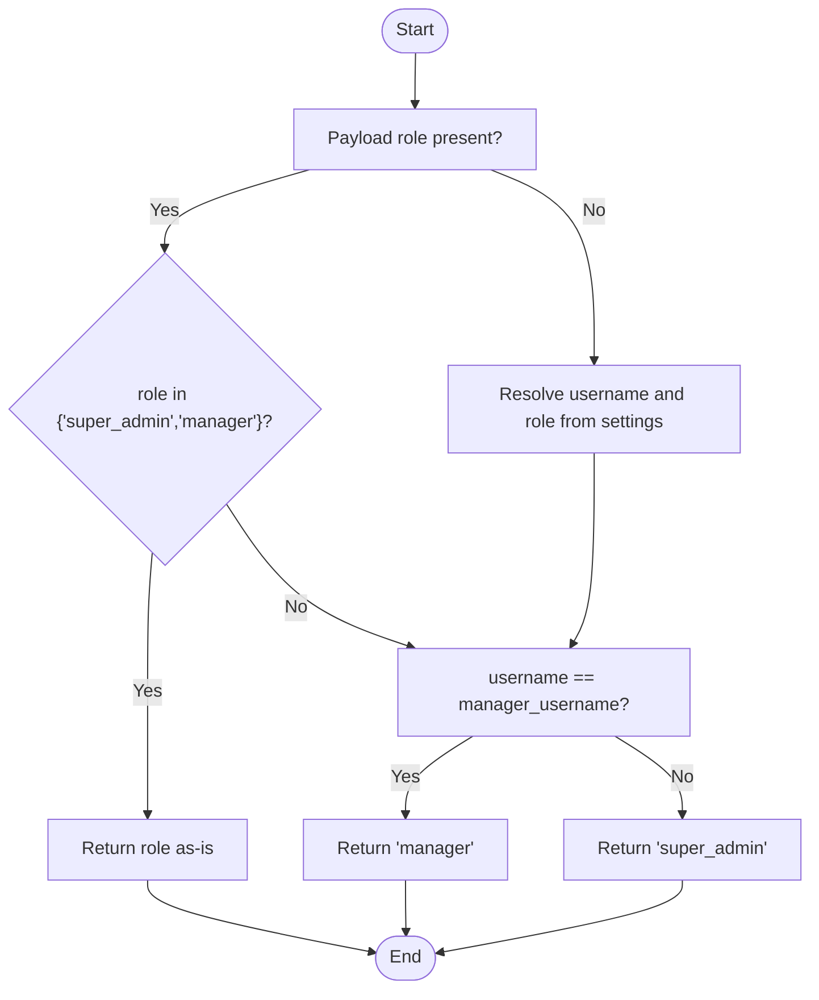
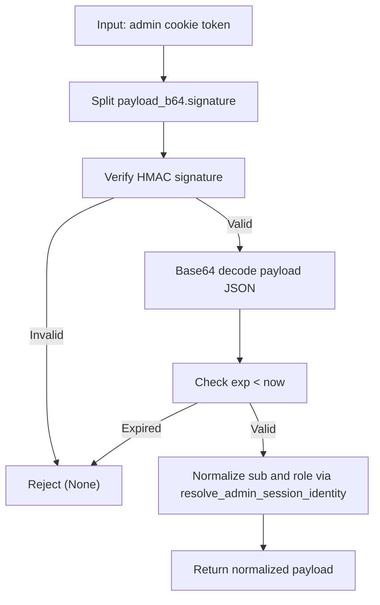
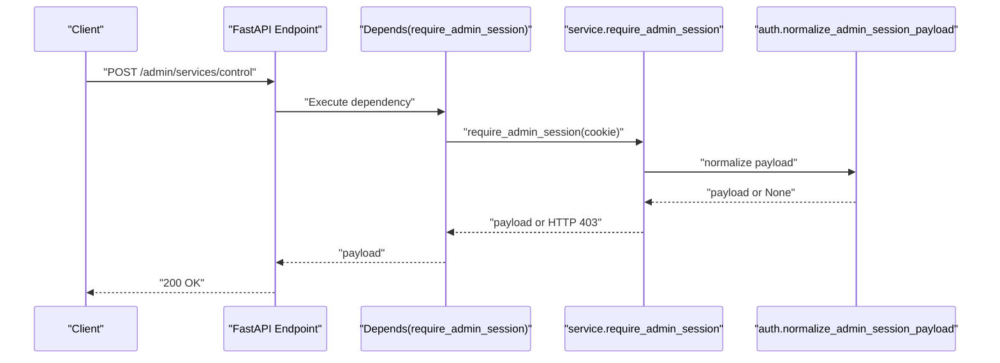
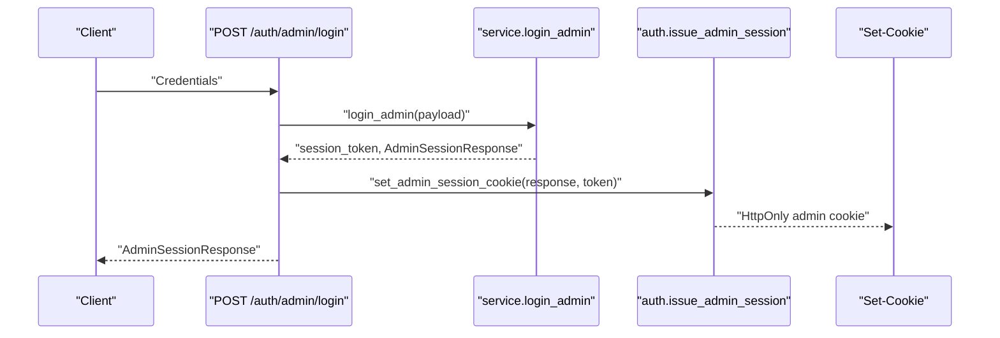
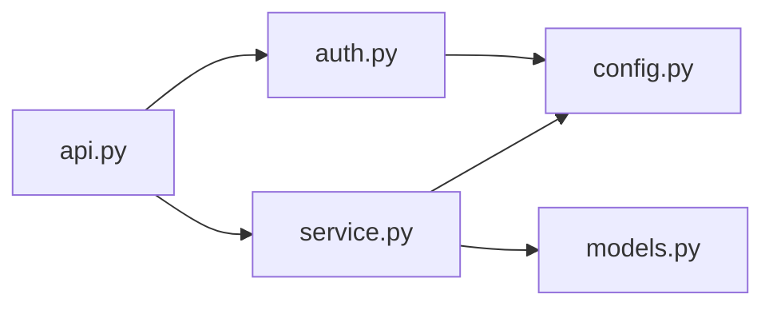

# Access Control

<cite>
**Referenced Files in This Document**
- [auth.py](file://src/sage_faculty_twin/auth.py)
- [api.py](file://src/sage_faculty_twin/api.py)
- [service.py](file://src/sage_faculty_twin/service.py)
- [config.py](file://src/sage_faculty_twin/config.py)
- [models.py](file://src/sage_faculty_twin/models.py)
</cite>

## Table of Contents
1. [Introduction](#introduction)
2. [Project Structure](#project-structure)
3. [Core Components](#core-components)
4. [Architecture Overview](#architecture-overview)
5. [Detailed Component Analysis](#detailed-component-analysis)
6. [Dependency Analysis](#dependency-analysis)
7. [Performance Considerations](#performance-considerations)
8. [Troubleshooting Guide](#troubleshooting-guide)
9. [Conclusion](#conclusion)

## Introduction
This document explains the access control mechanisms implemented in the application. It covers role-based permissions, endpoint-level authorization, middleware-based validation, session payload normalization, and privilege escalation rules. It also documents how FastAPI dependency injection and request validation integrate with the access control system, and provides examples of protected endpoints and enforcement points.

## Project Structure
Access control spans three primary modules:
- Authentication and session management: [auth.py](file://src/sage_faculty_twin/auth.py)
- Endpoint orchestration and dependency injection: [api.py](file://src/sage_faculty_twin/api.py)
- Business logic and session validation: [service.py](file://src/sage_faculty_twin/service.py)
- Configuration and roles: [config.py](file://src/sage_faculty_twin/config.py)
- Session models: [models.py](file://src/sage_faculty_twin/models.py)

**Diagram sources**
- [api.py:422-424](file://src/sage_faculty_twin/api.py#L422-L424)
- [auth.py:119-129](file://src/sage_faculty_twin/auth.py#L119-L129)
- [service.py:2683-2693](file://src/sage_faculty_twin/service.py#L2683-L2693)
- [config.py:121-128](file://src/sage_faculty_twin/config.py#L121-L128)
- [models.py:756-762](file://src/sage_faculty_twin/models.py#L756-L762)

**Section sources**
- [api.py:422-424](file://src/sage_faculty_twin/api.py#L422-L424)
- [auth.py:119-129](file://src/sage_faculty_twin/auth.py#L119-L129)
- [service.py:2683-2693](file://src/sage_faculty_twin/service.py#L2683-L2693)
- [config.py:121-128](file://src/sage_faculty_twin/config.py#L121-L128)
- [models.py:756-762](file://src/sage_faculty_twin/models.py#L756-L762)

## Core Components
- Admin session cookie and token lifecycle:
  - Build and sign admin session tokens with HMAC-SHA256 and encode payload compactly.
  - Set cookies with HttpOnly, SameSite lax, and configurable TTL.
  - Decode and validate signatures, expiration, and payload shape.
- Admin identity resolution and privilege escalation:
  - Normalize roles to “super_admin” or “manager” based on payload or configured usernames.
  - Enforce strict 403 when no valid admin session is present.
- Endpoint-level authorization:
  - FastAPI Depends on a dependency that validates admin session and returns normalized payload.
  - Protected routes enforce authorization via dependency injection.
- User session management:
  - Similar token and cookie lifecycle for user sessions.
- Configuration-driven roles and secrets:
  - Admin and manager credentials, role constants, session secrets, and TTLs.

Key implementation references:
- Admin token encode/decode and cookie helpers: [auth.py:182-214](file://src/sage_faculty_twin/auth.py#L182-L214), [auth.py:57-86](file://src/sage_faculty_twin/auth.py#L57-L86)
- Admin session validation and normalization: [auth.py:119-155](file://src/sage_faculty_twin/auth.py#L119-L155)
- Identity resolution and escalation: [auth.py:132-142](file://src/sage_faculty_twin/auth.py#L132-L142)
- Endpoint dependency and protected routes: [api.py:422-424](file://src/sage_faculty_twin/api.py#L422-L424), [api.py:461-477](file://src/sage_faculty_twin/api.py#L461-L477), [api.py:574-594](file://src/sage_faculty_twin/api.py#L574-L594)
- Service-side validation and login/logout: [service.py:2683-2693](file://src/sage_faculty_twin/service.py#L2683-L2693), [service.py:2695-2717](file://src/sage_faculty_twin/service.py#L2695-L2717)
- Session models: [models.py:756-762](file://src/sage_faculty_twin/models.py#L756-L762)
- Config roles and secrets: [config.py:121-128](file://src/sage_faculty_twin/config.py#L121-L128)

**Section sources**
- [auth.py:57-86](file://src/sage_faculty_twin/auth.py#L57-L86)
- [auth.py:119-155](file://src/sage_faculty_twin/auth.py#L119-L155)
- [auth.py:132-142](file://src/sage_faculty_twin/auth.py#L132-L142)
- [auth.py:182-214](file://src/sage_faculty_twin/auth.py#L182-L214)
- [api.py:422-424](file://src/sage_faculty_twin/api.py#L422-L424)
- [api.py:461-477](file://src/sage_faculty_twin/api.py#L461-L477)
- [api.py:574-594](file://src/sage_faculty_twin/api.py#L574-L594)
- [service.py:2683-2693](file://src/sage_faculty_twin/service.py#L2683-L2693)
- [service.py:2695-2717](file://src/sage_faculty_twin/service.py#L2695-L2717)
- [models.py:756-762](file://src/sage_faculty_twin/models.py#L756-L762)
- [config.py:121-128](file://src/sage_faculty_twin/config.py#L121-L128)

## Architecture Overview
The access control architecture enforces admin-only access using a layered approach:
- Transport-level: HttpOnly cookies carry signed JWT-like payloads for admin sessions.
- Validation-level: FastAPI Depends invokes a validator that decodes, verifies, normalizes, and returns the session payload.
- Authorization-level: Routes decorated with the dependency are enforced admin-only.
- Privilege escalation: Identity resolution maps raw roles and usernames to effective roles.

**Diagram sources**
- [api.py:422-424](file://src/sage_faculty_twin/api.py#L422-L424)
- [service.py:2683-2693](file://src/sage_faculty_twin/service.py#L2683-L2693)
- [auth.py:119-155](file://src/sage_faculty_twin/auth.py#L119-L155)
- [config.py:121-128](file://src/sage_faculty_twin/config.py#L121-L128)

## Detailed Component Analysis

### Role-Based Permissions and Privilege Escalation
- Roles:
  - super_admin: highest privilege.
  - manager: administrative role with specific capabilities.
- Escalation rules:
  - If role is “super_admin” or “manager”, preserve it.
  - If username equals configured manager username, escalate to “manager”.
  - Otherwise, escalate to “super_admin”.

**Diagram sources**
- [auth.py:132-142](file://src/sage_faculty_twin/auth.py#L132-L142)
- [config.py:121-124](file://src/sage_faculty_twin/config.py#L121-L124)

**Section sources**
- [auth.py:132-142](file://src/sage_faculty_twin/auth.py#L132-L142)
- [config.py:121-124](file://src/sage_faculty_twin/config.py#L121-L124)

### Session Payload Normalization
- Purpose: Ensure consistent identity and role fields for downstream logic.
- Process:
  - Decode cookie token with HMAC verification and expiration check.
  - Normalize “sub” and “role” fields using identity resolution.
  - Reject expired or tampered tokens.

**Diagram sources**
- [auth.py:193-214](file://src/sage_faculty_twin/auth.py#L193-L214)
- [auth.py:145-155](file://src/sage_faculty_twin/auth.py#L145-L155)
- [auth.py:132-142](file://src/sage_faculty_twin/auth.py#L132-L142)

**Section sources**
- [auth.py:145-155](file://src/sage_faculty_twin/auth.py#L145-L155)
- [auth.py:193-214](file://src/sage_faculty_twin/auth.py#L193-L214)

### Middleware-Based Access Validation and FastAPI Integration
- FastAPI dependency:
  - A dependency function extracts the admin cookie, calls service.require_admin_session, and returns the normalized payload.
- Route protection:
  - Endpoints requiring admin access use Depends(require_admin_session) to enforce authorization.
- Request validation:
  - Requests are validated using Pydantic models before access control checks.

**Diagram sources**
- [api.py:422-424](file://src/sage_faculty_twin/api.py#L422-L424)
- [service.py:2683-2693](file://src/sage_faculty_twin/service.py#L2683-L2693)
- [auth.py:119-129](file://src/sage_faculty_twin/auth.py#L119-L129)

**Section sources**
- [api.py:422-424](file://src/sage_faculty_twin/api.py#L422-L424)
- [service.py:2683-2693](file://src/sage_faculty_twin/service.py#L2683-L2693)
- [auth.py:119-129](file://src/sage_faculty_twin/auth.py#L119-L129)

### Protected Endpoints and Access Patterns
Examples of admin-protected endpoints:
- List managed services: GET /admin/services
- Control managed services: POST /admin/services/{action}
- Get/update availability schedule: GET /availability, PUT /availability
- Get previous week template: GET /availability/previous-week
- Knowledge management: POST/DELETE/PATCH /knowledge/*
- Reviews summary: GET /knowledge/reviews/summary

These endpoints use Depends(require_admin_session) to enforce admin-only access.

**Section sources**
- [api.py:461-477](file://src/sage_faculty_twin/api.py#L461-L477)
- [api.py:574-594](file://src/sage_faculty_twin/api.py#L574-L594)
- [api.py:764-799](file://src/sage_faculty_twin/api.py#L764-L799)

### Admin Login and Session Lifecycle
- Login:
  - Validates credentials against configured accounts.
  - Issues an admin session token and sets HttpOnly cookie.
- Logout:
  - Clears admin session cookie and returns guest-like session state.

**Diagram sources**
- [api.py:479-483](file://src/sage_faculty_twin/api.py#L479-L483)
- [service.py:2695-2710](file://src/sage_faculty_twin/service.py#L2695-L2710)
- [auth.py:102-111](file://src/sage_faculty_twin/auth.py#L102-L111)

**Section sources**
- [api.py:479-483](file://src/sage_faculty_twin/api.py#L479-L483)
- [service.py:2695-2710](file://src/sage_faculty_twin/service.py#L2695-L2710)
- [auth.py:102-111](file://src/sage_faculty_twin/auth.py#L102-L111)

### Session Models
- AdminSessionResponse: Indicates whether the current request is authenticated as admin and carries username and role.
- UserSessionResponse: Indicates user authentication state and account details.

**Section sources**
- [models.py:756-762](file://src/sage_faculty_twin/models.py#L756-L762)

## Dependency Analysis
Access control depends on:
- auth.py for token encoding/decoding, cookie management, and require_admin.
- service.py for require_admin_session and login/logout flows.
- config.py for role definitions, secrets, and TTLs.
- api.py for FastAPI dependency wiring and route protection.

**Diagram sources**
- [api.py:22-29](file://src/sage_faculty_twin/api.py#L22-L29)
- [auth.py:119-129](file://src/sage_faculty_twin/auth.py#L119-L129)
- [service.py:2683-2693](file://src/sage_faculty_twin/service.py#L2683-L2693)
- [config.py:121-128](file://src/sage_faculty_twin/config.py#L121-L128)
- [models.py:756-762](file://src/sage_faculty_twin/models.py#L756-L762)

**Section sources**
- [api.py:22-29](file://src/sage_faculty_twin/api.py#L22-L29)
- [auth.py:119-129](file://src/sage_faculty_twin/auth.py#L119-L129)
- [service.py:2683-2693](file://src/sage_faculty_twin/service.py#L2683-L2693)
- [config.py:121-128](file://src/sage_faculty_twin/config.py#L121-L128)
- [models.py:756-762](file://src/sage_faculty_twin/models.py#L756-L762)

## Performance Considerations
- Token verification is O(1) per request: HMAC constant-time compare and bounded JSON parse.
- Cookies are small and compact; minimal overhead.
- Expiration check prevents replay attacks without additional database lookups.
- FastAPI dependency ensures early exit on invalid sessions, reducing downstream work.

## Troubleshooting Guide
Common issues and resolutions:
- 403 Forbidden on admin endpoints:
  - Cause: Missing or invalid admin cookie; token signature mismatch or expiration.
  - Resolution: Re-authenticate via /auth/admin/login; ensure cookies are HttpOnly and SameSite lax.
- Unexpected role escalation:
  - Cause: Username matches configured manager username; role not provided in token.
  - Resolution: Verify admin_username/manager_username in configuration and ensure tokens include role when required.
- Session not recognized:
  - Cause: Wrong admin_session_secret or mismatched environment.
  - Resolution: Confirm DIGITAL_TWIN_ADMIN_SESSION_SECRET and DIGITAL_TWIN_ADMIN_SESSION_TTL_SECONDS align across instances.

**Section sources**
- [auth.py:119-129](file://src/sage_faculty_twin/auth.py#L119-L129)
- [auth.py:193-214](file://src/sage_faculty_twin/auth.py#L193-L214)
- [config.py:121-128](file://src/sage_faculty_twin/config.py#L121-L128)

## Conclusion
The application enforces robust admin-only access using signed session cookies, normalized payloads, and FastAPI dependency injection. Privilege escalation is explicit and controlled by configuration. The design balances security, simplicity, and maintainability, with clear separation of concerns across auth, service, and API layers.