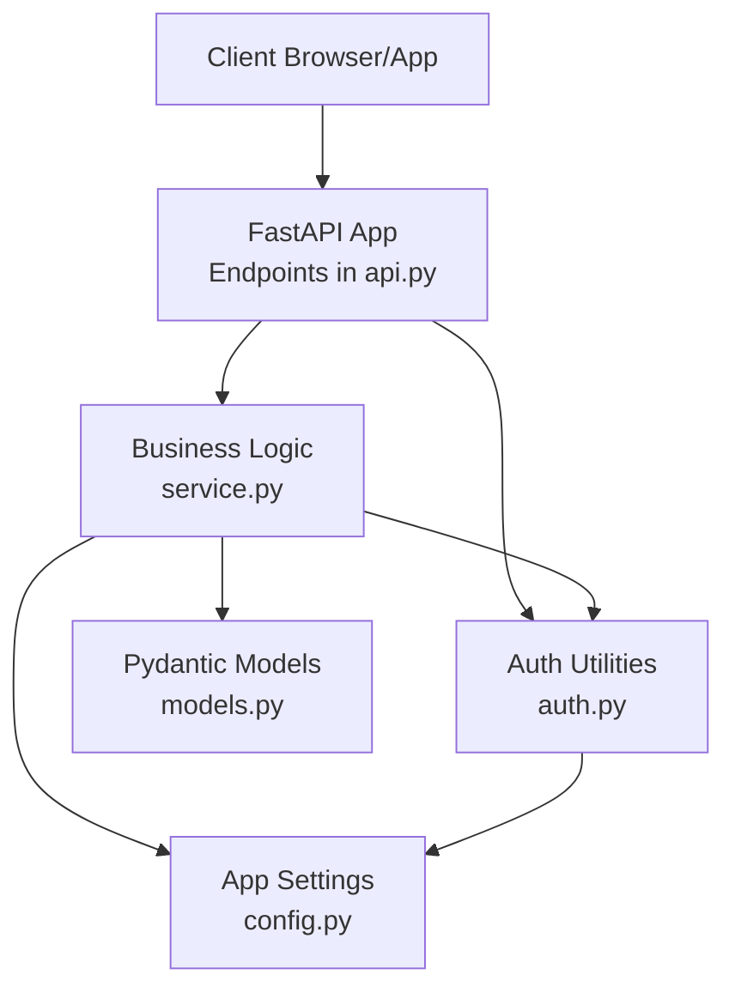
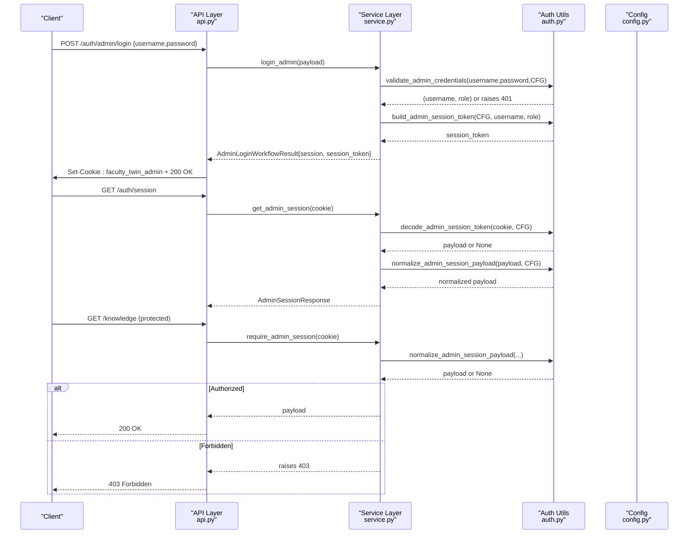
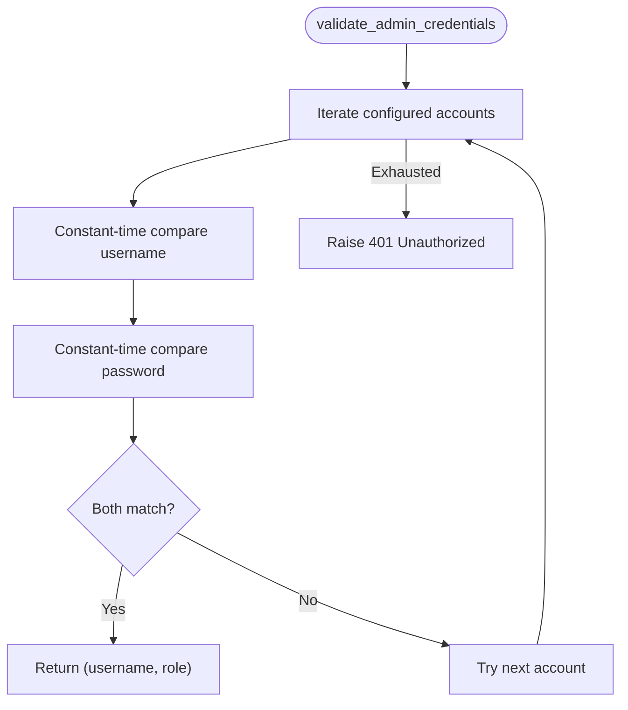
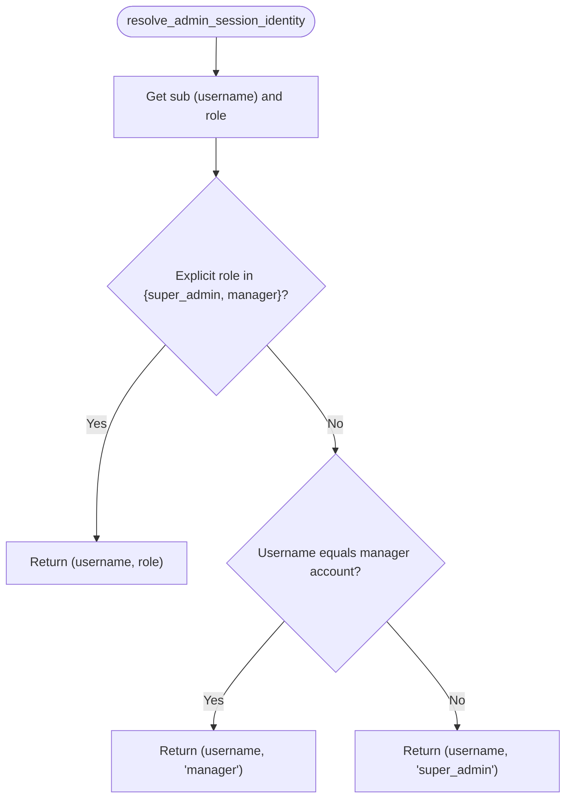
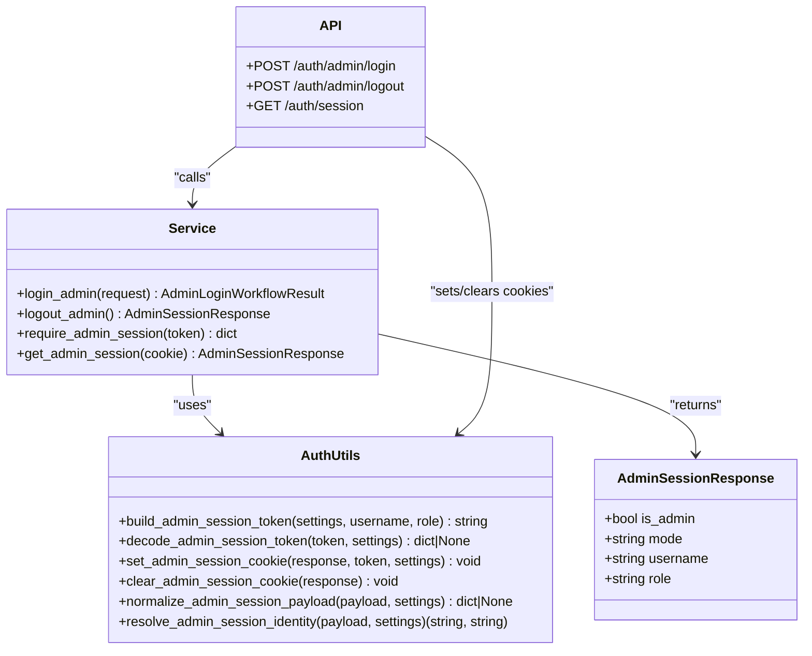
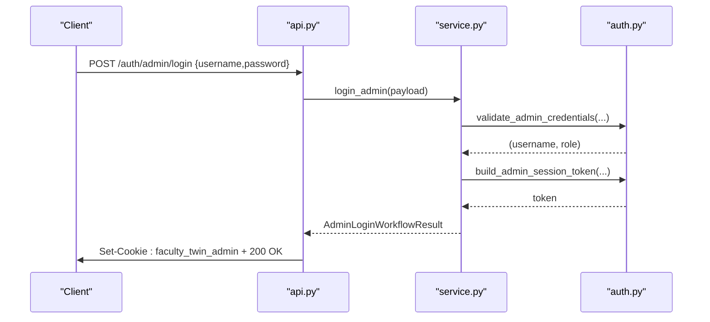
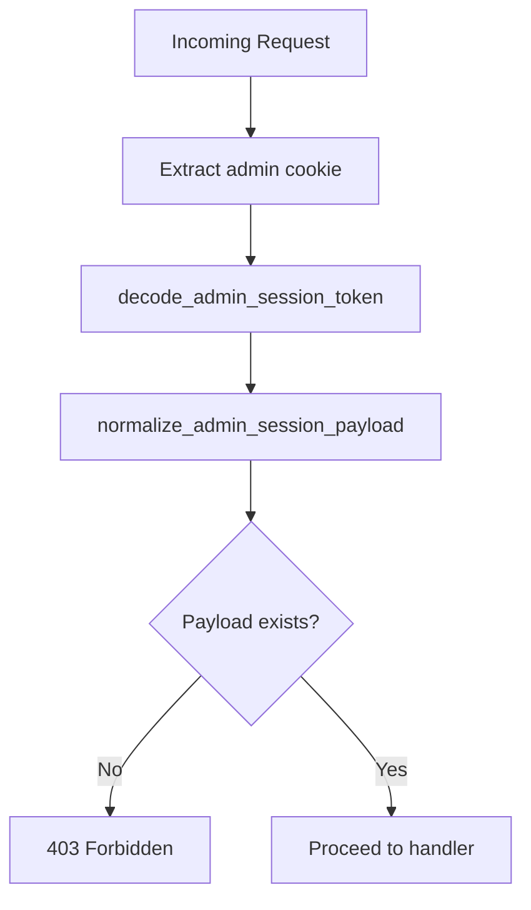
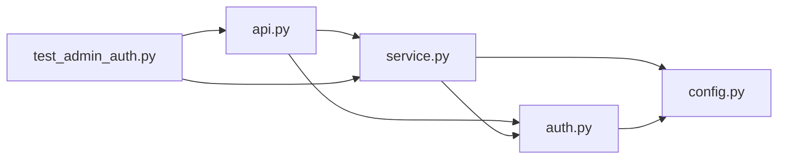

# Admin Authentication

<cite>
**Referenced Files in This Document**
- [auth.py](file://src/sage_faculty_twin/auth.py)
- [api.py](file://src/sage_faculty_twin/api.py)
- [service.py](file://src/sage_faculty_twin/service.py)
- [config.py](file://src/sage_faculty_twin/config.py)
- [models.py](file://src/sage_faculty_twin/models.py)
- [test_admin_auth.py](file://tests/test_admin_auth.py)
</cite>

## Table of Contents
1. [Introduction](#introduction)
2. [Project Structure](#project-structure)
3. [Core Components](#core-components)
4. [Architecture Overview](#architecture-overview)
5. [Detailed Component Analysis](#detailed-component-analysis)
6. [Dependency Analysis](#dependency-analysis)
7. [Performance Considerations](#performance-considerations)
8. [Troubleshooting Guide](#troubleshooting-guide)
9. [Conclusion](#conclusion)

## Introduction
This document describes the admin authentication system, covering credential validation, role-based access control (super_admin vs manager), administrative session management, and administrative endpoint authorization. It explains the admin login process, constant-time credential comparison, session privilege resolution, configuration requirements, and security policies. Administrative endpoints protected by admin sessions are documented along with authorization checks and privilege scopes.

## Project Structure
The admin authentication system spans several modules:
- Authentication primitives and session cookies: [auth.py](file://src/sage_faculty_twin/auth.py)
- API endpoints and dependency injection: [api.py](file://src/sage_faculty_twin/api.py)
- Business logic and authorization enforcement: [service.py](file://src/sage_faculty_twin/service.py)
- Application configuration and admin credentials: [config.py](file://src/sage_faculty_twin/config.py)
- Data models for admin session responses: [models.py](file://src/sage_faculty_twin/models.py)
- Behavioral tests validating admin flows: [test_admin_auth.py](file://tests/test_admin_auth.py)

**Diagram sources**
- [api.py:422-490](file://src/sage_faculty_twin/api.py#L422-L490)
- [auth.py:16-214](file://src/sage_faculty_twin/auth.py#L16-L214)
- [service.py:2683-2713](file://src/sage_faculty_twin/service.py#L2683-L2713)
- [config.py:9-132](file://src/sage_faculty_twin/config.py#L9-L132)
- [models.py:763-768](file://src/sage_faculty_twin/models.py#L763-L768)

**Section sources**
- [auth.py:1-214](file://src/sage_faculty_twin/auth.py#L1-L214)
- [api.py:422-490](file://src/sage_faculty_twin/api.py#L422-L490)
- [service.py:2683-2713](file://src/sage_faculty_twin/service.py#L2683-L2713)
- [config.py:9-132](file://src/sage_faculty_twin/config.py#L9-L132)
- [models.py:763-768](file://src/sage_faculty_twin/models.py#L763-L768)

## Core Components
- Admin session cookie and token lifecycle:
  - Cookie name: "faculty_twin_admin"
  - Token encoding: base64-encoded JSON payload + HMAC-SHA256 signature
  - Expiration enforced by token payload "exp"
  - Issuance and clearing handled by [auth.py:57-116](file://src/sage_faculty_twin/auth.py#L57-L116)
- Credential validation:
  - Constant-time comparison for username and password using [secrets.compare_digest:158-172](file://src/sage_faculty_twin/auth.py#L158-L172)
  - Admin accounts configured in [config.py:121-128](file://src/sage_faculty_twin/config.py#L121-L128)
- Role resolution:
  - Explicit roles "super_admin" and "manager" preserved
  - Manager privilege derived from username match when role is missing
  - Super_admin default fallback when neither explicit nor manager
  - Resolution logic in [auth.py:132-142](file://src/sage_faculty_twin/auth.py#L132-L142)
- Session identity normalization:
  - Normalization ensures consistent "sub" and "role" fields
  - Implemented in [auth.py:145-155](file://src/sage_faculty_twin/auth.py#L145-L155)
- Endpoint authorization:
  - Protected endpoints depend on [require_admin_session:422-424](file://src/sage_faculty_twin/api.py#L422-L424) or [Depends(require_admin_session):576-586](file://src/sage_faculty_twin/api.py#L576-L586)
  - Business logic enforces via [service.require_admin_session:2683-2693](file://src/sage_faculty_twin/service.py#L2683-L2693)

**Section sources**
- [auth.py:16-214](file://src/sage_faculty_twin/auth.py#L16-L214)
- [config.py:121-128](file://src/sage_faculty_twin/config.py#L121-L128)
- [api.py:422-490](file://src/sage_faculty_twin/api.py#L422-L490)
- [service.py:2683-2693](file://src/sage_faculty_twin/service.py#L2683-L2693)

## Architecture Overview
The admin authentication pipeline integrates FastAPI endpoints, session utilities, and service-layer authorization.

**Diagram sources**
- [api.py:479-490](file://src/sage_faculty_twin/api.py#L479-L490)
- [service.py:2695-2710](file://src/sage_faculty_twin/service.py#L2695-L2710)
- [auth.py:158-214](file://src/sage_faculty_twin/auth.py#L158-L214)
- [config.py:121-128](file://src/sage_faculty_twin/config.py#L121-L128)

## Detailed Component Analysis

### Credential Validation and Constant-Time Comparison
- Validation iterates configured admin accounts and compares username/password using constant-time comparison to prevent timing attacks.
- On match, returns the account username and role; otherwise raises 401 Unauthorized.

**Diagram sources**
- [auth.py:158-172](file://src/sage_faculty_twin/auth.py#L158-L172)
- [config.py:121-128](file://src/sage_faculty_twin/config.py#L121-L128)

**Section sources**
- [auth.py:158-172](file://src/sage_faculty_twin/auth.py#L158-L172)
- [config.py:121-128](file://src/sage_faculty_twin/config.py#L121-L128)

### Role-Based Access Control (RBAC)
- Explicit roles:
  - "super_admin": highest privilege
  - "manager": restricted administrative capabilities
- Implicit role resolution:
  - If role is missing but username equals manager account, role becomes "manager"
  - Otherwise, role becomes "super_admin"
- Normalization ensures consistent "sub" and "role" fields for downstream use.

**Diagram sources**
- [auth.py:132-142](file://src/sage_faculty_twin/auth.py#L132-L142)
- [config.py:123-124](file://src/sage_faculty_twin/config.py#L123-L124)

**Section sources**
- [auth.py:132-142](file://src/sage_faculty_twin/auth.py#L132-L142)
- [config.py:121-128](file://src/sage_faculty_twin/config.py#L121-L128)

### Administrative Session Management
- Token structure:
  - Payload includes sub, role, iat, exp, nonce
  - Signature computed via HMAC-SHA256 over base64-encoded payload
- Cookie handling:
  - HttpOnly, SameSite=Lax, configurable TTL, path "/"
  - Clearing removes the cookie
- Session reflection:
  - Endpoint returns AdminSessionResponse indicating is_admin, mode, username, and role

**Diagram sources**
- [models.py:763-768](file://src/sage_faculty_twin/models.py#L763-L768)
- [auth.py:24-116](file://src/sage_faculty_twin/auth.py#L24-L116)
- [api.py:479-490](file://src/sage_faculty_twin/api.py#L479-L490)
- [service.py:2695-2713](file://src/sage_faculty_twin/service.py#L2695-L2713)

**Section sources**
- [auth.py:24-116](file://src/sage_faculty_twin/auth.py#L24-L116)
- [models.py:763-768](file://src/sage_faculty_twin/models.py#L763-L768)
- [api.py:479-490](file://src/sage_faculty_twin/api.py#L479-L490)
- [service.py:2695-2713](file://src/sage_faculty_twin/service.py#L2695-L2713)

### Admin Login Process
- Client posts credentials to /auth/admin/login
- Service validates credentials and builds a signed session token
- API sets HttpOnly admin cookie and returns AdminSessionResponse
- Subsequent requests carry the cookie for protected endpoints

**Diagram sources**
- [api.py:479-483](file://src/sage_faculty_twin/api.py#L479-L483)
- [service.py:2695-2710](file://src/sage_faculty_twin/service.py#L2695-L2710)
- [auth.py:158-172](file://src/sage_faculty_twin/auth.py#L158-L172)

**Section sources**
- [api.py:479-483](file://src/sage_faculty_twin/api.py#L479-L483)
- [service.py:2695-2710](file://src/sage_faculty_twin/service.py#L2695-L2710)
- [auth.py:158-172](file://src/sage_faculty_twin/auth.py#L158-L172)

### Authorization Checks and Protected Endpoints
- Global dependency require_admin_session enforces admin session on protected routes
- Examples include:
  - Knowledge management: GET /knowledge, POST /knowledge, DELETE /knowledge/{id}
  - Availability: GET /availability, PUT /availability, GET /availability/previous-week
  - Analytics and operations: GET /analytics/questions, GET /operations/workbench, GET /workflow/replay
  - Escalations and follow-ups: GET /escalations, POST /escalations/{id}/resolve, GET /follow-ups, POST /follow-ups/dispatch
  - Bookings: GET /bookings, POST /bookings/{id}/confirm, POST /bookings/{id}/reject
  - Services: GET /admin/services, POST /admin/services/{action}

**Diagram sources**
- [api.py:576-586](file://src/sage_faculty_twin/api.py#L576-L586)
- [service.py:2683-2693](file://src/sage_faculty_twin/service.py#L2683-L2693)
- [auth.py:145-155](file://src/sage_faculty_twin/auth.py#L145-L155)

**Section sources**
- [api.py:576-586](file://src/sage_faculty_twin/api.py#L576-L586)
- [service.py:2683-2693](file://src/sage_faculty_twin/service.py#L2683-L2693)
- [auth.py:145-155](file://src/sage_faculty_twin/auth.py#L145-L155)

### Administrative Privileges Scope
- super_admin:
  - Full access to administrative endpoints
  - Can inject knowledge via chat intent and publish knowledge gaps
- manager:
  - Access to administrative search and related operations
  - Cannot perform privileged actions reserved for super_admin

Behavioral tests demonstrate:
- Manager login yields role "manager" and can search knowledge
- Super_admin login yields role "super_admin" and can unlock all admin endpoints

**Section sources**
- [test_admin_auth.py:282-317](file://tests/test_admin_auth.py#L282-L317)
- [test_admin_auth.py:719-756](file://tests/test_admin_auth.py#L719-L756)

## Dependency Analysis
Key dependencies and coupling:
- API depends on Service for business logic and on Auth for cookie/session helpers
- Service depends on Auth for token validation/encoding and on Config for secrets/TTL
- Auth depends on Config for secrets and TTL values
- Tests validate end-to-end flows and RBAC behavior

**Diagram sources**
- [api.py:22-29](file://src/sage_faculty_twin/api.py#L22-L29)
- [service.py:29-37](file://src/sage_faculty_twin/service.py#L29-L37)
- [auth.py:13-14](file://src/sage_faculty_twin/auth.py#L13-L14)
- [config.py:9-15](file://src/sage_faculty_twin/config.py#L9-L15)
- [test_admin_auth.py:8-24](file://tests/test_admin_auth.py#L8-L24)

**Section sources**
- [api.py:22-29](file://src/sage_faculty_twin/api.py#L22-L29)
- [service.py:29-37](file://src/sage_faculty_twin/service.py#L29-L37)
- [auth.py:13-14](file://src/sage_faculty_twin/auth.py#L13-L14)
- [config.py:9-15](file://src/sage_faculty_twin/config.py#L9-L15)
- [test_admin_auth.py:8-24](file://tests/test_admin_auth.py#L8-L24)

## Performance Considerations
- Constant-time comparisons prevent timing-side-channel attacks during credential validation
- Session tokens are compact and validated server-side with minimal overhead
- Cookie TTLs are configured to balance usability and security

## Troubleshooting Guide
Common issues and resolutions:
- 403 Forbidden on admin endpoints:
  - Cause: Missing or invalid admin session cookie
  - Action: Ensure /auth/admin/login succeeded and cookie is present
- 401 Unauthorized on login:
  - Cause: Incorrect username/password or mismatched credentials
  - Action: Verify admin credentials in configuration
- Expired session:
  - Cause: Token "exp" in payload less than current time
  - Action: Re-authenticate to obtain a new session token
- Manager role not recognized:
  - Cause: Username differs from configured manager username
  - Action: Use the configured manager account for manager privileges

**Section sources**
- [auth.py:212-214](file://src/sage_faculty_twin/auth.py#L212-L214)
- [auth.py:158-172](file://src/sage_faculty_twin/auth.py#L158-L172)
- [api.py:422-424](file://src/sage_faculty_twin/api.py#L422-L424)

## Conclusion
The admin authentication system provides robust, constant-time credential validation, clear role-based access control, and secure session management. Admin endpoints are consistently protected through dependency injection and service-layer authorization, ensuring that only authorized administrators can access sensitive administrative functions. Proper configuration of admin credentials and session secrets is essential for maintaining security.