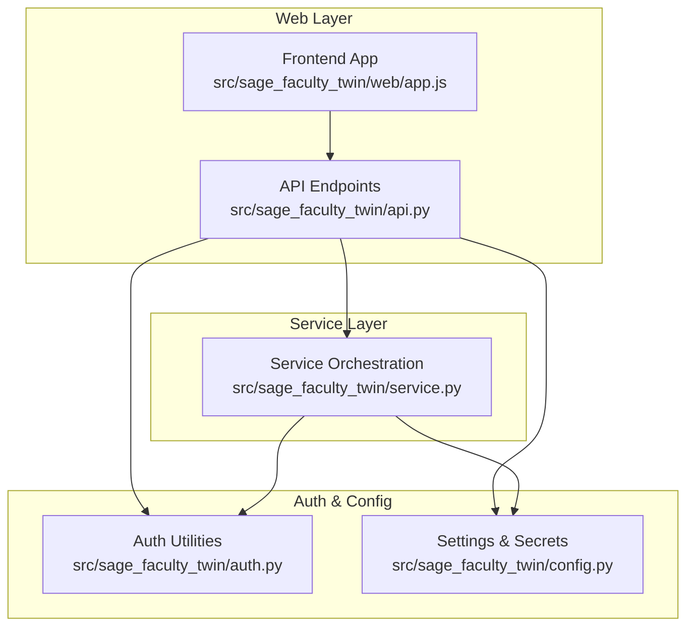
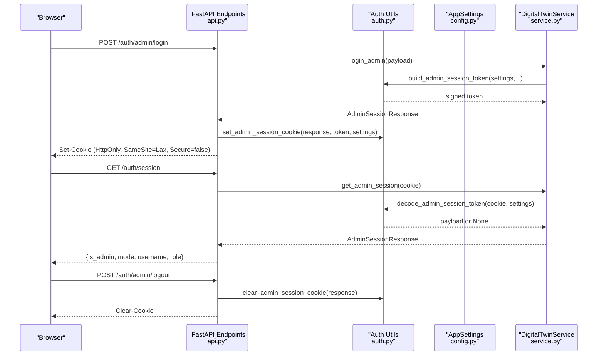
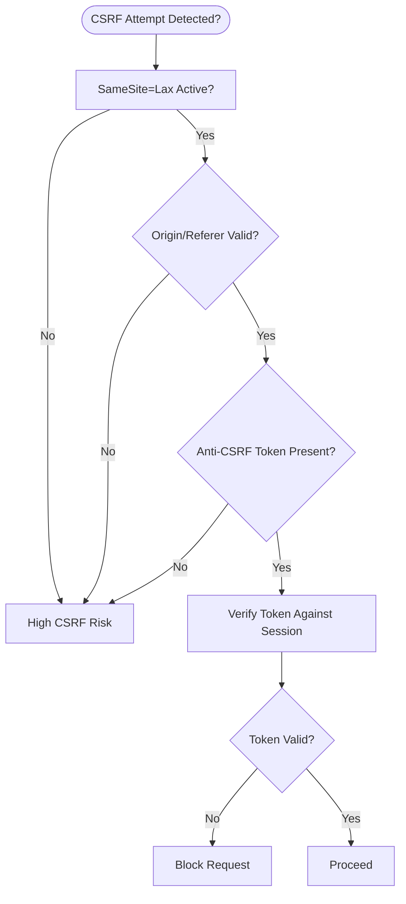
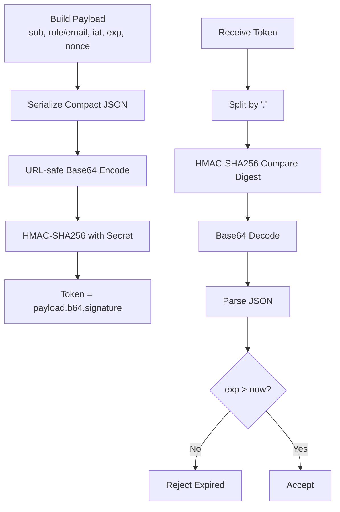
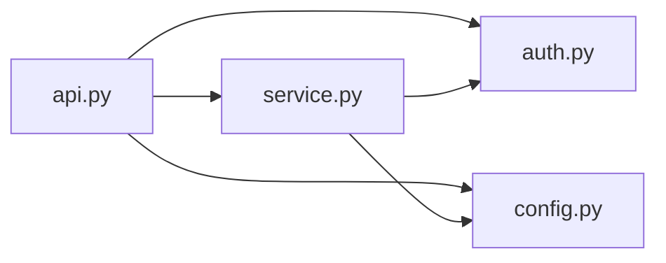

# Security Best Practices

<cite>
**Referenced Files in This Document**
- [auth.py](file://src/sage_faculty_twin/auth.py)
- [config.py](file://src/sage_faculty_twin/config.py)
- [api.py](file://src/sage_faculty_twin/api.py)
- [service.py](file://src/sage_faculty_twin/service.py)
- [runtime_env.py](file://src/sage_faculty_twin/runtime_env.py)
- [app.js](file://src/sage_faculty_twin/web/app.js)
</cite>

## Table of Contents
1. [Introduction](#introduction)
2. [Project Structure](#project-structure)
3. [Core Components](#core-components)
4. [Architecture Overview](#architecture-overview)
5. [Detailed Component Analysis](#detailed-component-analysis)
6. [Dependency Analysis](#dependency-analysis)
7. [Performance Considerations](#performance-considerations)
8. [Troubleshooting Guide](#troubleshooting-guide)
9. [Conclusion](#conclusion)
10. [Appendices](#appendices)

## Introduction
This document provides security best practices and implementation guidelines for the authentication system. It focuses on secure cookie configuration, CSRF protection considerations, session timeout management, and credential storage security. It also includes recommendations for production deployments, environment variable management, and security hardening, along with mitigation strategies for common vulnerabilities and monitoring approaches for suspicious activities.

## Project Structure
The authentication system spans several modules:
- Authentication primitives and cookie helpers
- Application settings and environment configuration
- API endpoints for login/logout and session inspection
- Service layer that orchestrates authentication workflows
- Frontend integration that consumes session state

**Diagram sources**
- [api.py:450-510](file://src/sage_faculty_twin/api.py#L450-L510)
- [auth.py:16-116](file://src/sage_faculty_twin/auth.py#L16-L116)
- [config.py:121-128](file://src/sage_faculty_twin/config.py#L121-L128)
- [service.py:5284-5400](file://src/sage_faculty_twin/service.py#L5284-L5400)
- [app.js:1979-1996](file://src/sage_faculty_twin/web/app.js#L1979-L1996)

**Section sources**
- [api.py:450-510](file://src/sage_faculty_twin/api.py#L450-L510)
- [auth.py:16-116](file://src/sage_faculty_twin/auth.py#L16-L116)
- [config.py:121-128](file://src/sage_faculty_twin/config.py#L121-L128)
- [service.py:5284-5400](file://src/sage_faculty_twin/service.py#L5284-L5400)
- [runtime_env.py:102-131](file://src/sage_faculty_twin/runtime_env.py#L102-L131)
- [app.js:1979-1996](file://src/sage_faculty_twin/web/app.js#L1979-L1996)

## Core Components
- Cookie-based session tokens for admin and user roles
- HMAC-signed cookies with embedded expiration and per-request nonce
- Environment-driven secrets and TTLs
- Session read/write endpoints and logout handlers
- Frontend polling of session state

Key implementation highlights:
- Secure cookie attributes: HttpOnly, SameSite=Lax, and configurable Secure flag
- Token encoding: URL-safe base64 payload + HMAC-SHA256 signature
- Expiration enforcement during decoding
- Nonce inclusion to mitigate token reuse risks
- Environment-based secrets and TTLs for admin and user sessions

**Section sources**
- [auth.py:16-116](file://src/sage_faculty_twin/auth.py#L16-L116)
- [auth.py:182-214](file://src/sage_faculty_twin/auth.py#L182-L214)
- [config.py:121-128](file://src/sage_faculty_twin/config.py#L121-L128)
- [api.py:479-510](file://src/sage_faculty_twin/api.py#L479-L510)
- [service.py:5382-5392](file://src/sage_faculty_twin/service.py#L5382-L5392)

## Architecture Overview
The authentication flow integrates frontend, backend endpoints, and service orchestration.

**Diagram sources**
- [api.py:479-510](file://src/sage_faculty_twin/api.py#L479-L510)
- [auth.py:24-54](file://src/sage_faculty_twin/auth.py#L24-L54)
- [auth.py:57-86](file://src/sage_faculty_twin/auth.py#L57-L86)
- [auth.py:193-214](file://src/sage_faculty_twin/auth.py#L193-L214)
- [config.py:121-128](file://src/sage_faculty_twin/config.py#L121-L128)
- [service.py:5382-5392](file://src/sage_faculty_twin/service.py#L5382-L5392)

## Detailed Component Analysis

### Secure Cookie Configuration
- HttpOnly: Enabled for both admin and user cookies to reduce XSS impact.
- SameSite=Lax: Recommended default for cross-site request scenarios while mitigating CSRF.
- Secure flag: Disabled by default in the current implementation. This is acceptable for development but must be enabled in production behind TLS termination.
- Max-Age: Derived from settings for admin and user session TTLs.
- Path: Root path for broad applicability.

Recommendations:
- Enforce Secure=true in production environments.
- Consider SameSite=Strict for higher-risk endpoints if feasible.
- Use domain scoping and partitioned cookies where supported by clients.
- Implement rolling sessions with periodic re-authentication for long-lived administrative tasks.

**Section sources**
- [auth.py:57-86](file://src/sage_faculty_twin/auth.py#L57-L86)
- [config.py:125-128](file://src/sage_faculty_twin/config.py#L125-L128)

### CSRF Protection Considerations
Current state:
- No built-in CSRF tokens in cookie-based session flow.
- SameSite=Lax reduces risk but does not eliminate CSRF entirely.

Mitigations:
- Add anti-CSRF tokens for state-changing forms and AJAX endpoints.
- Validate referer and origin headers where applicable.
- Implement double-submit cookie pattern alongside SameSite=Lax.
- For SPA usage, ensure CSRF protections align with CORS policies.

[No sources needed since this diagram shows conceptual workflow, not actual code structure]

### Session Timeout Management
- Tokens carry exp claim validated during decoding.
- Cookies configured with max_age equal to TTL.
- Frontend periodically refreshes session state.

Recommendations:
- Enforce server-side TTL checks and automatic logout on expiration.
- Implement idle timeouts and sliding windows for user sessions.
- Add grace period for re-authentication on token expiry.
- Log and notify users before session expiration.

**Section sources**
- [auth.py:24-54](file://src/sage_faculty_twin/auth.py#L24-L54)
- [auth.py:193-214](file://src/sage_faculty_twin/auth.py#L193-L214)
- [config.py:125-128](file://src/sage_faculty_twin/config.py#L125-L128)
- [app.js:1979-1996](file://src/sage_faculty_twin/web/app.js#L1979-L1996)

### Credential Storage Security
- Admin credentials are validated against stored accounts using constant-time comparison.
- Secrets for signing session tokens are environment-driven.
- Passwords are not stored in plaintext; validation compares against configured values.

Recommendations:
- Store hashed credentials using strong, adaptive hashing (bcrypt/scrypt/PBKDF2).
- Rotate secrets regularly and audit access logs.
- Limit exposure of secrets via environment variables and configuration files.
- Use separate secrets for admin and user sessions.

**Section sources**
- [auth.py:158-172](file://src/sage_faculty_twin/auth.py#L158-L172)
- [config.py:121-128](file://src/sage_faculty_twin/config.py#L121-L128)

### Token Encoding and Validation
- Payload is serialized compactly, base64-encoded, and signed with HMAC-SHA256.
- Signature verification uses constant-time comparison.
- Decoding validates expiration and returns structured payload.

Recommendations:
- Use unique per-token nonces to prevent replay attacks.
- Consider JWS/JWT for standardized token handling with aud/iss/exp/nbf.
- Implement token binding (IP, UA) for high-value sessions.
- Add revocation lists or short-lived tokens with refresh mechanisms.

**Diagram sources**
- [auth.py:182-214](file://src/sage_faculty_twin/auth.py#L182-L214)

**Section sources**
- [auth.py:182-214](file://src/sage_faculty_twin/auth.py#L182-L214)

### Production Deployment Recommendations
- TLS termination: Enable Secure=true for cookies and enforce HTTPS.
- Environment isolation: Separate .env files per environment; restrict permissions.
- Secret rotation: Automate rotation and ensure old keys remain valid during transition.
- Network controls: Restrict inbound access to API endpoints; use WAF/OWASP CRS.
- Logging and auditing: Record failed login attempts, session creation/logout, and token validation failures.

**Section sources**
- [config.py:10-15](file://src/sage_faculty_twin/config.py#L10-L15)
- [auth.py:57-86](file://src/sage_faculty_twin/auth.py#L57-L86)

### Environment Variable Management
- Prefix: DIGITAL_TWIN_
- Sensitive keys: admin_session_secret, user_session_secret, admin_password, manager_password
- TTLs: admin_session_ttl_seconds, user_session_ttl_seconds

Recommendations:
- Use encrypted secrets managers (e.g., Vault/KMS).
- Avoid committing secrets to version control; use CI/CD secret injection.
- Validate required variables at startup and fail closed if missing.

**Section sources**
- [config.py:10-15](file://src/sage_faculty_twin/config.py#L10-L15)
- [config.py:121-128](file://src/sage_faculty_twin/config.py#L121-L128)

### Monitoring and Detection
- Track anomalies: burst login attempts, repeated invalid sessions, expired tokens, frequent logout.
- Alert on: multiple failed logins from same IP, session fixation attempts, unexpected SameSite/Secure mismatches.
- Correlate with request logs: endpoint access, user-agent, referrer, origin.

**Section sources**
- [service.py:5382-5392](file://src/sage_faculty_twin/service.py#L5382-L5392)
- [auth.py:193-214](file://src/sage_faculty_twin/auth.py#L193-L214)

## Dependency Analysis
Authentication relies on configuration-driven secrets and TTLs, with endpoints delegating cookie handling to auth utilities and service orchestration validating tokens.

**Diagram sources**
- [api.py:479-510](file://src/sage_faculty_twin/api.py#L479-L510)
- [auth.py:16-116](file://src/sage_faculty_twin/auth.py#L16-L116)
- [config.py:121-128](file://src/sage_faculty_twin/config.py#L121-L128)
- [service.py:5284-5400](file://src/sage_faculty_twin/service.py#L5284-L5400)

**Section sources**
- [api.py:479-510](file://src/sage_faculty_twin/api.py#L479-L510)
- [auth.py:16-116](file://src/sage_faculty_twin/auth.py#L16-L116)
- [config.py:121-128](file://src/sage_faculty_twin/config.py#L121-L128)
- [service.py:5284-5400](file://src/sage_faculty_twin/service.py#L5284-L5400)

## Performance Considerations
- Constant-time comparisons prevent timing attacks but add minimal overhead.
- HMAC-SHA256 is efficient; ensure secrets are cached and not reloaded frequently.
- Avoid excessive cookie reads/writes; batch session updates when possible.

[No sources needed since this section provides general guidance]

## Troubleshooting Guide
Common issues and resolutions:
- Session not persisting: Verify SameSite/Lax compatibility and Secure flag alignment with deployment TLS.
- Frequent logout: Check TTL values and clock skew; ensure server time is synchronized.
- Login failures: Confirm credentials match configured values and secrets are correct.

**Section sources**
- [auth.py:158-172](file://src/sage_faculty_twin/auth.py#L158-L172)
- [config.py:125-128](file://src/sage_faculty_twin/config.py#L125-L128)
- [service.py:5382-5392](file://src/sage_faculty_twin/service.py#L5382-L5392)

## Conclusion
The authentication system employs secure cookie practices and HMAC-signed tokens with expiration checks. To achieve production-grade security, enable Secure cookies, implement CSRF protections, enforce strict session timeouts, and adopt robust secret management and monitoring.

[No sources needed since this section summarizes without analyzing specific files]

## Appendices

### Appendix A: Cookie Attribute Matrix
- Admin Cookie: HttpOnly=True, SameSite=Lax, Secure=<deployment>, Max-Age=TTL, Path=/
- User Cookie: HttpOnly=True, SameSite=Lax, Secure=<deployment>, Max-Age=TTL, Path=/

**Section sources**
- [auth.py:57-86](file://src/sage_faculty_twin/auth.py#L57-L86)

### Appendix B: Token Lifecycle Checklist
- Build payload with sub, role/email, iat, exp, nonce
- Encode payload compactly and base64-URL-safe
- Sign with HMAC-SHA256 using appropriate secret
- On receipt: split token, verify signature, decode payload, check exp
- Set cookie with HttpOnly, SameSite, Secure, Max-Age=path

**Section sources**
- [auth.py:182-214](file://src/sage_faculty_twin/auth.py#L182-L214)