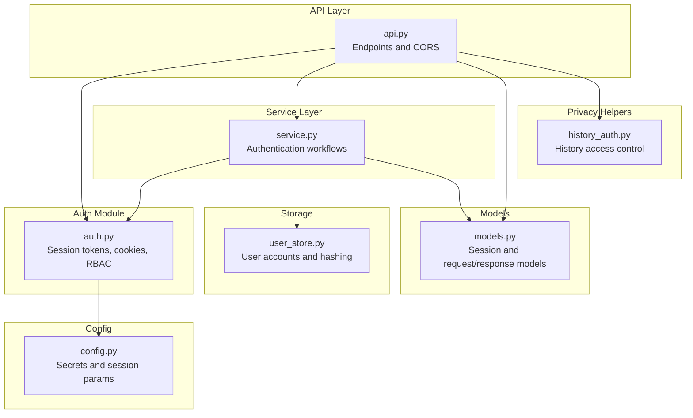
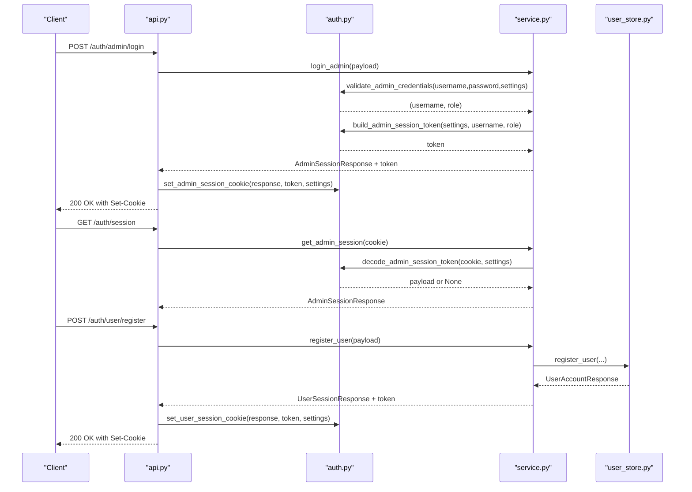
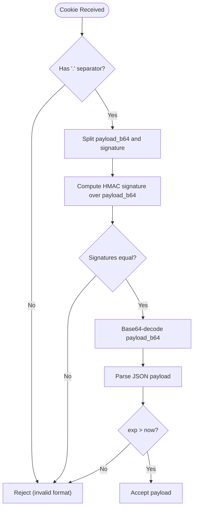
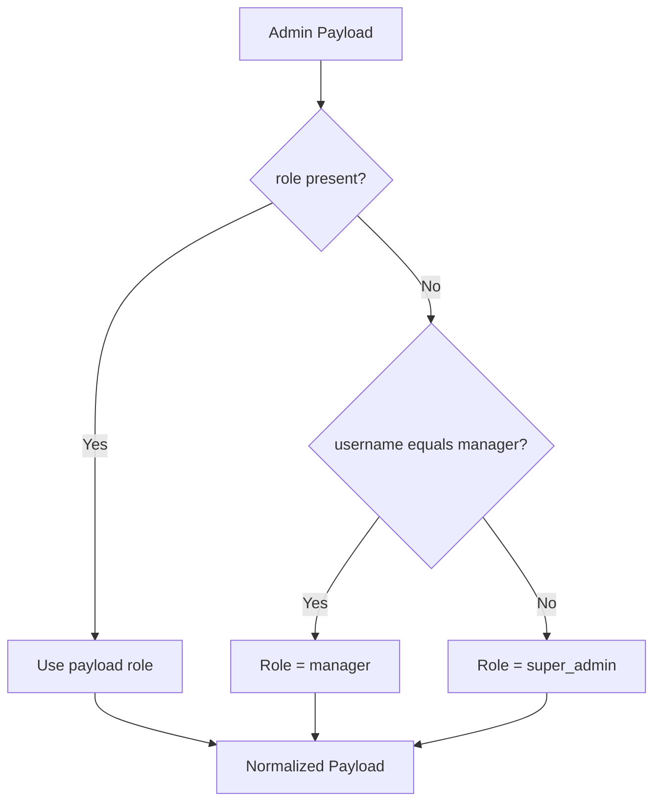
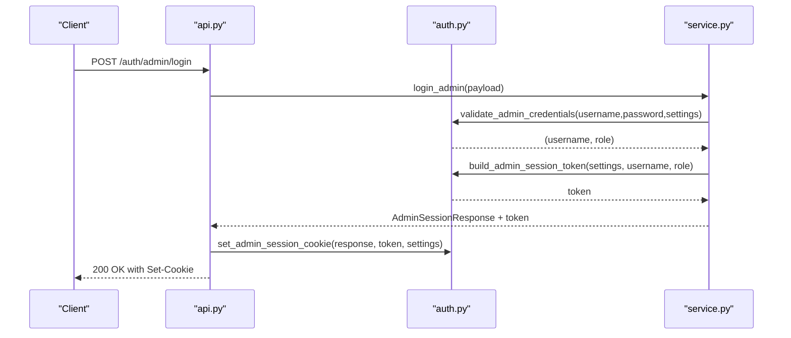
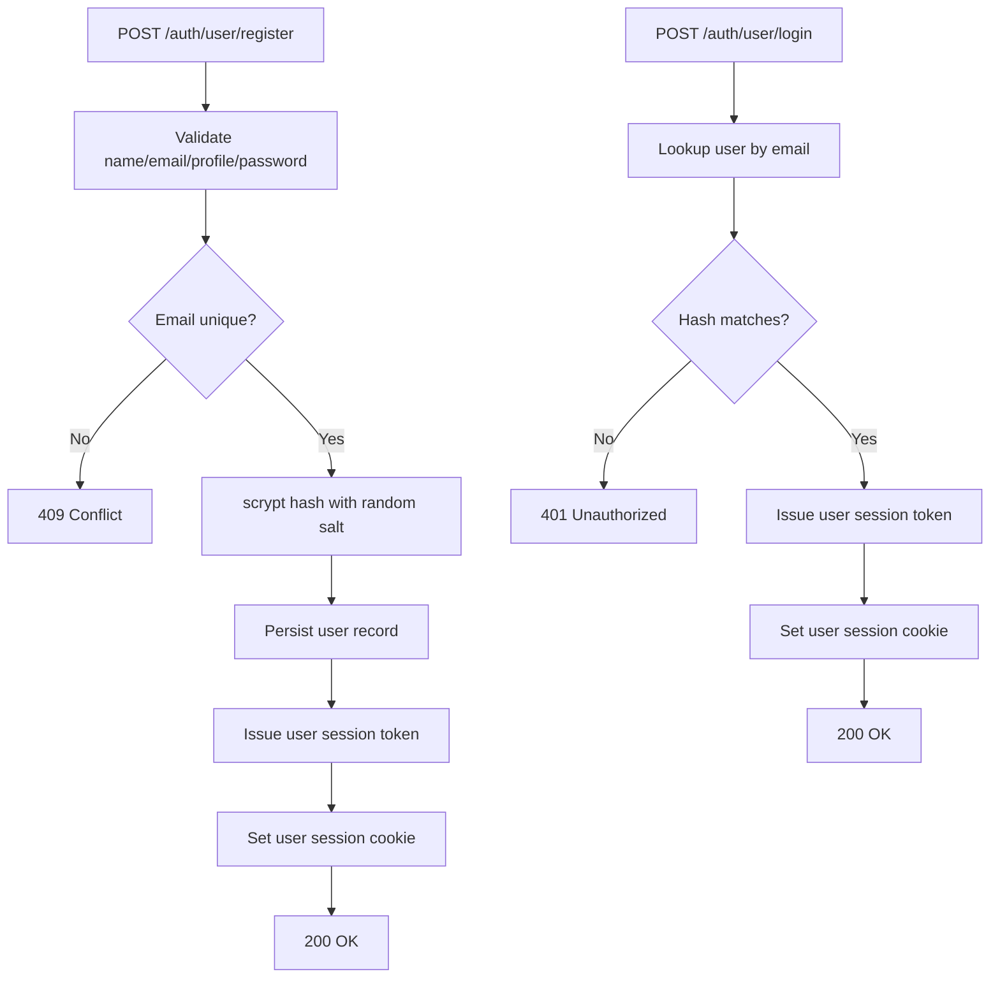
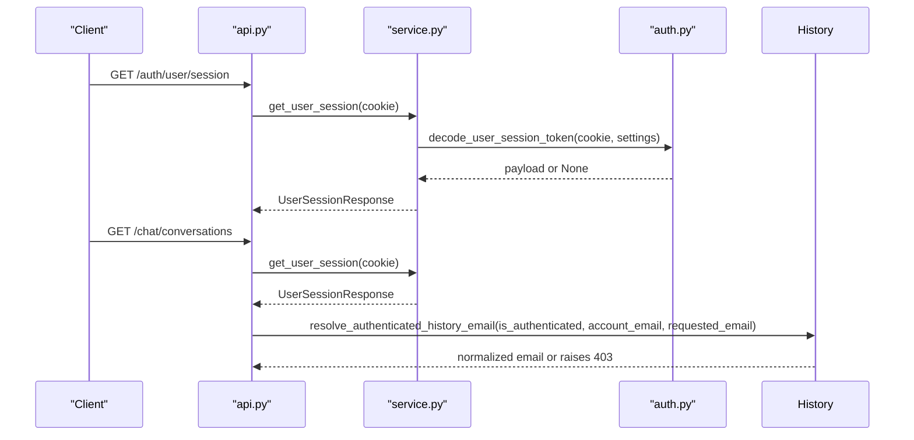
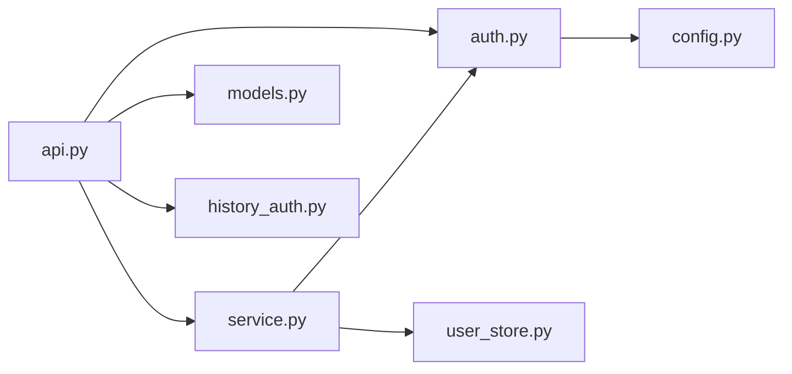

# Security and Authentication

<cite>
**Referenced Files in This Document**
- [auth.py](file://src/sage_faculty_twin/auth.py)
- [api.py](file://src/sage_faculty_twin/api.py)
- [service.py](file://src/sage_faculty_twin/service.py)
- [user_store.py](file://src/sage_faculty_twin/user_store.py)
- [history_auth.py](file://src/sage_faculty_twin/history_auth.py)
- [models.py](file://src/sage_faculty_twin/models.py)
- [config.py](file://src/sage_faculty_twin/config.py)
- [deployment.md](file://docs/deployment.md)
- [README.md](file://README.md)
</cite>

## Table of Contents
1. [Introduction](#introduction)
2. [Project Structure](#project-structure)
3. [Core Components](#core-components)
4. [Architecture Overview](#architecture-overview)
5. [Detailed Component Analysis](#detailed-component-analysis)
6. [Dependency Analysis](#dependency-analysis)
7. [Performance Considerations](#performance-considerations)
8. [Troubleshooting Guide](#troubleshooting-guide)
9. [Conclusion](#conclusion)
10. [Appendices](#appendices)

## Introduction
This document provides comprehensive security documentation for the authentication and access control systems. It explains session management, role-based access control, admin authentication mechanisms, and user registration processes. It documents security best practices, token management, and audit logging. Implementation details include authentication middleware, session validation, and secure API access. Privacy considerations, data protection measures, and compliance requirements are addressed alongside guidance for securing deployment environments and managing user credentials safely.

## Project Structure
The authentication subsystem spans several modules:
- Session and cookie management for admin and user contexts
- Endpoint handlers for login, logout, and session inspection
- Service-layer orchestration for authentication workflows
- User account storage with hashed credentials
- Access control helpers for history and resource boundaries
- Configuration for secrets, TTLs, and session parameters

**Diagram sources**
- [api.py:22-76](file://src/sage_faculty_twin/api.py#L22-L76)
- [auth.py:1-214](file://src/sage_faculty_twin/auth.py#L1-L214)
- [service.py:29-37](file://src/sage_faculty_twin/service.py#L29-L37)
- [user_store.py:1-168](file://src/sage_faculty_twin/user_store.py#L1-L168)
- [models.py:728-783](file://src/sage_faculty_twin/models.py#L728-L783)
- [config.py:121-129](file://src/sage_faculty_twin/config.py#L121-L129)
- [history_auth.py:1-27](file://src/sage_faculty_twin/history_auth.py#L1-L27)

**Section sources**
- [api.py:22-76](file://src/sage_faculty_twin/api.py#L22-L76)
- [auth.py:1-214](file://src/sage_faculty_twin/auth.py#L1-L214)
- [service.py:29-37](file://src/sage_faculty_twin/service.py#L29-L37)
- [user_store.py:1-168](file://src/sage_faculty_twin/user_store.py#L1-L168)
- [models.py:728-783](file://src/sage_faculty_twin/models.py#L728-L783)
- [config.py:121-129](file://src/sage_faculty_twin/config.py#L121-L129)
- [history_auth.py:1-27](file://src/sage_faculty_twin/history_auth.py#L1-L27)

## Core Components
- Admin and user session tokens: signed, time-bound cookies with HMAC signatures and expiration checks
- Role-based access control: admin roles (super_admin, manager) with identity normalization and enforcement
- User registration and authentication: bcrypt-like scrypt-based password hashing with salt per user
- History access control: strict ownership validation for retrieving conversation history
- Secure cookie attributes: HttpOnly, SameSite=Lax, configurable secure flag, path, and max-age
- Configuration-driven secrets and TTLs for both admin and user sessions

Key implementation references:
- Session token builders and validators
- Cookie setters and deleters
- Admin credential validation and identity resolution
- User registration and authentication flows
- History access boundary enforcement

**Section sources**
- [auth.py:20-214](file://src/sage_faculty_twin/auth.py#L20-L214)
- [user_store.py:70-121](file://src/sage_faculty_twin/user_store.py#L70-L121)
- [history_auth.py:6-27](file://src/sage_faculty_twin/history_auth.py#L6-L27)
- [config.py:121-129](file://src/sage_faculty_twin/config.py#L121-L129)

## Architecture Overview
The authentication architecture integrates API endpoints, session management, service workflows, and storage. Requests are validated against session cookies, normalized to canonical identities, and enforced against access policies.

**Diagram sources**
- [api.py:479-510](file://src/sage_faculty_twin/api.py#L479-L510)
- [auth.py:101-117](file://src/sage_faculty_twin/auth.py#L101-L117)
- [service.py:29-37](file://src/sage_faculty_twin/service.py#L29-L37)
- [user_store.py:70-106](file://src/sage_faculty_twin/user_store.py#L70-L106)

## Detailed Component Analysis

### Session Management and Cookies
- Admin and user session tokens are compact, signed JWT-like structures (payload + HMAC signature) stored in HttpOnly cookies
- Tokens carry issuer, issued-at, expiration, and per-context claims
- Cookie attributes:
  - HttpOnly: mitigates XSS risks
  - SameSite=Lax: reduces CSRF risk for cross-site requests
  - Secure flag: configurable; currently disabled by default
  - Max-Age and path configured per session type
- Token validation includes signature verification and expiration checks

**Diagram sources**
- [auth.py:192-214](file://src/sage_faculty_twin/auth.py#L192-L214)

**Section sources**
- [auth.py:56-86](file://src/sage_faculty_twin/auth.py#L56-L86)
- [auth.py:181-214](file://src/sage_faculty_twin/auth.py#L181-L214)
- [config.py:125-128](file://src/sage_faculty_twin/config.py#L125-L128)

### Role-Based Access Control (RBAC)
- Admin roles: super_admin and manager
- Identity normalization resolves effective role based on username and predefined accounts
- Access enforcement via dependency on require_admin_session in protected routes

**Diagram sources**
- [auth.py:131-155](file://src/sage_faculty_twin/auth.py#L131-L155)

**Section sources**
- [auth.py:131-155](file://src/sage_faculty_twin/auth.py#L131-L155)
- [api.py:461-477](file://src/sage_faculty_twin/api.py#L461-L477)

### Admin Authentication Mechanisms
- Credential validation compares username and password against configured accounts using constant-time comparisons
- On success, a session token is built and the admin cookie is set
- Logout clears the admin cookie and returns a user-mode session response

**Diagram sources**
- [api.py:479-483](file://src/sage_faculty_twin/api.py#L479-L483)
- [auth.py:158-172](file://src/sage_faculty_twin/auth.py#L158-L172)
- [auth.py:24-38](file://src/sage_faculty_twin/auth.py#L24-L38)

**Section sources**
- [auth.py:158-172](file://src/sage_faculty_twin/auth.py#L158-L172)
- [auth.py:101-117](file://src/sage_faculty_twin/auth.py#L101-L117)
- [api.py:479-483](file://src/sage_faculty_twin/api.py#L479-L483)

### User Registration and Authentication
- Registration enforces unique email, valid visitor profile, and stores a scrypt-derived hash with a random salt
- Authentication verifies the provided password against the stored hash using constant-time comparison
- On success, a user session cookie is set with a user token

**Diagram sources**
- [user_store.py:70-121](file://src/sage_faculty_twin/user_store.py#L70-L121)
- [auth.py:44-54](file://src/sage_faculty_twin/auth.py#L44-L54)
- [auth.py:72-82](file://src/sage_faculty_twin/auth.py#L72-L82)

**Section sources**
- [user_store.py:70-121](file://src/sage_faculty_twin/user_store.py#L70-L121)
- [auth.py:44-54](file://src/sage_faculty_twin/auth.py#L44-L54)
- [auth.py:72-82](file://src/sage_faculty_twin/auth.py#L72-L82)

### Session Validation and Middleware
- Protected routes depend on require_admin_session to enforce admin presence and identity normalization
- User session endpoints support guest vs authenticated modes with account details when available
- History access endpoints enforce that requested emails match the authenticated account’s normalized email

**Diagram sources**
- [api.py:456-510](file://src/sage_faculty_twin/api.py#L456-L510)
- [api.py:708-740](file://src/sage_faculty_twin/api.py#L708-L740)
- [history_auth.py:6-27](file://src/sage_faculty_twin/history_auth.py#L6-L27)

**Section sources**
- [api.py:421-424](file://src/sage_faculty_twin/api.py#L421-L424)
- [api.py:456-510](file://src/sage_faculty_twin/api.py#L456-L510)
- [api.py:708-740](file://src/sage_faculty_twin/api.py#L708-L740)
- [history_auth.py:6-27](file://src/sage_faculty_twin/history_auth.py#L6-L27)

### Token Management Best Practices
- Constant-time comparisons prevent timing attacks during credential validation
- Separate secrets for admin and user sessions reduce blast radius
- Short-lived tokens with exp checks and periodic renewal via cookie refresh
- HttpOnly and SameSite=Lax cookies mitigate XSS and CSRF risks
- Secure flag should be enabled in production HTTPS deployments

**Section sources**
- [auth.py:163-172](file://src/sage_faculty_twin/auth.py#L163-L172)
- [auth.py:192-214](file://src/sage_faculty_twin/auth.py#L192-L214)
- [auth.py:56-86](file://src/sage_faculty_twin/auth.py#L56-L86)
- [config.py:125-128](file://src/sage_faculty_twin/config.py#L125-L128)

### Audit Logging and Compliance
- No explicit audit log module is present in the referenced files
- Recommendations:
  - Log authentication attempts (success/failure), admin actions, and sensitive operations
  - Include timestamps, IP addresses, user identifiers, and outcomes
  - Retain logs per regulatory requirements and enable secure archival
  - Ensure logs are immutable and protected against tampering

[No sources needed since this section provides general guidance]

### Privacy and Data Protection
- User passwords are hashed with scrypt and stored with per-user salts
- Email normalization ensures consistent matching and reduces ambiguity
- History access is restricted to the authenticated user’s own data
- Cookie-based sessions avoid storing sensitive data in localStorage

**Section sources**
- [user_store.py:148-156](file://src/sage_faculty_twin/user_store.py#L148-L156)
- [history_auth.py:11-27](file://src/sage_faculty_twin/history_auth.py#L11-L27)

### Secure API Access
- Protected endpoints use dependency injection to enforce admin sessions
- CORS is configured for local development origins
- Rate-limiting and input validation are handled by FastAPI and Pydantic models

**Section sources**
- [api.py:461-477](file://src/sage_faculty_twin/api.py#L461-L477)
- [api.py:79-87](file://src/sage_faculty_twin/api.py#L79-L87)
- [models.py:728-783](file://src/sage_faculty_twin/models.py#L728-L783)

## Dependency Analysis
The authentication system exhibits low coupling and clear separation of concerns:
- API layer depends on auth and service modules
- Service orchestrates auth and storage interactions
- Storage encapsulates user persistence and hashing
- Config centralizes secrets and session parameters

**Diagram sources**
- [api.py:22-76](file://src/sage_faculty_twin/api.py#L22-L76)
- [auth.py:1-214](file://src/sage_faculty_twin/auth.py#L1-L214)
- [service.py:29-37](file://src/sage_faculty_twin/service.py#L29-L37)
- [user_store.py:1-168](file://src/sage_faculty_twin/user_store.py#L1-L168)
- [models.py:728-783](file://src/sage_faculty_twin/models.py#L728-L783)
- [config.py:121-129](file://src/sage_faculty_twin/config.py#L121-L129)
- [history_auth.py:1-27](file://src/sage_faculty_twin/history_auth.py#L1-L27)

**Section sources**
- [api.py:22-76](file://src/sage_faculty_twin/api.py#L22-L76)
- [auth.py:1-214](file://src/sage_faculty_twin/auth.py#L1-L214)
- [service.py:29-37](file://src/sage_faculty_twin/service.py#L29-L37)
- [user_store.py:1-168](file://src/sage_faculty_twin/user_store.py#L1-L168)
- [models.py:728-783](file://src/sage_faculty_twin/models.py#L728-L783)
- [config.py:121-129](file://src/sage_faculty_twin/config.py#L121-L129)
- [history_auth.py:1-27](file://src/sage_faculty_twin/history_auth.py#L1-L27)

## Performance Considerations
- Session validation is O(1) with constant-time HMAC verification and expiration checks
- Password hashing uses scrypt with tuned parameters for balanced cost and security
- Cookie-based sessions avoid frequent server-side state maintenance
- Consider rotating secrets periodically and refreshing tokens to minimize exposure windows

[No sources needed since this section provides general guidance]

## Troubleshooting Guide
Common issues and resolutions:
- 401 Unauthorized on admin login: incorrect username/password or timing attack protections triggered
- 403 Forbidden on protected routes: missing or invalid admin session cookie
- 401 Unauthorized on user login: email not found or password mismatch
- 409 Conflict on registration: email already registered
- History access denied: requested email differs from authenticated account’s normalized email

Operational tips:
- Verify session secrets and TTLs in configuration
- Ensure cookies are being sent with HTTPS in production
- Confirm SameSite and Secure flags align with deployment environment
- Monitor for timing attack mitigations causing perceived delays

**Section sources**
- [auth.py:158-172](file://src/sage_faculty_twin/auth.py#L158-L172)
- [auth.py:119-129](file://src/sage_faculty_twin/auth.py#L119-L129)
- [user_store.py:108-121](file://src/sage_faculty_twin/user_store.py#L108-L121)
- [user_store.py:86-89](file://src/sage_faculty_twin/user_store.py#L86-L89)
- [history_auth.py:15-25](file://src/sage_faculty_twin/history_auth.py#L15-L25)

## Conclusion
The authentication and access control system employs robust session management with signed, time-bound tokens, constant-time comparisons, and secure cookie attributes. Admin RBAC is enforced via normalized identities and dependency-based access checks. User credentials are securely hashed and stored, and history access is strictly scoped to authenticated owners. Deployment configurations should enable HTTPS and appropriate cookie flags for production. Additional audit logging and periodic secret rotation further strengthen security posture.

[No sources needed since this section summarizes without analyzing specific files]

## Appendices

### Security Checklist for Deployment
- Enable HTTPS and set Secure flag for cookies
- Rotate session secrets regularly
- Enforce SameSite=Strict for sensitive actions if feasible
- Limit CORS to trusted origins only
- Monitor authentication metrics and anomalies
- Back up user account data securely

**Section sources**
- [auth.py:56-86](file://src/sage_faculty_twin/auth.py#L56-L86)
- [config.py:125-128](file://src/sage_faculty_twin/config.py#L125-L128)
- [deployment.md:118-185](file://docs/deployment.md#L118-L185)

### Configuration Reference
- Admin and user session secrets and TTLs
- Visitor profile validation for registrations
- Environment-specific deployment notes

**Section sources**
- [config.py:121-129](file://src/sage_faculty_twin/config.py#L121-L129)
- [models.py:733-744](file://src/sage_faculty_twin/models.py#L733-L744)
- [README.md:57-102](file://README.md#L57-L102)