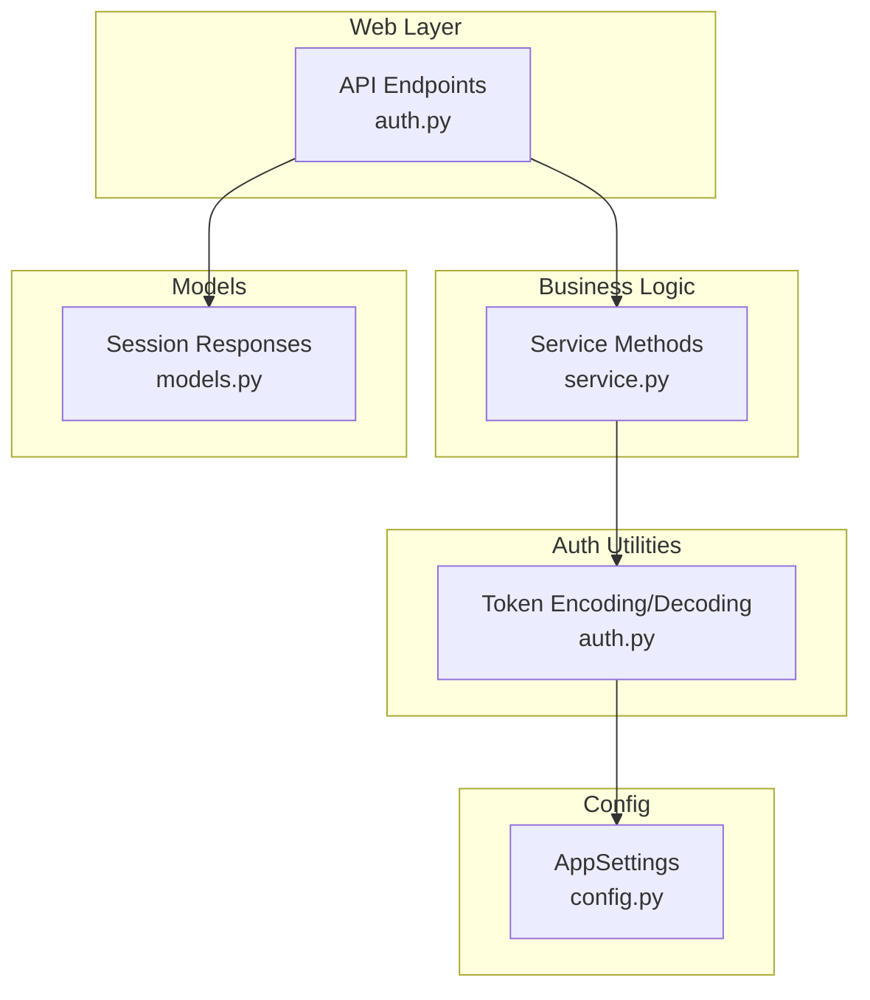
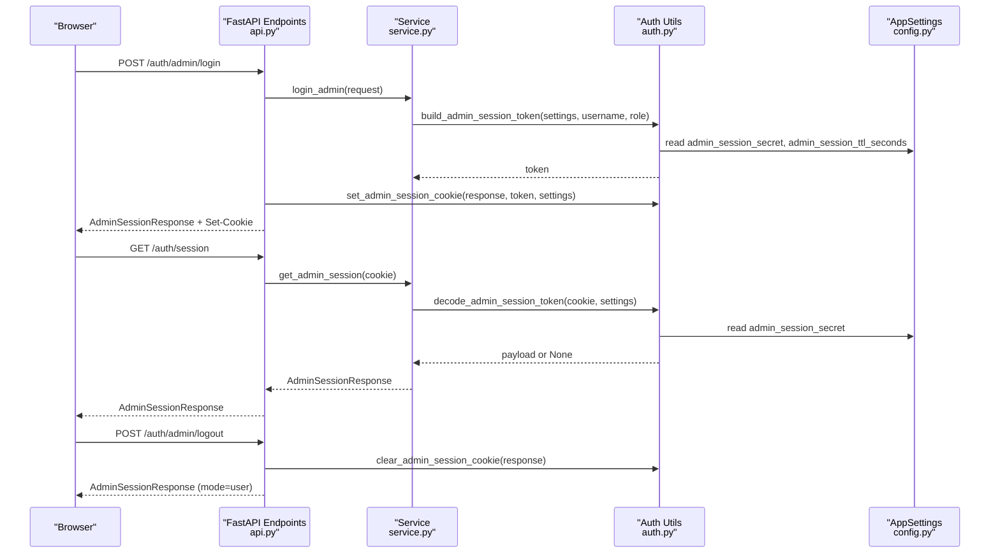
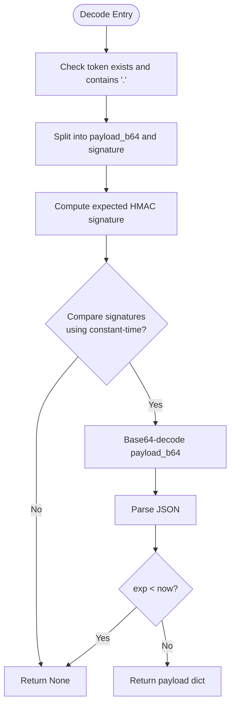
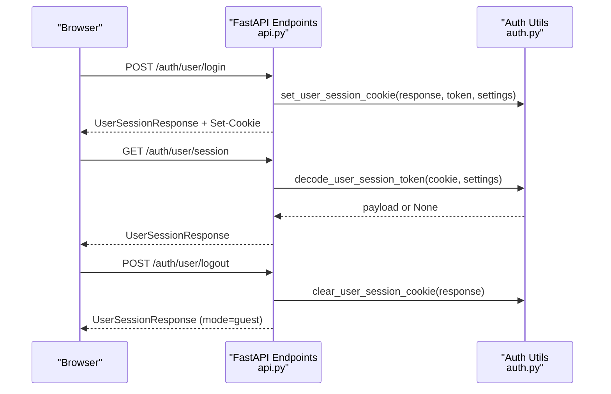
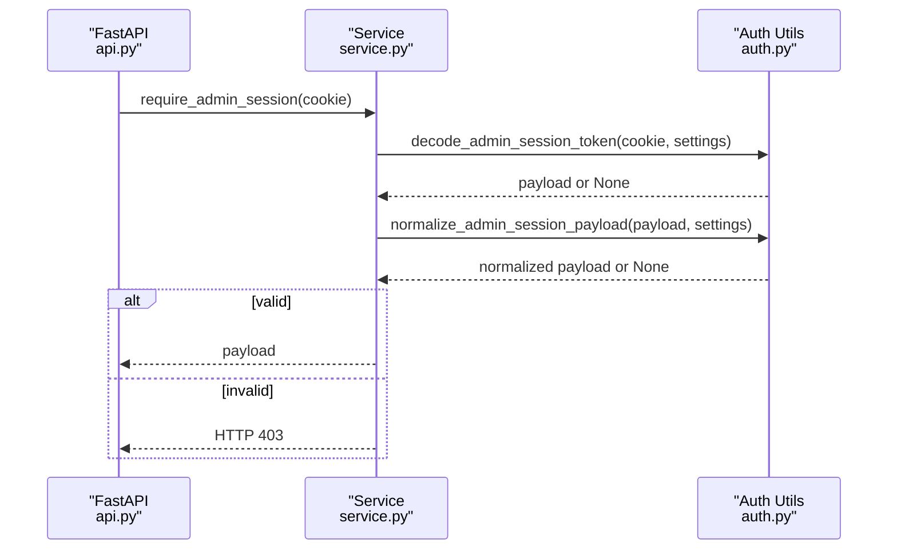
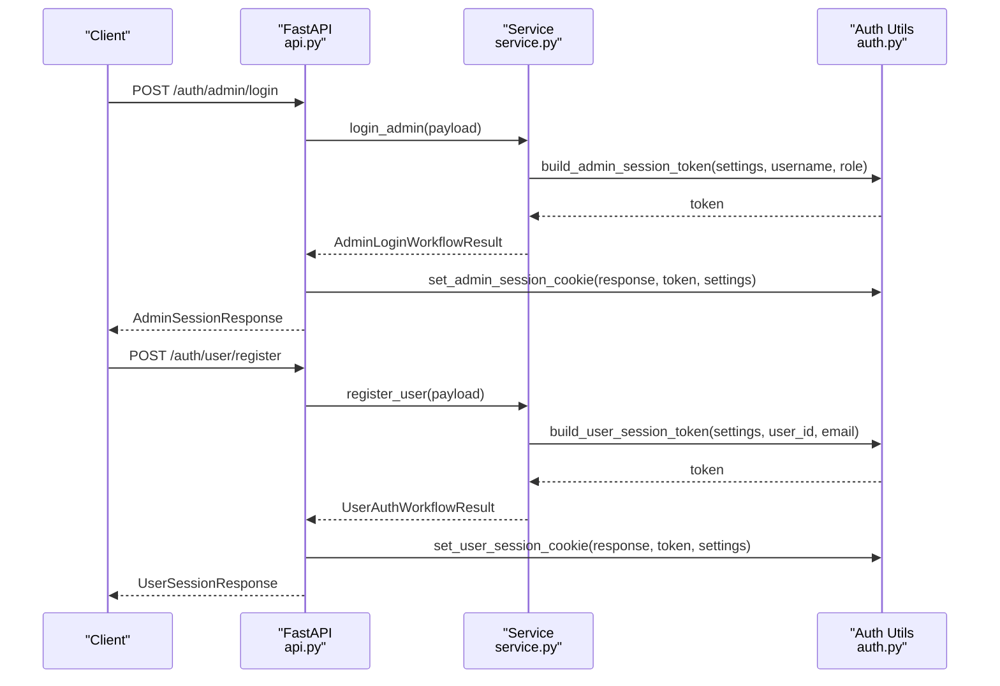
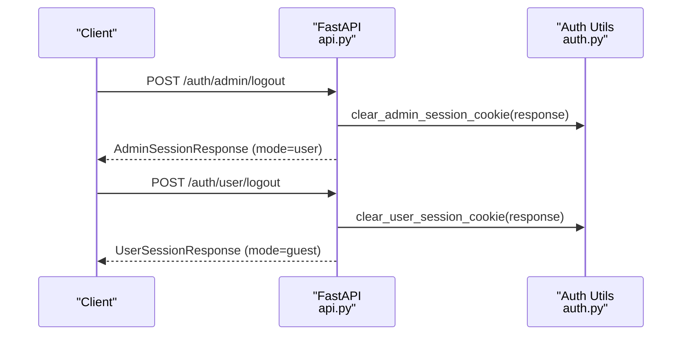
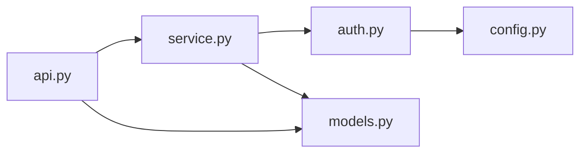

# Session Management

<cite>
**Referenced Files in This Document**
- [auth.py](file://src/sage_faculty_twin/auth.py)
- [api.py](file://src/sage_faculty_twin/api.py)
- [service.py](file://src/sage_faculty_twin/service.py)
- [config.py](file://src/sage_faculty_twin/config.py)
- [models.py](file://src/sage_faculty_twin/models.py)
</cite>

## Table of Contents
1. [Introduction](#introduction)
2. [Project Structure](#project-structure)
3. [Core Components](#core-components)
4. [Architecture Overview](#architecture-overview)
5. [Detailed Component Analysis](#detailed-component-analysis)
6. [Dependency Analysis](#dependency-analysis)
7. [Performance Considerations](#performance-considerations)
8. [Troubleshooting Guide](#troubleshooting-guide)
9. [Conclusion](#conclusion)

## Introduction
This document explains the session management system for both admin and user sessions. It covers cookie-based session handling, token encoding/decoding, HMAC signature verification, expiration checks, cookie attributes (HttpOnly, Secure, SameSite), session lifecycle, and security considerations. It also documents how sessions are validated, renewed, and destroyed, and provides examples of workflows for session creation, validation, and destruction.

## Project Structure
The session management spans several modules:
- Authentication and token utilities: [auth.py](file://src/sage_faculty_twin/auth.py)
- API endpoints for login/logout and session inspection: [api.py](file://src/sage_faculty_twin/api.py)
- Business logic for session creation and validation: [service.py](file://src/sage_faculty_twin/service.py)
- Configuration of secrets and TTLs: [config.py](file://src/sage_faculty_twin/config.py)
- Session response models: [models.py](file://src/sage_faculty_twin/models.py)

**Diagram sources**
- [auth.py:182-214](file://src/sage_faculty_twin/auth.py#L182-L214)
- [api.py:478-510](file://src/sage_faculty_twin/api.py#L478-L510)
- [service.py:2695-2742](file://src/sage_faculty_twin/service.py#L2695-L2742)
- [config.py:121-128](file://src/sage_faculty_twin/config.py#L121-L128)
- [models.py:756-768](file://src/sage_faculty_twin/models.py#L756-L768)

**Section sources**
- [auth.py:16-116](file://src/sage_faculty_twin/auth.py#L16-L116)
- [api.py:478-510](file://src/sage_faculty_twin/api.py#L478-L510)
- [service.py:2695-2742](file://src/sage_faculty_twin/service.py#L2695-L2742)
- [config.py:121-128](file://src/sage_faculty_twin/config.py#L121-L128)
- [models.py:756-768](file://src/sage_faculty_twin/models.py#L756-L768)

## Core Components
- Token encoding/decoding and HMAC verification:
  - Payload serialization and canonicalization
  - Base64 URL-safe encoding
  - HMAC-SHA256 signature generation
  - Signature verification using constant-time comparison
  - Expiration check against current time
- Cookie management:
  - Admin and user cookies with HttpOnly, SameSite=Lax, optional Secure, max-age derived from TTL
  - Set and delete cookie helpers
- Session building and normalization:
  - Admin and user token builders with issued/expiry timestamps and random nonce
  - Identity resolution and normalization for admin roles
- API endpoints:
  - Admin login/logout and session inspection
  - User registration/login/logout and session inspection
- Service integration:
  - Login workflows produce session tokens and responses
  - Validation helpers return normalized payloads or raise errors

**Section sources**
- [auth.py:182-214](file://src/sage_faculty_twin/auth.py#L182-L214)
- [auth.py:57-99](file://src/sage_faculty_twin/auth.py#L57-L99)
- [auth.py:158-172](file://src/sage_faculty_twin/auth.py#L158-L172)
- [api.py:478-510](file://src/sage_faculty_twin/api.py#L478-L510)
- [service.py:2695-2742](file://src/sage_faculty_twin/service.py#L2695-L2742)

## Architecture Overview
The session lifecycle follows a consistent pattern for both admin and user:
- Creation: Credentials or account data are validated; a signed token is produced and stored in a cookie.
- Validation: On subsequent requests, the cookie is decoded and verified; expiration and signature are checked.
- Renewal: Tokens are short-lived; clients should re-authenticate or refresh as needed.
- Destruction: Logout clears the cookie and resets the session state.

**Diagram sources**
- [api.py:478-490](file://src/sage_faculty_twin/api.py#L478-L490)
- [service.py:2695-2714](file://src/sage_faculty_twin/service.py#L2695-L2714)
- [auth.py:20-38](file://src/sage_faculty_twin/auth.py#L20-L38)
- [auth.py:57-66](file://src/sage_faculty_twin/auth.py#L57-L66)
- [auth.py:193-214](file://src/sage_faculty_twin/auth.py#L193-L214)
- [config.py:125-126](file://src/sage_faculty_twin/config.py#L125-L126)

## Detailed Component Analysis

### Token Encoding and Decoding
- Encoding:
  - Canonical JSON payload (sorted keys, compact separators)
  - Base64 URL-safe encoding
  - HMAC-SHA256 signature over the encoded payload using the secret
  - Token format: "<payload_b64>.<signature>"
- Decoding and Verification:
  - Split token into payload and signature
  - Recompute expected signature and compare with constant-time comparison
  - Decode payload and parse JSON
  - Check expiration against current time
  - Return None on any failure

**Diagram sources**
- [auth.py:193-214](file://src/sage_faculty_twin/auth.py#L193-L214)

**Section sources**
- [auth.py:182-214](file://src/sage_faculty_twin/auth.py#L182-L214)

### Cookie Configuration and Lifecycle
- Admin cookie:
  - Name: "faculty_twin_admin"
  - Attributes: HttpOnly=True, SameSite="lax", Secure=False, Max-Age=admin_session_ttl_seconds, Path="/"
  - Set on successful admin login; cleared on logout
- User cookie:
  - Name: "faculty_twin_user"
  - Attributes: HttpOnly=True, SameSite="lax", Secure=False, Max-Age=user_session_ttl_seconds, Path="/"
  - Set on user registration/login; cleared on logout
- Session inspection endpoints:
  - GET /auth/session returns admin session state
  - GET /auth/user/session returns user session state

**Diagram sources**
- [api.py:491-510](file://src/sage_faculty_twin/api.py#L491-L510)
- [auth.py:73-86](file://src/sage_faculty_twin/auth.py#L73-L86)
- [auth.py:41-54](file://src/sage_faculty_twin/auth.py#L41-L54)

**Section sources**
- [auth.py:57-99](file://src/sage_faculty_twin/auth.py#L57-L99)
- [api.py:451-458](file://src/sage_faculty_twin/api.py#L451-L458)
- [api.py:491-510](file://src/sage_faculty_twin/api.py#L491-L510)

### Session Validation and Normalization
- Admin validation:
  - Extract admin cookie, decode and verify token
  - Normalize identity by resolving role and username
  - Raise HTTP 403 if invalid
- User validation:
  - Extract user cookie, decode and verify token
  - Build user session response from payload

**Diagram sources**
- [api.py:422-424](file://src/sage_faculty_twin/api.py#L422-L424)
- [service.py:2695-2714](file://src/sage_faculty_twin/service.py#L2695-L2714)
- [auth.py:119-129](file://src/sage_faculty_twin/auth.py#L119-L129)
- [auth.py:145-155](file://src/sage_faculty_twin/auth.py#L145-L155)

**Section sources**
- [auth.py:119-155](file://src/sage_faculty_twin/auth.py#L119-L155)
- [api.py:422-424](file://src/sage_faculty_twin/api.py#L422-L424)
- [service.py:2695-2714](file://src/sage_faculty_twin/service.py#L2695-L2714)

### Session Creation Workflows
- Admin login:
  - Validate credentials
  - Build admin token with username and role
  - Return session response and token
- User registration/login:
  - Authenticate/create account
  - Build user token with user_id and email
  - Return session response and token

**Diagram sources**
- [api.py:478-496](file://src/sage_faculty_twin/api.py#L478-L496)
- [service.py:2695-2742](file://src/sage_faculty_twin/service.py#L2695-L2742)
- [auth.py:24-38](file://src/sage_faculty_twin/auth.py#L24-L38)
- [auth.py:45-54](file://src/sage_faculty_twin/auth.py#L45-L54)

**Section sources**
- [api.py:478-496](file://src/sage_faculty_twin/api.py#L478-L496)
- [service.py:2695-2742](file://src/sage_faculty_twin/service.py#L2695-L2742)
- [auth.py:24-54](file://src/sage_faculty_twin/auth.py#L24-L54)

### Session Destruction Workflows
- Admin logout:
  - Clear admin session cookie
  - Return session response indicating guest mode
- User logout:
  - Clear user session cookie
  - Return session response indicating guest mode

**Diagram sources**
- [api.py:485-509](file://src/sage_faculty_twin/api.py#L485-L509)
- [auth.py:69-86](file://src/sage_faculty_twin/auth.py#L69-L86)

**Section sources**
- [api.py:485-509](file://src/sage_faculty_twin/api.py#L485-L509)
- [auth.py:69-86](file://src/sage_faculty_twin/auth.py#L69-L86)

### Security Considerations
- Secret separation:
  - Admin and user sessions use distinct secrets configured separately
- Signature verification:
  - HMAC-SHA256 with constant-time comparison prevents timing attacks
- Expiration enforcement:
  - Tokens carry exp timestamps; expired tokens are rejected
- Cookie attributes:
  - HttpOnly=True reduces XSS risk
  - SameSite="lax" mitigates CSRF for cross-site requests
  - Secure=False indicates non-TLS transport; production deployments should enable TLS and set Secure=True
- Role normalization:
  - Admin identity resolution ensures consistent role assignment

**Section sources**
- [auth.py:182-214](file://src/sage_faculty_twin/auth.py#L182-L214)
- [auth.py:57-99](file://src/sage_faculty_twin/auth.py#L57-L99)
- [auth.py:132-142](file://src/sage_faculty_twin/auth.py#L132-L142)
- [config.py:125-128](file://src/sage_faculty_twin/config.py#L125-L128)

## Dependency Analysis
- API depends on Service for business logic and on Auth for token handling and cookie management.
- Service depends on Auth for token building/verification and on Config for secrets and TTLs.
- Auth depends on Config for secrets and TTLs and uses cryptographic primitives for signing and verification.
- Models define the shape of session responses returned by API and Service.

**Diagram sources**
- [api.py:22-29](file://src/sage_faculty_twin/api.py#L22-L29)
- [service.py:2695-2742](file://src/sage_faculty_twin/service.py#L2695-L2742)
- [auth.py:13-14](file://src/sage_faculty_twin/auth.py#L13-L14)
- [config.py:121-128](file://src/sage_faculty_twin/config.py#L121-L128)
- [models.py:756-768](file://src/sage_faculty_twin/models.py#L756-L768)

**Section sources**
- [api.py:22-29](file://src/sage_faculty_twin/api.py#L22-L29)
- [service.py:2695-2742](file://src/sage_faculty_twin/service.py#L2695-L2742)
- [auth.py:13-14](file://src/sage_faculty_twin/auth.py#L13-L14)
- [config.py:121-128](file://src/sage_faculty_twin/config.py#L121-L128)
- [models.py:756-768](file://src/sage_faculty_twin/models.py#L756-L768)

## Performance Considerations
- Token verification is O(1) per request: JSON parsing, HMAC computation, and time comparison.
- Cookies are small and transported on every request; keep payloads minimal (as implemented).
- Expiration checks prevent unnecessary backend processing for stale sessions.
- Consider rate-limiting login endpoints to mitigate brute-force attempts.

## Troubleshooting Guide
- Invalid or missing cookie:
  - Decoding returns None; endpoints return guest/admin user mode accordingly.
- Signature mismatch:
  - Constant-time comparison fails; token is rejected.
- Malformed payload:
  - JSON decode or base64 decode errors lead to rejection.
- Expired token:
  - exp < current time leads to rejection.
- Missing secrets or incorrect TTLs:
  - Verify configuration values for admin and user session secrets and TTLs.

**Section sources**
- [auth.py:193-214](file://src/sage_faculty_twin/auth.py#L193-L214)
- [config.py:125-128](file://src/sage_faculty_twin/config.py#L125-L128)

## Conclusion
The session management system uses compact, signed tokens with HMAC-SHA256, strict expiration checks, and conservative cookie attributes. Admin and user flows are symmetric, with separate secrets and TTLs. The design balances security and simplicity, enabling straightforward validation, renewal, and destruction workflows. For production, ensure TLS is enabled to allow Secure=True on cookies and rotate secrets regularly.