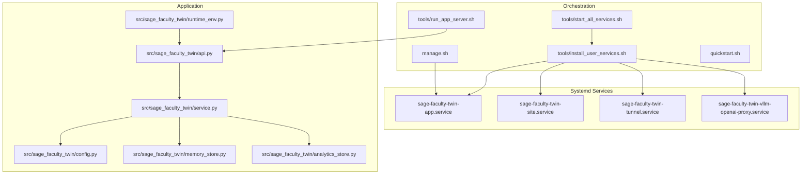
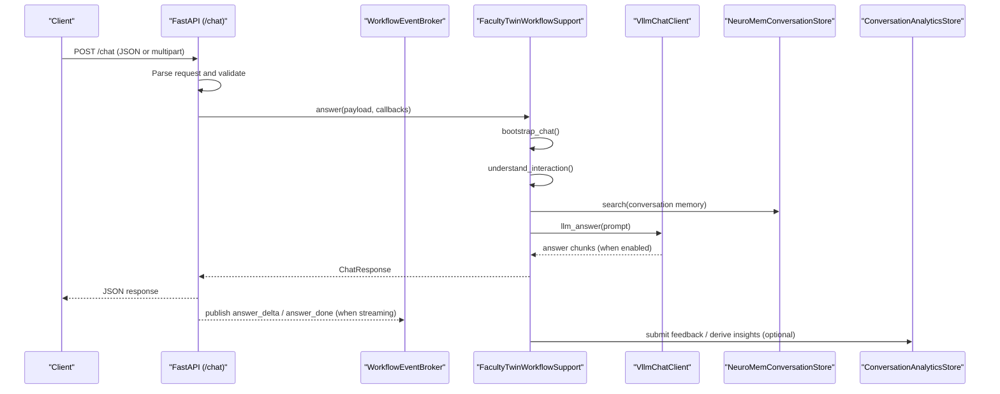
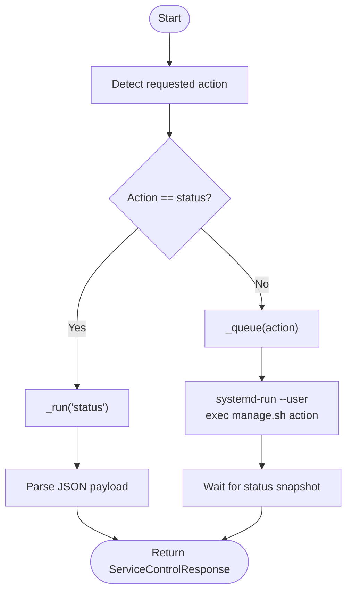
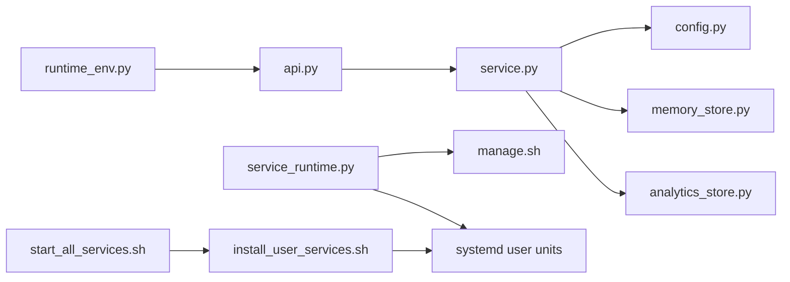

# Troubleshooting and Maintenance

<cite>
**Referenced Files in This Document**
- [README.md](file://README.md)
- [quickstart.sh](file://quickstart.sh)
- [manage.sh](file://manage.sh)
- [tools/start_all_services.sh](file://tools/start_all_services.sh)
- [tools/run_app_server.sh](file://tools/run_app_server.sh)
- [tools/install_user_services.sh](file://tools/install_user_services.sh)
- [deploy/systemd/user/sage-faculty-twin-app.service](file://deploy/systemd/user/sage-faculty-twin-app.service)
- [src/sage_faculty_twin/api.py](file://src/sage_faculty_twin/api.py)
- [src/sage_faculty_twin/service.py](file://src/sage_faculty_twin/service.py)
- [src/sage_faculty_twin/service_runtime.py](file://src/sage_faculty_twin/service_runtime.py)
- [src/sage_faculty_twin/config.py](file://src/sage_faculty_twin/config.py)
- [src/sage_faculty_twin/runtime_env.py](file://src/sage_faculty_twin/runtime_env.py)
- [src/sage_faculty_twin/analytics_store.py](file://src/sage_faculty_twin/analytics_store.py)
- [src/sage_faculty_twin/memory_store.py](file://src/sage_faculty_twin/memory_store.py)
</cite>

## Table of Contents
1. [Introduction](#introduction)
2. [Project Structure](#project-structure)
3. [Core Components](#core-components)
4. [Architecture Overview](#architecture-overview)
5. [Detailed Component Analysis](#detailed-component-analysis)
6. [Dependency Analysis](#dependency-analysis)
7. [Performance Considerations](#performance-considerations)
8. [Troubleshooting Guide](#troubleshooting-guide)
9. [Conclusion](#conclusion)
10. [Appendices](#appendices)

## Introduction
This document provides comprehensive troubleshooting and maintenance guidance for the Sage Faculty Twin system. It covers common issues and their solutions, performance tuning, monitoring, diagnostics, logging analysis, maintenance schedules, backups, system health checks, recovery procedures, and benchmarking techniques. The content is grounded in the repository’s scripts, configuration, and runtime components to ensure practical applicability.

## Project Structure
The system comprises:
- Application server (FastAPI) with streaming and SSE support
- Systemd user services for app, site proxy, tunnel, and optional OpenAI-compatible proxy
- Startup orchestration scripts for model service, app, and tunnel
- Configuration and environment bootstrapping
- Runtime analytics and memory stores for diagnostics and telemetry

**Diagram sources**
- [tools/start_all_services.sh:1-165](file://tools/start_all_services.sh#L1-L165)
- [tools/install_user_services.sh:1-157](file://tools/install_user_services.sh#L1-L157)
- [deploy/systemd/user/sage-faculty-twin-app.service:1-18](file://deploy/systemd/user/sage-faculty-twin-app.service#L1-L18)
- [src/sage_faculty_twin/api.py:1-996](file://src/sage_faculty_twin/api.py#L1-L996)
- [src/sage_faculty_twin/service.py:1-800](file://src/sage_faculty_twin/service.py#L1-L800)
- [src/sage_faculty_twin/config.py:1-132](file://src/sage_faculty_twin/config.py#L1-L132)
- [src/sage_faculty_twin/runtime_env.py:1-131](file://src/sage_faculty_twin/runtime_env.py#L1-L131)
- [src/sage_faculty_twin/memory_store.py:1-800](file://src/sage_faculty_twin/memory_store.py#L1-L800)
- [src/sage_faculty_twin/analytics_store.py:1-632](file://src/sage_faculty_twin/analytics_store.py#L1-L632)

**Section sources**
- [README.md:1-126](file://README.md#L1-L126)
- [tools/start_all_services.sh:1-165](file://tools/start_all_services.sh#L1-L165)
- [tools/install_user_services.sh:1-157](file://tools/install_user_services.sh#L1-L157)
- [deploy/systemd/user/sage-faculty-twin-app.service:1-18](file://deploy/systemd/user/sage-faculty-twin-app.service#L1-L18)
- [src/sage_faculty_twin/api.py:1-996](file://src/sage_faculty_twin/api.py#L1-L996)
- [src/sage_faculty_twin/service.py:1-800](file://src/sage_faculty_twin/service.py#L1-L800)
- [src/sage_faculty_twin/config.py:1-132](file://src/sage_faculty_twin/config.py#L1-L132)
- [src/sage_faculty_twin/runtime_env.py:1-131](file://src/sage_faculty_twin/runtime_env.py#L1-L131)
- [src/sage_faculty_twin/memory_store.py:1-800](file://src/sage_faculty_twin/memory_store.py#L1-L800)
- [src/sage_faculty_twin/analytics_store.py:1-632](file://src/sage_faculty_twin/analytics_store.py#L1-L632)

## Core Components
- Application server and endpoints (/health, /stack/versions, /stack/hardware, /chat, /chat/workflow-events)
- Streaming and SSE event publishing for workflow tracing and answer deltas
- Service runtime manager for systemd-managed actions
- Configuration loader with environment variable prefixes and defaults
- Analytics store for feedback, clustering, and satisfaction metrics
- Memory store with layered retrieval, telemetry, and persistence

Key runtime flags and behaviors:
- Streaming answer delivery controlled by environment flag
- SSE keepalive cadence to prevent proxy timeouts
- Prompt soft cap and truncation policies to bound latency
- Post-answer background tasks and deferred completion signaling

**Section sources**
- [src/sage_faculty_twin/api.py:1-996](file://src/sage_faculty_twin/api.py#L1-L996)
- [src/sage_faculty_twin/service_runtime.py:1-69](file://src/sage_faculty_twin/service_runtime.py#L1-L69)
- [src/sage_faculty_twin/config.py:1-132](file://src/sage_faculty_twin/config.py#L1-L132)
- [src/sage_faculty_twin/analytics_store.py:1-632](file://src/sage_faculty_twin/analytics_store.py#L1-L632)
- [src/sage_faculty_twin/memory_store.py:1-800](file://src/sage_faculty_twin/memory_store.py#L1-L800)

## Architecture Overview
The runtime architecture integrates FastAPI endpoints with a workflow engine that orchestrates retrieval, planning, LLM answering, and post-processing. Systemd user services manage lifecycle and health. Optional OpenAI-compatible proxy and Cloudflare tunnel expose the service externally.

**Diagram sources**
- [src/sage_faculty_twin/api.py:597-700](file://src/sage_faculty_twin/api.py#L597-L700)
- [src/sage_faculty_twin/service.py:635-775](file://src/sage_faculty_twin/service.py#L635-L775)
- [src/sage_faculty_twin/memory_store.py:446-489](file://src/sage_faculty_twin/memory_store.py#L446-L489)
- [src/sage_faculty_twin/analytics_store.py:109-141](file://src/sage_faculty_twin/analytics_store.py#L109-L141)

## Detailed Component Analysis

### Service Control and Lifecycle Management
- ServiceRuntimeManager delegates actions to manage.sh and uses systemd-run for queued operations
- manage.sh enumerates services, supports status/start/stop/restart, and can include optional units (proxy, tunnel, site)
- install_user_services.sh renders and installs systemd units, resolves Python binary, and optionally starts services

**Diagram sources**
- [src/sage_faculty_twin/service_runtime.py:13-69](file://src/sage_faculty_twin/service_runtime.py#L13-L69)
- [manage.sh:71-87](file://manage.sh#L71-L87)
- [tools/install_user_services.sh:114-153](file://tools/install_user_services.sh#L114-L153)

**Section sources**
- [src/sage_faculty_twin/service_runtime.py:1-69](file://src/sage_faculty_twin/service_runtime.py#L1-L69)
- [manage.sh:1-162](file://manage.sh#L1-L162)
- [tools/install_user_services.sh:1-157](file://tools/install_user_services.sh#L1-L157)

### Health and Diagnostics Endpoints
- /health returns initialization status and stack version metadata
- /stack/versions and /stack/hardware expose runtime stack and hardware info
- Streaming SSE endpoint /chat/workflow-events publishes trace steps and answer deltas

Operational checks:
- Verify app listens on configured port
- Confirm streaming enabled via environment flag
- Validate SSE keepalive cadence prevents proxy disconnects

**Section sources**
- [src/sage_faculty_twin/api.py:512-540](file://src/sage_faculty_twin/api.py#L512-L540)
- [src/sage_faculty_twin/service.py:250-346](file://src/sage_faculty_twin/service.py#L250-L346)

### Configuration and Environment Bootstrapping
- AppSettings loads environment variables with prefix DIGITAL_TWIN_, merges .env and SAGE .env, and defines defaults
- runtime_env.py ensures local policy and sageVDB source visibility, prepends PYTHONPATH entries, and validates dependencies

Common misconfigurations:
- Missing or incorrect DIGITAL_TWIN_LLM_BASE_URL/API_KEY
- Policy module imported from non-local path
- sageVDB compiled extension not linked

**Section sources**
- [src/sage_faculty_twin/config.py:1-132](file://src/sage_faculty_twin/config.py#L1-L132)
- [src/sage_faculty_twin/runtime_env.py:1-131](file://src/sage_faculty_twin/runtime_env.py#L1-L131)

### Analytics and Memory Stores
- ConversationAnalyticsStore persists feedback, builds weekly reports, and generates knowledge gap suggestions
- NeuroMemConversationStore manages conversation and profile memories, exposes telemetry, and supports artifact retrieval

Diagnostic insights:
- Telemetry summaries for query/write counts and memory usefulness scoring
- Cluster analysis of questions and satisfaction trends

**Section sources**
- [src/sage_faculty_twin/analytics_store.py:1-632](file://src/sage_faculty_twin/analytics_store.py#L1-L632)
- [src/sage_faculty_twin/memory_store.py:1-800](file://src/sage_faculty_twin/memory_store.py#L1-L800)

## Dependency Analysis
- FastAPI application depends on service orchestration, memory store, and analytics
- ServiceRuntimeManager depends on manage.sh and systemd user units
- Application startup depends on runtime_env bootstrapping and knowledge backend dependencies

**Diagram sources**
- [src/sage_faculty_twin/api.py:1-996](file://src/sage_faculty_twin/api.py#L1-L996)
- [src/sage_faculty_twin/service.py:1-800](file://src/sage_faculty_twin/service.py#L1-L800)
- [src/sage_faculty_twin/config.py:1-132](file://src/sage_faculty_twin/config.py#L1-L132)
- [src/sage_faculty_twin/memory_store.py:1-800](file://src/sage_faculty_twin/memory_store.py#L1-L800)
- [src/sage_faculty_twin/analytics_store.py:1-632](file://src/sage_faculty_twin/analytics_store.py#L1-L632)
- [src/sage_faculty_twin/service_runtime.py:1-69](file://src/sage_faculty_twin/service_runtime.py#L1-L69)
- [manage.sh:1-162](file://manage.sh#L1-L162)
- [tools/install_user_services.sh:1-157](file://tools/install_user_services.sh#L1-L157)
- [tools/start_all_services.sh:1-165](file://tools/start_all_services.sh#L1-L165)

**Section sources**
- [src/sage_faculty_twin/api.py:1-996](file://src/sage_faculty_twin/api.py#L1-L996)
- [src/sage_faculty_twin/service.py:1-800](file://src/sage_faculty_twin/service.py#L1-L800)
- [src/sage_faculty_twin/service_runtime.py:1-69](file://src/sage_faculty_twin/service_runtime.py#L1-L69)
- [src/sage_faculty_twin/runtime_env.py:1-131](file://src/sage_faculty_twin/runtime_env.py#L1-L131)
- [tools/start_all_services.sh:1-165](file://tools/start_all_services.sh#L1-L165)
- [tools/install_user_services.sh:1-157](file://tools/install_user_services.sh#L1-L157)

## Performance Considerations
- Streaming and SSE
  - Enable DIGITAL_TWIN_STREAM_CHAT_ANSWER for progressive rendering
  - Tune DIGITAL_TWIN_CHAT_SSE_KEEPALIVE_SECONDS to match proxy timeouts
- Prompt engineering and truncation
  - Adjust DIGITAL_TWIN_PROMPT_SOFT_CAP to balance context length and latency
  - Review memory hit limits and knowledge excerpt caps
- Memory and retrieval
  - Configure conversation memory index type and collection type for workload
  - Monitor telemetry for query/write ratios and latency
- Model service
  - Ensure upstream vLLM supports chunked transfer-encoding for streaming
  - Validate model service health before enabling streaming

[No sources needed since this section provides general guidance]

## Troubleshooting Guide

### Common Issues and Solutions
- Module import errors during development
  - Symptom: “No module named sage_faculty_twin” or policy import mismatch
  - Resolution: Use provided scripts to bootstrap environment and ensure PYTHONPATH includes sibling repos
  - Reference: [runtime_env.py:34-56](file://src/sage_faculty_twin/runtime_env.py#L34-L56)
- Streaming not working
  - Symptom: No SSE events or proxy drops connection
  - Resolution: Enable DIGITAL_TWIN_STREAM_CHAT_ANSWER, confirm upstream emits Transfer-Encoding: chunked, adjust DIGITAL_TWIN_CHAT_SSE_KEEPALIVE_SECONDS
  - Reference: [api.py:130-147](file://src/sage_faculty_twin/api.py#L130-L147)
- 422 on /chat
  - Cause: Missing required fields (student_name, question)
  - Resolution: Include required fields in request body
  - Reference: [api.py:370-406](file://src/sage_faculty_twin/api.py#L370-L406)
- Service not starting
  - Use manage.sh status to list service states; install and start via install_user_services.sh
  - Reference: [manage.sh:71-87](file://manage.sh#L71-L87), [tools/install_user_services.sh:131-153](file://tools/install_user_services.sh#L131-L153)
- Proxy or tunnel failures
  - Validate systemd unit status and logs; start tunnel unit if needed
  - Reference: [tools/start_all_services.sh:127-148](file://tools/start_all_services.sh#L127-L148)

### Diagnostic Procedures
- Health checks
  - GET /health for initialization status and stack versions
  - GET /stack/versions and /stack/hardware for runtime metadata
  - Reference: [api.py:512-540](file://src/sage_faculty_twin/api.py#L512-L540)
- Streaming diagnostics
  - Subscribe to /chat/workflow-events SSE and watch keepalive events
  - Reference: [api.py:597-609](file://src/sage_faculty_twin/api.py#L597-L609)
- Memory and analytics
  - Inspect telemetry summaries and recent events from memory store
  - Reference: [memory_store.py:675-755](file://src/sage_faculty_twin/memory_store.py#L675-L755), [analytics_store.py:149-192](file://src/sage_faculty_twin/analytics_store.py#L149-L192)

### Log Analysis Techniques
- Systemd logs
  - Use journalctl --user -u <service> to inspect recent logs for the app, site, tunnel, or proxy
  - Reference: [tools/start_all_services.sh:108-122](file://tools/start_all_services.sh#L108-L122), [tools/start_all_services.sh:133-144](file://tools/start_all_services.sh#L133-L144)
- Application logs
  - Ensure logs are visible via systemd; verify environment variables are exported before launching the app
  - Reference: [tools/run_app_server.sh:22-31](file://tools/run_app_server.sh#L22-L31)

### Maintenance Schedules
- Daily
  - Monitor /health and SSE connectivity
  - Review systemd unit statuses
- Weekly
  - Inspect analytics reports and satisfaction trends
  - Audit memory store telemetry and storage growth
- Monthly
  - Rotate and archive logs
  - Validate model service health and streaming behavior

[No sources needed since this section provides general guidance]

### Backup Procedures
- Data directories to back up
  - Conversation memory: data/conversation_memory
  - Knowledge base: data/knowledge_base
  - User accounts: data/user_accounts
  - Operations task state: data/operations_task_state
  - Suggestions and escalations: data/suggestions, data/escalations
- Backup strategy
  - Snapshot the above directories regularly
  - Compress and encrypt backups; retain rotation policy
- Recovery
  - Restore directories to identical paths
  - Restart services and verify /health and data integrity

[No sources needed since this section provides general guidance]

### System Health Checks
- Pre-deployment
  - quickstart.sh performs smoke test and environment checks
  - Reference: [quickstart.sh:196-201](file://quickstart.sh#L196-L201)
- Full-stack startup
  - start_all_services.sh orchestrates model service, app, and tunnel health checks
  - Reference: [tools/start_all_services.sh:52-90](file://tools/start_all_services.sh#L52-L90), [tools/start_all_services.sh:95-125](file://tools/start_all_services.sh#L95-L125), [tools/start_all_services.sh:130-148](file://tools/start_all_services.sh#L130-L148)

### Performance Bottlenecks and Scaling
- Bottlenecks
  - LLM latency, retrieval overhead, and streaming proxy timeouts
- Mitigations
  - Tune prompt soft cap and retrieval top_k
  - Optimize memory index type and collection configuration
  - Scale model service horizontally and monitor throughput
- Monitoring
  - Track telemetry event counts and durations
  - Observe satisfaction trends and knowledge gap suggestions

**Section sources**
- [quickstart.sh:196-201](file://quickstart.sh#L196-L201)
- [tools/start_all_services.sh:52-90](file://tools/start_all_services.sh#L52-L90)
- [tools/start_all_services.sh:95-125](file://tools/start_all_services.sh#L95-L125)
- [tools/start_all_services.sh:130-148](file://tools/start_all_services.sh#L130-L148)
- [src/sage_faculty_twin/memory_store.py:675-755](file://src/sage_faculty_twin/memory_store.py#L675-L755)
- [src/sage_faculty_twin/analytics_store.py:194-222](file://src/sage_faculty_twin/analytics_store.py#L194-L222)

### System Recovery and Data Integrity
- Recovery
  - Reinstall services via install_user_services.sh and restart with manage.sh
  - Validate model service health before enabling streaming
- Data integrity
  - Verify memory store persistence and telemetry continuity
  - Cross-check analytics reports for anomalies

**Section sources**
- [tools/install_user_services.sh:131-153](file://tools/install_user_services.sh#L131-L153)
- [manage.sh:71-87](file://manage.sh#L71-L87)
- [tools/start_all_services.sh:52-90](file://tools/start_all_services.sh#L52-L90)
- [src/sage_faculty_twin/memory_store.py:675-755](file://src/sage_faculty_twin/memory_store.py#L675-L755)

### Disaster Recovery Procedures
- Immediate actions
  - Stop failing units, restart with minimal dependencies
  - Validate model service health and network connectivity
- Restoration
  - Restore data directories from backups
  - Reinstall services and re-apply configurations
- Validation
  - Run smoke tests and health checks
  - Confirm streaming and SSE behavior

**Section sources**
- [tools/start_all_services.sh:52-90](file://tools/start_all_services.sh#L52-L90)
- [tools/install_user_services.sh:131-153](file://tools/install_user_services.sh#L131-L153)

### Benchmarking Tools and Measurement Techniques
- Endpoint-level latency
  - Measure /chat response time and streaming SSE latency
- Throughput
  - Count successful requests per minute and error rates
- Retriever effectiveness
  - Evaluate knowledge hit counts and memory usefulness signals
- Telemetry-driven metrics
  - Use memory store telemetry summaries and analytics reports

[No sources needed since this section provides general guidance]

## Conclusion
This guide consolidates practical troubleshooting, maintenance, and performance practices for the Sage Faculty Twin system. By leveraging the provided scripts, systemd services, and runtime components, operators can maintain reliability, diagnose issues quickly, and scale the system effectively. Regular health checks, backups, and adherence to streaming and proxy requirements are essential for smooth operations.

## Appendices

### Quickstart and Service Management References
- First-time deployment and environment setup
  - [quickstart.sh:1-247](file://quickstart.sh#L1-L247)
- Service lifecycle management
  - [manage.sh:1-162](file://manage.sh#L1-L162)
  - [tools/install_user_services.sh:1-157](file://tools/install_user_services.sh#L1-L157)
  - [deploy/systemd/user/sage-faculty-twin-app.service:1-18](file://deploy/systemd/user/sage-faculty-twin-app.service#L1-L18)
- Full-stack startup
  - [tools/start_all_services.sh:1-165](file://tools/start_all_services.sh#L1-L165)

**Section sources**
- [quickstart.sh:1-247](file://quickstart.sh#L1-L247)
- [manage.sh:1-162](file://manage.sh#L1-L162)
- [tools/install_user_services.sh:1-157](file://tools/install_user_services.sh#L1-L157)
- [deploy/systemd/user/sage-faculty-twin-app.service:1-18](file://deploy/systemd/user/sage-faculty-twin-app.service#L1-L18)
- [tools/start_all_services.sh:1-165](file://tools/start_all_services.sh#L1-L165)