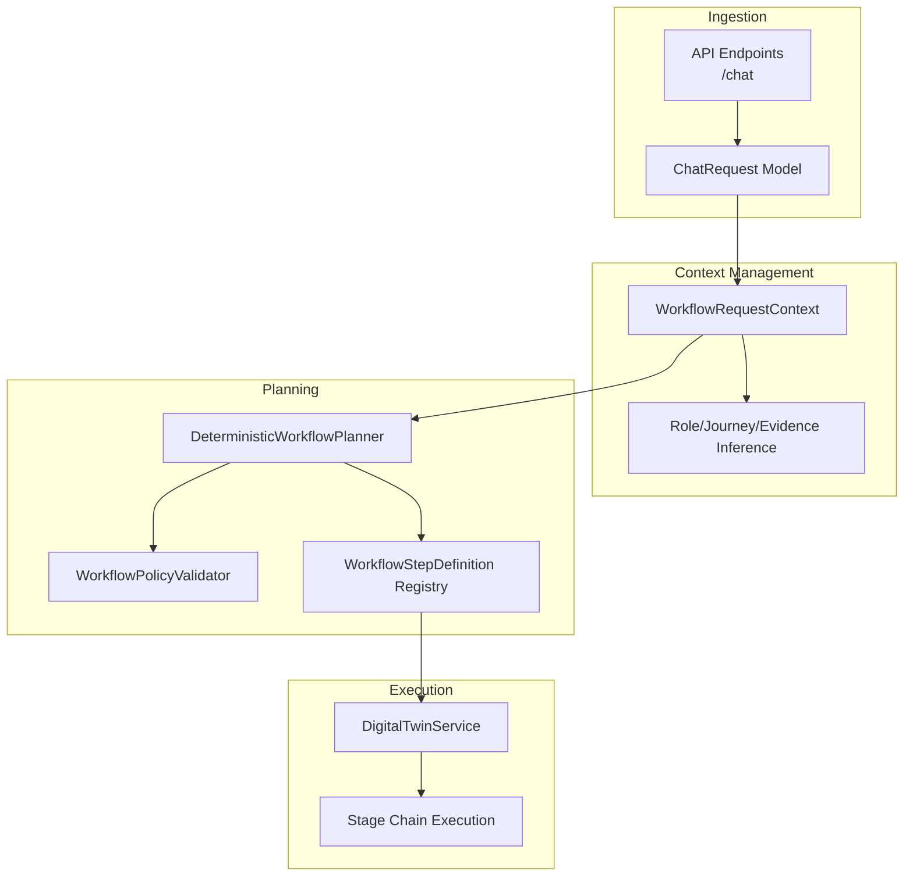
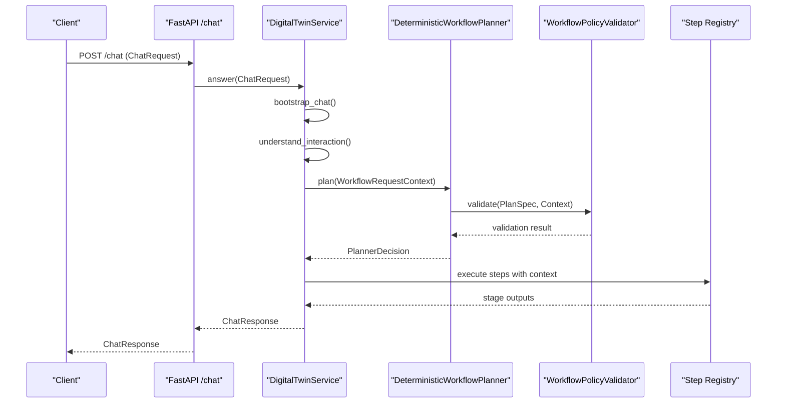
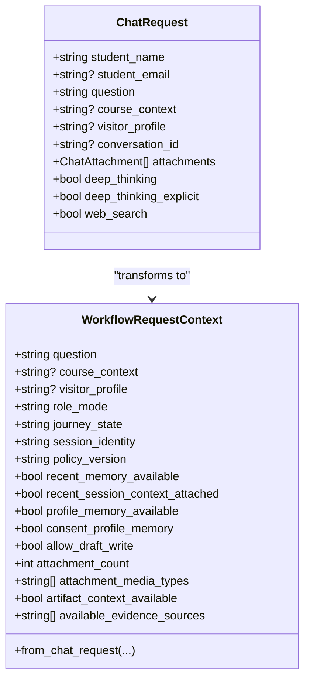
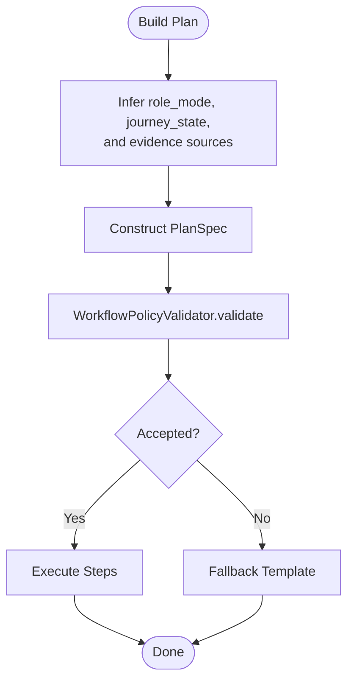
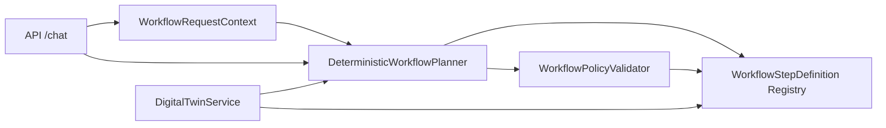
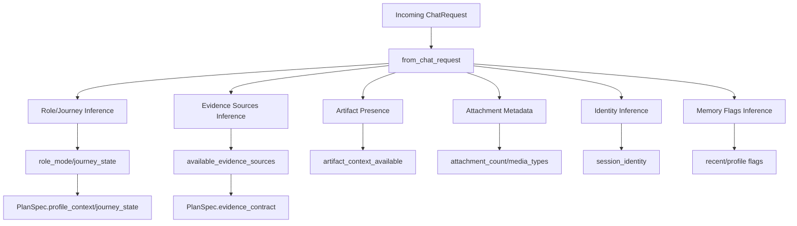

# Workflow Context

<cite>
**Referenced Files in This Document**
- [workflow_context.py](file://src/sage_faculty_twin/workflow_context.py)
- [models.py](file://src/sage_faculty_twin/models.py)
- [workflow_planner.py](file://src/sage_faculty_twin/workflow_planner.py)
- [workflow_policy.py](file://src/sage_faculty_twin/workflow_policy.py)
- [workflow_steps.py](file://src/sage_faculty_twin/workflow_steps.py)
- [api.py](file://src/sage_faculty_twin/api.py)
- [service.py](file://src/sage_faculty_twin/service.py)
</cite>

## Table of Contents
1. [Introduction](#introduction)
2. [Project Structure](#project-structure)
3. [Core Components](#core-components)
4. [Architecture Overview](#architecture-overview)
5. [Detailed Component Analysis](#detailed-component-analysis)
6. [Dependency Analysis](#dependency-analysis)
7. [Performance Considerations](#performance-considerations)
8. [Troubleshooting Guide](#troubleshooting-guide)
9. [Conclusion](#conclusion)
10. [Appendices](#appendices)

## Introduction
This document explains the workflow context management system, focusing on how requests are transformed into a structured WorkflowRequestContext, how context fields influence planning and execution, and how context propagates across workflow steps. It covers context creation from incoming ChatRequest, validation and transformation rules, enrichment and persistence signals, and practical usage patterns across the workflow. Guidance is also provided for extending context models and implementing custom context processors.

## Project Structure
The workflow context system spans several modules:
- Request modeling and parsing: ChatRequest and API endpoints
- Context model and enrichment: WorkflowRequestContext and inference helpers
- Planning and policy enforcement: DeterministicWorkflowPlanner and WorkflowPolicyValidator
- Step registry and execution: WorkflowStepDefinition and step-level requirements
- Service orchestration: DigitalTwinService and stage execution

**Diagram sources**
- [api.py:618-700](file://src/sage_faculty_twin/api.py#L618-L700)
- [models.py:16-31](file://src/sage_faculty_twin/models.py#L16-L31)
- [workflow_context.py:12-112](file://src/sage_faculty_twin/workflow_context.py#L12-L112)
- [workflow_planner.py:90-425](file://src/sage_faculty_twin/workflow_planner.py#L90-L425)
- [workflow_policy.py:64-199](file://src/sage_faculty_twin/workflow_policy.py#L64-L199)
- [workflow_steps.py:9-176](file://src/sage_faculty_twin/workflow_steps.py#L9-L176)
- [service.py:635-775](file://src/sage_faculty_twin/service.py#L635-L775)

**Section sources**
- [api.py:618-700](file://src/sage_faculty_twin/api.py#L618-L700)
- [models.py:16-31](file://src/sage_faculty_twin/models.py#L16-L31)
- [workflow_context.py:12-112](file://src/sage_faculty_twin/workflow_context.py#L12-L112)
- [workflow_planner.py:90-425](file://src/sage_faculty_twin/workflow_planner.py#L90-L425)
- [workflow_policy.py:64-199](file://src/sage_faculty_twin/workflow_policy.py#L64-L199)
- [workflow_steps.py:9-176](file://src/sage_faculty_twin/workflow_steps.py#L9-L176)
- [service.py:635-775](file://src/sage_faculty_twin/service.py#L635-L775)

## Core Components
- WorkflowRequestContext: Central context DTO capturing question, identity, role, journey, policy version, memory availability flags, attachment metadata, and computed evidence sources.
- ChatRequest: Incoming request model parsed by API endpoints; serves as the primary input to context creation.
- DeterministicWorkflowPlanner: Builds plans based on context and question heuristics; enforces policy and evidence contracts.
- WorkflowPolicyValidator: Validates plan against policy constraints and context availability.
- WorkflowStepDefinition: Defines step inputs/outputs, side effects, and timeouts; used by planner and validator.
- DigitalTwinService: Orchestrates stages and maintains ChatWorkflowContext during execution.

Key responsibilities:
- Context creation: from ChatRequest with identity inference, memory flags, attachment metadata, and evidence source inference.
- Validation: ensures plan adheres to policy, allowed evidence sources, and side-effect constraints.
- Execution: maps context fields into step inputs and drives side effects (e.g., memory writebacks).

**Section sources**
- [workflow_context.py:12-112](file://src/sage_faculty_twin/workflow_context.py#L12-L112)
- [models.py:16-31](file://src/sage_faculty_twin/models.py#L16-L31)
- [workflow_planner.py:90-425](file://src/sage_faculty_twin/workflow_planner.py#L90-L425)
- [workflow_policy.py:64-199](file://src/sage_faculty_twin/workflow_policy.py#L64-L199)
- [workflow_steps.py:9-176](file://src/sage_faculty_twin/workflow_steps.py#L9-L176)
- [service.py:635-775](file://src/sage_faculty_twin/service.py#L635-L775)

## Architecture Overview
The system transforms an incoming ChatRequest into a WorkflowRequestContext, which is then consumed by the planner to produce a PlanSpec. The plan is validated against policy, and the resulting steps are executed by the service with context propagated across stages.

**Diagram sources**
- [api.py:618-700](file://src/sage_faculty_twin/api.py#L618-L700)
- [service.py:635-775](file://src/sage_faculty_twin/service.py#L635-L775)
- [workflow_planner.py:110-133](file://src/sage_faculty_twin/workflow_planner.py#L110-L133)
- [workflow_policy.py:74-199](file://src/sage_faculty_twin/workflow_policy.py#L74-L199)
- [workflow_steps.py:179-184](file://src/sage_faculty_twin/workflow_steps.py#L179-L184)

## Detailed Component Analysis

### WorkflowRequestContext Model
WorkflowRequestContext encapsulates all context fields used across planning and execution:
- question: primary query text
- course_context: optional course context
- visitor_profile: visitor categorization
- role_mode: inferred role mode (e.g., front_desk, course_instructor, paper_writing_teacher, research_pi, collaboration_contact, system_operator)
- journey_state: inferred journey state (e.g., first_time_visitor, course_student, meeting_candidate, project_advisee, recurring_collaborator, lab_member, high_priority_escalation)
- session_identity: identity mode (anonymous, user, admin)
- policy_version: policy identifier
- recent_memory_available, recent_session_context_attached, profile_memory_available, consent_profile_memory: memory availability flags
- allow_draft_write: capability flag for draft writes
- attachment_count, attachment_media_types: attachment metadata
- artifact_context_available: whether artifact-related context is present
- available_evidence_sources: computed set of allowed evidence sources

Context creation and transformation:
- from_chat_request: constructs context from ChatRequest, infers identity, memory flags, consent, attachments, artifact presence, role_mode, journey_state, and evidence sources.

Inference functions:
- _infer_role_mode: maps question and visitor profile to role_mode using keyword markers.
- _infer_journey_state: maps urgency, meeting intent, and history markers to journey_state.
- _infer_evidence_sources: builds allowed sources from context flags and question markers.
- _question_mentions_artifact: detects artifact-related keywords.

**Diagram sources**
- [models.py:16-31](file://src/sage_faculty_twin/models.py#L16-L31)
- [workflow_context.py:12-112](file://src/sage_faculty_twin/workflow_context.py#L12-L112)

**Section sources**
- [workflow_context.py:12-112](file://src/sage_faculty_twin/workflow_context.py#L12-L112)
- [models.py:16-31](file://src/sage_faculty_twin/models.py#L16-L31)

### Context Validation and Transformation
Validation occurs in two phases:
- Planner decision: DeterministicWorkflowPlanner builds a PlanSpec and evaluates it with WorkflowPolicyValidator.
- Policy validation: Ensures plan’s steps, inputs/outputs, side effects, latency budget, and evidence sources align with policy and context.

Key checks:
- Policy version alignment
- Max stage count and latency budget
- Step registration and signature matching
- Side effect permissions and draft-write capability
- Evidence source availability and policy compliance
- Consent gating for profile memory

**Diagram sources**
- [workflow_planner.py:114-133](file://src/sage_faculty_twin/workflow_planner.py#L114-L133)
- [workflow_policy.py:74-199](file://src/sage_faculty_twin/workflow_policy.py#L74-L199)

**Section sources**
- [workflow_planner.py:114-133](file://src/sage_faculty_twin/workflow_planner.py#L114-L133)
- [workflow_policy.py:74-199](file://src/sage_faculty_twin/workflow_policy.py#L74-L199)

### Context Fields and Their Roles
- question: primary driver for role/journey inference and evidence source selection.
- session_identity: gates admin-only steps and draft-write permissions.
- role_mode/journey_state: guide planner goals and step inclusion.
- memory flags: control retrieval and side-effect steps.
- evidence sources: constrain grounding and citations.
- attachments: augment artifact context and influence retrieval choices.

Practical usage examples:
- Role inference selects appropriate knowledge backends and prompts.
- Journey state influences whether profile memory is considered.
- Evidence sources restrict allowed citations and enforce consent.
- Attachment metadata informs artifact memory retrieval and drafting.

**Section sources**
- [workflow_context.py:115-261](file://src/sage_faculty_twin/workflow_context.py#L115-L261)
- [workflow_planner.py:579-653](file://src/sage_faculty_twin/workflow_planner.py#L579-L653)
- [workflow_policy.py:15-38](file://src/sage_faculty_twin/workflow_policy.py#L15-L38)

### Context Propagation and Decision Making
Context flows through stages:
- Bootstrap: initialize ChatWorkflowContext and recent session context.
- Understand interaction: derive intent and decision mode from context.
- Plan: build plan using role_mode and journey_state.
- Execute: run steps with inputs drawn from context and outputs fed back into context.

Context-based decisions:
- Whether to include recent/profile/artifact memory depends on flags and question markers.
- Risk level and fallback templates depend on side effects and evidence contract.
- Draft writes are gated by allow_draft_write and policy configuration.

**Section sources**
- [service.py:635-775](file://src/sage_faculty_twin/service.py#L635-L775)
- [workflow_planner.py:179-425](file://src/sage_faculty_twin/workflow_planner.py#L179-L425)
- [workflow_steps.py:23-176](file://src/sage_faculty_twin/workflow_steps.py#L23-L176)

### Context Persistence Signals
Persistence-related fields:
- allow_draft_write: enables draft writeback steps.
- profile_memory_available and consent_profile_memory: gate profile memory retrieval and use.
- artifact_context_available: triggers artifact memory retrieval and writeback steps.
- recent_memory_available and recent_session_context_attached: influence recent memory retrieval.

These flags are derived from request metadata and question content, ensuring persistence actions are contextually justified and policy-compliant.

**Section sources**
- [workflow_context.py:38-112](file://src/sage_faculty_twin/workflow_context.py#L38-L112)
- [workflow_planner.py:579-653](file://src/sage_faculty_twin/workflow_planner.py#L579-L653)
- [workflow_policy.py:15-38](file://src/sage_faculty_twin/workflow_policy.py#L15-L38)

### Extending Context Models and Custom Processors
Guidance for extension:
- Add new fields to WorkflowRequestContext with appropriate validators and defaults.
- Extend inference functions (_infer_role_mode, _infer_journey_state, _infer_evidence_sources) to incorporate new signals.
- Update planner heuristics to conditionally include steps based on new fields.
- Register new step definitions in WorkflowStepDefinition and update the step registry.
- Ensure policy allows new side effects and evidence sources where applicable.
- Add tests covering new inference logic and planner behavior.

Implementation anchors:
- Context creation: WorkflowRequestContext.from_chat_request
- Inference: _infer_role_mode, _infer_journey_state, _infer_evidence_sources
- Planner: DeterministicWorkflowPlanner._build_plan and related helpers
- Policy: WorkflowPolicyValidator.validate
- Steps: WorkflowStepDefinition and registry

**Section sources**
- [workflow_context.py:38-112](file://src/sage_faculty_twin/workflow_context.py#L38-L112)
- [workflow_planner.py:179-425](file://src/sage_faculty_twin/workflow_planner.py#L179-L425)
- [workflow_policy.py:64-199](file://src/sage_faculty_twin/workflow_policy.py#L64-L199)
- [workflow_steps.py:9-176](file://src/sage_faculty_twin/workflow_steps.py#L9-L176)

## Dependency Analysis
The following diagram highlights key dependencies among context, planning, and policy components.

**Diagram sources**
- [workflow_context.py:12-112](file://src/sage_faculty_twin/workflow_context.py#L12-L112)
- [workflow_planner.py:90-425](file://src/sage_faculty_twin/workflow_planner.py#L90-L425)
- [workflow_policy.py:64-199](file://src/sage_faculty_twin/workflow_policy.py#L64-L199)
- [workflow_steps.py:9-176](file://src/sage_faculty_twin/workflow_steps.py#L9-L176)
- [api.py:618-700](file://src/sage_faculty_twin/api.py#L618-L700)
- [service.py:635-775](file://src/sage_faculty_twin/service.py#L635-L775)

**Section sources**
- [workflow_context.py:12-112](file://src/sage_faculty_twin/workflow_context.py#L12-L112)
- [workflow_planner.py:90-425](file://src/sage_faculty_twin/workflow_planner.py#L90-L425)
- [workflow_policy.py:64-199](file://src/sage_faculty_twin/workflow_policy.py#L64-L199)
- [workflow_steps.py:9-176](file://src/sage_faculty_twin/workflow_steps.py#L9-L176)
- [api.py:618-700](file://src/sage_faculty_twin/api.py#L618-L700)
- [service.py:635-775](file://src/sage_faculty_twin/service.py#L635-L775)

## Performance Considerations
- Context inference is lightweight and driven by string matching; keep keyword sets concise and localized.
- Evidence source computation is O(N) over the number of sources; maintain a small, ordered set.
- Planner latency budgets are enforced per step; tune timeout_budget_ms in step definitions to meet SLAs.
- Policy validation adds minimal overhead; ensure policy files are cached and loaded once per process.

## Troubleshooting Guide
Common issues and resolutions:
- Unexpected role_mode or journey_state:
  - Verify question markers and visitor_profile values.
  - Confirm inference functions are updated for new markers.
- Evidence contract violations:
  - Check available_evidence_sources vs. policy allowed sources.
  - Ensure consent_profile_memory is set when profile_memory is requested.
- Exceeded stage count or latency:
  - Review planner heuristics and reduce included steps.
  - Adjust step timeout_budget_ms to reflect realistic costs.
- Admin-only step failures:
  - Confirm session_identity is admin and allow_draft_write is true.
- Attachment-related retrieval missing:
  - Ensure artifact_context_available is true and attachments are present.

**Section sources**
- [workflow_context.py:210-261](file://src/sage_faculty_twin/workflow_context.py#L210-L261)
- [workflow_planner.py:579-653](file://src/sage_faculty_twin/workflow_planner.py#L579-L653)
- [workflow_policy.py:164-193](file://src/sage_faculty_twin/workflow_policy.py#L164-L193)

## Conclusion
The workflow context system provides a robust, policy-enforced mechanism for transforming raw requests into actionable plans. By structuring context fields around identity, role, journey, memory availability, and evidence sources—and by enforcing strict validation—the system ensures safe, predictable, and extensible behavior across steps and persistence operations.

## Appendices

### Appendix A: Context Creation Flow

**Diagram sources**
- [workflow_context.py:38-112](file://src/sage_faculty_twin/workflow_context.py#L38-L112)
- [workflow_context.py:210-261](file://src/sage_faculty_twin/workflow_context.py#L210-L261)