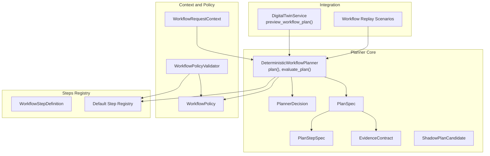
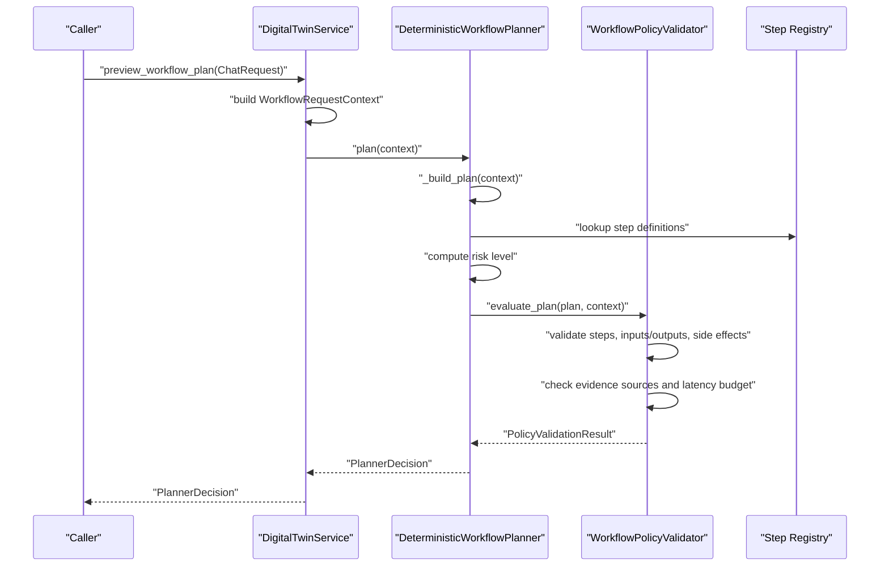
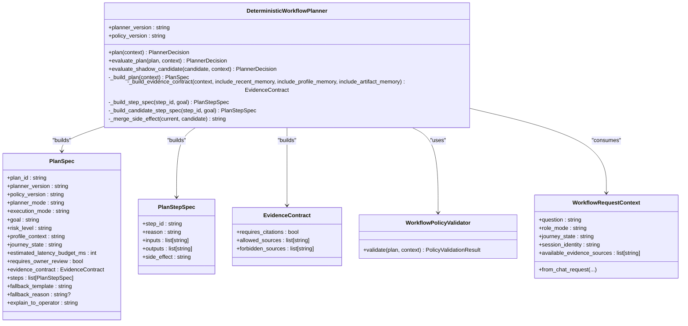
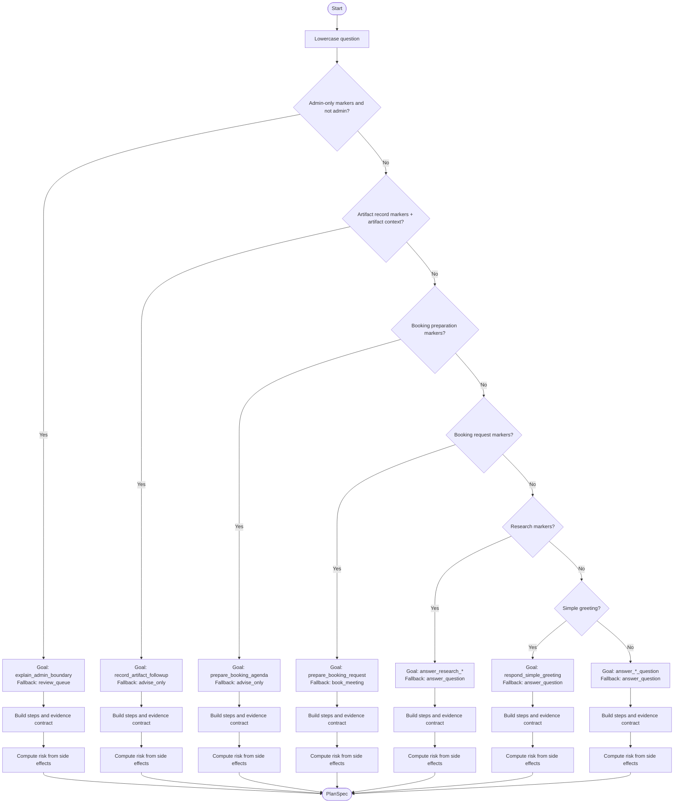
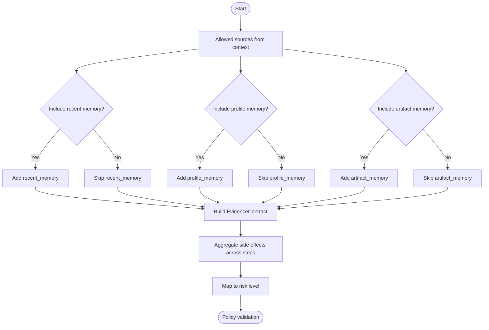
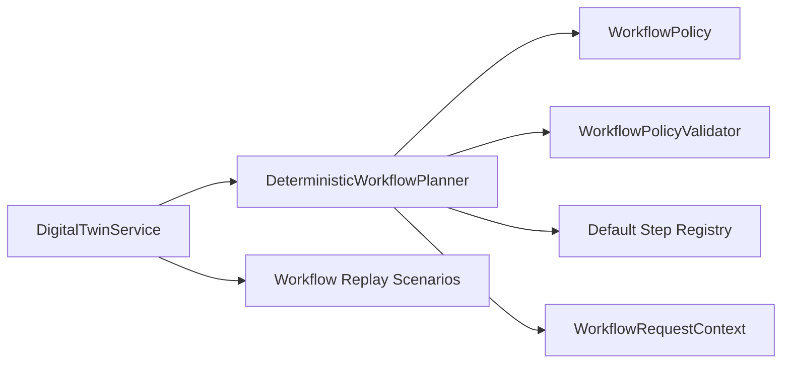

# Workflow Planner

<cite>
**Referenced Files in This Document**
- [workflow_planner.py](file://src/sage_faculty_twin/workflow_planner.py)
- [workflow_steps.py](file://src/sage_faculty_twin/workflow_steps.py)
- [workflow_context.py](file://src/sage_faculty_twin/workflow_context.py)
- [workflow_policy.py](file://src/sage_faculty_twin/workflow_policy.py)
- [workflow_eval.py](file://src/sage_faculty_twin/workflow_eval.py)
- [service.py](file://src/sage_faculty_twin/service.py)
- [faculty-default-2026-05.json](file://data/workflow_policies/faculty-default-2026-05.json)
- [v3_preview_scenarios.json](file://data/workflow_scenarios/v3_preview_scenarios.json)
</cite>

## Table of Contents
1. [Introduction](#introduction)
2. [Project Structure](#project-structure)
3. [Core Components](#core-components)
4. [Architecture Overview](#architecture-overview)
5. [Detailed Component Analysis](#detailed-component-analysis)
6. [Dependency Analysis](#dependency-analysis)
7. [Performance Considerations](#performance-considerations)
8. [Troubleshooting Guide](#troubleshooting-guide)
9. [Conclusion](#conclusion)
10. [Appendices](#appendices)

## Introduction
This document explains the DeterministicWorkflowPlanner and the broader workflow planning architecture. It covers the deterministic planning algorithm, intent classification logic, plan generation, planner modes, execution modes, risk assessment, evidence contracts, plan specification, fallback mechanisms, and side-effect management. It also provides guidance on extending the planner with new intent classifiers and plan templates.

## Project Structure
The workflow planner lives in the Sage Faculty Twin codebase under src/sage_faculty_twin and integrates with the broader service runtime. The key modules are:
- Planner and plan models: workflow_planner.py
- Step registry and definitions: workflow_steps.py
- Request context builder: workflow_context.py
- Policy and validation: workflow_policy.py
- Evaluation and replay: workflow_eval.py
- Service integration: service.py
- Policy and scenario data: data/workflow_policies/*.json and data/workflow_scenarios/*.json

**Diagram sources**
- [workflow_planner.py:90-133](file://src/sage_faculty_twin/workflow_planner.py#L90-L133)
- [workflow_steps.py:9-21](file://src/sage_faculty_twin/workflow_steps.py#L9-L21)
- [workflow_context.py:12-37](file://src/sage_faculty_twin/workflow_context.py#L12-L37)
- [workflow_policy.py:15-48](file://src/sage_faculty_twin/workflow_policy.py#L15-L48)
- [workflow_eval.py:13-34](file://src/sage_faculty_twin/workflow_eval.py#L13-L34)
- [service.py:5506-5523](file://src/sage_faculty_twin/service.py#L5506-L5523)

**Section sources**
- [workflow_planner.py:110-133](file://src/sage_faculty_twin/workflow_planner.py#L110-L133)
- [workflow_steps.py:179-183](file://src/sage_faculty_twin/workflow_steps.py#L179-L183)
- [workflow_context.py:38-112](file://src/sage_faculty_twin/workflow_context.py#L38-L112)
- [workflow_policy.py:64-199](file://src/sage_faculty_twin/workflow_policy.py#L64-L199)
- [workflow_eval.py:53-94](file://src/sage_faculty_twin/workflow_eval.py#L53-L94)
- [service.py:5506-5523](file://src/sage_faculty_twin/service.py#L5506-L5523)

## Core Components
- DeterministicWorkflowPlanner: Central orchestrator that builds plans from requests, applies intent classification, selects steps, computes risk, and validates against policy.
- PlanSpec, PlanStepSpec, EvidenceContract: Typed plan representation and evidence contract.
- WorkflowRequestContext: Normalized request context derived from ChatRequest.
- WorkflowStepDefinition and default registry: Step definitions with side effects, timeouts, and retry policies.
- WorkflowPolicy and WorkflowPolicyValidator: Policy enforcement and risk/risk-level alignment.
- ShadowPlanCandidate: Candidate plan for LLM shadow mode evaluation.
- PlannerDecision: Final decision with acceptance, validation errors, and fallback.

**Section sources**
- [workflow_planner.py:90-133](file://src/sage_faculty_twin/workflow_planner.py#L90-L133)
- [workflow_steps.py:9-21](file://src/sage_faculty_twin/workflow_steps.py#L9-L21)
- [workflow_context.py:12-37](file://src/sage_faculty_twin/workflow_context.py#L12-L37)
- [workflow_policy.py:15-48](file://src/sage_faculty_twin/workflow_policy.py#L15-L48)

## Architecture Overview
The planner operates in two primary modes:
- Deterministic mode: Uses intent classification and fixed step sequences to produce a plan.
- LLM shadow mode: Proposes a candidate plan and validates it against policy before acceptance.

Execution modes:
- shadow_or_template: Prefer deterministic plan; fall back to template if needed.
- template_only: Execute a pre-defined template plan.
- live_plan: Execute a plan generated by an LLM (not covered here).

Risk assessment:
- Side effects are aggregated across steps to compute a risk level aligned with policy.

**Diagram sources**
- [service.py:5506-5523](file://src/sage_faculty_twin/service.py#L5506-L5523)
- [workflow_planner.py:110-133](file://src/sage_faculty_twin/workflow_planner.py#L110-L133)
- [workflow_policy.py:74-199](file://src/sage_faculty_twin/workflow_policy.py#L74-L199)

## Detailed Component Analysis

### DeterministicWorkflowPlanner
- Responsibilities:
  - Build a deterministic plan from a request context.
  - Evaluate the plan against policy to produce a PlannerDecision.
  - Support shadow candidate evaluation for LLM shadow mode.
- Key methods:
  - plan(context): orchestrates building and evaluating.
  - evaluate_plan(plan, context): runs policy validation and constructs PlannerDecision.
  - evaluate_shadow_candidate(candidate, context): converts a candidate into a PlanSpec and evaluates.
  - _build_plan(context): intent-driven plan selection and step assembly.
  - _build_evidence_contract(...): composes allowed/forbidden sources based on context and inclusion flags.
  - _build_step_spec(step_id, goal): maps registry definitions to PlanStepSpec.
  - _merge_side_effect(a, b): aggregates side effects to compute risk.

**Diagram sources**
- [workflow_planner.py:90-133](file://src/sage_faculty_twin/workflow_planner.py#L90-L133)
- [workflow_planner.py:179-425](file://src/sage_faculty_twin/workflow_planner.py#L179-L425)
- [workflow_policy.py:64-199](file://src/sage_faculty_twin/workflow_policy.py#L64-L199)
- [workflow_context.py:12-37](file://src/sage_faculty_twin/workflow_context.py#L12-L37)

**Section sources**
- [workflow_planner.py:90-133](file://src/sage_faculty_twin/workflow_planner.py#L90-L133)
- [workflow_planner.py:179-425](file://src/sage_faculty_twin/workflow_planner.py#L179-L425)
- [workflow_planner.py:427-446](file://src/sage_faculty_twin/workflow_planner.py#L427-L446)
- [workflow_planner.py:452-472](file://src/sage_faculty_twin/workflow_planner.py#L452-L472)
- [workflow_planner.py:474-476](file://src/sage_faculty_twin/workflow_planner.py#L474-L476)

### Intent Classification and Plan Generation
The planner’s intent classification logic drives plan selection:
- Admin-only boundary checks: routes to explain boundary and queue review when admin-only markers appear and the session is not admin.
- Artifact record requests: builds a plan that records artifact memory with a reviewable draft.
- Booking preparation vs booking request: distinguishes between preparing agenda (read-only) and executing a booking (deferred to template).
- Research questions: combines hybrid knowledge with optional profile memory and artifact memory.
- Simple greeting: lightweight plan avoiding retrieval.
- General grounded questions: selects between hybrid knowledge and recent memory depending on context and course context.

**Diagram sources**
- [workflow_planner.py:179-425](file://src/sage_faculty_twin/workflow_planner.py#L179-L425)
- [workflow_planner.py:503-659](file://src/sage_faculty_twin/workflow_planner.py#L503-L659)

**Section sources**
- [workflow_planner.py:179-425](file://src/sage_faculty_twin/workflow_planner.py#L179-L425)
- [workflow_planner.py:503-659](file://src/sage_faculty_twin/workflow_planner.py#L503-L659)

### Evidence Contracts and Risk Assessment
EvidenceContract defines:
- requires_citations: whether answers must cite sources.
- allowed_sources: permitted evidence sources given context and inclusion flags.
- forbidden_sources: restricted sources (e.g., private student records without consent).

Risk assessment:
- Strongest side effect across steps is computed and mapped to a risk level.
- Policy enforces maximum stage count, latency budget, and allowed evidence sources.

**Diagram sources**
- [workflow_planner.py:427-446](file://src/sage_faculty_twin/workflow_planner.py#L427-L446)
- [workflow_policy.py:146-199](file://src/sage_faculty_twin/workflow_policy.py#L146-L199)

**Section sources**
- [workflow_planner.py:427-446](file://src/sage_faculty_twin/workflow_planner.py#L427-L446)
- [workflow_policy.py:146-199](file://src/sage_faculty_twin/workflow_policy.py#L146-L199)

### Planner Modes and Execution Modes
- Planner modes:
  - deterministic: default deterministic plan built from intent classification.
  - llm_shadow: candidate plan proposed by LLM and validated.
  - llm_live: plan generated by LLM (not implemented here).
- Execution modes:
  - shadow_or_template: prefer deterministic plan; fall back to template if needed.
  - template_only: execute a predefined template plan.
  - live_plan: execute an LLM-generated plan (not covered here).

These modes are encoded in PlanSpec and enforced during evaluation.

**Section sources**
- [workflow_planner.py:53-72](file://src/sage_faculty_twin/workflow_planner.py#L53-L72)
- [workflow_planner.py:135-177](file://src/sage_faculty_twin/workflow_planner.py#L135-L177)

### Fallback Mechanisms
- PlannerFallback captures fallback_template and reason when validation fails.
- evaluate_plan returns a PlannerDecision with fallback populated when validation errors are present.
- Shadow candidate evaluation also returns fallback information when rejected.

**Section sources**
- [workflow_planner.py:74-88](file://src/sage_faculty_twin/workflow_planner.py#L74-L88)
- [workflow_planner.py:114-133](file://src/sage_faculty_twin/workflow_planner.py#L114-L133)
- [workflow_planner.py:135-177](file://src/sage_faculty_twin/workflow_planner.py#L135-L177)

### Step Registry and Side Effects
- WorkflowStepDefinition defines:
  - step_id, description, required inputs, produced outputs, side_effect, admin_only flag, timeout_budget_ms, retry_policy, trace_key.
- Default step registry includes read-only and write steps with side effects:
  - none, draft_write, owner_review, admin_only.
- Side effects drive risk level computation and policy gating.

**Section sources**
- [workflow_steps.py:9-21](file://src/sage_faculty_twin/workflow_steps.py#L9-L21)
- [workflow_steps.py:23-174](file://src/sage_faculty_twin/workflow_steps.py#L23-L174)
- [workflow_steps.py:179-183](file://src/sage_faculty_twin/workflow_steps.py#L179-L183)
- [workflow_policy.py:202-214](file://src/sage_faculty_twin/workflow_policy.py#L202-L214)

### Plan Specification Examples
- Deterministic plan: constructed from intent classification and step registry lookups.
- Shadow candidate plan: built from a list of step IDs and evaluated against policy.
- Evidence contract: composed from context flags and forbidden sources.

Examples of plan goals and fallback templates are demonstrated in tests and scenarios.

**Section sources**
- [workflow_planner.py:179-425](file://src/sage_faculty_twin/workflow_planner.py#L179-L425)
- [workflow_planner.py:135-177](file://src/sage_faculty_twin/workflow_planner.py#L135-L177)
- [workflow_eval.py:13-34](file://src/sage_faculty_twin/workflow_eval.py#L13-L34)

### Extending the Planner
- Adding new intent classifiers:
  - Extend the intent detection logic in _build_plan(...) with new heuristics and goal assignments.
  - Ensure the new goal maps to a sensible fallback template and step sequence.
- Adding new plan templates:
  - Define new step sequences for the goal in _build_plan(...).
  - Optionally add new step IDs to the registry if needed.
- Updating policy:
  - Modify allowed_write_step_ids and allowed_evidence_sources in the policy JSON to enable new steps or sources.
- Validation:
  - Use WorkflowPolicyValidator to ensure new plans satisfy policy constraints.

**Section sources**
- [workflow_planner.py:179-425](file://src/sage_faculty_twin/workflow_planner.py#L179-L425)
- [workflow_steps.py:23-174](file://src/sage_faculty_twin/workflow_steps.py#L23-L174)
- [faculty-default-2026-05.json:20-22](file://data/workflow_policies/faculty-default-2026-05.json#L20-L22)

## Dependency Analysis
- Planner depends on:
  - WorkflowRequestContext for normalized inputs.
  - WorkflowPolicy and WorkflowPolicyValidator for enforcement.
  - Default step registry for step definitions and side effects.
- Service integration:
  - DigitalTwinService constructs context and delegates planning to DeterministicWorkflowPlanner.
  - Supports shadow comparison and evaluation replay scenarios.

**Diagram sources**
- [service.py:5506-5523](file://src/sage_faculty_twin/service.py#L5506-L5523)
- [workflow_planner.py:90-133](file://src/sage_faculty_twin/workflow_planner.py#L90-L133)
- [workflow_policy.py:64-199](file://src/sage_faculty_twin/workflow_policy.py#L64-L199)
- [workflow_steps.py:179-183](file://src/sage_faculty_twin/workflow_steps.py#L179-L183)

**Section sources**
- [service.py:5506-5523](file://src/sage_faculty_twin/service.py#L5506-L5523)
- [workflow_planner.py:90-133](file://src/sage_faculty_twin/workflow_planner.py#L90-L133)
- [workflow_policy.py:64-199](file://src/sage_faculty_twin/workflow_policy.py#L64-L199)
- [workflow_steps.py:179-183](file://src/sage_faculty_twin/workflow_steps.py#L179-L183)

## Performance Considerations
- Latency budget:
  - Each step has a timeout_budget_ms; total latency is summed and compared against estimated_latency_budget_ms.
  - Policy enforces max_latency_budget_ms.
- Step count:
  - Policy limits max_stage_count to prevent overly long plans.
- Lightweight greetings:
  - Avoid retrieval steps to minimize latency for simple queries.

**Section sources**
- [workflow_steps.py:18-19](file://src/sage_faculty_twin/workflow_steps.py#L18-L19)
- [workflow_policy.py:20-21](file://src/sage_faculty_twin/workflow_policy.py#L20-L21)
- [workflow_policy.py:152-162](file://src/sage_faculty_twin/workflow_policy.py#L152-L162)
- [workflow_planner.py:395-397](file://src/sage_faculty_twin/workflow_planner.py#L395-L397)

## Troubleshooting Guide
Common issues and resolutions:
- Validation errors:
  - Steps not registered, mismatched inputs/outputs, side effect mismatches, admin-only steps without admin session, draft-write capability required but not granted, exceeding stage count or latency budget, referencing unavailable or forbidden evidence sources, profile memory without consent.
- Evidence contract violations:
  - Allowed sources include unavailable sources from context or policy unknown sources; forbidden sources referenced.
- Risk level mismatch:
  - Plan risk level does not align with the strongest side effect across steps.

Use PlannerDecision.validation_errors to diagnose and address these issues.

**Section sources**
- [workflow_policy.py:74-199](file://src/sage_faculty_twin/workflow_policy.py#L74-L199)
- [workflow_planner.py:114-133](file://src/sage_faculty_twin/workflow_planner.py#L114-L133)

## Conclusion
The DeterministicWorkflowPlanner provides a robust, policy-enforced, deterministic workflow planning system. It classifies intents, selects appropriate steps, manages side effects and risk, and ensures plans adhere to evidence contracts and latency budgets. The architecture supports extension via new intent classifiers, plan templates, and policy updates, while maintaining safety and auditability through shadow evaluation and validation.

## Appendices

### Appendix A: Example Scenarios and Expected Outcomes
- Tutorial 7 grounding: stays on course material, avoids booking steps.
- Research direction: uses research grounding and optional profile memory.
- Booking preparation: prepares agenda without drafting a booking.
- Artifact-aware research follow-up: uses artifact memory and hybrid knowledge.

**Section sources**
- [v3_preview_scenarios.json:1-161](file://data/workflow_scenarios/v3_preview_scenarios.json#L1-L161)

### Appendix B: Policy Configuration
- Allowed evidence sources and forbidden sources define what can be cited.
- Allowed write step IDs control which steps can write drafts.

**Section sources**
- [faculty-default-2026-05.json:6-22](file://data/workflow_policies/faculty-default-2026-05.json#L6-L22)