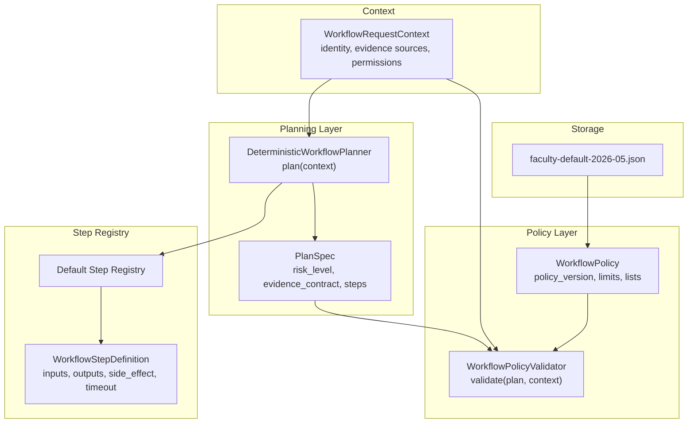
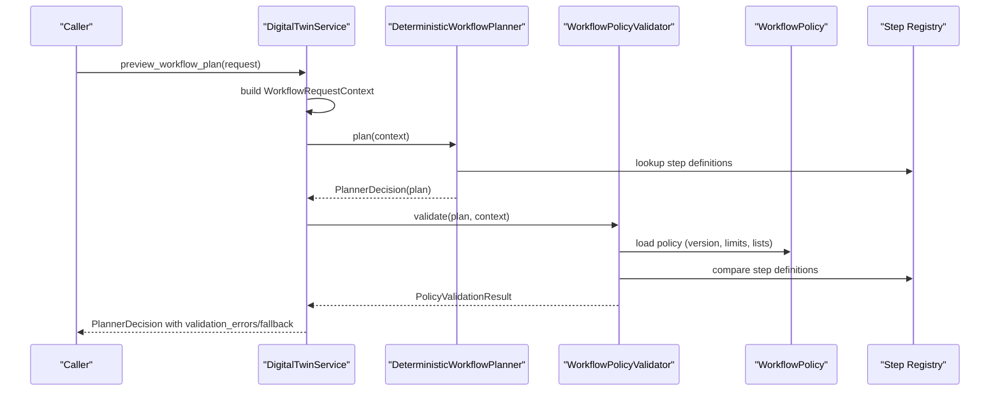
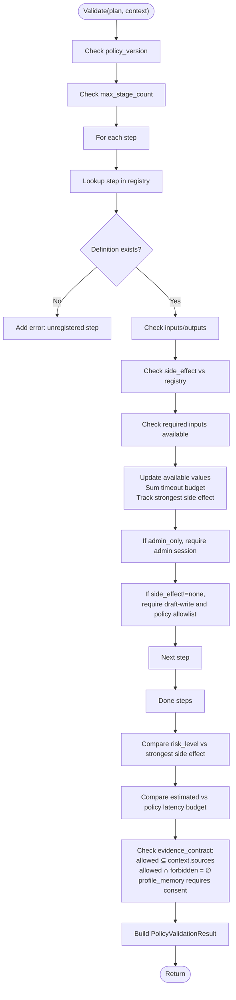
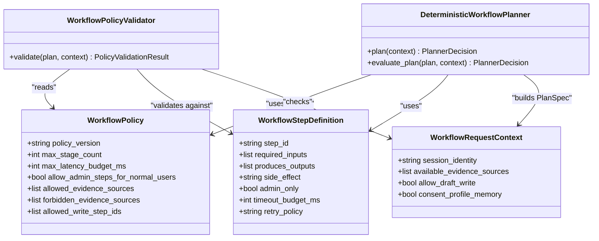

# Workflow Policy

<cite>
**Referenced Files in This Document**
- [workflow_policy.py](file://src/sage_faculty_twin/workflow_policy.py)
- [workflow_steps.py](file://src/sage_faculty_twin/workflow_steps.py)
- [workflow_context.py](file://src/sage_faculty_twin/workflow_context.py)
- [workflow_planner.py](file://src/sage_faculty_twin/workflow_planner.py)
- [workflow_eval.py](file://src/sage_faculty_twin/workflow_eval.py)
- [service.py](file://src/sage_faculty_twin/service.py)
- [faculty-default-2026-05.json](file://data/workflow_policies/faculty-default-2026-05.json)
- [test_workflow_policy.py](file://tests/test_workflow_policy.py)
</cite>

## Table of Contents
1. [Introduction](#introduction)
2. [Project Structure](#project-structure)
3. [Core Components](#core-components)
4. [Architecture Overview](#architecture-overview)
5. [Detailed Component Analysis](#detailed-component-analysis)
6. [Dependency Analysis](#dependency-analysis)
7. [Performance Considerations](#performance-considerations)
8. [Troubleshooting Guide](#troubleshooting-guide)
9. [Conclusion](#conclusion)
10. [Appendices](#appendices)

## Introduction
This document explains the workflow policy system that governs safe, auditable, and compliant execution of automated workflows. It covers policy evaluation, risk assessment, side effect management, policy structure, validator implementation, and policy versioning. It also documents how policies interact with the planner, steps, and context to ensure that plans adhere to organizational constraints and risk profiles.

## Project Structure
The policy system spans several modules:
- Policy model and validator: define policy structure, enforce constraints, and compute risk from side effects.
- Step registry: defines available steps, their inputs/outputs, side effects, and timeouts.
- Planner: builds plans and computes risk levels from step side effects.
- Context: captures session identity, available evidence sources, and permissions.
- Evaluation and testing: validate planner decisions against policy constraints.

**Diagram sources**
- [workflow_policy.py:15-215](file://src/sage_faculty_twin/workflow_policy.py#L15-L215)
- [workflow_steps.py:9-184](file://src/sage_faculty_twin/workflow_steps.py#L9-L184)
- [workflow_planner.py:90-425](file://src/sage_faculty_twin/workflow_planner.py#L90-L425)
- [workflow_context.py:12-112](file://src/sage_faculty_twin/workflow_context.py#L12-L112)
- [faculty-default-2026-05.json:1-23](file://data/workflow_policies/faculty-default-2026-05.json#L1-L23)

**Section sources**
- [workflow_policy.py:15-215](file://src/sage_faculty_twin/workflow_policy.py#L15-L215)
- [workflow_steps.py:9-184](file://src/sage_faculty_twin/workflow_steps.py#L9-L184)
- [workflow_planner.py:90-425](file://src/sage_faculty_twin/workflow_planner.py#L90-L425)
- [workflow_context.py:12-112](file://src/sage_faculty_twin/workflow_context.py#L12-L112)
- [faculty-default-2026-05.json:1-23](file://data/workflow_policies/faculty-default-2026-05.json#L1-L23)

## Core Components
- WorkflowPolicy: Defines policy version, operational limits, allowed and forbidden evidence sources, and allowed write step IDs.
- WorkflowPolicyValidator: Validates a plan against the policy, computing the strongest side effect and total latency, and checking evidence contracts and permissions.
- WorkflowStepDefinition: Describes each step’s inputs, outputs, side effect, admin-only flag, timeout budget, and retry policy.
- DeterministicWorkflowPlanner: Builds plans from context, computes risk level from the strongest side effect, and constructs evidence contracts.
- WorkflowRequestContext: Captures session identity, available evidence sources, and permissions (e.g., draft-write capability).
- Policy JSON: Default policy file loaded by the system.

Key behaviors:
- Risk levels are mapped from the strongest side effect across steps.
- Evidence contracts must align with allowed and forbidden sources and consent.
- Side effects gate whether steps requiring write capability are permitted under current context.

**Section sources**
- [workflow_policy.py:15-215](file://src/sage_faculty_twin/workflow_policy.py#L15-L215)
- [workflow_steps.py:9-184](file://src/sage_faculty_twin/workflow_steps.py#L9-L184)
- [workflow_planner.py:90-425](file://src/sage_faculty_twin/workflow_planner.py#L90-L425)
- [workflow_context.py:12-112](file://src/sage_faculty_twin/workflow_context.py#L12-L112)
- [faculty-default-2026-05.json:1-23](file://data/workflow_policies/faculty-default-2026-05.json#L1-L23)

## Architecture Overview
The policy system enforces constraints during planning and validation. The planner constructs a plan with steps and evidence contracts. The validator checks:
- Policy version alignment
- Stage count and latency budgets
- Step registration, inputs/outputs, and side effects
- Evidence contract compliance (allowed, forbidden, consent)
- Admin-only step gating
- Risk level consistency with the strongest side effect

**Diagram sources**
- [service.py:5506-5523](file://src/sage_faculty_twin/service.py#L5506-L5523)
- [workflow_planner.py:110-133](file://src/sage_faculty_twin/workflow_planner.py#L110-L133)
- [workflow_policy.py:64-215](file://src/sage_faculty_twin/workflow_policy.py#L64-L215)
- [workflow_steps.py:179-184](file://src/sage_faculty_twin/workflow_steps.py#L179-L184)

## Detailed Component Analysis

### Policy Structure and Versioning
- Policy version: Ensures plan and policy versions match.
- Operational limits:
  - max_stage_count: Upper bound on number of steps.
  - max_latency_budget_ms: Upper bound on total latency budget.
- Allowed and forbidden evidence sources: Control what knowledge/memory sources can be used.
- allowed_write_step_ids: Whitelist of steps that may produce side effects under current context.

Policy loading:
- Default path resolves to a JSON file containing the policy.
- The validator loads the policy and applies constraints during validation.

**Section sources**
- [workflow_policy.py:15-39](file://src/sage_faculty_twin/workflow_policy.py#L15-L39)
- [workflow_policy.py:50-61](file://src/sage_faculty_twin/workflow_policy.py#L50-L61)
- [faculty-default-2026-05.json:1-23](file://data/workflow_policies/faculty-default-2026-05.json#L1-L23)

### Risk Levels and Side Effects
Side effect taxonomy:
- none: No persistent change.
- draft_write: Creates drafts requiring review.
- owner_review: Requires owner-level review.
- admin_only: Requires admin identity.

Risk mapping:
- read_only: Strongest side effect none
- draft_write: Strongest side effect draft_write
- owner_review: Strongest side effect owner_review
- admin_only: Strongest side effect admin_only

Validator computes the strongest side effect across steps and compares it to the plan’s risk_level.

**Section sources**
- [workflow_policy.py:202-214](file://src/sage_faculty_twin/workflow_policy.py#L202-L214)
- [workflow_planner.py:405-415](file://src/sage_faculty_twin/workflow_planner.py#L405-L415)

### Evidence Contracts and Consent
EvidenceContract enforces:
- Allowed sources must be a subset of context.available_evidence_sources.
- Forbidden sources must not overlap with allowed sources.
- Explicit consent is required for profile_memory usage.

Consent and source inference:
- Context infers available_evidence_sources from request and flags like recent memory, profile memory, and artifacts.
- Consent flag gates profile_memory usage.

**Section sources**
- [workflow_planner.py:427-446](file://src/sage_faculty_twin/workflow_planner.py#L427-L446)
- [workflow_context.py:210-239](file://src/sage_faculty_twin/workflow_context.py#L210-L239)
- [workflow_policy.py:164-192](file://src/sage_faculty_twin/workflow_policy.py#L164-L192)

### Step Registry and Side Effect Enforcement
Each step defines:
- required_inputs and produces_outputs
- side_effect (none/draft_write/owner_review/admin_only)
- admin_only flag
- timeout_budget_ms
- retry_policy

Validator checks:
- Step ID exists in registry
- Inputs/outputs match registry
- Side effect matches registry
- Admin-only steps require admin session
- Non-none side effects require draft-write capability and policy whitelist

**Section sources**
- [workflow_steps.py:9-21](file://src/sage_faculty_twin/workflow_steps.py#L9-L21)
- [workflow_steps.py:23-174](file://src/sage_faculty_twin/workflow_steps.py#L23-L174)
- [workflow_policy.py:100-145](file://src/sage_faculty_twin/workflow_policy.py#L100-L145)

### Planner Integration and Risk Computation
The planner:
- Builds PlanSpec with steps, evidence contract, and risk_level computed from the strongest side effect.
- Computes estimated_latency_budget_ms as the sum of step timeout budgets.
- Enforces admin-only boundaries and evidence inclusion heuristics.

**Section sources**
- [workflow_planner.py:179-425](file://src/sage_faculty_twin/workflow_planner.py#L179-L425)
- [workflow_planner.py:427-446](file://src/sage_faculty_twin/workflow_planner.py#L427-L446)

### Validation Flow
The validator performs a comprehensive check:
- Policy version match
- Stage count limit
- Duplicate steps (acyclicity)
- Registry compliance (inputs/outputs/side effects)
- Admin-only gating
- Evidence contract compliance
- Latency budget comparison
- Risk level alignment

**Diagram sources**
- [workflow_policy.py:74-199](file://src/sage_faculty_twin/workflow_policy.py#L74-L199)

**Section sources**
- [workflow_policy.py:74-199](file://src/sage_faculty_twin/workflow_policy.py#L74-L199)

### Examples and Scenarios

- Default policy acceptance:
  - A read-only course plan is accepted under default policy.
  - The plan’s risk level equals the strongest side effect across steps.

- Custom policy:
  - A tighter policy reduces max_stage_count and disables write steps.
  - Plans exceeding limits are rejected with validation errors.

- Evidence contract violations:
  - Using forbidden sources or profile_memory without consent triggers errors.

- Admin-only steps:
  - Steps marked admin_only require admin session; otherwise validation fails.

**Section sources**
- [test_workflow_policy.py:29-58](file://tests/test_workflow_policy.py#L29-L58)
- [test_workflow_policy.py:60-100](file://tests/test_workflow_policy.py#L60-L100)
- [workflow_policy.py:164-192](file://src/sage_faculty_twin/workflow_policy.py#L164-L192)
- [workflow_planner.py:182-196](file://src/sage_faculty_twin/workflow_planner.py#L182-L196)

## Dependency Analysis
- Planner depends on:
  - WorkflowPolicy for version and limits
  - Step registry for step definitions
  - Context for identity and evidence sources
- Validator depends on:
  - Policy for constraints
  - Step registry for step definitions
  - Context for permissions and evidence sources
- Context influences:
  - Evidence contract construction
  - Draft-write allowance
  - Admin-only gating

**Diagram sources**
- [workflow_policy.py:15-215](file://src/sage_faculty_twin/workflow_policy.py#L15-L215)
- [workflow_steps.py:9-184](file://src/sage_faculty_twin/workflow_steps.py#L9-L184)
- [workflow_planner.py:90-133](file://src/sage_faculty_twin/workflow_planner.py#L90-L133)
- [workflow_context.py:12-112](file://src/sage_faculty_twin/workflow_context.py#L12-L112)

**Section sources**
- [workflow_policy.py:15-215](file://src/sage_faculty_twin/workflow_policy.py#L15-L215)
- [workflow_steps.py:9-184](file://src/sage_faculty_twin/workflow_steps.py#L9-L184)
- [workflow_planner.py:90-133](file://src/sage_faculty_twin/workflow_planner.py#L90-L133)
- [workflow_context.py:12-112](file://src/sage_faculty_twin/workflow_context.py#L12-L112)

## Performance Considerations
- Latency budget:
  - The planner sums per-step timeout budgets to estimate total latency.
  - The validator compares this against the plan’s estimated budget and the policy’s max latency budget.
- Stage count:
  - Excessive steps trigger early rejection to prevent long-running or complex plans.
- Evidence selection:
  - Inclusion of memory and knowledge sources impacts latency and cost; the planner balances retrieval depth with budget.

[No sources needed since this section provides general guidance]

## Troubleshooting Guide
Common validation failures and resolutions:
- Policy version mismatch:
  - Ensure plan.policy_version matches the loaded policy version.
- Stage count exceeded:
  - Reduce steps or adjust policy max_stage_count.
- Unregistered step or mismatched inputs/outputs/side effects:
  - Verify step_id exists in the registry and matches required inputs/outputs and side effect.
- Admin-only step without admin session:
  - Elevate session to admin or remove admin-only steps.
- Side-effect steps without draft-write capability:
  - Enable allow_draft_write or remove side-effect steps.
- Evidence contract violations:
  - Remove forbidden sources; ensure profile_memory consent is granted.
- Latency budget exceeded:
  - Simplify plan or increase policy max_latency_budget_ms.

Operational tips:
- Use the service’s preview endpoint to inspect PlannerDecision and validation_errors.
- Review fallback reasons to understand why a plan was rejected.

**Section sources**
- [workflow_policy.py:74-199](file://src/sage_faculty_twin/workflow_policy.py#L74-L199)
- [service.py:5506-5523](file://src/sage_faculty_twin/service.py#L5506-L5523)

## Conclusion
The workflow policy system provides a robust framework for safe, auditable automation. By enforcing strict constraints on steps, evidence usage, and permissions, and by mapping side effects to risk levels, it ensures that plans remain within acceptable operational bounds. The planner and validator collaborate closely with context and the step registry to maintain compliance and reliability across diverse use cases.

[No sources needed since this section summarizes without analyzing specific files]

## Appendices

### Appendix A: Example Policy Configuration
- Policy file location: data/workflow_policies/faculty-default-2026-05.json
- Typical fields:
  - policy_version
  - max_stage_count
  - max_latency_budget_ms
  - allowed_evidence_sources
  - forbidden_evidence_sources
  - allowed_write_step_ids

**Section sources**
- [faculty-default-2026-05.json:1-23](file://data/workflow_policies/faculty-default-2026-05.json#L1-L23)

### Appendix B: Custom Policy Creation
- Create a JSON policy file with the same schema as the default.
- Load it via the service or planner to override defaults.
- Validate behavior using test scenarios that assert acceptance/rejection.

**Section sources**
- [test_workflow_policy.py:60-100](file://tests/test_workflow_policy.py#L60-L100)

### Appendix C: Policy Validation Scenarios
- Read-only plan accepted under default policy.
- Tight policy rejects overly complex plans.
- Forbidden evidence sources cause validation errors.
- Missing consent for profile_memory causes validation errors.

**Section sources**
- [test_workflow_policy.py:29-58](file://tests/test_workflow_policy.py#L29-L58)
- [test_workflow_policy.py:60-100](file://tests/test_workflow_policy.py#L60-L100)