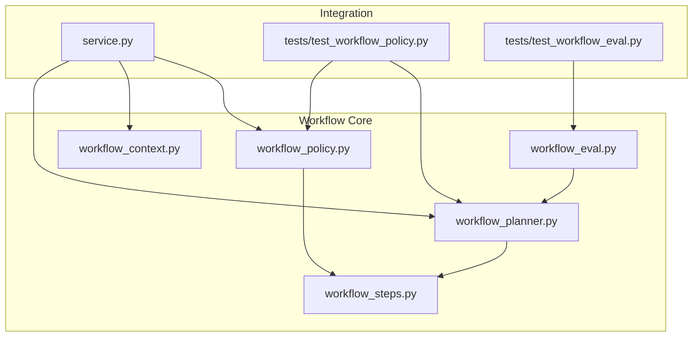
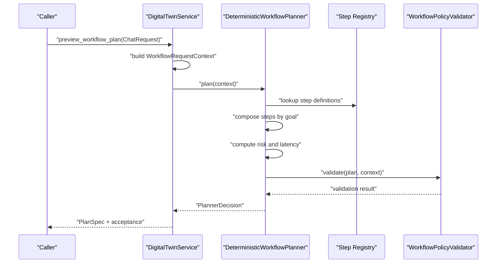
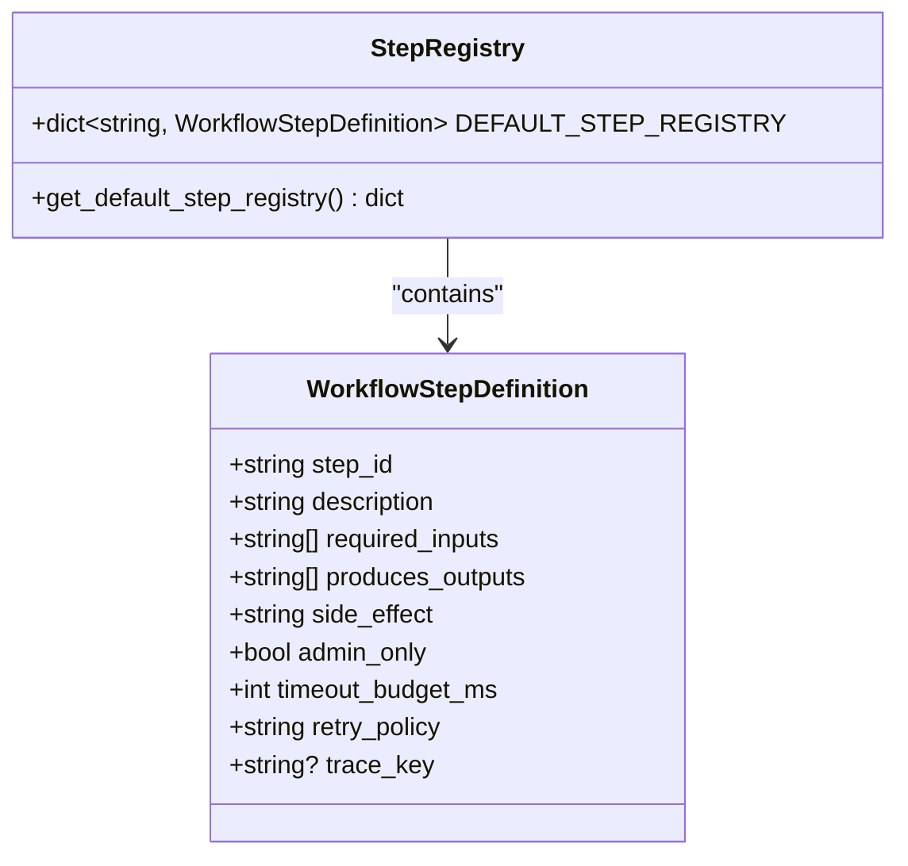
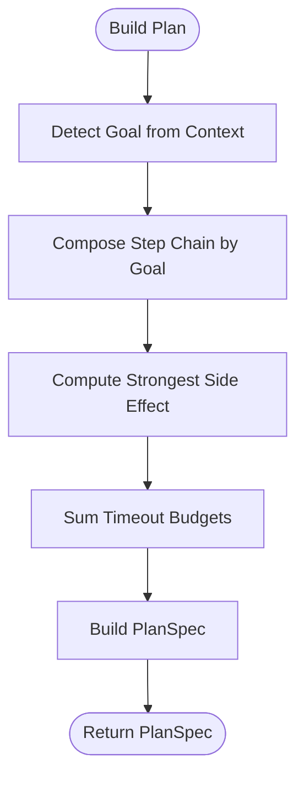
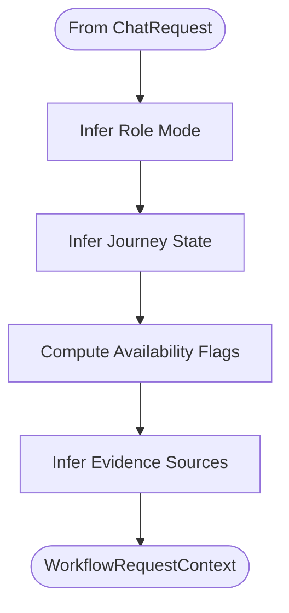
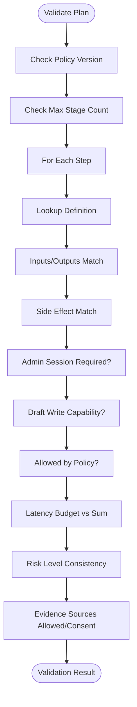
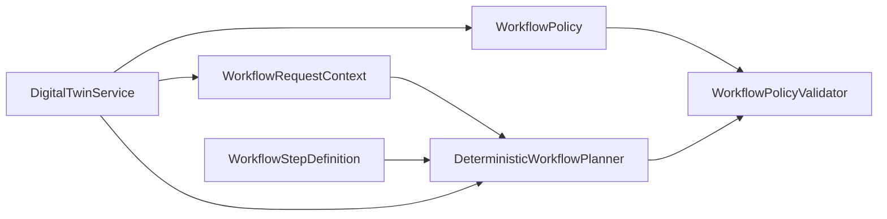

# Workflow Steps

<cite>
**Referenced Files in This Document**
- [workflow_steps.py](file://src/sage_faculty_twin/workflow_steps.py)
- [workflow_planner.py](file://src/sage_faculty_twin/workflow_planner.py)
- [workflow_context.py](file://src/sage_faculty_twin/workflow_context.py)
- [workflow_policy.py](file://src/sage_faculty_twin/workflow_policy.py)
- [workflow_eval.py](file://src/sage_faculty_twin/workflow_eval.py)
- [service.py](file://src/sage_faculty_twin/service.py)
- [test_workflow_policy.py](file://tests/test_workflow_policy.py)
- [test_workflow_eval.py](file://tests/test_workflow_eval.py)
</cite>

## Table of Contents
1. [Introduction](#introduction)
2. [Project Structure](#project-structure)
3. [Core Components](#core-components)
4. [Architecture Overview](#architecture-overview)
5. [Detailed Component Analysis](#detailed-component-analysis)
6. [Dependency Analysis](#dependency-analysis)
7. [Performance Considerations](#performance-considerations)
8. [Troubleshooting Guide](#troubleshooting-guide)
9. [Conclusion](#conclusion)
10. [Appendices](#appendices)

## Introduction
This document describes the workflow step system that powers deterministic planning and policy-driven execution of conversational AI actions. It covers step definitions, execution patterns, step registry management, validation, and dynamic planning. It also provides guidance on composing steps, conditional execution, chaining, and extending the system with custom steps.

## Project Structure
The workflow system is centered around four modules:
- Step registry and definitions
- Planner that builds deterministic plans
- Request context shaping
- Policy and validator ensuring safety and compliance
- Evaluation and testing harnesses

**Diagram sources**
- [workflow_steps.py:1-184](file://src/sage_faculty_twin/workflow_steps.py#L1-L184)
- [workflow_planner.py:1-659](file://src/sage_faculty_twin/workflow_planner.py#L1-L659)
- [workflow_context.py:1-262](file://src/sage_faculty_twin/workflow_context.py#L1-L262)
- [workflow_policy.py:1-215](file://src/sage_faculty_twin/workflow_policy.py#L1-L215)
- [workflow_eval.py:1-95](file://src/sage_faculty_twin/workflow_eval.py#L1-L95)
- [service.py:5505-5522](file://src/sage_faculty_twin/service.py#L5505-L5522)
- [test_workflow_policy.py:1-100](file://tests/test_workflow_policy.py#L1-L100)
- [test_workflow_eval.py:1-29](file://tests/test_workflow_eval.py#L1-L29)

**Section sources**
- [workflow_steps.py:1-184](file://src/sage_faculty_twin/workflow_steps.py#L1-L184)
- [workflow_planner.py:1-659](file://src/sage_faculty_twin/workflow_planner.py#L1-L659)
- [workflow_context.py:1-262](file://src/sage_faculty_twin/workflow_context.py#L1-L262)
- [workflow_policy.py:1-215](file://src/sage_faculty_twin/workflow_policy.py#L1-L215)
- [workflow_eval.py:1-95](file://src/sage_faculty_twin/workflow_eval.py#L1-L95)
- [service.py:5505-5522](file://src/sage_faculty_twin/service.py#L5505-L5522)

## Core Components
- Step Registry and Definitions
  - Defines the canonical set of workflow steps with input/output contracts, side effects, timeouts, and trace keys.
  - Provides a copyable default registry for planner initialization.
- Planner
  - Builds deterministic plans from a request context.
  - Selects step sequences based on intent detection and context flags.
  - Produces a plan with step specs, risk level, and evidence contract.
- Context
  - Encapsulates request metadata and inferred states (role mode, journey state, available memories, evidence sources).
- Policy and Validator
  - Enforces allowed steps, evidence sources, latency budgets, and side-effect gating.
  - Validates plan against policy and context.
- Evaluation
  - Loads replay scenarios and evaluates planner decisions against expectations.

**Section sources**
- [workflow_steps.py:9-184](file://src/sage_faculty_twin/workflow_steps.py#L9-L184)
- [workflow_planner.py:90-425](file://src/sage_faculty_twin/workflow_planner.py#L90-L425)
- [workflow_context.py:12-112](file://src/sage_faculty_twin/workflow_context.py#L12-L112)
- [workflow_policy.py:15-215](file://src/sage_faculty_twin/workflow_policy.py#L15-L215)
- [workflow_eval.py:13-95](file://src/sage_faculty_twin/workflow_eval.py#L13-L95)

## Architecture Overview
The planner consumes a request context, selects a goal, composes a step chain, and validates it against policy. The validator ensures step inputs/outputs match registry definitions, side effects are permitted, and latency budgets are respected.

**Diagram sources**
- [service.py:5505-5522](file://src/sage_faculty_twin/service.py#L5505-L5522)
- [workflow_planner.py:110-133](file://src/sage_faculty_twin/workflow_planner.py#L110-L133)
- [workflow_policy.py:74-199](file://src/sage_faculty_twin/workflow_policy.py#L74-L199)
- [workflow_steps.py:179-184](file://src/sage_faculty_twin/workflow_steps.py#L179-L184)

## Detailed Component Analysis

### Step Registry and Definitions
- Purpose
  - Central registry of step metadata: step_id, description, required_inputs, produces_outputs, side_effect, admin_only flag, timeout_budget_ms, retry_policy, trace_key.
- Built-in Steps
  - detect_profile_context, classify_intent, retrieve_knowledge, retrieve_hybrid_knowledge, retrieve_recent_memory, retrieve_profile_memory, retrieve_artifact_memory, assemble_prompt_context, answer_with_citations, detect_knowledge_gap, score_memory_usefulness, render_user_response, record_conversation_memory, record_artifact_memory, draft_booking_request, create_escalation_draft, draft_follow_up_action, draft_knowledge_gap.
- Registry Management
  - Default registry is a dictionary keyed by step_id.
  - A deep-copying accessor returns a fresh registry instance for each planner.

**Diagram sources**
- [workflow_steps.py:9-21](file://src/sage_faculty_twin/workflow_steps.py#L9-L21)
- [workflow_steps.py:23-176](file://src/sage_faculty_twin/workflow_steps.py#L23-L176)
- [workflow_steps.py:179-184](file://src/sage_faculty_twin/workflow_steps.py#L179-L184)

**Section sources**
- [workflow_steps.py:9-184](file://src/sage_faculty_twin/workflow_steps.py#L9-L184)

### Planner and Execution Patterns
- DeterministicWorkflowPlanner
  - Initializes with a step registry and a policy.
  - Builds plans by detecting intent/goals from the request context and assembling a step chain.
  - Computes risk level from the strongest side effect across steps and estimates latency budget.
- Goal-based Planning
  - Admin-boundary requests, artifact recording, booking preparation, booking requests, research questions, greetings, and general grounded answers each map to a distinct goal with a tailored step sequence.
- Evidence Contract
  - Allowed and forbidden sources are derived from context and policy.
- Shadow Candidate Evaluation
  - Allows evaluating alternate step sequences without live execution, computing risk and latency similarly.

**Diagram sources**
- [workflow_planner.py:179-425](file://src/sage_faculty_twin/workflow_planner.py#L179-L425)

**Section sources**
- [workflow_planner.py:90-425](file://src/sage_faculty_twin/workflow_planner.py#L90-L425)

### Request Context and Conditional Execution
- WorkflowRequestContext
  - Captures question, course context, visitor profile, role_mode, journey_state, session_identity, and flags indicating memory availability and consent.
  - Infers role_mode and journey_state from the question and visitor profile.
  - Determines available evidence sources based on context flags and question content.
- Conditional Retrievals
  - Decisions to include recent memory, profile memory, and artifact memory depend on flags and question markers.

**Diagram sources**
- [workflow_context.py:38-112](file://src/sage_faculty_twin/workflow_context.py#L38-L112)
- [workflow_context.py:210-239](file://src/sage_faculty_twin/workflow_context.py#L210-L239)

**Section sources**
- [workflow_context.py:12-112](file://src/sage_faculty_twin/workflow_context.py#L12-L112)

### Policy Validation and Safety Controls
- WorkflowPolicy
  - Defines allowed evidence sources, forbidden sources, max stage count, max latency budget, and allowed write step IDs.
- WorkflowPolicyValidator
  - Validates plan against policy and context:
    - Step presence in registry and exact input/output sets
    - Side effect alignment
    - Availability of required inputs
    - Admin-only step gating
    - Draft-write capability gating
    - Latency budget and risk level consistency
    - Evidence source permissions and consent checks

**Diagram sources**
- [workflow_policy.py:74-199](file://src/sage_faculty_twin/workflow_policy.py#L74-L199)

**Section sources**
- [workflow_policy.py:15-215](file://src/sage_faculty_twin/workflow_policy.py#L15-L215)

### Step Catalog and Contracts
Below is a structured overview of built-in steps. For each step, we describe inputs, outputs, side effects, and typical timeout budget. These values are defined in the step registry and used during planning and validation.

- detect_profile_context
  - Inputs: question, visitor_profile, course_context
  - Outputs: profile_context
  - Side effect: none
  - Timeout budget: low
  - Trace key: planner_profile_context
- classify_intent
  - Inputs: question, course_context, profile_context
  - Outputs: interaction_intent
  - Side effect: none
  - Timeout budget: low
  - Trace key: planner_intent
- retrieve_knowledge
  - Inputs: question, profile_context
  - Outputs: knowledge_hits
  - Side effect: none
  - Timeout budget: moderate
  - Trace key: planner_knowledge
- retrieve_hybrid_knowledge
  - Inputs: question, profile_context, interaction_intent
  - Outputs: knowledge_hits, retrieval_path
  - Side effect: none
  - Timeout budget: higher
  - Trace key: planner_hybrid_knowledge
- retrieve_recent_memory
  - Inputs: question, session_identity
  - Outputs: recent_memory_hits
  - Side effect: none
  - Timeout budget: moderate
  - Trace key: planner_recent_memory
- retrieve_profile_memory
  - Inputs: question, journey_state
  - Outputs: profile_memory_hits
  - Side effect: none
  - Timeout budget: moderate
  - Trace key: planner_profile_memory
- retrieve_artifact_memory
  - Inputs: question, session_identity, interaction_intent
  - Outputs: artifact_memory_hits
  - Side effect: none
  - Timeout budget: moderate-high
  - Trace key: planner_artifact_memory
- assemble_prompt_context
  - Inputs: question, interaction_intent
  - Outputs: prompt_context
  - Side effect: none
  - Timeout budget: low
  - Trace key: planner_prompt_context
- answer_with_citations
  - Inputs: question, prompt_context
  - Outputs: answer
  - Side effect: none
  - Timeout budget: high
  - Trace key: planner_answer
- detect_knowledge_gap
  - Inputs: answer, knowledge_hits
  - Outputs: knowledge_gap_signal
  - Side effect: none
  - Timeout budget: low
  - Trace key: planner_knowledge_gap
- score_memory_usefulness
  - Inputs: answer
  - Outputs: memory_usefulness_signal
  - Side effect: none
  - Timeout budget: low
  - Trace key: planner_memory_usefulness
- render_user_response
  - Inputs: answer
  - Outputs: response_payload
  - Side effect: none
  - Timeout budget: low
  - Trace key: planner_response_render
- record_conversation_memory
  - Inputs: answer, response_payload
  - Outputs: memory_writeback
  - Side effect: draft_write
  - Timeout budget: low
  - Trace key: planner_memory_writeback
- record_artifact_memory
  - Inputs: interaction_intent, response_payload
  - Outputs: artifact_memory_writeback
  - Side effect: draft_write
  - Timeout budget: low
  - Trace key: planner_artifact_memory_writeback
- draft_booking_request
  - Inputs: interaction_intent, recent_memory_hits
  - Outputs: booking_draft
  - Side effect: draft_write
  - Timeout budget: low
  - Trace key: planner_booking_draft
- create_escalation_draft
  - Inputs: interaction_intent, knowledge_hits
  - Outputs: escalation_draft
  - Side effect: draft_write
  - Timeout budget: low
  - Trace key: planner_escalation_draft
- draft_follow_up_action
  - Inputs: answer, recent_memory_hits
  - Outputs: follow_up_draft
  - Side effect: draft_write
  - Timeout budget: low
  - Trace key: planner_follow_up_draft
- draft_knowledge_gap
  - Inputs: knowledge_gap_signal, knowledge_hits
  - Outputs: knowledge_gap_draft
  - Side effect: draft_write
  - Timeout budget: low
  - Trace key: planner_knowledge_gap_draft

Notes:
- Side effects are enforced by policy and context. Steps marked admin_only require an admin session.
- Timeout budgets are summed to compute estimated latency; the plan’s estimated_latency_budget_ms must exceed the sum.
- Trace keys are used for observability and operator explanations.

**Section sources**
- [workflow_steps.py:23-174](file://src/sage_faculty_twin/workflow_steps.py#L23-L174)

### Step Composition, Chaining, and Conditional Execution
- Composition
  - The planner composes a linear sequence of steps per goal. Steps are appended in a deterministic order based on intent and context flags.
- Chaining
  - Steps produce outputs that become inputs for subsequent steps. The validator enforces exact input/output parity with registry definitions.
- Conditional Execution
  - Whether to include recent/profile/artifact memory depends on context flags and question markers. Admin-only steps are gated by session identity.

Examples (described):
- Research grounding: detect_profile_context → classify_intent → retrieve_hybrid_knowledge → optional retrieve_recent_memory → optional retrieve_artifact_memory → optional retrieve_profile_memory → assemble_prompt_context → answer_with_citations → score_memory_usefulness → render_user_response.
- Artifact recording: detect_profile_context → classify_intent → optional retrieve_recent_memory → optional retrieve_artifact_memory → assemble_prompt_context → answer_with_citations → render_user_response → record_artifact_memory.
- Booking preparation: detect_profile_context → classify_intent → conditional retrieve_profile_memory/retrieve_hybrid_knowledge → optional retrieve_recent_memory → optional retrieve_artifact_memory → assemble_prompt_context → answer_with_citations → score_memory_usefulness → render_user_response.

**Section sources**
- [workflow_planner.py:179-392](file://src/sage_faculty_twin/workflow_planner.py#L179-L392)
- [workflow_policy.py:100-144](file://src/sage_faculty_twin/workflow_policy.py#L100-L144)

### Step Registry Management and Dynamic Loading
- Default Registry
  - Provided by a constant dictionary keyed by step_id and returned via a deep-copying accessor.
- Dynamic Step Loading
  - The planner initializes with get_default_step_registry(), enabling per-instance isolation and controlled mutation if needed.
- Extending the Registry
  - To add a custom step, define a WorkflowStepDefinition and merge it into the planner’s step registry before planning.

Guidance:
- Define a new WorkflowStepDefinition with required_inputs and produces_outputs aligned with downstream consumers.
- Choose side_effect appropriately (none, draft_write, owner_review, admin_only).
- Set timeout_budget_ms conservatively to respect latency budgets.
- Optionally set trace_key for observability.
- Merge into the planner’s registry before invoking plan().

**Section sources**
- [workflow_steps.py:179-184](file://src/sage_faculty_twin/workflow_steps.py#L179-L184)
- [workflow_planner.py:90-101](file://src/sage_faculty_twin/workflow_planner.py#L90-L101)

### Integration with Service and Testing
- Service Integration
  - The service constructs a WorkflowRequestContext from ChatRequest and calls the planner to produce a plan preview.
- Testing
  - Tests validate policy loading, acceptance of read-only plans, and strict stage-count enforcement with custom policies.
  - Replay scenarios exercise planner decisions across multiple scenarios.

**Section sources**
- [service.py:5505-5522](file://src/sage_faculty_twin/service.py#L5505-L5522)
- [test_workflow_policy.py:17-100](file://tests/test_workflow_policy.py#L17-L100)
- [workflow_eval.py:53-95](file://src/sage_faculty_twin/workflow_eval.py#L53-L95)
- [test_workflow_eval.py:19-29](file://tests/test_workflow_eval.py#L19-L29)

## Dependency Analysis
The planner depends on the step registry and policy for validation. The validator cross-checks plan steps against the registry and context. The service orchestrates planning and exposes plan previews.

**Diagram sources**
- [workflow_planner.py:90-133](file://src/sage_faculty_twin/workflow_planner.py#L90-L133)
- [workflow_policy.py:64-199](file://src/sage_faculty_twin/workflow_policy.py#L64-L199)
- [service.py:5505-5522](file://src/sage_faculty_twin/service.py#L5505-L5522)

**Section sources**
- [workflow_planner.py:90-133](file://src/sage_faculty_twin/workflow_planner.py#L90-L133)
- [workflow_policy.py:64-199](file://src/sage_faculty_twin/workflow_policy.py#L64-L199)
- [service.py:5505-5522](file://src/sage_faculty_twin/service.py#L5505-L5522)

## Performance Considerations
- Timeout Budgets
  - Each step defines a timeout_budget_ms. The planner sums these to estimate total latency. The plan’s estimated_latency_budget_ms must exceed the sum; otherwise, validation fails.
- Latency Budget Limits
  - Policy max_latency_budget_ms caps the maximum allowed latency. Plans exceeding this are rejected.
- Step Count Limits
  - Policy max_stage_count restricts the number of steps in a plan to prevent long-running chains.
- Recommendations
  - Keep steps focused and atomic.
  - Prefer read-only steps when possible to reduce side effects and latency.
  - Use retrieve_hybrid_knowledge judiciously; it has a higher timeout budget.
  - Avoid unnecessary retrievals when context flags indicate they are not applicable.

**Section sources**
- [workflow_steps.py:18-18](file://src/sage_faculty_twin/workflow_steps.py#L18-L18)
- [workflow_planner.py:395-425](file://src/sage_faculty_twin/workflow_planner.py#L395-L425)
- [workflow_policy.py:20-20](file://src/sage_faculty_twin/workflow_policy.py#L20-L20)
- [workflow_policy.py:152-162](file://src/sage_faculty_twin/workflow_policy.py#L152-L162)

## Troubleshooting Guide
Common validation failures and remedies:
- Step not registered
  - Cause: step_id not present in the registry.
  - Remedy: Add a WorkflowStepDefinition with matching step_id and inputs/outputs.
- Inputs/Outputs mismatch
  - Cause: plan step inputs/outputs differ from registry definition.
  - Remedy: Align plan step inputs/outputs exactly with the registry.
- Side effect mismatch
  - Cause: plan step side_effect differs from registry.
  - Remedy: Adjust plan step or registry definition consistently.
- Admin-only step without admin session
  - Cause: admin_only step invoked by non-admin session.
  - Remedy: Require admin credentials or switch to a non-admin step.
- Draft-write capability missing
  - Cause: side-effect requiring draft-write without allow_draft_write.
  - Remedy: Enable allow_draft_write or remove draft-write steps.
- Exceeds max stage count
  - Cause: plan exceeds policy.max_stage_count.
  - Remedy: Simplify plan or adjust policy.
- Exceeds max latency budget
  - Cause: plan estimated_latency_budget_ms below sum of step budgets or above policy limit.
  - Remedy: Reduce step count or increase budget; ensure registry budgets are realistic.
- Forbidden or unavailable evidence sources
  - Cause: allowed_sources include forbidden items or unavailable sources.
  - Remedy: Remove forbidden sources and ensure consent for profile_memory.

**Section sources**
- [workflow_policy.py:100-199](file://src/sage_faculty_twin/workflow_policy.py#L100-L199)
- [test_workflow_policy.py:60-100](file://tests/test_workflow_policy.py#L60-L100)

## Conclusion
The workflow step system provides a robust, policy-enforced framework for deterministic planning. By defining clear step contracts, enforcing safety via policy validation, and offering observable traces, it supports safe, auditable automation. Extensibility is achieved by adding new step definitions and merging them into the planner’s registry.

## Appendices

### Appendix A: Example Scenarios and Expectations
- Scenario-based evaluation loads replay scenarios and asserts goals, fallback templates, required/forbidden steps, and acceptance outcomes.
- Use these scenarios to validate planner behavior under various intents and contexts.

**Section sources**
- [workflow_eval.py:53-95](file://src/sage_faculty_twin/workflow_eval.py#L53-L95)
- [test_workflow_eval.py:19-29](file://tests/test_workflow_eval.py#L19-L29)