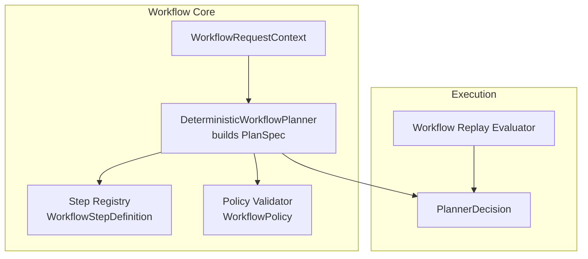
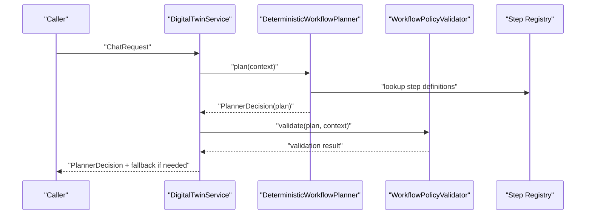
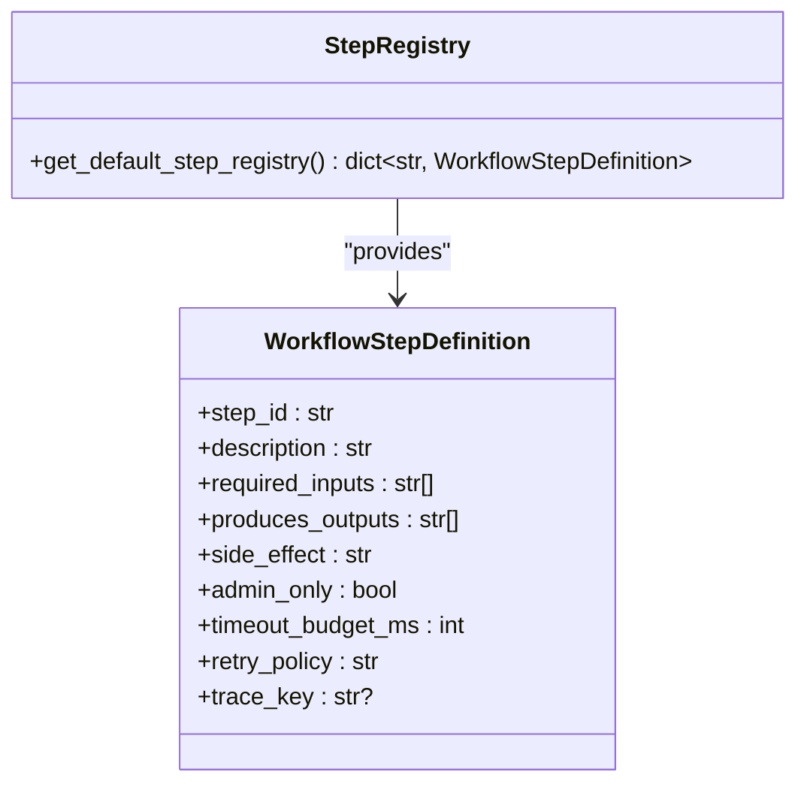
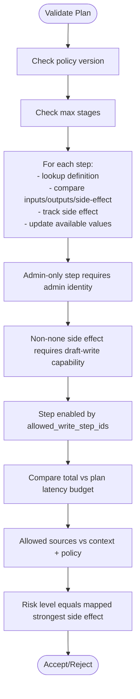
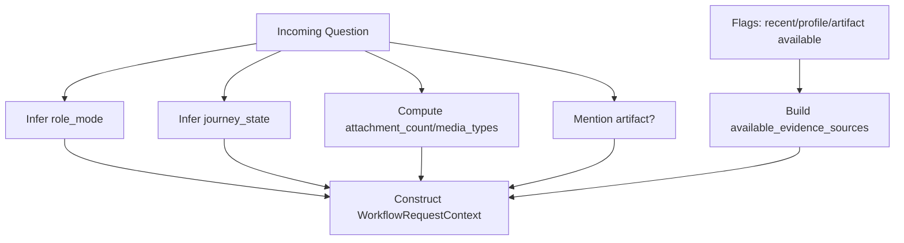
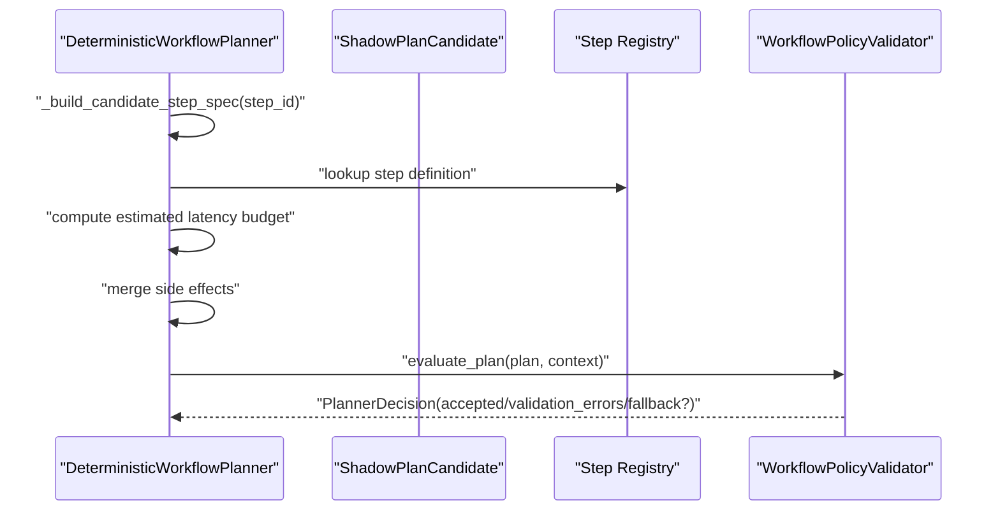
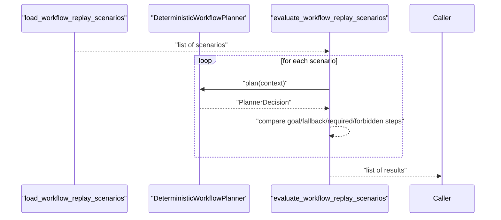
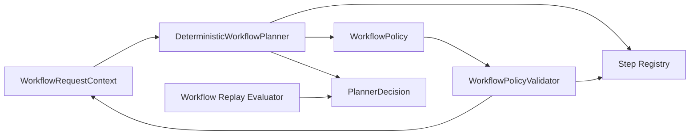

# Workflow System

<cite>
**Referenced Files in This Document**
- [workflow_planner.py](file://src/sage_faculty_twin/workflow_planner.py)
- [workflow_steps.py](file://src/sage_faculty_twin/workflow_steps.py)
- [workflow_policy.py](file://src/sage_faculty_twin/workflow_policy.py)
- [workflow_context.py](file://src/sage_faculty_twin/workflow_context.py)
- [workflow_eval.py](file://src/sage_faculty_twin/workflow_eval.py)
- [service.py](file://src/sage_faculty_twin/service.py)
- [test_dynamic_workflow_planner.py](file://tests/test_dynamic_workflow_planner.py)
- [test_workflow_policy.py](file://tests/test_workflow_policy.py)
- [test_workflow_eval.py](file://tests/test_workflow_eval.py)
</cite>

## Table of Contents
1. [Introduction](#introduction)
2. [Project Structure](#project-structure)
3. [Core Components](#core-components)
4. [Architecture Overview](#architecture-overview)
5. [Detailed Component Analysis](#detailed-component-analysis)
6. [Dependency Analysis](#dependency-analysis)
7. [Performance Considerations](#performance-considerations)
8. [Troubleshooting Guide](#troubleshooting-guide)
9. [Conclusion](#conclusion)
10. [Appendices](#appendices)

## Introduction
This document explains the workflow planning and execution system that powers deterministic, step-based, policy-driven interactions. It covers:
- Deterministic workflow architecture and step-based processing model
- Policy-driven decision making and risk/risk-level mapping
- Workflow planner implementation and shadow planning for safety
- Fallback mechanisms and planner comparison
- Integration with memory systems, knowledge retrieval, and LLM processing
- Guidance for extending the system with custom steps and policies

## Project Structure
The workflow system is centered around four core modules:
- Planner: builds plans from natural-language intents and context
- Steps: a registry of executable steps with side effects and timeouts
- Policy: enforces constraints on evidence sources, write steps, latency, and risk
- Context: captures request metadata, roles, journey state, and available evidence sources

**Diagram sources**
- [workflow_planner.py:90-134](file://src/sage_faculty_twin/workflow_planner.py#L90-L134)
- [workflow_steps.py:9-21](file://src/sage_faculty_twin/workflow_steps.py#L9-L21)
- [workflow_policy.py:64-199](file://src/sage_faculty_twin/workflow_policy.py#L64-L199)
- [workflow_context.py:12-37](file://src/sage_faculty_twin/workflow_context.py#L12-L37)
- [workflow_eval.py:53-94](file://src/sage_faculty_twin/workflow_eval.py#L53-L94)

**Section sources**
- [workflow_planner.py:90-134](file://src/sage_faculty_twin/workflow_planner.py#L90-L134)
- [workflow_steps.py:179-184](file://src/sage_faculty_twin/workflow_steps.py#L179-L184)
- [workflow_policy.py:64-199](file://src/sage_faculty_twin/workflow_policy.py#L64-L199)
- [workflow_context.py:12-37](file://src/sage_faculty_twin/workflow_context.py#L12-L37)
- [workflow_eval.py:53-94](file://src/sage_faculty_twin/workflow_eval.py#L53-L94)

## Core Components
- DeterministicWorkflowPlanner: constructs a PlanSpec from a WorkflowRequestContext, selects steps based on intent and context, computes risk level, and validates against policy.
- WorkflowStepDefinition: defines step semantics, required inputs, produced outputs, side effects, timeouts, and retry policy.
- WorkflowPolicy and WorkflowPolicyValidator: enforce allowed evidence sources, write-step enablement, latency budgets, and risk alignment.
- WorkflowRequestContext: normalizes request metadata into role_mode, journey_state, identity, and available evidence sources.
- PlannerDecision: encapsulates acceptance, validation errors, fallback, and the final PlanSpec.
- WorkflowReplayScenario and evaluator: define expected goals, fallback templates, required/forbidden steps, and validate planner decisions.

**Section sources**
- [workflow_planner.py:90-134](file://src/sage_faculty_twin/workflow_planner.py#L90-L134)
- [workflow_steps.py:9-21](file://src/sage_faculty_twin/workflow_steps.py#L9-L21)
- [workflow_policy.py:15-48](file://src/sage_faculty_twin/workflow_policy.py#L15-L48)
- [workflow_context.py:12-37](file://src/sage_faculty_twin/workflow_context.py#L12-L37)
- [workflow_eval.py:13-34](file://src/sage_faculty_twin/workflow_eval.py#L13-L34)

## Architecture Overview
The system follows a deterministic planner that:
- Infers intent and context from the incoming request
- Builds a linear sequence of steps tailored to the intent
- Computes risk level from the strongest side effect among steps
- Validates the plan against policy constraints
- Produces a PlannerDecision with optional fallback

**Diagram sources**
- [service.py:132-138](file://src/sage_faculty_twin/service.py#L132-L138)
- [workflow_planner.py:110-134](file://src/sage_faculty_twin/workflow_planner.py#L110-L134)
- [workflow_policy.py:74-199](file://src/sage_faculty_twin/workflow_policy.py#L74-L199)
- [workflow_steps.py:179-184](file://src/sage_faculty_twin/workflow_steps.py#L179-L184)

## Detailed Component Analysis

### DeterministicWorkflowPlanner
- Purpose: Build a deterministic PlanSpec from a request context, compute risk level, and produce a PlannerDecision.
- Key behaviors:
  - Goal selection based on intent detection and context flags
  - Step assembly from a shared registry
  - Risk computation from the strongest side effect across steps
  - Evidence contract construction limiting allowed and forbidden sources
  - Validation via WorkflowPolicyValidator and fallback creation when rejected
  - Shadow candidate evaluation for safety checks

**Diagram sources**
- [workflow_planner.py:90-134](file://src/sage_faculty_twin/workflow_planner.py#L90-L134)
- [workflow_planner.py:53-88](file://src/sage_faculty_twin/workflow_planner.py#L53-L88)
- [workflow_planner.py:32-40](file://src/sage_faculty_twin/workflow_planner.py#L32-L40)
- [workflow_policy.py:64-199](file://src/sage_faculty_twin/workflow_policy.py#L64-L199)

**Section sources**
- [workflow_planner.py:110-134](file://src/sage_faculty_twin/workflow_planner.py#L110-L134)
- [workflow_planner.py:179-425](file://src/sage_faculty_twin/workflow_planner.py#L179-L425)
- [workflow_planner.py:427-446](file://src/sage_faculty_twin/workflow_planner.py#L427-L446)
- [workflow_planner.py:448-476](file://src/sage_faculty_twin/workflow_planner.py#L448-L476)

### Step Registry and Side Effects
- WorkflowStepDefinition defines:
  - step_id, description, required_inputs, produces_outputs
  - side_effect: none, draft_write, owner_review, admin_only
  - timeout_budget_ms and retry_policy
  - trace_key for observability
- The default registry includes retrieval, assembly, answer, scoring, rendering, and write-back steps.

**Diagram sources**
- [workflow_steps.py:9-21](file://src/sage_faculty_twin/workflow_steps.py#L9-L21)
- [workflow_steps.py:179-184](file://src/sage_faculty_twin/workflow_steps.py#L179-L184)

**Section sources**
- [workflow_steps.py:9-21](file://src/sage_faculty_twin/workflow_steps.py#L9-L21)
- [workflow_steps.py:23-174](file://src/sage_faculty_twin/workflow_steps.py#L23-L174)
- [workflow_steps.py:179-184](file://src/sage_faculty_twin/workflow_steps.py#L179-L184)

### Policy and Risk Mapping
- WorkflowPolicy enforces:
  - max_stage_count, max_latency_budget_ms
  - allowed_evidence_sources and forbidden_evidence_sources
  - allowed_write_step_ids
- WorkflowPolicyValidator checks:
  - plan policy version alignment
  - step presence, uniqueness, and signature matching
  - admin-only step constraints and draft-write capability
  - evidence source validity per policy
  - latency budget alignment
  - risk level correctness via strongest side effect mapping

**Diagram sources**
- [workflow_policy.py:74-199](file://src/sage_faculty_twin/workflow_policy.py#L74-L199)
- [workflow_policy.py:207-214](file://src/sage_faculty_twin/workflow_policy.py#L207-L214)

**Section sources**
- [workflow_policy.py:15-48](file://src/sage_faculty_twin/workflow_policy.py#L15-L48)
- [workflow_policy.py:64-199](file://src/sage_faculty_twin/workflow_policy.py#L64-L199)
- [workflow_policy.py:207-214](file://src/sage_faculty_twin/workflow_policy.py#L207-L214)

### Context Management
- WorkflowRequestContext normalizes:
  - role_mode (instructor, PI, researcher, collaboration contact, system operator)
  - journey_state (first-time visitor, course student, meeting candidate, etc.)
  - session_identity (anonymous, user, admin)
  - available_evidence_sources based on question, attachments, and flags
- Helper inference functions detect artifacts, booking intent, and profile/memory availability.

**Diagram sources**
- [workflow_context.py:38-112](file://src/sage_faculty_twin/workflow_context.py#L38-L112)
- [workflow_context.py:210-239](file://src/sage_faculty_twin/workflow_context.py#L210-L239)

**Section sources**
- [workflow_context.py:12-37](file://src/sage_faculty_twin/workflow_context.py#L12-L37)
- [workflow_context.py:38-112](file://src/sage_faculty_twin/workflow_context.py#L38-L112)
- [workflow_context.py:210-239](file://src/sage_faculty_twin/workflow_context.py#L210-L239)

### Shadow Planning and Safety
- ShadowPlanCandidate enables evaluating a read-only candidate plan with a subset of steps and evidence sources.
- Planner evaluates the candidate and returns a PlannerDecision with risk level computed from the strongest side effect.
- Tests demonstrate enabling artifact memory writes only under explicit archive requests and with draft-write capability.

**Diagram sources**
- [workflow_planner.py:135-177](file://src/sage_faculty_twin/workflow_planner.py#L135-L177)
- [workflow_planner.py:462-472](file://src/sage_faculty_twin/workflow_planner.py#L462-L472)

**Section sources**
- [workflow_planner.py:135-177](file://src/sage_faculty_twin/workflow_planner.py#L135-L177)
- [test_dynamic_workflow_planner.py:308-355](file://tests/test_dynamic_workflow_planner.py#L308-L355)
- [test_dynamic_workflow_planner.py:357-400](file://tests/test_dynamic_workflow_planner.py#L357-L400)

### Planner Evaluation and Replay Scenarios
- WorkflowReplayScenario defines expected outcomes for a given ChatRequest.
- WorkflowReplayResult compares actual planner outputs to expectations.
- Tests validate deterministic planner behavior against curated scenarios.

**Diagram sources**
- [workflow_eval.py:45-94](file://src/sage_faculty_twin/workflow_eval.py#L45-L94)
- [test_workflow_eval.py:11-28](file://tests/test_workflow_eval.py#L11-L28)

**Section sources**
- [workflow_eval.py:13-34](file://src/sage_faculty_twin/workflow_eval.py#L13-L34)
- [workflow_eval.py:45-94](file://src/sage_faculty_twin/workflow_eval.py#L45-L94)
- [test_workflow_eval.py:11-28](file://tests/test_workflow_eval.py#L11-L28)

## Dependency Analysis
- Planner depends on:
  - Step registry for step semantics
  - Policy for constraints and risk mapping
  - Context for intent and evidence source inference
- Policy validator depends on:
  - Policy configuration
  - Step registry for signature checks
  - Context for input availability
- Tests validate:
  - Policy loading and enforcement
  - Scenario-based replay acceptance
  - Shadow candidate evaluation and fallback behavior

**Diagram sources**
- [workflow_planner.py:90-134](file://src/sage_faculty_twin/workflow_planner.py#L90-L134)
- [workflow_policy.py:64-199](file://src/sage_faculty_twin/workflow_policy.py#L64-L199)
- [workflow_steps.py:179-184](file://src/sage_faculty_twin/workflow_steps.py#L179-L184)
- [workflow_eval.py:53-94](file://src/sage_faculty_twin/workflow_eval.py#L53-L94)

**Section sources**
- [workflow_planner.py:90-134](file://src/sage_faculty_twin/workflow_planner.py#L90-L134)
- [workflow_policy.py:64-199](file://src/sage_faculty_twin/workflow_policy.py#L64-L199)
- [workflow_steps.py:179-184](file://src/sage_faculty_twin/workflow_steps.py#L179-L184)
- [workflow_eval.py:53-94](file://src/sage_faculty_twin/workflow_eval.py#L53-L94)

## Performance Considerations
- Timeout budgets: Each step defines a timeout_budget_ms; total latency is compared against the plan’s estimated_latency_budget_ms.
- Latency budget limits: Policy enforces max_latency_budget_ms to cap end-to-end cost.
- Deterministic planning avoids expensive retrieval for simple greetings and reduces redundant memory retrievals when recent session context is attached.
- Shadow planning can be disabled for benchmark scenarios to minimize overhead.

[No sources needed since this section provides general guidance]

## Troubleshooting Guide
Common issues and resolutions:
- Plan rejected due to mismatched step signatures: Ensure step inputs/outputs/side-effect match the registry definition.
- Forbidden evidence sources: Remove references to forbidden sources (e.g., private_student_record_without_consent) or adjust policy.
- Exceeded stage or latency budget: Reduce step count or increase estimated_latency_budget_ms within policy limits.
- Admin-only steps: Verify session_identity is admin or remove admin-only steps.
- Missing draft-write capability: Enable allow_draft_write when appropriate for write-side-effect steps.

**Section sources**
- [workflow_policy.py:74-199](file://src/sage_faculty_twin/workflow_policy.py#L74-L199)
- [test_workflow_policy.py:60-99](file://tests/test_workflow_policy.py#L60-L99)

## Conclusion
The workflow system combines deterministic planning, a strict step registry, and policy-driven validation to ensure safe, auditable, and predictable interactions. Shadow planning and planner comparison further enhance safety and reliability. Extensibility is achieved through adding new steps to the registry and updating policies to reflect new capabilities.

[No sources needed since this section summarizes without analyzing specific files]

## Appendices

### Example Workflows and Execution Patterns
- Course grounding: Detect profile context → classify intent → hybrid knowledge retrieval → assemble prompt → answer with citations → score memory usefulness → render user response.
- Booking preparation: Stay read-only; avoid booking drafts; leverage knowledge and memory to advise.
- Artifact-aware research: Combine research knowledge with artifact memory and profile memory when consent and context permit.
- Simple greeting: Minimal steps; skip retrieval to reduce latency.

**Section sources**
- [test_dynamic_workflow_planner.py:47-79](file://tests/test_dynamic_workflow_planner.py#L47-L79)
- [test_dynamic_workflow_planner.py:81-102](file://tests/test_dynamic_workflow_planner.py#L81-L102)
- [test_dynamic_workflow_planner.py:191-220](file://tests/test_dynamic_workflow_planner.py#L191-L220)
- [test_dynamic_workflow_planner.py:263-288](file://tests/test_dynamic_workflow_planner.py#L263-L288)

### Extending the System
- Adding a new step:
  - Define a new WorkflowStepDefinition with required_inputs, produces_outputs, side_effect, and timeout_budget_ms.
  - Register it in the default registry and ensure policy allows it if it has side effects.
- Updating policy:
  - Modify allowed_evidence_sources, allowed_write_step_ids, or max_latency_budget_ms.
  - Load custom policy via service initialization to override defaults.

**Section sources**
- [workflow_steps.py:23-174](file://src/sage_faculty_twin/workflow_steps.py#L23-L174)
- [workflow_steps.py:179-184](file://src/sage_faculty_twin/workflow_steps.py#L179-L184)
- [workflow_policy.py:54-62](file://src/sage_faculty_twin/workflow_policy.py#L54-L62)
- [test_workflow_policy.py:60-99](file://tests/test_workflow_policy.py#L60-L99)