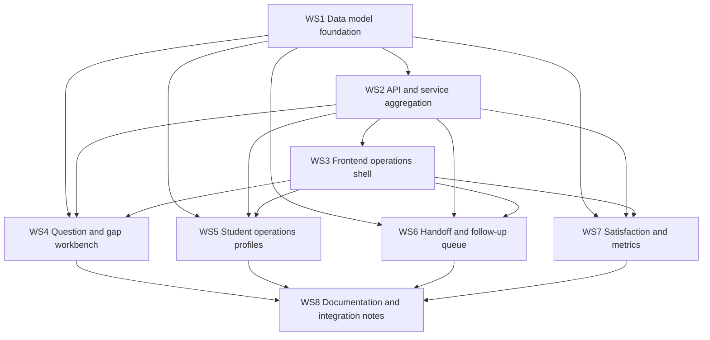

# Multi-Agent Rollout Plan

This document defines the recommended execution order, dependency boundaries, and merge sequence
for the `v2` operations-console upgrade after the `v1.0.0` baseline release.

The goal is to let multiple agents work in parallel without repeatedly colliding in the same files
 or solving the same architectural question twice.

## Target Outcome

The `v2` work should upgrade the current admin experience into an operations console that can
support:

- question distribution and cluster analysis,
- knowledge gap tickets and remediation workflow,
- student operations profiles instead of raw memory browsing,
- human handoff and follow-up queue management,
- satisfaction tracking and closed-loop improvement.

## Workstreams

The work is split into eight workstreams. The identifiers below match the prompts already prepared
for parallel agent execution.

1. `WS1` Data model foundation
   Scope: unified operations objects, knowledge gap ticket model, owner/status fields, persistence.
2. `WS2` API and service aggregation
   Scope: operations-facing endpoints and response models for dashboard/workbench use.
3. `WS3` Frontend operations shell
   Scope: admin-to-operations-console information architecture and layout skeleton.
4. `WS4` Question distribution and knowledge gap workbench
   Scope: analytics-to-ticket workflow, actionable knowledge gap handling.
5. `WS5` Student operations profiles
   Scope: richer student profile detail and segmentation-oriented views.
6. `WS6` Human handoff and follow-up queue
   Scope: unified operational task queue, state transitions, assignee/notes handling.
7. `WS7` Satisfaction and operational metrics
   Scope: structured feedback reasons, coverage metrics, effect-tracking slices.
8. `WS8` Documentation and release-facing integration notes
   Scope: ops-console documentation, workflow explanation, repo-facing usage guidance.

## Recommended Agent Assignment

When possible, assign these workstreams to agents with the following bias:

| Workstream | Best-fit agent | Why |
| --- | --- | --- |
| `WS1` | `sage` | Best for runtime-safe architecture and store/model boundaries. |
| `WS2` | `sage` | Best for API/service layering and contract cleanup. |
| `WS3` | `sage-apps` | Best fit for app-facing UI structure work. |
| `WS4` | `sage-apps` | Primarily product workflow plus light backend integration. |
| `WS5` | `sage-apps` | Student profile aggregation is app-facing and workflow-heavy. |
| `WS6` | `sage-apps` | Queue and console handling is app operations work. |
| `WS7` | `sage` | Metrics, model boundaries, and signal correctness matter most here. |
| `WS8` | `sage-docs` | Best fit for documentation structure and publishable guidance. |

If you need a quick read-only scout before implementation, use `Explore` first and hand its findings
to the implementation agent.

## Dependency Graph

## Execution Order

### Phase 0: Alignment

Start with `WS1` and `WS2` first.

Reason:

- `WS1` decides the canonical operations objects.
- `WS2` turns those objects into stable backend contracts.
- Every UI-facing workstream depends on those contracts even if it begins with placeholders.

Expected output before expansion:

- final model/store names,
- persistence shape,
- new response/request models,
- operations-facing API surface.

### Phase 1: Shell and parallel feature tracks

Once `WS2` has stabilized the first API draft, run these in parallel:

- `WS3` Frontend operations shell
- `WS4` Question and gap workbench
- `WS5` Student operations profiles
- `WS6` Handoff and follow-up queue
- `WS7` Satisfaction and metrics

Reason:

- They all share the same operations-console destination.
- They can work in parallel if file ownership is respected.
- `WS3` should establish the top-level layout early so the feature workstreams plug into a stable
  shell rather than each inventing their own modal or panel pattern.

### Phase 2: Documentation and consolidation

Run `WS8` after at least `WS3`, `WS4`, `WS5`, `WS6`, and `WS7` have landed or reached review-ready
state.

Reason:

- Documentation should describe the actual console shape, not the intended one.
- `WS8` can also surface inconsistencies before final integration.

## File Ownership Guidance

To reduce merge conflicts, keep ownership boundaries explicit.

### Primary ownership

- `WS1`
  Files: `models.py`, new store files, `analytics_store.py`, `memory_store.py`
- `WS2`
  Files: `api.py`, `service.py`, `models.py`
- `WS3`
  Files: `web/index.html`, `web/app.js`, `web/styles.css`
- `WS4`
  Files: `analytics_store.py`, gap-related store/model files, `web/app.js`
- `WS5`
  Files: `memory_store.py`, `service.py`, `web/app.js`
- `WS6`
  Files: `escalation_store.py`, `follow_up_store.py`, `service.py`, `web/app.js`
- `WS7`
  Files: `analytics_store.py`, `models.py`, feedback flow in `web/app.js`
- `WS8`
  Files: `README.md`, `docs/ops-console.md`, supporting docs

### Shared hot spots

These files are most likely to conflict and should be merged carefully:

- `src/sage_faculty_twin/models.py`
- `src/sage_faculty_twin/service.py`
- `src/sage_faculty_twin/web/app.js`

Recommended rule:

- land `WS1` first if it changes shared models,
- land `WS2` second for contract stabilization,
- rebase all UI or workflow branches onto those two before merge.

## Merge Sequence

Recommended merge order:

1. `WS1` Data model foundation
2. `WS2` API and service aggregation
3. `WS3` Frontend operations shell
4. `WS4` Question and knowledge gap workbench
5. `WS5` Student operations profiles
6. `WS6` Handoff and follow-up queue
7. `WS7` Satisfaction and operational metrics
8. `WS8` Documentation and integration notes

Rationale:

- `WS3` should land before the feature-heavy console slices to reduce parallel layout drift.
- `WS4` through `WS7` can be reviewed in parallel, but if they are merged serially after rebasing on
  `WS3`, the conflict profile will be much lower.

## Integration Checkpoints

Treat these as gates between phases.

### Checkpoint A: Backend contract stable

Required before most frontend feature work merges:

- operations models finalized,
- new ops APIs passing focused tests,
- no regression in admin/auth and workflow tests.

### Checkpoint B: Console shell stable

Required before feature workstreams finalize UI:

- admin mode can enter a dedicated operations console,
- module navigation is stable,
- placeholder or real panels exist for all target modules.

### Checkpoint C: Closed-loop features stable

Required before documentation merge:

- knowledge gap tickets are actionable,
- student profile detail is navigable,
- handoff/follow-up queues support state transitions,
- satisfaction summary is visible and structured.

## Review Focus Per Workstream

Use these as PR review priorities.

### `WS1`

- Are the new operations objects minimal but sufficient?
- Did the implementation avoid duplicating equivalent state in multiple stores?
- Is JSON persistence forward-compatible with current repo conventions?

### `WS2`

- Are the API responses shaped for the console, not raw internal stores?
- Are old interfaces preserved where compatibility matters?
- Are auth boundaries unchanged and clear?

### `WS3`

- Did the UI move from modal sprawl to a true operations shell?
- Is the chat path still intact for ordinary users?
- Is the console layout stable on desktop and non-broken on mobile?

### `WS4`

- Can operators turn analytics findings into remediation actions?
- Are ticket states and evidence visible enough to support action?

### `WS5`

- Does the student view help decide what to do next, not just what is stored?
- Are profile summaries grounded in real stored signals?

### `WS6`

- Are operational tasks truly closable and traceable?
- Can the queue support daily handling without hidden state?

### `WS7`

- Are satisfaction metrics more informative than raw thumbs-up/thumbs-down counts?
- Are structured reasons and slices actually usable for improvement?

### `WS8`

- Does the documentation match the landed implementation?
- Can a new maintainer understand the console flow quickly?

## Suggested Branch Strategy

Use feature branches rooted from `main`:

- `feature/ops-data-foundation`
- `feature/ops-api-aggregation`
- `feature/ops-console-shell`
- `feature/ops-question-gap-workbench`
- `feature/ops-student-profiles`
- `feature/ops-handoff-followup`
- `feature/ops-satisfaction-metrics`
- `feature/ops-docs`

Avoid merging long-lived branches without rebasing after `WS1` and `WS2` land.

## Final Deliverable Shape

When all workstreams land, the repository should have:

- one stable operations-console entry path,
- one operations-oriented backend contract layer,
- one documented execution model for knowledge gaps, profiles, handoffs, follow-ups, and
  satisfaction,
- a `v2` implementation path that builds cleanly on the `v1.0.0` public baseline.